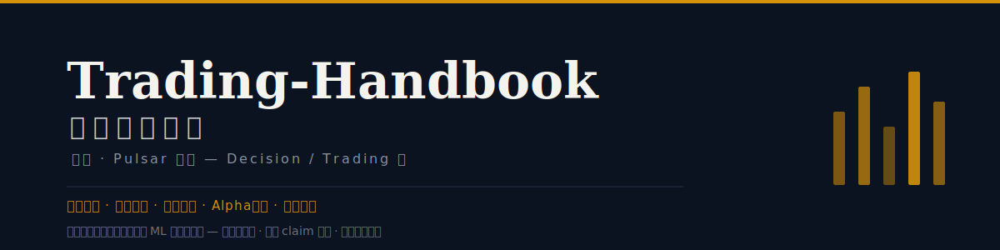

<!-- markdownlint-disable MD033 MD041 -->
<p align="center"></p>

<div align="center">

**照見（Pulsar）系列 · Decision / Trading 端**

給做過實盤的人的一張「量化 ML 方法活地圖」——不科普概念，只回答<br>
**這個方法跟另一個差在哪 · 哪些 claim 在真實市場會崩 · 誰在持續付錢**

[](https://creativecommons.org/licenses/by/4.0/)


[](https://github.com/sou350121/Pulsar-KenVersion)

`366 頁解構` · `10 方法族` · `6 深度綜述` · `6 張力圖` · `13 篇 arXiv 一手解構` · `每日自動增長`

</div>

> [!NOTE]
> **2026-07 更新**：新增**一手 arXiv 全文解構管線**（⚡ 論文直接抓全文自主解構，不再只吃二手導讀）＋ **6 篇深度綜述**（一篇看懂一整族）。每日自動增長、每週掃前沿。

---

## 這是什麼

不是教科書、不是論文摘要，是一張**可導航的方法地圖**。每一頁把一個量化 ML 方法拆成「架構 → 數學 → 數據 → 評測 → **失效模式** → 怎麼跟別的線組合」，再投到**五軸本體論**上跟其他方法做 Pareto 對比。多數頁已回鏈原始論文（arXiv/DOI＋被引數，Crossref 核）。

> [!TIP]
> **想在裡面找靈感？四條路——**
> 1. 想吃透**一整族** → **🧭 深度綜述**：把幾十頁串成演進主線＋核心張力＋失效合集
> 2. 要**策略角度** → **⚔️ 六個策略問題**：每個都是一場「誰持續付錢」的博弈
> 3. 查**某類方法** → **📂 10 區地圖**，每區 `⚡` = 最值得先讀
> 4. 追**前沿** → **📡 雷達**，每週自動掃 arXiv ＋ 從業者博客（`⚡` 命中會被一手全文解構成新頁）

## 三個理由選它

1. **不只是摘要**：每頁把「架構怎麼改、Napkin 公式、§5 評測的 Δ 哪部分是真 capability 哪部分是過擬合」都寫出來——看懂和能用之間的坑，標出來。
2. **只關心能落地的**：每頁 §6 拆「隱含假設 + 什麼時候崩」——regime 依賴、換手成本未計、前瞻偏差、容量天花板、因子擁擠。哪些 claim 在真實市場會碎，直接點破。
3. **活的知識庫**：每日自動抓 QuantML 語料，每週掃 arXiv q-fin 把 ⚡ 論文抓全文一手解構——不是六個月沒人維護的靜態文檔。

## 和這些方式相比

跟上量化 ML 方法，大多數人用這幾種方式——先說各自真正好在哪：

**讀 arXiv 原文**：最權威的一手來源，但每週幾十篇讀不完，也看不出方法之間的關係。
**量化公眾號**（QuantML 等）：可讀的中文導讀，碎片時間友好——本手冊的選題與發現正是源於它的策展。
**券商金工研報**：深度且貼近實盤，但更新慢、覆蓋偏因子、難獲取。
**知識星球 / 社群**：一手實操經驗與真實參數，但零散、搜索困難、質量參差。

**選 Trading-Handbook**：需要**系統化的方法對比 + 失效模式 + 五軸導航**，而且每天自動增長、永久可 grep。

| 維度 | 讀 arXiv 原文 | 量化公眾號 | 券商研報 | 知識星球 | **Trading-Handbook** |
|---|---|---|---|---|---|
| **最擅長** | 最權威一手 | 可讀中文導讀 | 貼近實盤 | 真實參數/踩坑 | 系統化方法地圖 + 每日自動 |
| **失效模式點破** | ⚠️ 自己讀出 | ❌ 只講亮點 | ⚠️ 偏正面 | ⚠️ 零散 | ✅ 每頁 §6 隱含假設 + 何時崩 |
| **方法間系統對比** | ❌ 一篇篇看 | ❌ | ⚠️ 偏因子 | ❌ | ✅ 五軸 + 6 張力圖 + 6 綜述 |
| **一手 vs 二手** | ✅ 一手 | ❌ 二手摘要 | ⚠️ 混合 | ⚠️ 混雜 | ✅ 導讀 ＋ arXiv 一手全文解構 |
| **更新頻率** | 實時但海量 | 不定期 | 月 / 季 | 實時但難搜 | 每日自動 + 每週雷達 |
| **歷史可查 / grep** | ✅ arXiv | ❌ 90 天限流 | ❌ 難獲取 | ❌ 帖子易沉 | ✅ Git 永久 + 全文 grep |
| **數字可信** | ✅ 原文 | ⚠️ 轉述易錯 | ✅ | ⚠️ 參差 | ✅ number_audit 逐字接地 |

## 先看這幾篇（30 分鐘建立框架）

按依賴順序——每一篇回答上一篇讀完後自然產生的問題。

**① [五軸速查](cheat-sheet/ontology.md)** `5 min`
先建座標系：任意兩個方法都投到這五軸上比。讀完你有了看整本書的透鏡。

**② [張力圖：預測驅動 vs 策略驅動](crossing/supervised-vs-rl/overview.md)** `10 min`
①給你座標，這篇教你用座標：Alpha 該長在**信號**裡（監督預測）還是**策略**裡（RL）？讀完你會用「誰持續付錢」的角度拆方法。

**③ 選一篇[深度綜述](guides/overview.md)** `15 min`
挑你當前最近的一族（因子挖掘 / 時序基座 / LLM-agentic / 執行RL…），一篇看懂整族的演進主線 + 核心張力 + 失效合集。

**④ 順著綜述的 reading path 進任意單頁**
看一頁解構怎麼把方法拆成「架構 → 數學 → 數據 → 評測 → **失效模式** → 怎麼組合」。準備動手時再深入。

---

## ⚔️ 六個策略問題（張力圖 · 靈感從這裡來）

每張張力圖不是「介紹兩類方法」，而是逼你回答一個真實的設計選擇——並點出**誰因為結構性理由持續付錢**。

| 張力 | 它逼你回答的問題 |
|---|---|
| [預測驅動 vs 策略驅動](crossing/supervised-vs-rl/overview.md) | Alpha 該長在**信號**裡（監督預測）還是**策略**裡（RL）？交易成本內化在哪？ |
| [可解釋因子 vs 端到端黑盒](crossing/explicit-factors-vs-e2e/overview.md) | 因子要**看得懂、能歸因**，還是**榨乾非線性**？擁擠與沉默退化怎麼防？ |
| [大模型邏輯 vs 專用時序基座](crossing/llm-reasoning-vs-ts-baselines/overview.md) | 讀**敘事**還是算**數值**？LLM 的幻覺與延遲關在哪一層？ |
| [靜態關聯 vs 動態微觀流](crossing/static-graph-vs-dynamic-flow/overview.md) | 用**慢的關係圖**還是**快的訂單流**？圖定權重、流定時機的接縫在哪？ |
| [兩步法 vs 聯合優化](crossing/predict-then-optimize-vs-end-to-end/overview.md) | 先預測再優化（模組可單測）還是端到端（全局最優但梯度塌縮）？ |
| [人機協同 vs 全自動智能體](crossing/human-in-loop-vs-autonomous-agent/overview.md) | co-pilot 可問責 vs 全自治更快——護欄放哪、誰扛責？ |

> 全部入口與代表方法見 [Crossing 總覽](crossing/overview.md)。

## 🧭 深度綜述（吃透一整族）

單頁教你拆一個方法；**綜述教你看懂一整族在賭什麼**——演進主線、核心張力、什麼在持續有效 vs 什麼被擁擠掉、失效模式合集，最後給一條有序讀法。每篇讀過該族數十頁真實解構後寫成，論斷可追溯到頁面、數字逐字引原頁。

| 綜述 | 底盤 | 一句話 |
|---|--:|---|
| [時序基礎模型全景](guides/time-series-forecasting.md) | 88 頁 | 通用時序模型移植到金融，什麼移得動、什麼移不動 |
| [因子挖掘全景](guides/factor-mining.md) | 62 頁 | 護城河不是更高 IC 的單因子，而是抗衰減的因子生產線 |
| [LLM-Agentic 交易全景](guides/llm-agentic.md) | 49 頁 | 哪幾層 alpha 是真的，哪幾層是包裝洩漏的 demo |
| [執行與組合 RL 全景](guides/reinforcement-learning.md) | 42 頁 | RL 的真戰場是執行/對沖，不是端到端選股 |
| [組合優化全景](guides/portfolio-optimization.md) | 36 頁 | 護城河是把預測誤差關進籠子的工序，不是更準的預測 |
| [市場微結構全景](guides/market-microstructure.md) | 28 頁 | 毫秒到日內：扣掉延遲與成本，這條 alpha 你來得及吃嗎 |

> 索引與讀法見 [深度綜述總覽](guides/overview.md)。

## 五軸本體論（手冊的靈魂）

任意兩個方法都能投到這五軸上做對比——這是全書的座標系：

| 軸 | 兩端 |
|---|---|
| **數據模態** | 量價/表格 ↔ 另類/文本/圖/微觀盤口 |
| **時間尺度** | 高頻/日內 ↔ 日頻/波段 ↔ 宏觀/長週期 |
| **學習範式** | 監督回歸 ↔ 強化學習 ↔ 生成式/大模型 ↔ 因果/結構 |
| **Alpha 機制** | 顯式因子 ↔ 端到端表徵 ↔ 組合/執行優化 ↔ 多智能體博弈 |
| **人機協作** | 全自動黑盒 ↔ 人機協同/可解釋 ↔ Agent/自主演進 |

詳見 [五軸速查](cheat-sheet/ontology.md) · 時間維度看 [兩年演進 timeline](cheat-sheet/timeline.md)。

## 📂 10 方法族地圖（366 頁）

| 方法族 Zone | 頁數 | 焦點 |
|---|--:|---|
| [時序預測](foundations/time-series-forecasting/overview.md) `time-series-forecasting` | 88 | 預測基座/基礎模型 |
| [因子挖掘](foundations/factor-mining/overview.md) `factor-mining` | 62 | Alpha 因子/擁擠度 |
| [LLM 智能體](foundations/llm-agentic/overview.md) `llm-agentic` | 49 | 大模型/多智能體交易 |
| [強化學習](foundations/reinforcement-learning/overview.md) `reinforcement-learning` | 42 | 執行/做市/組合 RL |
| [組合優化](foundations/portfolio-optimization/overview.md) `portfolio-optimization` | 36 | 配置/端到端優化 |
| [市場微結構](foundations/market-microstructure/overview.md) `market-microstructure` | 28 | 訂單流/LOB/日內 |
| [圖網絡](foundations/graph-networks/overview.md) `graph-networks` | 25 | 關係圖/動態圖 |
| [評測基準](foundations/evaluation-benchmarks/overview.md) `evaluation-benchmarks` | 20 | 基準/打假/穩健性 |
| [因果結構](foundations/causal-structural/overview.md) `causal-structural` | 9 | 機制/regime/定價 |
| [數據生成](foundations/data-generation-augmentation/overview.md) `data-generation-augmentation` | 7 | 合成/增強/模擬 |

> zone 按**方法族**切；跨族的比較由五軸 + tags 承載，在上面的張力圖撈出。

## 📡 雷達（多源前瞻情報）

除 QuantML 策展外，每週自動掃更多來源、依十區分類，只出「標題＋鏈接＋一句話機制解讀」；`⚡` 命中會被**抓全文一手解構成新頁**（走 ar5iv/PDF，非二手摘要）：

- [arXiv q-fin 雷達](radar/arxiv/overview.md) — q-fin.* ＋ cs.LG/stat.ML 量化新論文
- [實踐者雷達](radar/practitioner/overview.md) — Quantocracy / Alpha Architect / AQR / Quantpedia / CXO 等從業者博客

## ⏱ 自動更新（北京時間）

| 內容 | 時間 | 去哪看 |
|---|---|---|
| QuantML 語料增量同步 | 每日 21:00 | [foundations/](foundations/overview.md) |
| arXiv q-fin ＋ 從業者雷達 | 每週六 15:00 | [radar/](radar/arxiv/overview.md) |
| ⚡ 命中 → 一手全文解構 | 隨週度雷達 | foundations/（arXiv 頁） |
| 自愈 watchdog | 每日 09:00 | — |

## ⚙️ 背後的系統：照見 Pulsar

每日內容由 [照見 Pulsar](https://github.com/sou350121/Pulsar-KenVersion) 自動驅動——**機械保障先行，LLM 判斷斷後**：

- **機械閘門**：`handbook_audit` 7 項硬檢查（0 斷鏈 / 0 孤頁 / **0 版權洩漏**）＋ `number_audit` 數字接地——每個基準數字必須逐字來自原文，否則不放。
- **自愈**：cron 以「頁面是否存在」判斷工作，抓取/生成/推送任一步失敗，下輪自動重試，從不靜默丟數據。
- **分工**：Opus 定架構 / 本體 / 裁決，qwen 跑蒸餾 / 分類 / 套模板；一手 arXiv 頁額外過**全頁數字接地審計**。
- 同一個 Pulsar 也驅動 [VLA](https://github.com/sou350121/VLA-Handbook) / [Spatial](https://github.com/sou350121/Spatial-Intelligence-Handbook) / [Physics](https://github.com/sou350121/Physics-Controllable-Generation-Handbook) 三本姊妹手冊。

## 狀態（誠實）

**v0.5 · 每日自動增長。** 366 頁已生成、質量閘門全綠（0 斷鏈/孤頁/版權洩漏）。內容是對公開論文的**二階分析**（多數已回鏈原文、約 1/4 帶被引數），另有 13 篇由 arXiv 全文**一手解構**——是一張**強地圖**，不是逐頁核過原文的權威參考；未驗證細節標 `TBD`（設計特性，不假裝確定）。

<details>
<summary><b>怎麼建的 · 版權</b></summary>

```
QuantML 語料：enumerate → fetch(allorigins) → Pass A(qwen 分類) → Pass B(qwen 寫頁)
arXiv 一手：radar ⚡ → 抓全文(ar5iv/PDF) → 同一套 Pass A/B → 全頁數字接地審計
→ Opus 綜合/audit → handbook_audit + number_audit 閘門 → 自愈 cron 推送
```

- 抓來的原文正文（版權屬原作者 / QuantML）**不入庫**（`data/raw`、`data/distill` 已 gitignore）；庫內只有解構頁與公開元數據。
</details>

## 姊妹手冊（照見四冊）

| 冊 | 視角 |
|---|---|
| [VLA-Handbook](https://github.com/sou350121/VLA-Handbook) | Action 端 |
| [Spatial-Intelligence-Handbook](https://github.com/sou350121/Spatial-Intelligence-Handbook) | Perception 端 |
| [Physics-Controllable-Generation-Handbook](https://github.com/sou350121/Physics-Controllable-Generation-Handbook) | Generation 端 |
| **Trading-Handbook**（本冊） | **Decision / Trading 端** |

## 致謝 & License

選題與發現源：[QuantML 公眾號](https://mp.weixin.qq.com/) 的策展。解構為對公開論文的二手分析（另含 arXiv 一手全文解構），CC-BY-4.0；版權歸原論文與 QuantML 所有。由 [照見 Pulsar](https://github.com/sou350121/Pulsar-KenVersion) 系統自動驅動。
