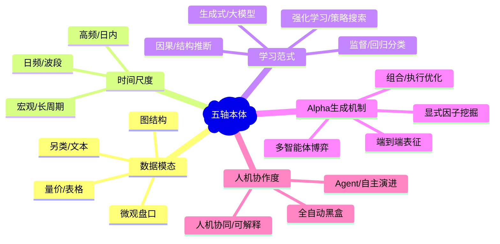

# 量化方法五轴本体

> 手冊的靈魂。任意兩個量化方法都能投到這五軸上做 Pareto 對比。
> **設計理由**：五轴覆盖语料中方法演进的核心方差来源，使任意模型可在同一坐标系下定位其信号源、时间尺度、学习范式、Alpha生成路径与人机协作边界，支撑Pareto前沿对比与失效归因。

## 五軸鳥瞰圖

## 五軸

| # | 軸 | 兩端 | 它在語料裡區分了什麼 |
|---|---|---|---|
| 1 | **数据模态** | 量价/表格 ↔ 另类/文本/图结构/微观盘口 | 区分模型对输入表征的依赖程度与特征工程深度，决定跨市场泛化能力与数据清洗成本 |
| 2 | **时间尺度** | 高频/日内 ↔ 日频/波段 ↔ 宏观/长周期 | 区分信号衰减速率、交易成本敏感度与模型复杂度上限，决定策略容量与实盘滑点容忍度 |
| 3 | **学习范式** | 监督/回归分类 ↔ 强化学习/策略搜索 ↔ 生成式/大模型 ↔ 因果/结构推断 | 区分优化目标与训练循环设计，决定模型是直接拟合收益率、内化交易成本，还是探索策略空间与因果机制 |
| 4 | **Alpha生成机制** | 显式因子挖掘 ↔ 端到端表征 ↔ 组合/执行优化 ↔ 多智能体博弈 | 区分超额收益的提取位置与部署方式，决定策略的可解释性、模块化解耦程度与全局最优风险 |
| 5 | **人机协作度** | 全自动黑盒 ↔ 人机协同/可解释 ↔ Agent/自主演进 | 区分运营风控边界、监管合规要求与策略迭代速度，决定实盘部署的维护成本与极端行情兜底能力 |

## Foundations 方法族 → 軸的落點

| Zone | 名稱 | 收什麼 | 容量估計 |
|---|---|---|---|
| [`time-series-forecasting`](/foundations/time-series-forecasting/overview) | 时序预测基础 | 面向价格/收益率/波动率的序列建模，涵盖Transformer变体、RNN/LSTM、MLP/Mixer、状态空间模型及频率自适应架构 | ~60 |
| [`graph-networks`](/foundations/graph-networks/overview) | 图网络与关系建模 | 利用股票间相关性、产业链、分析师覆盖或动态共现关系构建异构图/动态图，进行趋势预测、风格挖掘与组合构建 | ~35 |
| [`reinforcement-learning`](/foundations/reinforcement-learning/overview) | 强化学习与策略搜索 | DRL/MARL在选股、调仓、做市、执行与对冲中的应用，涵盖PPO/SAC/分布RL、奖励函数设计与环境模拟 | ~55 |
| [`llm-agentic`](/foundations/llm-agentic/overview) | 大模型与智能体 | LLM在因子挖掘、情绪分析、研报生成、RAG增强及多智能体交易工作流中的适配、微调与推理架构 | ~50 |
| [`market-microstructure`](/foundations/market-microstructure/overview) | 微观结构与高频 | 限价订单簿(LOB)建模、订单流信号、做市策略、高频套利、微观流动性与价格形成机制 | ~40 |
| [`factor-mining`](/foundations/factor-mining/overview) | 因子挖掘与特征工程 | 公式型Alpha生成、AutoML/遗传编程挖掘、特征选择、风格因子构造、信号衰减与拥挤度分析 | ~45 |
| [`portfolio-optimization`](/foundations/portfolio-optimization/overview) | 组合优化与资产配置 | 均值方差/风险平价/Black-Litterman、稀疏优化、执行算法(VWAP/冲击成本)、多资产轮动与战术配置 | ~40 |
| [`causal-structural`](/foundations/causal-structural/overview) | 因果推断与结构建模 | 因果发现、反事实推理、结构VAR、因果特征选择、新闻/公告对价格的因果路径建模 | ~25 |
| [`evaluation-benchmarks`](/foundations/evaluation-benchmarks/overview) | 评测基准与失效分析 | 回测防穿越、样本外稳定性、过拟合检测、鲁棒性量化、公开基准(TFB/QuantBench)与模型衰减归因 | ~25 |
| [`data-generation-augmentation`](/foundations/data-generation-augmentation/overview) | 数据生成与增强 | GAN/扩散模型合成金融时序、缺失值插补、数据增强、分布外泛化与对抗样本防御 | ~24 |

> 容量估計是設計時的配額，不是實際數；實際歸類以 Pass A（`data/distill/`）為準。
