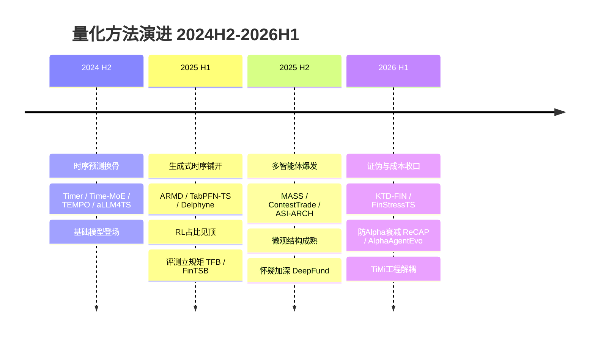
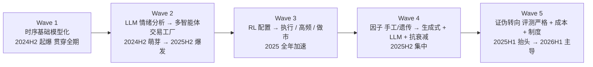

# 時間線：ML-for-Quant 的兩年演進

> 語料：QuantML 公眾號 2024-06 ~ 2026-06 的 **399 篇**論文導讀（`data/distill/`）。
> 軸：每篇的 `date`（發表日）。本頁講的是**這條河怎麼流**，不是論文清單。
> 讀法：先看波次，再看半年脊，最後看「什麼變了 / 什麼沒變」。引用論文只連到已落地的 foundations 頁；尚在收尾的頁面只報名稱。

---

## 鳥瞰圖（先看兩張圖）

**半年脊 × 代表方法**（每段主旋律＋代表作）：

**五道波次**（macro-waves，疊起來而非互斥；後一道起來時前一道退到背景）：

---

## 0. 兩年的形狀（先給結論）

語料按半年切，每段的篇數與「必讀（⚡）密度」如下（皆由 `data/distill/` 直接點算，非估計）：

| 半年窗 | 對應月份 | 篇數 | ⚡ | 🔧 | 📖 | 這半年的主旋律 |
|---|---|---:|---:|---:|---:|---|
| **2024 H2** | 2024-06 ~ 12 | 128 | 13 | 103 | 12 | 時序預測「換骨」：基礎模型登場，Transformer 變體軍備競賽 |
| **2025 H1** | 2025-01 ~ 06 | 110 | 17 | 79 | 14 | LLM-agentic 與 RL 鋪開；評測基準成形（這半年 eval 篇數 2→7） |
| **2025 H2** | 2025-07 ~ 12 | 115 | 33 | 72 | 10 | **多智能體爆發 + 微觀結構成熟**：⚡ 密度全程最高 |
| **2026 H1** | 2026-01 ~ 06 | 46 | 17 | 24 | 4 | 證偽與成本收口；frontier 轉向「剝離幻象、防 Alpha 衰減」 |

> ⚠️ 誠實提示：**2026 H1 只有 46 篇**，是因為語料在 2026-06-20 截斷（這是一條**仍在流動**的週更串，不是全市場普查）。這 46 篇的話題分布可信，但「篇數下降」**不能**讀成「研究變少」——是窗口未滿。下文所有跨期比較都已按比例（占當期百分比）對齊。

**全期 zone × 半年矩陣**（占當期百分比；只列主力 zone）：

| Zone | 全期 | 2024H2 | 2025H1 | 2025H2 | 2026H1 |
|---|---:|---:|---:|---:|---:|
| time-series-forecasting | 100 | 30% | 28% | 20% | 15% |
| factor-mining | 62 | 15% | 10% | 18% | 19% |
| llm-agentic | 60 | 16% | 17% | 13% | 10% |
| reinforcement-learning | 41 | 7% | 13% | 10% | 8% |
| portfolio-optimization | 34 | 5% | 8% | 10% | 13% |
| market-microstructure | 29 | 7% | 8% | 6% | 8% |
| graph-networks | 26 | 6% | 3% | 11% | 2% |
| evaluation-benchmarks | 18 | 1% | 6% | 4% | 8% |

一句話讀法：**時序預測從近三成的絕對主角，一路讓位**；接棒的不是某一個 zone，而是「因子 + 評測 + 組合/執行」這組更靠近實盤的方向。

---

## 1. 五道波次（macro-waves，按出現順序）

我從時間軸上**實際看到**五道波。它們不是互斥的階段，而是疊起來的——後一道起來時前一道並未死，只是退到背景。

**Wave 1 — 時序基礎模型化（2024 H2 起爆，主軸貫穿全期）**
2024 下半年集中出現一批「預訓練 / 生成式 / 零樣本」時序模型：[TEMPO](/foundations/time-series-forecasting/tempo)（提示詞生成式預訓練，2024-09）、[Time-MoE](/foundations/time-series-forecasting/time-moe)（億級 MoE，2024-09）、[Timer](/foundations/time-series-forecasting/timer)（清華，decoder-only 自回歸預訓練，2024-10）、[aLLM4TS](/foundations/time-series-forecasting/allm4ts)（把 LLM 適配到時序，2024-08）。我點算到 2024 H2 的「時序基礎模型 / 預訓練 / 零樣本」類論文有 **6 篇**，是同類話題最密的半年。

**Wave 2 — LLM 從「情緒分析」走到「多智能體交易工廠」（2024 H2 萌芽 → 2025 H2 爆發）**
語料裡帶「智能體」的論文按半年是 **12 / 14 / 18 / 5**，帶「多智能體」是 **8 / 5 / 11 / 1**——**雙雙在 2025 H2 見頂**。早期是單 LLM 做情感/研報（[CopBERT/CopGPT](/foundations/llm-agentic/copbert-copgpt) 開篇即在 2024-06），中段是多智能體框架（[FinCon](/foundations/llm-agentic/fincon) 2024-12、[HedgeAgents](/foundations/llm-agentic/hedgeagents) 2025-02、[TradingAgents](/foundations/llm-agentic/tradingagents) 2025-06），到 2025 H2 變成「自我進化 / 競賽淘汰 / 機構級分工」（[ASI-ARCH](/foundations/llm-agentic/asi-arch)「架構探索的 AlphaGo 時刻」2025-08、[ContestTrade](/foundations/llm-agentic/contesttrade) 2025-08、貝萊德 [AlphaAgents](/foundations/llm-agentic/alphaagents) 2025-08）。

**Wave 3 — RL 重心從「配置」漂到「執行 / 高頻 / 做市」（2025 全年加速）**
2024 上半 RL 多談組合配置；越往後越貼盤口。標誌：[MacroHFT](/foundations/reinforcement-learning/macrohft)（增強記憶 HFT，2024-06）與 [JAX-LOB](/foundations/reinforcement-learning/jax-lob)（GPU 加速 LOB 模擬，2024-07）開路，[HRT](/foundations/reinforcement-learning/hrt)（分層選股+執行，2024-10）把「選股」與「執行」拆成雙層，到 2025 H2 直接出現 [JaxMARL-HFT](/foundations/reinforcement-learning/jaxmarl-hft)（首個 GPU 高頻 MARL，吞吐 240× 提升，2025-11）與貝萊德的「DRL 最優訂單執行」（2026-01）。RL zone 中「執行/做市/高頻/對沖」類論文按半年是 **4 / 4 / 6 / 2**，2025 H2 是高點。

**Wave 4 — 因子挖掘從「手工/遺傳」走向「生成式 + LLM 推理 + 抗衰減」（2025 H2 集中）**
factor-mining 占比在 2025 H2 反彈到 18%、2026 H1 到 19%（全期次高密度段）。前段是公式型/遺傳/RL 挖掘（[Alpha2](/foundations/factor-mining/alpha2) 2024-06、[AlphaForge](/foundations/factor-mining/alphaforge) 2024-08、[Style Miner](/foundations/factor-mining/style-miner) 2024-12）；後段全面 LLM 化並且**把「Alpha 衰減」當成第一性問題**（[AlphaAgent](/foundations/factor-mining/alphaagent)「終結 Alpha 衰減」2025-08、[AlphaSAGE](/foundations/factor-mining/alphasage) GFlowNets 結構感知 2025-09、[CogAlpha](/foundations/factor-mining/cogalpha) 七層認知 2025-12、[Alpha-R1](/foundations/factor-mining/alpha-r1) 首個因子篩選 LLM 推理模型 2025-12，到 2026-05 的 [AlphaAgentEvo](/foundations/factor-mining/alphaagentevo) GRPO+AST）。

**Wave 5 — 證偽轉向：評測嚴格化 + 成本意識 + 制度非平穩（2025 H1 抬頭 → 2026 H1 主導 frontier）**
帶「過擬合/樣本外/回測/穿越/失效/衰減/陷阱/擁擠」字樣的論文按半年是 **13 / 16 / 19 / 17**——絕對數穩升，而 2026 H1 的 17 篇占當期 46 篇的 **約 37%**，比例上最高。這道波是全書最「成年」的信號：場子開始算成本、查穿越、剝幻象（詳見 §3-§4）。

---

## 2. 半年脊（half-year-by-half-year 的敘事）

### 2024 H2（2024-06 ~ 12）：時序預測的「換骨之年」
語料就是從這裡開始的（首篇 2024-06-02）。這半年 128 篇裡 30% 是時序預測，且呈現兩條並行線：
- **基礎模型線**：TEMPO / Time-MoE / Timer / aLLM4TS 把「給每個資產訓一個 bespoke forecaster」的舊範式，換成「先預訓練一個大時序模型、再少樣本適配」。[TimesFM](/foundations/time-series-forecasting/timesfm)（2024-12）直接示範「金融領域微調大時序模型」。
- **架構軍備線**：[StockFormer](/foundations/time-series-forecasting/stockformer)（多任務+高低頻分離）、[StockMixer](/foundations/time-series-forecasting/stockmixer)（純 MLP）、xLSTM-Mixer、ARMA-Attention、[FAN](/foundations/time-series-forecasting/fan)（頻率自適應歸一化抗非平穩）……一邊堆 Transformer，一邊已經有人喊「（當前）為何你不需要深度學習來做時序預測」（2024-10）。
- **冷水第一桶**：evaluation 的開篇 ⚡《[大語言模型在時序預測中真的有效嗎？](/foundations/evaluation-benchmarks/art-33)》（2024-07）——系統消融證明 LLM 對時序依賴表徵**無增益且算力昂貴**，單層注意力即可媲美。這篇是後來整條 Wave 5 的種子。
- 同期已埋下多智能體（[FinAgent](/foundations/llm-agentic/finagent) KDD24 多模態、[FinCon](/foundations/llm-agentic/fincon) NIPS24）、圖網絡（[MGDPR](/foundations/graph-networks/mgdpr)、[HATS](/foundations/graph-networks/hats)）、因果（[CausalStock](/foundations/causal-structural/causalstock) NIPS24）、端到端優化（[BPQP](/foundations/portfolio-optimization/bpqp)「超越 CVXPY」）的種子。

### 2025 H1（2025-01 ~ 06）：鋪開與「立規矩」
- 時序仍最大（28%），但**生成式範式接管**：[ARMD](/foundations/time-series-forecasting/armd)（自回歸滑動擴散）、[TabPFN-TS](/foundations/time-series-forecasting/tabpfn-ts)（表格基礎模型搬到時序，2025-01）、[TimeDART](/foundations/time-series-forecasting/timedart)（自監督預訓練，2025-05）、[Delphyne](/foundations/time-series-forecasting/delphyne)（CMU×Bloomberg 通用+金融預訓練，2025-06）。
- **RL 占比衝到 13%（全期最高）**，並開始往執行/對沖細分。
- **評測基準集中成形**：eval-benchmarks 從 2024H2 的 2 篇跳到 7 篇——[TFB](/foundations/evaluation-benchmarks/tfb)、[LOB-Bench](/foundations/evaluation-benchmarks/lob-bench)、[FinTSB](/foundations/evaluation-benchmarks/fintsb)、[QuantBench](/foundations/evaluation-benchmarks/quantbench)、LOBCAST 都在這半年立起來。場子開始要求「可公平對比」。
- 因子端出現 LLM 化苗頭：[AlphaSharpe](/foundations/factor-mining/alphasharpe)（LLM 生成穩健風險指標，2025-02）、清華 IIIS 的 [LLM+MCTS Alpha 挖掘](/foundations/factor-mining/llm-mcts-alpha-mining)（2025-06）、[UMI](/foundations/factor-mining/umi)（KDD25 通用多層次非理性因子）。

### 2025 H2（2025-07 ~ 12）：高峰半年（⚡ 33，全期最密）
這是語料裡密度最高、也最「熱鬧」的半年。三件事同時發生：
- **多智能體爆發**：「多智能體」提及數在此見頂（11）。[MASS](/foundations/llm-agentic/mass)（北大，多智能體規模化模擬組合，2025-07）、ContestTrade、AlphaAgents、ASI-ARCH 全擠在 7-8 月。
- **微觀結構成熟**：market-microstructure 這半年 ⚡ 扎堆——UCL×JP Morgan 的「[AI 做市商悖論](/foundations/market-microstructure/hawkes-lob-ppo-sil)」（Hawkes LOB + PPO/SIL，揭示 RL 做市商靠**供流動性**而非搶跑獲利，2025-11）、牛津「做市商終極困境」、「訂單流信號解釋度暴增 482%」。LOB 深度學習從「預測中間價」走到「解釋價格形成機制 + RL 做市」。
- **圖網絡的二次起跳**：graph-networks 占比從 3% 反彈到 11%，且**從靜態產業圖轉向動態/另類關係圖**——[DeltaLag](/foundations/graph-networks/deltalag)（動態領漲-滯漲）、[FNIRVAR](/foundations/graph-networks/fnirvar)（高維因子下的隱含網絡）、[COGRASP](/foundations/graph-networks/cograsp)（動態共現圖）、[DINS](/foundations/graph-networks/dins)（散戶抱團 meme 股）。
- 同時，**懷疑也在加深**：[DeepFund](/foundations/llm-agentic/deepfund)（NeurIPS25「AI 投資：財富密碼還是回測陷阱？」2025-10）、《[深度優於廣度：線性模型樣本外衰減](/foundations/evaluation-benchmarks/art-337)》（推導樣本外夏普衰減封閉解，證明強信號優於弱信號堆砌，2025-12）、[Walk-Forward Analysis](/foundations/evaluation-benchmarks/walk-forward-analysis)（「為何回測完美實盤腰斬」2025-11）。

### 2026 H1（2026-01 ~ 06，窗口未滿，46 篇）
最新半年的話題重心，從「造更強的模型」明顯轉到「**證偽既有結果、把成本與制度寫進評估**」：
- **剝幻象**：[KTD-FIN](/foundations/evaluation-benchmarks/ktd-fin)（清華×階躍星辰，用四階段物理掩碼 + Barra 歸因，證明主流 LLM 交易收益**其實是風格暴露而非選股 Alpha**，2026-06）；[FinStressTS](/foundations/evaluation-benchmarks/finstressts)（可控合成基準，診斷深度模型在低信噪比/機制切換下為何輸給經典模型，2026-06）。
- **算成本**：[Cost-Aware Execution Filter](/foundations/evaluation-benchmarks/cost-aware-execution-filter)（「從年化 129% 到巨虧 −83.9% 僅需 10bps 成本」2026-05）把交易成本擺到策略生死線上。
- **防衰減 / 對制度**：[ReCAP](/foundations/reinforcement-learning/recap)（KDD26，CUSUM 自適應切分市場制度 + 策略差異向量持續學習，正面解決 RL 策略 Alpha 衰減與災難性遺忘，2026-06）；因子端《因子的非對稱性：為何 Alpha 在熊市反而更強》（56 市場 133 因子，狀態相依權重，2026-06）。
- **agentic 仍在進化但更「工程化」**：[TiMi](/foundations/llm-agentic/timi)（ICLR26，把 LLM 推理**離線**生成代碼+約束、**在線**輕量 CPU 毫秒執行，繞開大模型實盤延遲，2026-05）、北大光華「自主市場分析實時 AI 投資代理」（嚴格現時預測防穿越，但坦承 LLM **只擅長選贏家、不識輸家**，2026-01）。

---

## 3. 三條跨切面（cross-cutting，貫穿全期）

**成本意識（cost-awareness）——從邊註變成生死線。**
帶「成本/滑點/衝擊/bps/摩擦」字樣的論文按半年是 **7 / 8 / 10 / 6**，絕對數穩定，但**語氣**在升級：2024 多是「我們也報了換手率」，2026 已經是「10bps 成本就能把 129% 翻成 −83.9%」（Cost-Aware Execution Filter）。AI 做市商悖論那篇更直接把「對手滑點」做成核心觀測量。

**制度 / 非平穩（regime / non-stationarity）——從架構技巧變成評估前提。**
相關提及按半年是 **5 / 8 / 4 / 6**。早期是模型內的小技巧（[FAN](/foundations/time-series-forecasting/fan) 頻率自適應歸一化抗非平穩）；後期變成**評估與部署的一等公民**——[FinPFN](/foundations/time-series-forecasting/finpfn)（市場風格切換下的元學習，2025-12）、ReCAP（CUSUM 切制度）、[Regime-Switching Pricing Kernel](/foundations/causal-structural/regime-switching-pricing-kernel)（2026-01）、熊市因子非對稱（2026-06）都把「市場會換檔」當成設計起點而非異常。

**評測嚴格化（evaluation rigor）——獨立成 zone 且越來越「打假」。**
evaluation-benchmarks 從 2024H2 的 2 篇起步，立了一批公開基準（TFB/LOB-Bench/FinTSB/QuantBench）；到 2025-2026 性質轉變，從「能不能公平比」走到「**你那個 Alpha 是不是假的**」：盈虧平衡夏普比率揭高夏普陷阱、《深度優於廣度》給衰減封閉解、KTD-FIN 用掩碼剝記憶與風格。這是整個語料最健康的演化線。

---

## 4. 什麼變了 / 什麼沒變

### ✅ 真實的、留下來的位移（durable shifts）
- **時序預測：bespoke → 預訓練/生成式基礎模型。** 這是最確鑿的一次範式換骨。TEMPO/Time-MoE/Timer（2024）→ TabPFN-TS/TimeDART/Delphyne（2025H1）→ [Kronos](/foundations/time-series-forecasting/kronos)（清華，專為 K 線的基礎模型，二元球面量化標記器，2025-08）/[FinCast](/foundations/time-series-forecasting/fincast)（首個十億級金融時序基礎模型，2025-08）/FinPFN（2025-12）。**金融專屬時序基礎模型**在 2025 H2 成形，是真正落地的新物種。
- **因子挖掘：手工/遺傳 → 生成式 + LLM 推理，且以「抗衰減」為目標函數。** 不是換工具，是換了**問題定義**——從「找更多因子」變成「找**不會擁擠、不會衰減**的因子」。
- **RL：配置 → 執行 / 做市 / 高頻。** 並且基礎設施真的跟上了（JAX-LOB → JaxMARL-HFT 的 GPU 化）。
- **圖網絡：靜態產業圖 → 動態 / 另類關係圖。** 領漲-滯漲、共現、隱含網絡、散戶抱團，關係本身變成被學習的時變對象。
- **評測：從「報指標」→「打假 + 算成本 + 對制度」。** 這是場子成熟最可靠的指標。

### ⚠️ 熱鬧過、但要打折扣的（hype to discount）
- **「LLM 直接做時序預測」**——語料**自己**從 2024-07（《LLM 在時序預測中真的有效嗎？》）到 2026-06（FinStressTS、KTD-FIN）反覆證偽。把預訓練語言知識套到時序/交易上，多次被消融或掩碼證明「**贏在風格暴露與記憶，而非真 Alpha**」。這條線是語料裡最清楚的一次「退潮」。
- **「多智能體」數量見頂於 2025 H2 後回落。** 提及數 8/5/11/1（多智能體）——2025 H2 的扎堆有明顯的「框架複現潮」成分（投行分工模板被反覆實現）。到 2026，agentic 沒消失，但重心從「堆角色」轉向「[TiMi](/foundations/llm-agentic/timi) 式工程解耦」和「[AlphaBench](/foundations/llm-agentic/alphabench)/KTD-FIN 式評測」——熱度退、嚴肅度進。
- **「超高夏普」標題黨。** 語料裡反覆出現「夏普 13 獨角獸」「年化 61.73%」這類標題，**但同一語料的 evaluation zone 持續拆穿**（盈虧平衡夏普、回測腰斬、成本翻轉）。這是 desk 讀者要時刻保留的折扣。

### 🔒 兩年都沒怎麼變的（durable invariants）
- **時序預測始終是體量最大的 zone（100/399，全期第一）**——不管範式怎麼換，「預測下一段」永遠是入口。
- **「端到端 vs 先預測再優化」的張力貫穿始終**：從 [DSPO](/foundations/portfolio-optimization/dspo)（2024-06 端到端直接排序）、[BPQP](/foundations/portfolio-optimization/bpqp)（2024-12）到 2026-05《[拒絕先預測再優化：把 Sharpe/Omega/CVaR 塞進損失函數，端到端真的有效嗎？](/foundations/portfolio-optimization/sharpe-omega-cvar)》——兩年了，這個問題還在被反覆問，沒有定論。
- **可解釋性 vs 黑盒**的拉扯沒停：開篇 [CopBERT/CopGPT](/foundations/llm-agentic/copbert-copgpt) 就在談「GPT 強但有幻覺、BERT 可解釋」，到 [ProtoHedge](/foundations/reinforcement-learning/protohedge)「像交易員一樣思考」（2025-11）、CogAlpha 七層認知，可解釋性一直是 agentic/因子的賣點。

---

## 5. Frontier 指向哪（僅以最新一批論文為據）

只看 2026-05 ~ 06 的尾段（語料最後 ~18 篇），frontier 呈現四個明確指向——**全部偏向「成年化」而非「更大模型」**：

1. **評估打假成為主戰場。** KTD-FIN（剝風格+記憶看 LLM 還剩多少 Alpha）、FinStressTS（合成壓力測試）、Cost-Aware Execution Filter（成本翻轉）——最新一批最高被評為 ⚡ 的，多是「拆穿」而非「刷新」。**這是 desk 最該跟的一條線。**
2. **Alpha 衰減被當成核心技術問題正面攻堅。** ReCAP（持續學習 + 制度切分）、AlphaAgentEvo（GRPO+AST 鄰域約束防擁擠）——從「挖到 Alpha」轉向「**讓 Alpha 不死**」。
3. **agentic 走向「離線推理 / 在線輕量執行」的工程解耦。** TiMi（ICLR26）把 LLM 從實盤關鍵路徑上拿掉，只在離線生成代碼與約束——這可能是 agentic 真正進實盤的形態。
4. **生成式擴散滲入組合層。** [STABLE](/foundations/portfolio-optimization/stable)（ICLR26，用擴散模型生成 Black-Litterman 觀點輸入，2026-05）把「生成式」從時序/因子推進到資產配置的觀點生成。

**反指標也要記：** 最新尾段同時出現 Jane Street 算力帝國（4032 GPU / $70 億）這類「規模軍備」報導與 Mojo「同一策略兩種結果」的確定性焦慮——說明 frontier 一邊是學術的「打假與防衰減」，一邊是工業的「算力與工程確定性」，**兩條線並未合流**。

---

## 6. 如何用這頁

- 想知道**某個方法現在處於波次哪一段**：先到 §1 找它屬於哪道波，再到對應 zone 的 [overview](/foundations/time-series-forecasting/overview) 看落點。
- 想做**對比/失效歸因**：§4 的「打折扣」清單就是現成的 devil's-advocate 提綱；任何「超高夏普」先過一遍 evaluation zone。
- 想**追前沿**：只信 §5（已限定最新一批），別被中段的多智能體熱度誤導方向。

> 數據口徑：所有篇數、占比、提及數均來自 `data/distill/` 的 399 條記錄直接點算；「語料顯示」為點算結果，「我推斷」處已標明。窗口截斷於 2026-06-20，2026 H1 為未滿窗口。
