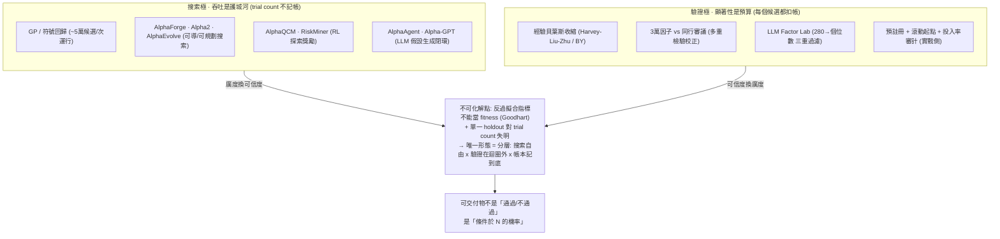

# 自動化搜索 vs 預註冊驗證（Autoresearch Throughput vs Pre-Registered Validation）

> **本質衝突**：自動化因子研究把「一晚上跑一萬個候選」變成護城河，但每多測一個候選就多花掉一份統計顯著性——搜索吞吐買到的是廣度，付掉的是可信度。兩極不能靠「把校正加進迴圈」化解，因為反過擬合指標一旦成為搜索目標就失效（Goodhart）。唯一可行的形態是**分層**：搜索層自由跑，驗證層在迴圈之外、且迴圈不得對它優化。

**Status:** v0.6 — Opus 手寫綜合。證據底盤來自 2026-07-22 的一次對抗式文獻審計（6 個檢索角度 / 25 個來源 / 119 條 claim 抽取 / 25 條進三票對抗驗證 → 17 條確認、8 條推翻），完整紀錄見 [審計報告](/reports/deep-research/2026-07-22-autoresearch-audit)；實戰對照組來自一份五案全結的預註冊研究計畫，見 [投資哲學量化](/use-cases/philosophy-quantification)。

## 中心張力

前六張張力圖問的都是「**哪條路更能賺錢**」。這一張問的是一個更前置、也更難堪的問題：**你憑什麼相信你剛剛挖到的東西是真的？**

這條張力的兩極不是兩種方法族，是兩種**對「發現」的記帳方式**。

**搜索極**把研究產能當作第一性。GP / 符號回歸把公式當可搜索的符號樹，RL 把它寫成 MDP 序列決策，LLM agent 再把「想法→因子」的認知摩擦壓到近零——[AlphaForge](/foundations/factor-mining/alphaforge) 的 proxy optimizer、[Alpha2](/foundations/factor-mining/alpha2) 的 MCTS 指令流、[AlphaQCM](/foundations/factor-mining/alphaqcm) 的無偏方差探索獎勵、[AlphaAgent](/foundations/factor-mining/alphaagent) 的三智能體閉環，全都在同一個方向上加速：**單位時間內能評估多少個候選**。這一極的世界觀是工程的——搜索空間巨大、獎勵稀疏、探索效率就是一切。

**驗證極**把「試了幾次」當作第一性。它的世界觀是統計的：一個回測的可信度不是它自己的性質，而是它與**所有沒被展示出來的候選**之間的關係。[經驗貝葉斯](/foundations/factor-mining/empirical-bayes) 的收縮、[3 萬因子 vs 同行審議](/foundations/factor-mining/factor-zoo-vs-peer-review) 的多重檢驗校正、[LLM Factor Lab](/foundations/factor-mining/llm-factor-lab) 把 280 個候選過完 FF5 / 異象賽馬只剩個位數——這一極做的全是同一件事：**把 trial count 還原到顯著性裡去**。

兩極的衝突之所以是**結構性**的而非可調和的，靠三件已驗證的事實撐起來。

**第一，搜索極在方法論上是空的。** 對 [AlphaGen](https://arxiv.org/abs/2306.12964)（KDD'23）、[AlphaQCM](/foundations/factor-mining/alphaqcm)（ICML'25）、[TLRS](https://arxiv.org/html/2507.20263)、[RiskMiner](https://arxiv.org/abs/2402.07080)、[AlphaEval](/foundations/evaluation-benchmarks/alphaeval) 做全文關鍵字檢索，`multiple testing` / `data snooping` / `deflated Sharpe` / `PBO` / `CSCV` / `White's Reality Check` / `false discovery` / `Bonferroni` 的出現次數**全部是 0**。唯一的防線是「用驗證集選模型」，而那個選擇動作本身就是一次未校正的選擇偏誤。這不是苛責個別論文——這是整個生成側次領域的共同缺口。（RiskMiner 更走反方向：它的 risk-**seeking** MCTS 明確優化最好情況而非平均情況，是多重性防護的反面。）

**第二，這個缺口在數學上是致命的，不是學術潔癖。** Bailey / Borwein / López de Prado / Zhu 的示範實驗：純隨機漫步生成 1,000 天日價，4 參數月度規則掃 22×20×10×2 = **8,800 個組合**，勝出者樣本內年化 Sharpe **1.27**，PSR 統計量 2.83——按常規檢驗，「真 Sharpe 為負」的機率不到 1%。而 CSCV 給出的 PBO 是 **55%**，約 **53% 的樣本外 Sharpe 是負的**。原文一句話點破：「5% 偽陽性率只在你**恰好測一次**時成立。」自動化研究迴圈的定義就是「不只測一次」。

**第三，最致命的是，這條張力不能靠把校正塞進迴圈來消解。** 同一批作者在「限制與誤用」一節明確禁止：

> 我們必須警告讀者不要用 CSCV 來**指導**最優策略的搜索……當一個度量變成目標，它就不再是好的度量……PBO 不應該是選擇所依賴的目標函數。

同一節還打掉了單一 holdout 這條退路：**「只要研究者試過不只一組配置，過擬合就永遠存在……hold-out 方法不考慮嘗試次數……『這個回測過擬合了嗎』的答案不是真或假，而是一個取決於試驗次數的機率。」**

所以：把 PBO 當 fitness 會毀掉 PBO；把 holdout 當唯一閘門則對 trial count 完全失明。兩極之間**沒有平滑滑塊**——這正是它有資格成為一張獨立張力圖的原因。可行解只有一種形態：**分層**。搜索層可以任意自由，但驗證層必須物理性地在迴圈之外，且迴圈**不得對它優化**，代價是驗證層的每一次使用都是不可再生資源。

與[圖 6 人機協同 vs 全自動智能體](/crossing/human-in-loop-vs-autonomous-agent)的分工要說清楚：圖 6 判的是**決策權與問責在誰手上**，失效模式是同質化踩踏與問責真空；本圖判的是**發現的統計效力怎麼記帳**，失效模式是偽發現被常規檢驗蓋章放行。兩者壓在同一根軸（人機協作度）上，但一個看治理、一個看認識論——自治度上調一格，圖 6 要求護欄同步上調，本圖要求**trial count 的帳本同步上調**。



## 五軸投影

| 軸 | 搜索極 | 驗證極 | 是否判別 |
|---|---|---|---|
| 數據模態 | 量價 / 多模態 | 同左 | 正交 |
| 時間尺度 | 日頻為主 | 同左 | 正交 |
| 學習範式 | 元學習搜索 / RL / 生成式 | 統計推斷（非學習範式） | 弱判別 |
| Alpha生成機制 | **搜索驅動**（先窮舉後解釋） | **假設驅動**（先立論後檢驗） | **次判別** |
| 人機協作度 | **Agent 自主演進**（自治度 ∝ trial count 數量級） | **人機協同**（人守門柱，門柱先於計算釘死） | **核心判別軸** |

> 正交軸：**數據模態與時間尺度**——兩極吃完全一樣的數據、跑一樣的頻率，這條張力純粹關於**研究過程本身**，不關於研究對象。核心判別落在人機協作度，但與圖 6 是同一根軸的兩種投影：**自治度決定的不只是誰負責，還決定了 N 有多大**。這是全手冊唯一一條「判別維度是元層級（研究方法論）而非方法層級」的張力。

## 判別維度對比表

| 維度 | 搜索極（autoresearch） | 驗證極（pre-registration） |
|---|---|---|
| 單位時間候選數 | 10³–10⁵ 量級 | 10⁰–10¹ 量級 |
| trial count 記帳 | 幾乎全不記（實測關鍵字命中 0） | 記帳即核心產出 |
| 顯著性門檻 | 名義 5% / 驗證集選最佳 | 條件於 N 的機率（deflated Sharpe / PBO） |
| 樣本外結構 | 多為單一固定窗（AlphaGen 2020-2021、AlphaQCM 2021-2022） | 滾動起點 + 凍結 holdout |
| 可重現性 | 低——種子離散度常大於效果量 | 中高——門柱與數據先於計算提交 |
| 產出速度 | 快，且隨算力線性擴張 | 慢，受人審與 holdout 不可再生性硬限 |
| 主要失效模式 | 偽發現被常規檢驗蓋章、樣本外腰斬、擁擠 | 漏真（power 不足）、人的想像力封頂、迭代太慢錯過 regime |
| 成本模型誠實度 | 常缺席或只報 IC；有案例只收賣出費 | 成本/投入率是明列閘門 |
| 對 regime 轉換 | 脆——訓練窗結構被當常態 | 脆但可見——滾動起點會把它照出來 |

## 三個坑，全部帶可查數字

**坑一：延長 holdout，IC 腰斬。** 這是全域最強的一份不利證據，而且來自方法**自己的作者**。[AlphaQCM](/foundations/factor-mining/alphaqcm) 附錄 G.3 把測試窗從 2021/01–2022/12 延長到 2021/01–2024/12，訓練與驗證完全不動：

| 方法 / 宇宙 | 2021-2022 IC | 2021-2024 IC |
|---|--:|--:|
| AlphaGen · CSI 500 | 8.08% | **4.19%** |
| AlphaQCM · CSI 500 | 9.55% | **5.87%** |
| AlphaGen · CSI 300 | 8.13% | **4.13%** |
| AlphaQCM · CSI 300 | 8.49% | **5.48%** |

作者原文：「幾乎所有方法都出現明顯的樣本外 IC 下降……這個問題或許可以透過在新資訊到來時重新擬合模型來解決。」**這個補救方案從未被測試。** 兩點要說準確：(a)「一律腰斬」是誇大，跌幅從 ~12%（Alpha101 3.44→3.02）到 ~50%（AlphaGen）不等，論文用詞是「幾乎所有」；(b) IC 仍為正、AlphaQCM 在延長窗仍勝基線，這是重度衰減不是歸零。但延長窗**包含**原本那兩年，所以 2023-2024 單獨的邊際 IC 顯著低於 5.87%——這個方向讓衰減的讀法更強而非更弱。論文從未拆解「衰減 vs 中國 A 股體制轉換」。

**坑二：單次運行的結果不可重現。** 同一份 ICML 論文的 10 種子表：GP + 互相關過濾在全市場宇宙是 **IC 0.84% ± 2.27%**；GP 無過濾 1.32% ± 2.01%；PPO + 過濾 2.15% ± 1.86%。而 AlphaQCM 在 CSI 300 上贏 AlphaGen 的幅度是 **0.36%**——**小於兩者各自的種子離散度**（1.03% / 0.94%）。要精確：以 10 個種子算，PPO + 過濾的均值標準誤是 0.59%（t ≈ 3.7），它並非「與零無異」；真正與零無異的是 GP + 過濾（t ≈ 1.17）。可辯護的說法是「**單次運行不可靠，且有實質機率落在負 IC**」，不是「全都是零」。另外那些 GP/PPO 基線是由競爭方法的作者自己實作調參的——經典的欠調基線設定，所以「GP 一無是處」是編輯性修飾，論文自己只說 suboptimal。

**坑三：評估協定本身就是坑。** 頭條數字幾乎清一色是截面 IC/RankIC，沒有淨成本報酬、沒有風險調整、沒有多重性校正。TLRS 的頭條是「RankIC 相對提升 9.29%」，摘要裡沒有任何報酬 / Sharpe / 回撤 / 換手數字。AlphaQCM 明文「我們選擇 IC 作為評估樣本外表現最重要的指標」，四張結果表全是 IC，三張圖沒有一條淨值曲線。最露骨的是 [AlphaAgent](/foundations/factor-mining/alphaagent)——這一族裡數字最像組合的一個：CSI 500 年化超額 11.00% / IR 1.488 / MDD −9.36%，S&P 500 8.74% / IR 1.055 / MDD −9.10%，看起來可部署。但成本模型是 CSI 500 買 0.05% / 賣 0.15%，**S&P 500 只收賣出 0.05%，買入免費，無價差、無衝擊、無借券**；而那個 IR 1.055 建立在 **IC 0.0056** 上——接近零的截面預測力配 IR 破 1，是一個只有在成本近乎為零時才成立的組合。連這一極最好的數字，都撐在一個不會存在的成本假設上。

> 連 [AlphaEval](/foundations/evaluation-benchmarks/alphaeval) 這個以「修好評估」為賣點的工作也沒補上這個洞：它的五個維度（預測力、時序穩定、擾動保真、金融邏輯、多樣性）沒有任何一項含 trial 調整；全文檢索 `multiple testing` / `deflated Sharpe` / `PBO` / `CSCV` / `data snooping` / `false discovery` 在 v1 與 v2 皆為 0。它是把多重性問題**換題**，不是**解題**。

## 何時選哪邊 / 何時崩

**選搜索極，當**：你的宇宙有足夠的截面寬度（數百到數千個標的）讓 IC 這個指標本身有統計意義；你有能力承擔「產出一批候選、絕大多數是偽陽性」的篩選成本；且你的下游有一條真正嚴苛的過濾線（正交化、已知因子吸收、擁擠監控）。**崩點**：(1) 你把驗證集當搜索目標——這是最常見也最隱蔽的死法，因為它讓每個數字看起來都很好；(2) 你在小截面宇宙上做這件事——30 檔 ETF 的截面 IC 幾乎不承載資訊，這一極的全部證據都建立在 CSI 300/500 這種數百檔的寬度上；(3) 你信了單次運行的數字——種子離散度會讓你把噪音當作方法優勢。

**選驗證極，當**：你的候選空間本來就小（配置 / 規則 / sleeve 層級，而非公式層級）；你打算把結果拿去動真錢；或你的宇宙不支持大規模截面統計。**崩點**：(1) power 不足——門柱釘太死會漏掉真的東西，而且你不會知道漏了；(2) 人的想像力封頂——驗證極不產生假設，它只殺假設；(3) **holdout 被反覆使用**——這是驗證極的頭號自殺方式，每偷看一次它就退化一分，而且退化不可逆、不可觀測。

**最務實的部署幾乎都不在兩極上**，而是一個帶硬邊界的三層架構：

```
搜索層（可全自動、可任意吞吐）
  → 產出：候選 + 完整 trial ledger（含被丟棄的）
        ↓ 邊界：ledger 過去，模型不過去
篩選層（自動，但目標函數不得是反過擬合指標）
  → 正交化 / 已知因子吸收 / 成本與容量門檻 / 擁擠度
        ↓ 邊界：人在這裡釘門柱，且門柱先於計算提交
驗證層（不可再生資源，迴圈永不對它優化）
  → deflated Sharpe / PBO 以 effective N 計算 + 滾動起點 + 凍結 holdout
        ↓
        產出「條件於 N 的機率」，不是「通過/不通過」
```

## 最便宜的前置閘門：19 年沒人用的 pretest

在燒任何搜索預算**之前**，Chen & Navet (2007) 提出的協定是這條張力上成本最低的一道閘門：讓你的 miner 跟兩個明確的 null 對打——**同等強度的隨機搜索**（Pretest 1 精確匹配 GP 評估過的唯一候選數，500 族群 × 100 世代 ≈ 5 萬個隨機候選）與**零智能 / 樂透式交易**。原文的停止規則：

> 如果 pretest 的結果顯示 GP 沒有優於隨機搜索或隨機交易行為的統計證據，那我們認為就沒有必要再投入資源於 GP。

它是**兩分支**的而非硬停：輸給樂透交易 = 這段資料沒有可學的東西（放棄）；在可學的資料上輸給隨機搜索 = 你的搜索機器配錯了（作者明確授權繼續調參）。誠實揭露：原作者自稱只是初步證據、3 個交易所有 1 個不一致，且 19 年來**沒有任何獨立複現**；現代 RL / LLM 挖掘文獻對它的採用率接近零。它是「原理紮實但非標準」的協定——但在這條張力上，它是唯一一個能在花錢之前就否決整個計畫的設計。

## 代表方法

**搜索極（本手冊已解構）**：[AlphaForge](/foundations/factor-mining/alphaforge) · [Alpha2](/foundations/factor-mining/alpha2) · [AlphaEvolve](/foundations/factor-mining/alphaevolve) · [AlphaQCM](/foundations/factor-mining/alphaqcm) · [AlphaAgent](/foundations/factor-mining/alphaagent) · [AlphaAgentEvo](/foundations/factor-mining/alphaagentevo) · [Alpha-GPT](/foundations/factor-mining/alpha-gpt) · [Alpha-R1](/foundations/factor-mining/alpha-r1) · [AlphaSAGE](/foundations/factor-mining/alphasage) · [LLM+MCTS Alpha Mining](/foundations/factor-mining/llm-mcts-alpha-mining) · [Style Miner](/foundations/factor-mining/style-miner)

**驗證極（本手冊已解構）**：[經驗貝葉斯](/foundations/factor-mining/empirical-bayes) · [3 萬因子 vs 同行審議](/foundations/factor-mining/factor-zoo-vs-peer-review) · [LLM Factor Lab](/foundations/factor-mining/llm-factor-lab) · [HF9 / Post-Adaptive-LASSO](/foundations/factor-mining/hf9-post-adaptive-lasso) · [Comprehensive Crowded Factor](/foundations/factor-mining/comprehensive-crowded-factor) · [AlphaEval](/foundations/evaluation-benchmarks/alphaeval) · [Base-Rate-Honest Benchmark](/foundations/evaluation-benchmarks/base-rate-honest-benchmark) · [Cost-Aware Execution Filter](/foundations/evaluation-benchmarks/cost-aware-execution-filter)

**註冊行（尚無解構頁，但在本張力裡被反覆引用）**：
- `AlphaGen`（KDD 2023, arXiv 2306.12964）——全族公共基線，**本手冊尚無獨立頁**，卻是幾乎每張 §7 對照表的參照點。建議優先補。
- `Bailey, Borwein, López de Prado & Zhu — The Probability of Backtest Overfitting`（J. Computational Finance 20(4)）——PBO / CSCV 原始出處。
- `Bailey & López de Prado — The Deflated Sharpe Ratio`——trial-adjusted Sharpe 原始出處。
- `Chen & Navet (2007) — Failure of GP-Induced Trading Strategies`（Springer CIEF Vol. II）——pretest 協定。
- `Arian, Norouzi & Seco (2024) — Backtest overfitting in the machine learning era`（Knowledge-Based Systems 305）——CPCV 在 PBO / deflated Sharpe 上支配單路徑與 walk-forward。

## 一條與本手冊既有裁決的張力（不掩蓋）

[因子挖掘全景](/guides/factor-mining) 的「張力四」裁決是：**「把研發預算從『造更多因子』轉到『更狠的多重檢驗校正 + 已知因子吸收』」**，並引 [3 萬因子 vs 同行審議](/foundations/factor-mining/factor-zoo-vs-peer-review) 支持「數據挖掘因子在嚴格校正下不遜於同行評審因子」。

本張力圖的審計結果**支持這個裁決的方向，但收窄它的可實施性**，兩點修正：

1. **這個裁決在生成側從未被實施。** 它是規範性主張，而現有 RL / LLM 挖掘論文的關鍵字命中率是 0。「校正才是護城河」與「沒有人在挖掘迴圈裡做校正」同時為真——所以這個護城河目前是空地，不是既成事實。
2. **它不能被直接寫進自動迴圈。** 一旦把校正指標當成搜索/選擇的目標函數，它就失效（原作者明文禁止）。所以正確的實施形態不是「在 fitness 裡加一項校正」，而是把校正放到迴圈**構不到**的一層，並接受該層的每次使用都消耗不可再生的可信度預算。

另外要標一個被本次審計**推翻**的常見引用：Hou / Xue / Zhang 的「447 個異象有 64% 複現失敗」與「t≥3 下 85% 陣亡」在三票對抗驗證下**未通過**（1-2 與 0-3），微型股加權的因果故事也未通過（0-3）。這兩個數字在中文量化圈流傳極廣——**引用前請直接回 NBER 工作論文原文核對**。

## 對讀者（按 persona 分流）

- **因子研究員**：先量你自己的 trial count，包含被丟棄的。如果你答不出這個數字，你的 deflated Sharpe 就算不出來，而算不出來 = 你不知道你的顯著性門檻在哪。
- **組合配置**：這條張力對你其實**更嚴重而非更輕**——配置層候選（權重、閾值、sleeve 組合）彼此高度相關，名義 N 與有效 N 的差距可能是數量級級別，而這個差距直接決定校正是否可用。見下方未解問題。
- **LLM-agent 工程**：你的迴圈每跑一輪就在花可信度預算。把 trial ledger 當成一等公民寫進 state，不是事後補的日誌——它是唯一無法事後重建的東西。
- **RL 策略**：risk-seeking 探索（如 RiskMiner）在多重性視角下是**主動放大**偽發現率的設計。它在搜索層可能是對的，但它的產出必須被當成「未經校正的原料」對待。
- **研究學生**：這是一個結構性開放問題，不是已解決的工程細節。整條文獻裡沒有一篇公開過「預註冊協定 + 明確 trial count + deflated Sharpe/PBO」三者齊備的樣本外紀錄。

## 未解問題（本圖的維護清單）

1. **有沒有任何一套自動因子挖掘系統——學術或商業——公開過帶預註冊協定、明確 trial count、且附 deflated Sharpe 或 PBO 的樣本外紀錄？** 本次審計的證據集裡沒有。這可能意味著從未有人做過，也可能只是檢索沒觸及。這是對想建這種迴圈的人最有決策價值的一個空白。
2. **候選高度相關時，多重性懲罰怎麼算？** effective-number-of-independent-trials 文獻（Harvey & Liu；López de Prado & Lewis 2018 的無監督聚類）存在但本次未評估。對小宇宙、候選近似克隆的場景，名義 N 與有效 N 的差距可能巨大，並直接決定 deflated Sharpe 閘門是否可用。
3. **Chen & Navet 的 pretest 在現代數據與小宇宙上還有鑑別力嗎？** 原始證據自稱初步、19 年無複現。若成立，它是最便宜的前置閘門；若不成立，迴圈需要另一種預先承諾的檢定。
4. **AlphaQCM 的 IC 腰斬，是衰減、擁擠、還是中國 A 股體制轉換？** 沒有任何一篇論文做過這個拆解。三者的補救方向完全不同。
5. **商業側完全查無實據。** WorldQuant（Alpha101/191、BRAIN/WebSim 眾包）、Two Sigma、Kavout、Qraft 沒有任何一條聲明通過驗證——這些公司未公開任何綁定其自動化研究流程的可驗證樣本外紀錄。請讀成「**不存在可驗證的公開證據**」，而非「它們無效」。

---

**上一張** · [圖 6 人機協同 vs 全自動智能體](/crossing/human-in-loop-vs-autonomous-agent) ｜ **回** [Crossing 總覽](/crossing/overview) ｜ **證據底盤** [審計報告](/reports/deep-research/2026-07-22-autoresearch-audit) · [實戰對照組](/use-cases/philosophy-quantification) ｜ **落地** [自動化研究迴圈建造指南](/guides/autoresearch-loop)
