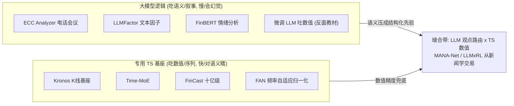

# 大模型逻辑 vs 专用时序基座（LLM Reasoning vs Dedicated TS Foundation Models）

> **本質衝突**：LLM 擅长跨模态知识检索与宏观叙事推理，但数值模式捕捉弱、高频推理慢、成本高；专用 TS 基础模型在序列拟合上占优却读不懂新闻语义。融合路径：LLM 做特征路由/观点注入，TS 模型做数值预测。

**Status:** v0.7 — Opus 手寫綜合，非摘要。TS 基座极已随语料增长补实（多个十亿级金融基础模型入库：Kronos/FinCast/ARMD 等）。

## 中心张力

这条张力常被「LLM 能不能预测股价」这种伪命题污染，真正的分水岭是**信号到底来自语义还是来自数值**。LLM 的本事是**把非结构化叙事压成可用的先验**——读财报、读电话会议、读新闻，做跨模态检索、做宏观逻辑链推理（ECC Analyzer 从电话会议抽信号、LLMFactor 从文本生成可解释因子、TRR 做组合崩溃的时间关系推理都是这一极）。它的弱点是**数值模式捕捉**：把一段价格序列喂给 LLM 让它续写下一个数，本质是让一个为语言优化的 tokenizer 去做它不擅长的回归；再加上推理延迟（高频根本不可能等一次 LLM forward）和 token 成本，纯靠 LLM 做数值预测在量化里基本是死路。

专用 TS 基础模型（Time-MoE、Timer、TEMPO、aLLM4TS）走的是另一条：在海量时序上预训练，把「序列拟合」这件事做到极致，zero-shot/few-shot 跨资产迁移。它们在数值预测的样本外 IC、多步长稳定性上结构性占优，推理也比 LLM 快几个数量级。但它们**对语义瞎**——一条「美联储意外加息 50bp」的新闻在纯量价 TS 模型眼里只是一根异常的 bar，它不知道为什么。两极各自的盲区恰好互补，于是缝合是必然的，问题只是**在哪一层缝**。注意一个语料里很关键的细节：aLLM4TS、Timer、TEMPO 这些「TS 基础模型」内部其实复用了 LLM 的 Transformer 骨架甚至预训练权重——所以这条张力不是「架构之争」（都是 Transformer），而是**「输入是 token 化的语义还是 patch 化的数值」+「优化目标是下一个 token 还是下一段序列」之争**。在哪里咬人：成本（LLM 每次推理的 token 账单 vs TS 模型一次 forward）、延迟（高频侧 LLM 完全出局）、以及幻觉（LLM 会编造它没读到的数字，用作数值信号是灾难）。

下图是语料里压倒性主流的分层缝法：LLM 待在**观点层**（吃语义、出方向先验/情绪分），TS 基座待在**数值层**（吃 patch、出预测），缝合带把 LLM 信号当额外通道喂给 TS——**把幻觉和延迟关在观点层，数值精度交给 TS 层**。

## 五轴投影

| 轴 | 大模型逻辑 | 专用 TS 基座 | 是否判别 |
|---|---|---|---|
| 数据模态 | **文本/多模态**（语义为食） | **量价/表格**（数值为食） | **核心判别轴** |
| 时间尺度 | 日频~中长周期（推理慢，跟不上高频） | 跨周期，可下探高频 | **判别**——高频侧 LLM 出局 |
| 学习范式 | **生成式/大模型** | 监督回归（虽用大模型骨架） | **核心判别轴** |
| Alpha生成机制 | 端到端表征 / 因子（文本因子）/ 风险择时 | 端到端表征 | 弱判别 |
| 人机协作度 | 偏人机协同可解释（叙事可读） | 全自动黑盒 | 部分判别 |

> 正交轴：**Alpha生成机制**。两极都能落到「端到端表征」，alpha 提取位置不分边。真正分水岭是 **数据模态（语义 vs 数值）× 学习范式（生成 vs 回归）**。一个反直觉点：架构轴**不**判别——两边骨架都是 Transformer，差别在喂进去的是 token 化语义还是 patch 化数值。

## 判别维度对比表

| 维度 | 大模型逻辑（LLM） | 专用 TS 基座 |
|---|---|---|
| 数值预测精度 | 弱——非数值优化的 tokenizer | 强——序列拟合是主业 |
| 语义/叙事理解 | 强——读财报新闻电话会议 | 无——量价里看不到为什么 |
| 推理延迟 | 高——高频不可用 | 低——一次 forward |
| 单位成本 | 高——token 账单 | 低 |
| 幻觉风险 | 高——会编数字，做数值信号是灾难 | 低——但会沉默外推到 OOD |
| 可解释性 | 中-高——能给推理链/叙事 | 低——黑盒 patch |
| 跨资产迁移 | 中——靠 prompt 泛化 | 强——预训练 zero-shot 迁移 |
| 失效场景 | 数值任务幻觉、延迟、成本爆炸 | 语义事件盲、分布漂移沉默退化 |

## 何时选哪边 / 何时崩

**选 LLM 逻辑，当**：信号本质来自文本/事件（财报、研报、电话会议、政策叙事），频率在日频以上，且你要的是**可解释的观点**而非毫秒级数值预测。LLM 适合做「观点层」「特征路由层」——决定哪些标的值得看、给一个带理由的方向先验。**崩点**：让 LLM 直接吐数值预测（幻觉 + 精度差）；用在高频（延迟杀死一切）；以及把 LLM 的叙事自信当成统计置信度——它对编造的逻辑和真实的逻辑一样自信。

**选专用 TS 基座，当**：信号主要在量价/数值结构里、需要跨资产 zero-shot 迁移、或频率往高频走。**崩点**：纯数值模型对语义事件全盲，黑天鹅/政策冲击来时它把异常 bar 当噪声平滑掉；以及预训练-微调的分布错配——在通用时序上预训练的基座，面对金融特有的厚尾/非平稳，会**沉默地**外推到训练分布里（不报警的退化最危险，[FAN 频率自适应归一化](/foundations/time-series-forecasting/fan)正是为治这个非平稳问题）。

**组合路线**（语料里压倒性主流）：**LLM 做特征路由/观点注入 + TS 做数值预测**——LLM 把新闻/事件压成结构化先验（情绪分、事件标签、方向观点），作为额外通道喂给 TS 模型或组合层（MANA-Net 用新闻加权、「从新闻到预测」直接把 LLM 信号接进 TS forecast）。分层的好处：把幻觉和延迟关在「观点层」，数值精度交给「TS 层」，两边的失效模式不会互相污染。

## 代表方法

**大模型逻辑一极**（吃语义/叙事、读财报新闻电话会议、推理慢成本高、会幻觉数字）：
- [ECC Analyzer 电话会议 LLM 框架](/foundations/llm-agentic/ecc-analyzer)（llm-agentic · 2247486072）— 从语音/文本抽信号
- [TRR 组合崩溃时间关系推理](/foundations/llm-agentic/trr)（llm-agentic · 2247487194）— LLM 做风险择时/黑天鹅推理
- [FinBERT & LLM 情绪分析](/foundations/llm-agentic/finbert-llm-prompting)（llm-agentic · 2247486930）— 语义压成情绪先验
- [LLMFactor + SKGP 可解释股价预测](/foundations/llm-agentic/llmfactor)（llm-agentic · 2247485339）— LLM 从文本生成可读因子
- [GraphRAG + Ollama 知识图谱分析](/foundations/llm-agentic/graphrag)（llm-agentic · 2247485462）— 检索增强的逻辑推理
- [微调 LLM 预测股票收益率](/foundations/llm-agentic/llms)（llm-agentic · 2247485651）— **让 LLM 直接吐数值信号**，正是本张力警告的「拿语义模型做回归」，缝合的反面教材

**专用 TS 基座一极**（吃数值/序列、序列拟合是主业、推理快、对语义瞎）：
- [Time-MoE 亿级 MoE 时序基础模型](/foundations/time-series-forecasting/time-moe)（time-series-forecasting · 2247486849）— ⚡ 稀疏 MoE 时序基座
- [Kronos K线基础模型](/foundations/time-series-forecasting/kronos)（time-series-forecasting · 2247491353）— ⚡ 清华，**专为量化 K 线设计**的基础模型，二元球面量化标记器，金融原生 TS 基座的代表
- [FinCast 十亿级金融预测基座](/foundations/time-series-forecasting/fincast)（time-series-forecasting · 2247491504）— ⚡ CIKM 25，首个十亿参数金融时序基座，PQ-loss 防坍塌、令牌级 MoE 隔离领域噪声
- [Timer 生成式预训练时序大模型](/foundations/time-series-forecasting/timer)（time-series-forecasting · 2247487139）— ⚡ 复用 LLM Transformer 骨架做时序预训练，印证「不是架构之争是输入之争」
- [ARMD 自回归滑动扩散](/foundations/time-series-forecasting/armd)（time-series-forecasting · 2247488868）— ⚡ 确定性滑动替代加噪，纯数值时序生成
- [TimeDART 自监督时序预训练](/foundations/time-series-forecasting/timedart)（time-series-forecasting · 2247490397）— ⚡ ICML 25，自回归 + 扩散去噪自监督
- [TEMPO 提示词驱动的预训练 TS](/foundations/time-series-forecasting/tempo)（time-series-forecasting · 2247486820）— ⚡ prompt 驱动但本质数值
- [aLLM4TS 把 LLM 适配于时序表征](/foundations/time-series-forecasting/allm4ts)（time-series-forecasting · 2247486045）— ⚡ **正好骑在缝上**：用 LLM 权重做 TS 表征
- [FAN 频率自适应归一化](/foundations/time-series-forecasting/fan)（time-series-forecasting · 2247487027）— TS 侧治非平稳，防「沉默外推到 OOD」

**缝合带（LLM 观点 × TS 数值——把幻觉/延迟关在观点层）：**
- [MANA-Net 新闻加权市场预测](/foundations/time-series-forecasting/mana-net)（time-series-forecasting · 2247486835）— 文本信号加权融入 TS forecast
- [LLM x 强化学习：从新闻中学习交易](/foundations/reinforcement-learning/llm-x)（reinforcement-learning · 2247492102）— 中科院，LLM 把新闻语义喂给 RL 决策，跨层缝合的现代样本
- 从新闻到预测：LLM 驱动的时序预测（llm-agentic · 2247487049）— 直接缝合（注册行，解构页待建）
- Conv-LSTM + LLM 集成股票预测（llm-agentic · 2247487110）— 数值模型 + LLM（注册行，解构页待建）
