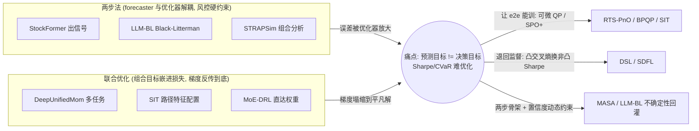

# 两步法 vs 联合优化（Predict-then-Optimize vs End-to-End Joint Optimization）

> **本質衝突**：先预测后优化模块解耦、风控清晰、可单测，但预测误差会被组合层放大；端到端把 Sharpe/CVaR 嵌进损失可全局最优，但梯度不稳、实盘难调试。常以预测置信区间做动态权重约束来折中。

**Status:** v0.7 — Opus 手寫綜合，非摘要。端到端/可微优化与两步法两极均已补实（portfolio-optimization 入库 ~31 篇，含 BPQP/RTS-PnO/DSL 等关键样本）。

## 中心张力

这条张力极易和[预测 vs 策略](/crossing/supervised-vs-rl/overview)混淆，但它问的是不同的问题。预测 vs 策略问「优化目标是收益率还是回报」；**两步法 vs 联合优化问「预测和组合构建是两个模块还是一个目标」**——你可以两边都用监督学习，区别只在「预测器的损失」和「组合的目标」是不是同一个反向传播图。

两步法（predict-then-optimize）是工业界的默认架构：第一步训一个 forecaster 输出预期收益/协方差，第二步把这些估计灌进一个独立的优化器（均值方差、风险平价、Black-Litterman）解出权重。它的核心优点是**解耦带来的工程可控性**——预测模块和优化模块各自可单测、可替换、可解释，风控约束（仓位上限、行业中性、换手限制）作为优化器的硬约束清清楚楚摆在那里。但它有一个致命的结构缺陷：**预测器优化的目标（MSE/IC）和最终关心的目标（Sharpe/回撤）不是一回事**。一个在 MSE 上最优的预测，灌进优化器后可能因为误差结构和优化器的敏感方向对齐而被**放大**——均值方差优化对预期收益的估计误差极度敏感是教科书级别的老问题，「error maximization」这个绰号就是这么来的。两步法把这个放大留给了下游，而预测器训练时对此一无所知。

联合优化（end-to-end）把组合目标直接嵌进损失函数——让网络的梯度一路从「最终 Sharpe/CVaR/扣成本收益」反传到预测层，于是预测器学到的不是「最准的收益估计」而是「最有利于下游组合的表征」（DeepUnifiedMom 把动量组合构建做成多任务、Signature-Informed Transformer 做端到端资产配置、MoE-DRL 端到端组合优化都是这一极）。理论上这是全局最优，能内化「哪种预测误差下游不在乎、哪种致命」。代价：**梯度不稳定**（Sharpe/CVaR 不是好优化的损失，含分位数/比率，梯度噪声大、易塌缩到平凡解）、**风控约束变软**（硬约束塞进可微损失变成惩罚项，实盘可能违反）、**实盘难调试**（端到端的失败是整体性的，没有中间量可指认是预测错了还是优化错了）。在哪里咬人：两步法在「预测准但组合烂」时找不到病灶（因为放大发生在解耦的缝里），联合优化在「整体不收敛/塌缩」时同样找不到病灶（因为没有中间量）。

下图的关键不是「两极对立」，而是**中间折中带分叉成两条方向相反的路**：左侧两步法（解耦、可审计、但误差被放大）与右侧联合优化（一损失到底、但梯度塌缩）之间，一条路用可微 QP / SPO+ 代理损失**让端到端工程上成立**（RTS-PnO/BPQP/SIT），另一条路反而**主动退回监督**、用凸交叉熵换掉非凸 Sharpe（DSL/SDFL）——同一个痛点，相反处方。

## 五轴投影

| 轴 | 两步法 | 联合优化 | 是否判别 |
|---|---|---|---|
| 数据模态 | 任意（解耦不挑模态） | 任意 | 不判别 |
| 时间尺度 | 任意，日频常见 | 任意 | 不判别 |
| 学习范式 | 监督回归 + 独立优化器 | 监督回归 / RL（端到端可微） | 部分判别 |
| Alpha生成机制 | 信号 + **独立的组合/执行优化** | **组合目标嵌入表征** | **核心判别轴** |
| 人机协作度 | 人机协同（优化器约束人手设） | 偏全自动黑盒 | **判别** |

> 正交轴：**数据模态 与 时间尺度**——这条张力是纯**架构/优化目标**之争，和信号源、频率完全无关。同一套量价日频数据，既能跑两步法也能跑联合优化。判别全压在 **Alpha生成机制（组合优化是独立模块还是嵌入损失）× 人机协作度（风控约束是硬约束还是软惩罚）** 上。

## 判别维度对比表

| 维度 | 两步法（predict-then-optimize） | 联合优化（end-to-end） |
|---|---|---|
| 目标一致性 | 弱——预测目标 ≠ 组合目标 | 强——一个损失到底 |
| 误差放大 | 高——预测误差被优化器放大且无感 | 低——内化误差敏感性 |
| 风控约束 | 硬约束，清晰可审计 | 软惩罚，实盘可能违反 |
| 模块可测性 | 高——预测/优化各自单测 | 低——只有整体指标 |
| 梯度稳定性 | N/A（优化器是凸/解析的） | 差——Sharpe/CVaR 难优化、易塌缩 |
| 可解释/可归因 | 高——能指认是预测还是优化的错 | 低——失败是整体性的 |
| 实盘落地成本 | 低——成熟工具链 | 高——难调试、难复现 |
| 失效场景 | error maximization、协方差估计崩 | 梯度塌缩到平凡解、软约束被突破 |

## 何时选哪边 / 何时崩

**选两步法，当**：风控/合规要硬约束（受监管资金、对外产品必须能审计每条约束）、团队需要可替换的模块化架构、或组合层本身有成熟的优化器（你不想重造均值方差）。这是绝大多数机构的合理默认。**崩点**：当预测误差结构恰好和优化器敏感方向对齐时（高度相关资产 + 均值方差），error maximization 会把一个看似不错的预测炸成极端集中的烂组合；协方差矩阵估计在样本不足时病态，优化器对它的敏感度远超对预期收益的敏感度。

**选联合优化，当**：最终目标（Sharpe/扣成本收益/CVaR）和预测目标差距大且你能证明这个 gap 是收益来源、有充足样本外预算调试梯度、且能接受软化风控（或在端到端外再包一层硬约束兜底）。**崩点**：损失塌缩——网络发现「全空仓」或「等权」是 Sharpe 损失的局部最优就躺平了；软约束在极端行情被突破（损失里的惩罚项压不住一个 100× 的 PnL 诱惑）；以及不可复现——端到端对初始化/数据顺序敏感，实盘和回测对不上还找不到原因。

**组合路线**（最务实的折中）：**两步法骨架 + 预测置信度驱动的动态约束**——保留解耦的可审计骨架，但让预测器**额外输出置信区间/不确定性**，优化器据此动态调权重约束（高不确定的标的自动收紧仓位上限）。这把联合优化想要的「误差敏感性」以一种可解释、可审计的方式塞回两步法，而不交出硬约束。[DeepUnifiedMom](/foundations/portfolio-optimization/deepunifiedmom) 的多任务设计、[MASA](/foundations/portfolio-optimization/masa) 的自适应风险管理框架都在这条折中线上；[LLM-BL](/foundations/portfolio-optimization/llm-blm) 用预测方差直接当 BL 置信度矩阵，是「不确定性回灌约束」最干净的落地。

> **v0.6 语料复核——折中带正在分叉成两条不对称的路**：语料浮现的不是一条折中线，而是**两个方向相反的回缩**。一边是 RTS-PnO/BPQP/SIT：用 SPO+ 代理损失或可微 QP 把优化层**做成可反传的**，让端到端真的能训——这是「让 e2e 工程上成立」的方向。另一边更反直觉：DSL 和 SDFL **主动放弃端到端**，把组合优化重新表述成「监督学习预计算的最优权重」，用凸交叉熵换掉非凸 Sharpe——这是承认「e2e 的梯度病不值得，退回两步监督更稳」的方向。两条路都来自同一个痛点（Sharpe/CVaR 难优化），却给出相反处方。配合[成本感知执行过滤器](/foundations/evaluation-benchmarks/cost-aware-execution-filter)这个「预测精度高但实盘巨亏」的活体反例，本张力被语料证实的核心不是「哪边赢」，而是**「目标错位（预测目标≠决策目标）是真实且昂贵的，三种应对——可微优化器/退回监督/执行端过滤——各有适用区间」**。原 v0.5 担心的「e2e 端到端正例偏薄」已被补足，新的薄点是这三条应对路线之间缺少同任务的横向对照。

## 代表方法

**两步法一极**（forecaster 与优化器解耦、风控硬约束清晰、可单测）：
- [Street PE 收益估值](/foundations/factor-mining/street-pe)（factor-mining · 2247486921）— 信号端，后接独立组合层
- [StockFormer 多任务选股](/foundations/time-series-forecasting/stockformer)（time-series-forecasting · 2247484801）— 典型「先出信号」，组合构建在外
- [STRAPSim 组合相似性度量](/foundations/portfolio-optimization/strapsim)（portfolio-optimization · 2247491859）— 贝莱德，独立的组合分析层，纯第二步工具
- [LLM 增强的 Black-Litterman](/foundations/portfolio-optimization/llm-blm)（portfolio-optimization · 2247492053）— LLM 出观点向量 q + 用预测方差当置信度 Ω → BL 优化器，两步法的现代版，且自带不确定性量化
- [融合 LLM 观点的 BL 模型](/foundations/portfolio-optimization/llm-bl)（portfolio-optimization · 2247490164）— 同思路，LLM 观点接经典 BL，解耦清晰
- [DSL 监督学习决策框架](/foundations/portfolio-optimization/dsl)（portfolio-optimization · 2247491174）— **反直觉样本**：作者明确放弃端到端直接优化非凸 Sharpe，改用交叉熵监督学习预计算的最优权重——把「联合优化」重新拆回「两步监督」以求稳定，是对 e2e 梯度病的正面回应
- [SDFL 半决策导向学习](/foundations/portfolio-optimization/sdfl)（portfolio-optimization · 2247489784）— 同上，以凸交叉熵替代非凸 Sharpe + 深度集成降方差，「半端到端」往两步法收缩的代表

**联合优化一极**（组合目标嵌进损失、梯度反传到底、全局最优但难调试）：
- [DeepUnifiedMom 多任务统一动量组合](/foundations/portfolio-optimization/deepunifiedmom)（portfolio-optimization · 2247484736）— 预测 + 组合一体的多任务设计
- [RTS-PnO 风险感知预测-分配](/foundations/portfolio-optimization/rts-pno)（portfolio-optimization · 2247491002）— ⚡ KDD 25，用 SPO+ 代理损失让不可微优化层端到端回传、保形预测动态校准约束，**直面「预测目标≠决策目标」错位**的样板，实盘购汇场景
- [BPQP 端到端可微优化器](/foundations/portfolio-optimization/bpqp)（portfolio-optimization · 2247488193）— ⚡ NIPS 24，把可微优化的反传重构成 QP、前后向分离——这是「让端到端真正能训」的基础设施，回答了 e2e 派的工程可行性
- [Sharpe/Omega/CVaR 塞进损失](/foundations/portfolio-optimization/sharpe-omega-cvar)（portfolio-optimization · 2247493957）— 「拒绝先预测再优化」，用 Softplus/变分把不可微金融指标平滑成损失直接反传，**正中本张力靶心**
- [SIT 路径特征端到端配置](/foundations/portfolio-optimization/signature-informed-transformer-sit)（portfolio-optimization · 2247491898）— 路径特征注入注意力 + 直接优化 CVaR，作者明言「消除预测-优化范式的误差放大」
- [MoE-DRL 端到端组合优化](/foundations/portfolio-optimization/moedrlpm)（portfolio-optimization · 2247491804）— 混合专家 + RL 直达权重
- [TLN-VWAP 深度学习执行](/foundations/portfolio-optimization/tln-vwap)（portfolio-optimization · 2247490093）— **绕过成交量预测**、自动微分直接优化 VWAP 滑点损失，「两步执行 → 端到端执行」的干净案例（且证明简单线性模型端到端即够）
- [牛津端到端期权交易](/foundations/time-series-forecasting/art-36)（time-series-forecasting · 2247485626）— loss 直接是交易目标
- [PortfolioMASTER 选股损失函数](/foundations/time-series-forecasting/portfoliomaster)（time-series-forecasting · 2247491994）— 直接拷问「loss 该嵌多少组合目标」

**折中带（两步骨架 + 置信度/约束动态化、或可微 QP 当桥）：**
- [MASA 多智能体自适应风险管理](/foundations/portfolio-optimization/masa)（portfolio-optimization · 2247486159）— 解耦骨架但动态调风险约束
- [AlphaGAT 自适应组合](/foundations/portfolio-optimization/alphagat)（portfolio-optimization · 2247491933）— 因子挖掘 + 图注意力组合，半端到端
- [YAND 微分几何组合优化](/foundations/portfolio-optimization/yand)（portfolio-optimization · 2247493812）— 丘成桐团队，把高阶矩优化做成结构化可微步骤，给两步法的「优化器」侧装上更强的梯度
- [成本感知执行过滤器](/foundations/evaluation-benchmarks/cost-aware-execution-filter)（evaluation-benchmarks · 2247493963）— 实证「预测精度高 ≠ 实盘赚钱」，**正是两步法 error-amplification 在执行端的活体反例**（精度→收益的断裂）
- [贝莱德 DRL 最优订单执行](/foundations/reinforcement-learning/art-359)（reinforcement-learning · 2247492961）— reward 含收益+冲击二次惩罚，执行层把成本嵌进目标的样本
