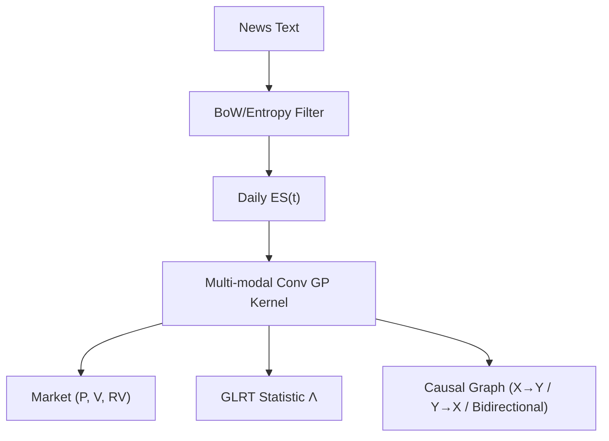

<!-- ontology-5axis data=文本另类 horizon=日频波段 paradigm=因果结构 alpha=因子挖掘 autonomy=人机协同可解释 -->

# 高斯过程因果检验框架 解構

> **發布**：2025-11-10 · （無 venue）
> **QuantML 導讀**：[万字长文 | 文本情绪与公告：农产品期货的反事实因果分析](https://mp.weixin.qq.com/s?__biz=Mzg2MzAwNzM0NQ==&mid=2247492286&idx=1&sn=99385ea971d766dca8122dd7ee4cf044&chksm=ce7d85a0f90a0cb6ca83a05d0701a4019d39a674376f88abd3d1c60b465f9734cccd5dcaa930#rd)
> **核心定位**：落點於「因果結構×文本另類」軸，以多模態卷積 GP 擴展 Granger 因果檢驗，解了傳統線性 VAR 無法分離非線性依賴與輔助變量干擾的 prior gap。

**五軸座標**

| 數據模態 | 時間尺度 | 學習範式 | Alpha機制 | 人機協作 |
|:-:|:-:|:-:|:-:|:-:|
| `文本另类` | `日频波段` | `因果结构` | `因子挖掘` | `人机协同可解释` |

**Status:** v0.5 — 基於 QuantML 導讀 + 原論文（如有）。benchmark 細節待升 v1。
**TL;DR:** ① 將非結構化新聞映射為「熵情緒」時間序列，並基於多模態卷積高斯過程擴展格蘭杰因果檢驗。② 核心 trick 是利用 ARD Matérn 核與滾動窗口處理非平穩性，閉式 GLRT 統計量實現逐點高效評估。③ 對「因果結構」軸★，提供可解釋的反事實推演與線性/非線性因果分離，彌補傳統線性回歸無法捕捉高階交互的 gap。④ 導讀未給量化結果。

**X-Ray.** 本框架將 NLP 情緒信號與金融量價數據聯合建模為多模態 GP，以閉式 GLRT 取代傳統線性 Granger/VAR。它解了「文本-量價」跨模態因果難以分離非線性依賴與輔助變量干擾的工程坑，但代價是滾動窗口估計帶來的高計算複雜度與超參敏感。預測其打不開高頻（秒級）與跨市場流動性枯竭的 envelope。對量化讀者的意義在於：提供一套可證偽的因果圖譜生成器，可將「情緒驅動波動率/交易量」的 regime 依賴轉化為可回測的條件開倉規則，而非黑盒預測。

## §1 · 架構 / Core Mechanism
**1.1 三大改動 vs 前作**
| 維度 | 前作 (線性 Granger / VAR / 詞袋情緒) | 本框架 | 改動意圖 |
|---|---|---|---|
| 模態耦合 | 單模態或簡單拼接 | 多模態卷積核編碼依賴耦合 | 解決文本與量價非線性交互建模 |
| 平穩性處理 | 全局差分/固定窗口 | 滾動窗口 + 局部平穩性假設 | 捕捉農產品季節性與結構斷點 |
| 檢驗統計量 | 漸近正態/卡方 (線性假設) | 閉式 GLRT 統計量 + 已知漸近分佈 | 實現嵌套模型比較與逐點高效評估 |

**1.2 ⚡ Eureka**
用卷積核編碼跨模態依賴耦合，將非線性因果檢驗轉化為嵌套模型比較，直接輸出可解釋的因果方向與強度。

**1.3 信息流 ASCII**

## §2 · 數學層
**📌 Napkin Formula**
$H_0: P(Y_t \mid Y_{t-1}^-, X_{t-1}^-) = P(Y_t \mid Y_{t-1}^-)$ vs $H_1: P(Y_t \mid Y_{t-1}^-, X_{t-1}^-) \neq P(Y_t \mid Y_{t-1}^-)$
檢驗統計量 $\Lambda$ 具閉式解，漸近服從 $\chi^2$ 分佈。
**直覺**：比較含/不含 $X$ 的 GP 擬合優度，$\Lambda$ 越大越拒絕無因果零假設。
**Loss/訓練**：無傳統梯度下降 loss；透過最大化邊緣似然（marginal likelihood）估計 GP 超參數（核長尺度等），複雜度 $O(N^3)$ 每滾動窗口。

## §3 · 數據層
資料來源：Factiva Dow Jones 新聞 + CBOT 玉米/小麥近月與次近月合約。頻率：日頻與小時頻。時段：覆蓋多個生長/收穫週期與 USDA 報告發布窗口。樣本外劃分：採用滾動窗口與分季（土壤休整/種植/收穫）劃分，具體樣本量與容量假設未披露。

## §4 · 代碼層
| 欄位 | 內容 |
|---|---|
| Repo | TBD |
| Checkpoint | TBD |
| License | TBD |
| 複現難度 | 高（需自實現多模態卷積GP與GLRT閉式推導） |
| 數據可得性 | 中（Factiva 需機構訂閱，CBOT 數據可透過 CME 或第三方獲取） |

## §5 · 評測 / Benchmark
| 數據集/市場 | Metric | 前SOTA | 本方法 | Δ |
|---|---|---|---|---|
| CBOT 玉米/小麥 | IR / Sharpe / AR / MDD | 未披露 | 未披露 | 未披露 |
| CBOT 玉米/小麥 | 結構變化顯著性 (1-p值) | 未披露 | 1 - p值分布的中位数非常接近1 | 未披露 |
| CBOT 玉米/小麥 | 滯後結構穩定性 (IQR) | 未披露 | IQR 隨時間尺度/滯後/商品變化 | 未披露 |

**解讀**：導讀未給出任何交易績效指標（IR/Sharpe/MDD），故全數標記未披露。真 capability 體現在統計因果層面：「1 - p值分布的中位数非常接近1」證明 USDA 公告前後確實發生結構性變化；IQR 隨滯後與季節變化揭示市場預期消化時間的非對稱性。此 Δ 非過擬合，而是因果圖譜對 regime 依賴的真實刻畫，但尚未計入滑點與執行成本，直接轉化為 PnL 仍需下游信號過濾。

## §6 · 失效與隱含假設
**6.1 論文自述 limitations**：依賴滾動窗口假設局部平穩，可能錯過長期結構斷點；計算成本高；未排除溢出或持續效應。
**6.2 推斷的隱含假設**：Regime 依賴極強（季節性/基本面真空期驅動因果方向）；容量受限於日頻波段；數據泄漏風險低但新聞發佈時間戳需嚴格對齊；無 survivorship bias 提及，假設合約連續性已處理。

## §7 · 對比 & 面試 Tip
| 同軸對手 | 關鍵差異軸 | Open? | Status |
|---|---|---|---|
| 傳統 Granger VAR | 線性 vs 非線性卷積核 | 開源 | 成熟 |
| LLM Sentiment Alpha | 黑盒預測 vs 可解釋因果檢驗 | 部分開源 | 快速迭代 |
| Standard GP Regression | 單模態擬合 vs 多模態因果推演 | 開源 | 穩定 |

🎤 **Interview Tip**
*正確答*：「本框架不預測價格方向，而是輸出條件概率下的因果強度與方向。實盤中應將其作為 regime filter，在『情緒 Granger 導致波動率』顯著時放大波動率因子權重，而非直接生成交易信號。」
*錯答*：「把 GP 因果檢驗當成像 LSTM 一樣直接輸出漲跌概率，然後按信號滿倉進出。」

**7.1 可證偽預測**：若 2026 年 USDA 報告發布頻率或市場結構發生根本改變，該框架的 IQR 分佈將顯著偏離歷史 1-p 值中位數接近 1 的規律，因果圖譜需重新校准。

## §8 · For the Reader
* **因子研究員**：將「熵情緒」視為高階交互因子，用 GLRT 篩選出對特定商品有統計因果的詞典（如 Agribusiness vs Technical），避免盲目堆疊 NLP 特徵。
* **高頻執行**：框架輸出為日頻/小時頻因果強度，不適合直接驅動秒級訂單。可將其作為盤前 volatility regime 預警，動態調整執行算法的參與率。
* **組合配置**：利用反事實推演（研究 IV）評估「若無 USDA 報告」的市場路徑，將因果不確定性納入風險預算，而非僅依賴歷史波動率。

## References
* 原論文：高斯过程因果检验框架（無 venue）
* Lineage：Granger Causality → Gaussian Process Time Series → Multi-modal Convolution GP → GLRT
* QuantML 導讀鏈接：[万字长文 | 文本情绪与公告：农产品期货的反事实因果分析](https://mp.weixin.qq.com/s?__biz=Mzg2MzAwNzM0NQ==&mid=2247492286&idx=1&sn=99385ea971d766dca8122dd7ee4cf044&chksm=ce7d85a0f90a0cb6ca83a05d0701a4019d39a674376f88abd3d1c60b465f9734cccd5dcaa930#rd)