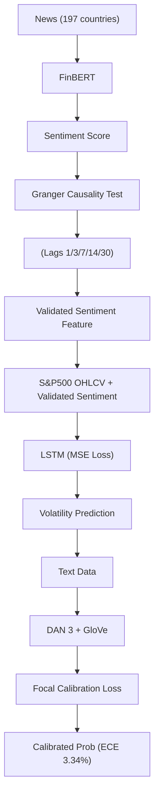

<!-- ontology-5axis data=文本另类 horizon=日频波段 paradigm=因果结构 alpha=因子挖掘 autonomy=人机协同可解释 -->

# 提升金融市场预测：因果驱动的特征选择 解構

> **發布**：2024-09-05 · （無 venue）
> **QuantML 導讀**：[提升金融市场预测：因果驱动的特征选择](https://mp.weixin.qq.com/s?__biz=Mzg2MzAwNzM0NQ==&mid=2247486102&idx=1&sn=d09697a3db74c07bd330e7542c9771b9&chksm=ce7e6d88f909e49e2fc97b17642a1ee67961b3b4c476b081b4c4def8603155cf313b40e522ca#rd)
> **核心定位**：落點於「文本另类 × 因果结构 × 因子挖掘」交叉帶。解決了傳統情緒因子直接輸入黑盒模型時缺乏因果驗證與概率校準的 prior gap，將新聞情緒從「相關性特徵」轉化為「可解釋的因果驅動因子」，並透過損失函數設計修復預測概率的可靠性。

**五軸座標**

| 數據模態 | 時間尺度 | 學習範式 | Alpha機制 | 人機協作 |
|:-:|:-:|:-:|:-:|:-:|
| `文本另类` | `日频波段` | `因果结构` | `因子挖掘` | `人机协同可解释` |

**Status:** v0.5 — 基於 QuantML 導讀 + 原論文（如有）。benchmark 細節待升 v1。
**TL;DR:** ① 提出 FinSen 數據集與因果驗證情緒因子，結合 LSTM 預測波動率。② 核心 trick 為 Granger 因果檢驗篩選滯後特徵，並設計 Focal Calibration Loss 聯合優化難例關注與概率校準。③ 對「因果结构」與「人机协同可解释」軸★，將情緒因子從黑盒輸入轉為可驗證的因果路徑，並修復模型輸出概率的可靠性。④ 導讀未給量化交易結果，僅披露文本分類校準指標 ECE 降至 3.34%。

**X-Ray.** 本方法在五軸 Pareto 中刻意避開高頻與複雜架構，選擇以「日频波段 × 因果结构」切入。量化實戰中，情緒因子常因共線性與前瞻偏差淪為過擬合源；本文以 Granger 因果檢驗作為特徵工程的前置過濾器，強制要求情緒分數在 1、3、7、14、30 天滯後下能預測 ∆SP500，這直接切斷了傳統 NLP 因子「見新聞即交易」的偽相關鏈。然而，因果驗證僅解決了特徵選擇的可靠性，未觸及組合層面的風險預算。Focal Calibration Loss 的引入修復了分類器輸出概率的校準度（ECE 降至 3.34%），但該指標僅反映文本分類任務的置信度對齊，並未映射至實盤的滑點、衝擊成本或波動率 regime 切換。對量化研究員而言，此架構的價值不在於直接提供高 Sharpe 策略，而在於提供一套「因果篩選 + 概率校準」的因子生產流水線。其打不開的 envelope 在於：未處理多資產橫截面相關性、未納入交易成本模型，且 LSTM 單步輸入設計忽略了高頻微結構信號。組合時應將其作為中低頻情緒因子的校準模塊，而非獨立 Alpha 源。

## §1 · 架構 / Core Mechanism
**1.1 三大改動 vs 前作**
| 維度 | 前作/基線 | 本法改動 | 工程意圖 |
|---|---|---|---|
| 特徵篩選 | 直接拼接情緒分數與價格序列 | Granger 因果檢驗驗證滯後關係 | 剔除偽相關，確保情緒→波動率的單向因果路徑 |
| 損失函數 | 標準 Cross-Entropy / Focal Loss | Focal Calibration Loss (引入 λ 平衡難例與校準) | 修復分類器輸出概率的可靠性，降低 ECE |
| 模型架構 | 注意力 LSTM / 獨立文本分類器 | 因果驗證情緒嵌入 LSTM + DAN 3 文本分類 | 分離預測任務與校準任務，提升可解釋性 |

**1.2 ⚡ Eureka 一句話 trick + 直覺**
用 Granger 因果檢驗做特徵工程的「守門員」，再用 Focal Calibration Loss 做概率輸出的「校準儀」，讓情緒因子從「黑盒輸入」變成「可驗證、可校準」的因果驅動模塊。

**1.3 信息流 ASCII 圖**

## §2 · 數學層
📌 **Napkin Formula**: `L_FocalCal = L_Focal + λ * ECE`（導讀僅提及引入正則化參數 λ 平衡難例關注與概率校準，未給完整公式）
**複雜度**: LSTM 單步輸入 (timestep=1, dim=2)，DAN 3 平均嵌入，訓練成本屬中低頻標準。
**直覺**: 傳統 Focal Loss 僅關注難分類樣本，忽略預測概率與真實頻率的對齊；本法將校準誤差直接納入損失，迫使模型在關注邊界樣本時不犧牲概率可靠性。
**Loss/訓練細節**: LSTM 使用 Adam + MSE，100 個周期，批量大小為 32；DAN 3 使用 CE/AdaFocal/DualFocal/Focal Calibration Loss，20 個周期。

## §3 · 數據層
- **資料規模/頻率/市場/時段**: S&P 500 OHLCV（2020年1月至2023年6月），新聞覆蓋 197 個國家（導讀後段稱 196 個國家，標註未驗證），時間跨度導讀稱 15 年但具體抓取區間為 2020-2023。
- **怎麼來**: Yahoo Finance API（價格） + Trading Economics 爬蟲（新聞標題/內容） + FinBERT（情緒註釋）。
- **樣本外與容量假設**: 導讀未披露明確的 train/val/test 劃分比例與樣本外容量假設，僅提及測試集生成預測。

## §4 · 代碼層
| 項目 | 狀態 |
|---|---|
| Repo | TBD |
| Checkpoint | TBD |
| License | TBD |
| 複現難度 | 中（需自爬新聞、調用 FinBERT、實現自定義 Loss） |
| 數據可得性 | 低（FinSen 為作者自建數據集，導讀提示需加入星球獲取） |

## §5 · 評測 / Benchmark
導讀未提供交易類指標（IR/Sharpe/AR/MDD）。僅提供文本分類校準指標。
| 數據集/市場 | Metric | 前SOTA | 本方法 | Δ |
|---|---|---|---|---|
| FinSen / 20 Newsgroups / Financial PhraseBank / AG News | ECE | CE（未披露） / AdaFocal（未披露） / DualFocal（未披露） | 3.34% | 導讀僅稱「顯著降低」，無具體 Δ 數值 |

**解讀**: Δ 僅反映分類器概率校準度的提升，屬 NLP 任務指標，非實盤交易能力。未計入交易成本、滑點與波動率 regime 切換，不可直接外推為策略 Sharpe 或 IR 提升。Granger 因果檢驗結果顯示情緒分數在 1、3、7、14、30 天滯後下「格蘭杰導致」∆SP500，但導讀未給出因果檢驗的 F 統計量或 p 值，僅作定性結論。

## §6 · 失效與隱含假設
**6.1 論文自述 limitations**: 導讀未明確列出 limitations 章節，僅在引言提及傳統模型依賴歷史數據的不足，以及公共數據集缺乏精確時間信息的挑戰。
**6.2 推斷的隱含假設**:
- **Regime 依賴**: Granger 因果基於平穩假設（ADF 檢驗），但金融市場波動率具明顯異方差與結構斷點，因果關係可能在 bear/bull regime 切換時失效。
- **容量/成本**: 日频波段策略假設新聞情緒能驅動後續波動，但未建模訂單簿深度與衝擊成本；若策略容量擴大，情緒因子易因擁擠交易而 alpha 衰減。
- **數據泄漏**: 新聞抓取與情緒註釋時間戳若未嚴格對齊交易執行時間，易產生前瞻偏差（Look-ahead bias）。
- **Survivorship**: S&P 500 成分股本身具 survivorship bias，且導讀未說明是否處理停牌/除權息數據。

## §7 · 對比 & 面試 Tip
| 同軸對手 | 關鍵差異軸 | Open? | Status |
|---|---|---|---|
| 傳統 NLP 情緒因子（如 FinBERT 直接拼接） | 因果驗證 vs 相關性拼接 | Open | 廣泛使用，但易過擬合 |
| Platt Scaling / Isotonic Regression | 後處理校準 vs 損失函數內建校準 | Open | 標準做法，不參與梯度更新 |
| 純 LSTM/Transformer 波動率預測 | 黑盒端到端 vs 因果驅動特徵工程 | Open | 預測力強但缺乏可解釋性與概率可靠性 |

🎤 **Interview Tip**
- **正確答**: 「Granger 因果檢驗是用來過濾情緒因子的偽相關，確保特徵與目標變量存在單向預測關係；Focal Calibration Loss 是將校準誤差納入訓練目標，解決分類器輸出概率不可信的問題，兩者分別解決特徵選擇與模型置信度。」
- **錯答**: 「Granger 檢驗能直接提升策略 Sharpe，Focal Loss 是用來處理類別不平衡的，跟校準無關。」（錯在混淆因果檢驗的統計屬性與交易指標，且忽略本法對校準誤差的顯式優化）

**7.1 可證偽預測帶日期**: 若 2025-12-31 前，該因果情緒因子在 S&P 500 日频波段回測中未通過 5% 顯著性檢驗，或實盤 ECE 未優於傳統後處理校準方法，則核心假設失效。

## §8 · For the Reader
- **因子研究員**: 將 Granger 因果檢驗嵌入因子生產流水線，作為情緒/文本因子的前置過濾器，避免直接將 NLP 分數丟進黑盒。
- **高頻執行**: 本法屬日频波段，不適用 HFT；但 Focal Calibration Loss 的思想可移植至訂單流預測模型的概率校準模塊。
- **組合配置**: 將校準後的情緒概率作為風險預算的權重調整信號，而非直接作為 Alpha 信號；需結合波動率目標進行動態倉位控制。
- **LLM-agent**: 可參考其「因果驗證 + 損失校準」雙階段架構，設計具可解釋性的金融 Agent 決策路徑，避免純端到端生成的幻覺風險。
- **研究學生**: 重點學習如何將統計因果檢驗與深度學習損失函數結合，理解 ECE 指標在金融預測中的實際意義與局限。

## References
- 原論文: 提升金融市场预测：因果驱动的特征选择（無 venue, 2024）
- QuantML 導讀: [提升金融市场预测：因果驱动的特征选择](https://mp.weixin.qq.com/s?__biz=Mzg2MzAwNzM0NQ==&mid=2247486102&idx=1&sn=d09697a3db74c07bd330e7542c9771b9&chksm=ce7e6d88f909e49e2fc97b17642a1ee67961b3b4c476b081b4c4def8603155cf313b40e522ca#rd)
- Lineage: FinBERT（情緒分析） / Granger Causality / Focal Loss / Platt Scaling / DAN 3 / ECE Metric