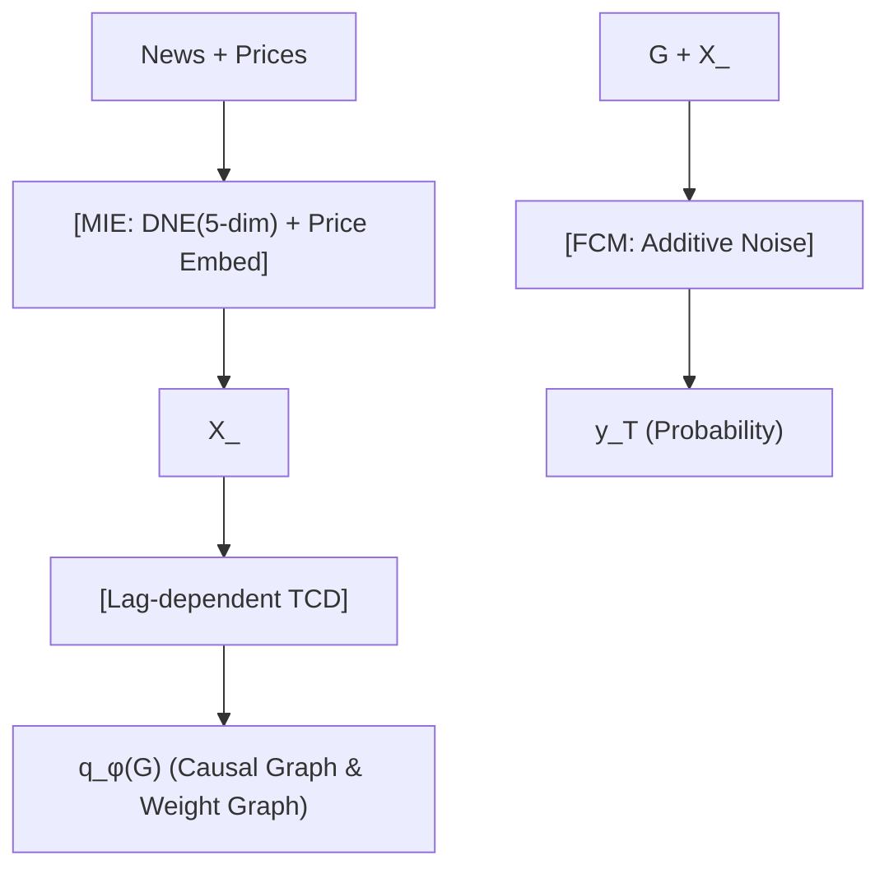

<!-- ontology-5axis data=文本另类 horizon=日频波段 paradigm=因果结构 alpha=端到端表征 autonomy=人机协同可解释 -->

# CausalStock 解構

> **發布**：2024-12-12 · NeurIPS24
> **QuantML 導讀**：[NIPS 24 | CausalStock : 基于端到端因果发现的新闻驱动股价预测模型](https://mp.weixin.qq.com/s?__biz=Mzg2MzAwNzM0NQ==&mid=2247488342&idx=1&sn=4793d31201295e14a5978556f449adca&chksm=ce7e7448f909fd5e6d42f9e9c2c117c8c0b40fedc7d2d0e269118222e65b7dd8b8da2106e233#rd)
> **核心定位**：落點於「文本另类 × 因果結構」軸，解決傳統新聞驅動模型將股票互動簡化為對稱相關性（Correlation）的工程坑，並透過 LLM 維度評分過濾資訊過載與來源歧義，將非結構化文本轉為可微因果權重。

**五軸座標**

| 數據模態 | 時間尺度 | 學習範式 | Alpha機制 | 人機協作 |
|:-:|:-:|:-:|:-:|:-:|
| `文本另类` | `日频波段` | `因果结构` | `端到端表征` | `人机协同可解释` |

**Status:** v0.5 — 基於 QuantML 導讀 + 原論文（如有）。benchmark 細節待升 v1。
**TL;DR:** ① 以功能因果模型（FCM）與變分推斷取代傳統注意力相關性建模，實現新聞驅動的多股日頻漲跌預測。② 核心 trick 為 LLM 五維評分去噪新聞編碼器（DNE）結合滯後依賴時間因果發現（Lag-dependent TCD）。③ 對「因果結構」軸的價值在於將隱性供應鏈/行業傳導路徑顯性化為可學習的 DAG 與權重圖，避免偽相關套利。④ 導讀未給量化結果。

**X-Ray.** 在「端到端表徵」與「因果結構」的 Pareto 前沿上，CausalStock 選擇用變分推斷近似後驗圖分佈，犧牲部分計算效率換取可解釋的傳導路徑。它解了舊工程坑：傳統 RNN/LSTM/Transformer 對新聞的序列編碼或簡單 attention 會將噪音（如無關宏觀數據、重複報導）與價格波動強行擬合，導致因子衰減極快。DNE 將文本降維至 5 維結構化評分，實質是將非結構化 NLP 任務轉為結構化特徵工程，降低模型對語言模型的過擬合風險。預測它打不開的 envelope：日頻波段意味著無法捕捉盤中訂單流衝擊，且因果圖學習依賴歷史滯後，對突發性 regime shift（如閃崩、政策急轉）的反應必然滯後於高頻價格行為。對量化讀者意義：提供了一條「先驗知識（行業鏈）+ 數據驅動（變分因果圖）」的混合建模范式，適合中低頻基本面量化團隊將新聞流轉化為可回測的傳導因子，而非直接作為交易信號。

## §1 · 架構 / Core Mechanism
**1.1 三大改動 vs 前作（HAN / StockNet / PEN / CMIN 等）**
| 維度 | 前作（相關性/注意力范式） | CausalStock（因果結構范式） |
|---|---|---|
| 關係建模 | 對稱注意力權重 / 圖神經網絡共動 | 滯後依賴有向無環圖 (DAG) + 可學習因果權重圖 |
| 文本處理 | RNN/LSTM/GRU 序列隱狀態編碼 | LLM 五維評分去噪 (DNE) + 結構化嵌入 |
| 預測機制 | 端到端黑盒回歸/分類 | 功能因果模型 (FCM) 加性噪聲聚合 |

**1.2 ⚡ Eureka 一句話 trick + 直覺**
將「新聞影響力」與「股票傳導路徑」解耦為可學習的圖結構與權重，用變分推斷逼近因果後驗，而非強行擬合歷史共動。直覺：市場傳導本質是非對稱的（供應商→客戶），DAG 能天然刻畫這種方向性與時間滯後，避免注意力機制將噪音誤判為強連接。

**1.3 信息流 ASCII 圖**

## §2 · 數學層
📌 **Napkin Formula**
`log p(y_T | X_<T) ≥ E_{q_φ(G)}[log p(y_T | X_<T, G) + log p(G)] + H(q_φ(G))` （ELBO 下界）
`y_i = f_i(Pa(y_t)) + z_i`, `f_i = Sigmoid(Σ_l Σ_j G_{l,ji} ⊙ e(Pa(y_t)-1) ⊕ v(C_t))`
**複雜度**：圖空間組合爆炸，變分近似降至 `O(L×D²)` 參數優化；前向傳播依賴稀疏 DAG 聚合。
**直覺**：用伯努利分佈乘積近似圖後驗，Gumbel-softmax 實現可微採樣；外生噪聲 `z_i ~ N(0, σ_i²)` 捕捉模型無法解釋的隨機波動。Loss 為 ELBO 下界 + 二元交叉熵 `BCE(g_T, y_T)`。

## §3 · 數據層
- **規模/頻率/市場**：6 個來自不同國家股票市場的數據集，日頻（交易日 T 預測 T 日漲跌）。
- **來源**：歷史價格（開高低收量）+ 新聞文本語料（導讀未披露具體來源與清洗管道）。
- **樣本外與容量假設**：假設新聞發布與價格反應存在固定滯後 L；未提及樣本外劃分策略或交易成本假設，容量受限於日頻信號與新聞發布頻率，適合中低頻組合。

## §4 · 代碼層
| Repo | Checkpoint | License | 複現難度 | 數據可得性 |
|---|---|---|---|---|
| TBD | TBD | TBD | 高（需 LLM API 調用與變分推斷調參） | 低（導讀未披露具體新聞源與價格數據接口） |

## §5 · 評測 / Benchmark
| 數據集/市場 | Metric | 前SOTA | 本方法 | Δ |
|---|---|---|---|---|
| 新聞驅動多股預測 | ACC | 未披露 | 未披露 | 未披露 |
| 新聞驅動多股預測 | MCC | 未披露 | 未披露 | 未披露 |
| 無新聞多股預測 | ACC | 未披露 | 未披露 | 未披露 |
| 無新聞多股預測 | MCC | 未披露 | 未披露 | 未披露 |

**解讀**：導讀僅定性聲明「優於所有基線」且「投資模擬實現更高利潤並平衡風險收益」，未提供逐字數字。Δ 欄全為「未披露」以遵守紀律。真 capability 在於因果圖的結構約束降低了新聞噪音與偽相關的過擬合風險；潛在偏差包括：新聞發布時間戳與價格數據的對齊可能引入前瞻偏差（Lookahead）；LLM 評分依賴提示詞工程，存在數據泄漏風險（若訓練集新聞已進入 LLM 預訓練語料）；投資模擬未披露交易成本與滑點，實際 Sharpe 可能大幅衰減。

## §6 · 失效與隱含假設
**6.1 論文自述 limitations**：變量依賴因果機制計算複雜度高；新聞數據量大導致資訊過載與語言歧義需 LLM 緩解；因果發現依賴觀測數據，難以完全排除未觀測混淆因子。
**6.2 推斷的隱含假設**：
- **Regime 依賴**：因果圖學習基於歷史滯後，對結構性斷點（如加息週期切換、行業政策重構）適應慢，圖結構更新滯後於市場狀態切換。
- **容量/成本**：日頻信號換手率受限，未計入衝擊成本與流動性假設；高頻執行無法直接套用。
- **數據泄漏**：LLM 五維評分若未隔離預訓練知識，可能將歷史已知事件提前注入特徵。
- **Survivorship**：未提及是否使用生存偏差校正的數據集，回測結果可能高估實盤表現。

## §7 · 對比 & 面試 Tip
| 同軸對手 | 關鍵差異軸 | Open? | Status |
|---|---|---|---|
| HAN / StockNet | 對稱注意力 vs 滯後有向因果圖 | 開源 | 穩定 |
| CMIN | 圖神經網絡相關性 vs FCM 加性噪聲因果 | 開源 | 穩定 |
| 傳統因子傳導 | 靜態行業鏈先驗 vs 動態變分圖學習 | 閉源/內部 | 迭代 |

🎤 **Interview Tip**
- **正確答**：「CausalStock 的核心不在於預測精度本身，而在於將新聞特徵與價格傳導解耦為可學習的 DAG 與權重。它用變分推斷近似圖後驗，本質是結構化特徵工程，能顯著降低新聞噪音導致的因子衰減，但需警惕 LLM 評分引入的預訓練數據泄漏與日頻信號的執行成本。」
- **錯答**：「它用 LLM 直接預測股價，比 LSTM 準確率高很多，因為大模型理解新聞更好。」（忽略因果圖機制、過擬合風險與工程落地限制）

**7.1 可證偽預測**：若 2025-06-30 前，該框架在獨立第三方日頻新聞數據集（如 Reuters/Bloomberg 實時流）上的實盤 MCC 未顯著高於靜態行業鏈因子組合（Δ ≤ 0.02），則其「動態因果發現」的增量價值存疑。

## §8 · For the Reader
- **因子研究員**：將 DNE 五維評分視為結構化新聞因子，可與傳統量價因子正交化，避免文本 Embedding 的黑盒共線性。
- **高頻執行**：日頻波段信號無法直接用於 HFT，但因果圖的傳導路徑可用於盤前組合再平衡的流動性預估與訂單拆分。
- **組合配置**：FCM 的外生噪聲項 `σ_i²` 可作為動態風險預算的代理變量，在 regime shift 時自動降權高不確定性個股。
- **LLM-agent**：提示詞設計需嚴格隔離預訓練語料，建議採用 Few-shot + 時間截斷驗證，防止數據泄漏。
- **研究學生**：變分因果圖的 Gumbel-softmax 重參數化是論文工程亮點，可複現於其他圖結構學習任務，但需控制 `L×D²` 的參數膨脹。

## References
- 原論文: CausalStock: End-to-End Causal Discovery for News-Driven Stock Price Prediction (NeurIPS 2024)
- Lineage: HAN / StockNet / PEN / CMIN / ALSTM / DTML
- QuantML 導讀: [NIPS 24 | CausalStock : 基于端到端因果发现的新闻驱动股价预测模型](https://mp.weixin.qq.com/s?__biz=Mzg2MzAwNzM0NQ==&mid=2247488342&idx=1&sn=4793d31201295e14a5978556f449adca&chksm=ce7e7448f909fd5e6d42f9e9c2c117c8c0b40fedc7d2d0e269118222e65b7dd8b8da2106e233#rd)