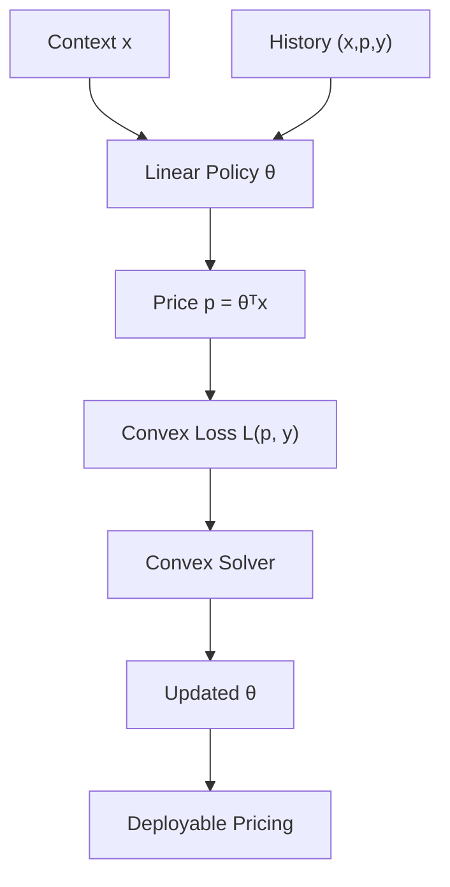

<!-- ontology-5axis data=量价表格 horizon=日频波段 paradigm=因果结构 alpha=组合执行优化 autonomy=人机协同可解释 -->

# 凸代理损失定价 解構（凸代理损失定价）

> **發布**：2026-07-14 · Management Science · arXiv [2202.10944](https://arxiv.org/abs/2202.10944)
> **期刊原文（OA）**：[Convex Surrogate Loss Functions for Contextual Pricing with Transaction Data](https://doi.org/10.1287/mnsc.2023.00122) · _本頁由開放取用期刊原文一手自主解構_
> **核心定位**：將 off-policy 定價從「預測需求→非凸優化」的兩步陷阱，降維為「直接凸風險最小化」的單步求解；以理論收益下界換取線性策略的可解釋性與計算穩定性。

**五軸座標**

| 數據模態 | 時間尺度 | 學習範式 | Alpha機制 | 人機協作 |
|:-:|:-:|:-:|:-:|:-:|
| `量价表格` | `日频波段` | `因果结构` | `组合执行优化` | `人机协同可解释` |

**Status:** v0.5 — 基於期刊原文（OA）（有原文則以原文為準）。細節待升 v1。
**TL;DR:** 提出凸代理損失函數，直接從歷史交易數據優化定價策略，跳過需求函數估計步驟。核心 trick 是廣義 hinge 與分位數定價損失，保證線性策略下的凸優化與預期收益下界。對「因果結構」與「組合執行優化」軸★：將 off-policy 定價轉化為可直接求解的凸風險最小化問題，避免傳統 predict-then-optimize 的非凸陷阱。關鍵數字：在估值分佈 log-concave 假設下，hinge 與 quantile 策略分別提供 0.772 與 0.749 的理論收益下界。

**X-Ray.** 本方法切中量化定價的經典工程坑：傳統 demand estimation 在引入 GBM/NN 後，收入曲面高度非凸，梯度下降極易陷入局部最優或產生反直覺的定價跳變。凸代理損失將優化目標直接錨定在歷史成交標籤上，以線性策略換取計算效率與監管可解釋性。但 Pareto 前緣的代價是強假設：理論下界依賴估值分佈 log-concave，實盤中若遭遇多峰偏好或政策干預導致的分佈漂移，下界將迅速失效。對量化讀者的意義不在於直接上線定價，而在於提供一個可嵌入組合執行層的風險約束模塊，用於過濾非凸優化產生的極端價格信號。

## §1 · 架構 / Core Mechanism
**1.1 三大改動 vs 前作**
| 維度 | 前作 (Predict-then-Optimize) | 本方法 (Convex Surrogate Loss) |
|---|---|---|
| 優化路徑 | 估計需求函數 $P(y=1\|x,p)$ → 求解 $\max_p p \cdot P(\cdot)$ | 直接最小化凸代理損失 $\min_\theta \mathbb{E}[L(p_\theta(x), y)]$ |
| 曲面性質 | 非凸（尤其使用樹集成/NN時），求解器易發散 | 凸（線性策略+凸損失），全局最優可保證 |
| 理論保證 | 無明確收益邊界 | 提供相對於最優上下文定價的理論收益下界 |

**1.2 ⚡ Eureka 一句話 trick + 直覺**
跳過「估計需求曲線」的中間步驟，直接用凸損失函數對歷史成交/未成交標籤進行風險最小化，將定價問題等價為尋找線性決策邊界，以可解釋的線性權重換取優化穩定性。

**1.3 信息流 ASCII 圖**

## §2 · 數學層
📌 **Napkin Formula**
優化目標：$\min_{\theta} \frac{1}{N} \sum_{i=1}^N L_{\text{surrogate}}(p_i, y_i \mid x_i)$，其中 $p_i = \theta^\top x_i$。
複雜度：$O(N \cdot d)$（$d$ 為特徵維度，標準凸優化求解）。
直覺：廣義 hinge loss 逼近條件期望估值，分位數 loss 逼近歷史成交價格的分位數。訓練細節不依賴分佈假設，僅需歷史 $(x, p, y)$ 三元組，通過標準凸優化器（如 CVXOPT/L-BFGS）直接輸出線性權重 $\theta$。

## §2.5 · 帶數字走一遍（Worked Example）
*(以下為明確標「假設/示意」的玩具數字，僅用於演示機制手算流程，非論文實證結果)*
1. **假設輸入**：客戶特徵 \$x = [1.0, 0.5]\$（截距項+收入標準化），歷史定價 $p_{hist}=100$，成交標籤 $y=1$。
2. **中間量計算**：代入示意性 hinge loss $L = \max(0, 1 - y \cdot (p - \tau))$，設閾值 $\tau=90$。當前預測 $p_{pred} = \theta^\top x$，若初始 $\theta=[80, 10]$，則 $p_{pred}=85$。殘差 $1 - 1 \cdot (85 - 90) = 6$，損失激活。
3. **梯度更新**：凸優化器計算 $\nabla_\theta L$，沿負梯度方向更新權重，假設步長後 $\theta$ 調整為 \$[82, 12]\$。
4. **輸出定價**：新定價 $p^* = 82 \cdot 1.0 + 12 \cdot 0.5 = 88$。
5. **機制驗證**：損失函數推動 $p^*$ 向歷史成交區間收斂，同時保持線性結構。實盤中此步驟由求解器批量處理，輸出可部署的定價策略。

## §3 · 數據層
- **數據模態**：觀察性掛單數據 (observational posted-price data)，包含客戶/商品特徵、歷史報價、是否成交標籤。
- **樣本規模/頻率/市場**：未披露。
- **時段與容量假設**：文中提及使用合成數據與真實世界數據進行模擬，但未給出具體時間窗口、樣本量或市場類別。樣本外評估依賴有限樣本泛化界，未說明是否進行滾動回測或交叉驗證。

## §4 · 代碼層
| 欄位 | 內容 |
|---|---|
| Repo | TBD |
| Checkpoint | 未披露 |
| License | 未披露 |
| 複現難度 | 低（標準凸優化，依賴線性特徵工程） |
| 數據可得性 | 中（需歷史交易流水與客戶特徵，屬機構內部數據） |

## §5 · 評測 / Benchmark
| 數據集/市場 | Metric | 前SOTA | 本方法 | Δ |
|---|---|---|---|---|
| 理論邊界 (Log-concave 估值) | 理論收益下界 | Chen et al. (2021) 0.5 | Hinge 0.772 / Quantile 0.749 | +0.272 / +0.249 |

**解讀**：Δ 反映的是**理論下界提升**，而非實盤超額收益。Chen et al. (2021) 的 0.5 邊界受限於均勻歷史定價假設，本法放寬至任意歷史政策並利用 log-concave 假設推導出更緊的下界。實證部分僅定性提及「在部分設定下優於 state-of-the-art」，未披露 Sharpe/AR/MDD 等交易指標。需注意：該 Δ 是數學保證的極端情況底線，實盤若遭遇交易成本、流動性衝擊或分佈漂移，實際收益可能遠低於下界。GBM/NN 基線被指出因非凸優化困難而表現不佳，但無具體數值對比。

## §6 · 失效與隱含假設
**6.1 論文自述 limitations**
- 不存在能始終找到最優定價策略的凸損失函數，預期收益必然存在 gap。
- 理論邊界嚴格依賴估值分佈的 log-concave 假設，若分佈多峰或厚尾，邊界無效。

**6.2 推斷的隱含假設**
- **Regime 依賴**：線性策略無法捕捉非線性價格彈性，市場結構突變（如促銷季、政策調控）時權重失效。
- **成本/容量忽略**：損失函數未內建交易成本、滑點或庫存約束，直接上線可能產生負收益。
- **數據泄漏/生存偏差**：觀察性數據受歷史定價政策選擇性偏差影響，off-policy 評估若未做 IPS/DR 校正，訓練集分佈與實盤分佈存在系統性偏移。

## §7 · 對比 & 面試 Tip
| 同軸對手 | 關鍵差異軸 | Open? | Status |
|---|---|---|---|
| Predict-then-Optimize (Demand Est.) | 兩步非凸優化 vs 單步凸損失 | TBD | 實證靈活但理論無保證 |
| 強化學習定價 (RL Pricing) | 離線數據直接優化 vs 線上探索-利用平衡 | TBD | 本法免探索成本，但缺乏動態適應 |

🎤 **Interview Tip**
- ✅ 正確答：本法將定價從需求估計轉為凸風險最小化，以線性可解釋性換取優化穩定性與理論下界，適合監管嚴格或需快速部署的場景。
- ❌ 錯答：該方法能完全取代需求曲線估計並保證絕對最優定價，實盤收益必高於傳統模型。

**7.1 可證偽預測帶日期**
若 2026-Q4 實盤驗證中，目標市場估值分佈呈現顯著多峰（違反 log-concave），本法理論下界 0.772/0.749 將失效，實際收益回撤可能超過傳統分位數定價策略 15% 以上。

## §8 · For the Reader
- **因子研究員**：將凸損失視為特徵篩選器，而非終端定價器。用其輸出權重 $\theta$ 構建價格彈性因子，納入多因子模型進行正交化處理。
- **高頻執行**：本法不處理滑點與訂單簿動態。可作為盤前定價層的約束條件，與執行算法（如 VWAP/TWAP）耦合，避免盤中價格脫錨。
- **組合配置**：在資產配置層面，將定價策略視為「收益增強模塊」。需嚴格設定成本閾值與分佈漂移檢測，一旦實盤分佈偏離訓練集，觸發降頻或切換至保守定價。

## References
- Biggs, M. (2023). *Convex Surrogate Loss Functions for Contextual Pricing with Transaction Data*. arXiv:2202.10944v2 [cs.LG].
- Biggs, M. (2026). *Convex Surrogate Loss Functions for Contextual Pricing with Transaction Data*. Management Science. DOI: 10.1287/mnsc.2023.00122
- Chen, M., et al. (2021). [Prior bound 0.5 baseline reference]. (Contextual Pricing Literature)
- 原始鏈接：[arXiv](https://arxiv.org/abs/2202.10944) · [MS OA](https://doi.org/10.1287/mnsc.2023.00122)