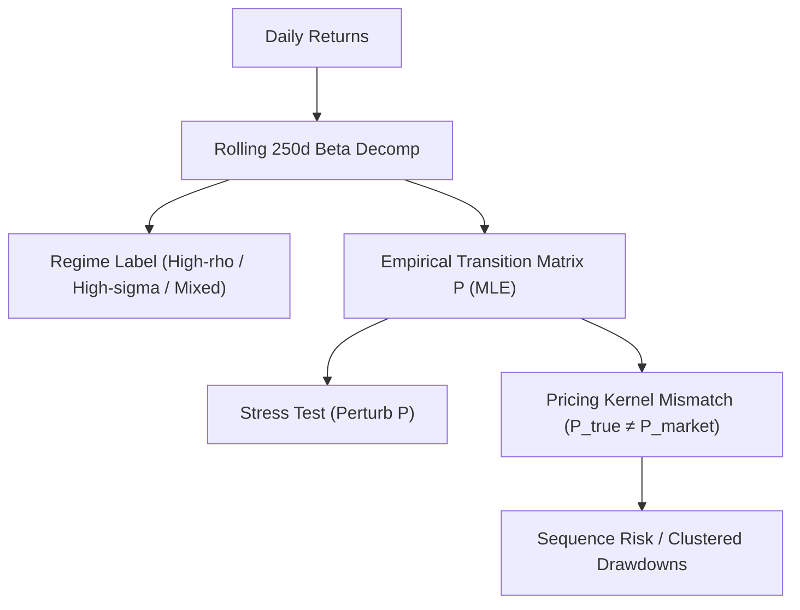

<!-- ontology-5axis data=量价表格 horizon=日频波段 paradigm=因果结构 alpha=风险择时 autonomy=人机协同可解释 -->

# Regime-Switching Pricing Kernel 解構

> **發布**：2026-01-29 · （無 venue）
> **QuantML 導讀**：[非μ之错，P之罪 ：Beta 异象背后的机制转换定价逻辑](https://mp.weixin.qq.com/s?__biz=Mzg2MzAwNzM0NQ==&mid=2247493116&idx=1&sn=5f68e985c6320b8ac1a8c55af6b2f6c7&chksm=ce7d82e2f90a0bf4c67338107ecd4d7826a32c248d90b1bbeb274864e26e9e5a27f6f5939546#rd)
> **核心定位**：將資產定價的誤差源從狀態條件風險溢價（μ）轉移至機制轉換概率（P），解構了傳統因子模型在群集回撤期失效的結構性盲區。

**五軸座標**

| 數據模態 | 時間尺度 | 學習範式 | Alpha機制 | 人機協作 |
|:-:|:-:|:-:|:-:|:-:|
| `量价表格` | `日频波段` | `因果结构` | `风险择时` | `人机协同可解释` |

**Status:** v0.5 — 基於 QuantML 導讀 + 原論文（如有）。benchmark 細節待升 v1。
**TL;DR:** ① 將定價核錯配錨定於轉移矩陣而非狀態內矩，解釋 Beta 異象與群集回撤。② 核心 trick 是將滾動 Beta 拆解為相關性與相對波動率分量，識別三種機制並對經驗轉移矩陣進行定向擾動。③ 對「風險擇時」軸提供可解釋的轉換概率對沖路徑，將 Alpha 從靜態暴露轉向動態轉換定價。④ 導讀未給量化結果。

**X-Ray.** 本文將定價單元從狀態條件矩（μ）平移至轉移矩陣（P），直擊傳統因子模型在機制切換期失效的工程痛點。透過將滾動 Beta 拆解為相關性與相對波動率，框架識別出高相關性機制作為尾部風險放大器。此設計在「風險擇時」軸上提供可解釋的轉換概率對沖路徑，但無法打開高頻執行或隱狀態推斷的 envelope。對量化讀者而言，核心意義在於將 Alpha 生成從靜態暴露轉向動態轉換定價，並提示混合夏普比率可能掩蓋嚴重的時序風險。

## §1 · 架構 / Core Mechanism
**1.1 三大改動 vs 前作**
| 維度 | 傳統狀態定價模型 (CAPM/ICAPM/HMM) | Regime-Switching Pricing Kernel |
|---|---|---|
| 定價誤差源 | 狀態條件風險溢價（μ）或因子載荷估計偏差 | 機制間轉換概率（P）的信念錯配 |
| 風險分解 | 單一 Beta 或潛變量推斷 | 滾動 Beta 拆解為相關性（ρ）與相對波動率（σ_rel） |
| 驗證路徑 | 橫截面回歸 / 潛狀態濾波 | 保持機制內矩固定，定向擾動轉移矩陣進行壓力測試 |

**1.2 ⚡ Eureka**
「錯配存在於箭頭（Transitions），而非節點（Regimes）」：市場系統性低估向高壓力、高相關性機制轉換的權重，導致定價核（SDF）與真實轉移動態脫鉤。

**1.3 信息流**

## §2 · 數學層
📌 **Napkin Formula**
$$E_t[M_{t+1} R_{t+1}] = 1, \quad M_{t+1} \text{ 依賴於轉移矩陣 } P$$
$$P_{ij} = \frac{N_{ij}}{\sum_k N_{ik}}, \quad \text{MLE 行歸一化}$$
**直覺**：價格不僅取決於狀態內的支付，更取決於進入不同狀態的概率。當真實轉移矩陣 $P$ 與市場隱含矩陣錯配時，即使狀態內 Beta 被正確定價，仍會產生可預測的超額回報與尾部風險。
**Loss/訓練**：基於一階馬爾可夫假設的最大似然估計（行歸一化計數），無梯度優化，計算複雜度 $O(N \cdot T)$。

## §3 · 數據層
- **規模/頻率/市場**：標普 500 成分股，日度回報。
- **來源**：Bloomberg。
- **樣本外與容量假設**：機制標籤視為觀測實現值（非潛狀態），依賴 250 個觀測值的滾動窗口。假設機制動態具市場層面共同性，未計入交易成本與流動性摩擦，容量受標普 500 日度流動性限制。

## §4 · 代碼層
| 項目 | 狀態 |
|---|---|
| Repo | TBD |
| Checkpoint | TBD |
| License | TBD |
| 複現難度 | Medium（需日度數據與滾動窗口計算） |
| 數據可得性 | Bloomberg / CRSP（TBD） |

## §5 · 評測 / Benchmark
| 數據集/市場 | Metric | 前SOTA | 本方法 | Δ |
|---|---|---|---|---|
| 標普 500 成分股 | 機制持續概率（對角線） | 未披露 | > 98.5% | 未披露 |
| 標普 500 成分股 | Mixed → High-rho 轉換概率 | 未披露 | 0.28% | 未披露 |
| 標普 500 成分股 | High-sigma → High-rho 轉換概率 | 未披露 | 0.12% | 未披露 |
| PoC 組合（6檔大盤科技） | 最差相對回撤 | 未披露 | -34.7% | 未披露 |

**解讀**：Δ 欄的結構性差異源於定價邏輯的平移，而非傳統因子的超額收益。壓力測試顯示，僅改變轉移矩陣即可驅動左尾損失嚴重度與持續時間的顯著變化，證明該框架捕捉的是真實的轉換風險（Transition Risk）。潛在過擬合風險在於滾動窗口端點的前瞻偏差，以及將機制標籤視為觀測值而非潛狀態可能引入的測量誤差。成本未計入，實際執行需評估日度換倉摩擦。

## §6 · 失效與隱含假設
**6.1 論文自述 limitations**
- 假設一階馬爾可夫過程，忽略高階路徑依賴。
- 機制標籤基於觀測實現值，未處理測量誤差或潛狀態濾波。
- 未計入交易成本、稅務與流動性限制。

**6.2 推斷的隱含假設**
- **Regime 依賴**：高持續性（> 98.5%）意味著信號更新緩慢，適合波段持有，但對突發結構性斷裂（Regime Break）反應滯後。
- **容量/成本**：標普 500 成分股日度換倉容量充足，但「門戶」轉換（Mixed → High-rho）的對沖操作可能在壓力期面臨流動性枯竭。
- **數據泄漏**：滾動 250 日窗口若未嚴格使用滾動端點，易引入前視偏差。
- **Survivorship**：僅覆蓋現存標普 500 成分股，忽略退市股票的尾部貢獻。

## §7 · 對比 & 面試 Tip
| 同軸對手 | 關鍵差異軸 | Open? | Status |
|---|---|---|---|
| Hamilton (1989) MRS | 潛狀態 EM 推斷 vs 觀測 Beta 分解 | TBD | Classic |
| Frazzini-Pedersen (2014) BLP | 槓桿限制解釋 Beta 異象 vs 轉換概率錯配 | TBD | Classic |
| 傳統 HMM 因子模型 | 狀態內矩定價 vs 轉移矩陣定價核錯配 | TBD | Active |

🎤 **Interview Tip**
- **正確答**：該框架將定價誤差從狀態條件風險溢價（μ）轉移至轉移矩陣（P），核心在於識別「門戶」轉換概率的市場錯配，並透過擾動 P 分離時序風險。
- **錯答**：認為這只是一個更好的 HMM 因子模型，或試圖用狀態內 Beta 係數的時變性解釋超額收益。

**7.1 可證偽預測**
若市場對機制轉換概率的定價完全有效，則在控制轉移矩陣錯配後，Beta 異象與群集回撤的橫截面差異應顯著收斂。驗證窗口：未來 12 個月壓力期（TBD）。

## §8 · For the Reader
- **因子研究員**：將單一 Beta 拆解為 ρ 與 σ_rel 分量，過濾高相關性機制下的偽信號，避免在 Mixed → High-rho 轉換期過度暴露。
- **組合配置**：將「門戶」轉換（Mixed → High-rho）視為尾部風險保險的定價錨，利用轉移矩陣擾動結果調整組合的時序風險敞口。
- **LLM-agent / 研究學生**：此框架示範了如何將經濟直覺（錯配在箭頭非節點）轉化為可計算的轉移矩陣壓力測試，適合用於構建可解釋的風險擇時模塊，而非黑盒預測。

## References
- QuantML 導讀：[非μ之错，P之罪 ：Beta 异象背后的机制转换定价逻辑](https://mp.weixin.qq.com/s?__biz=Mzg2MzAwNzM0NQ==&mid=2247493116&idx=1&sn=5f68e985c6320b8ac1a8c55af6b2f6c7&chksm=ce7d82e2f90a0bf4c67338107ecd4d7826a32c248d90b1bbeb274864e26e9e5a27f6f5939546#rd)
- Lineage: Sharpe (1964) CAPM / Hamilton (1989) Markov Switching / Frazzini & Pedersen (2014) Betting Against Beta / Mehra & Prescott (1985) Equity Premium Puzzle