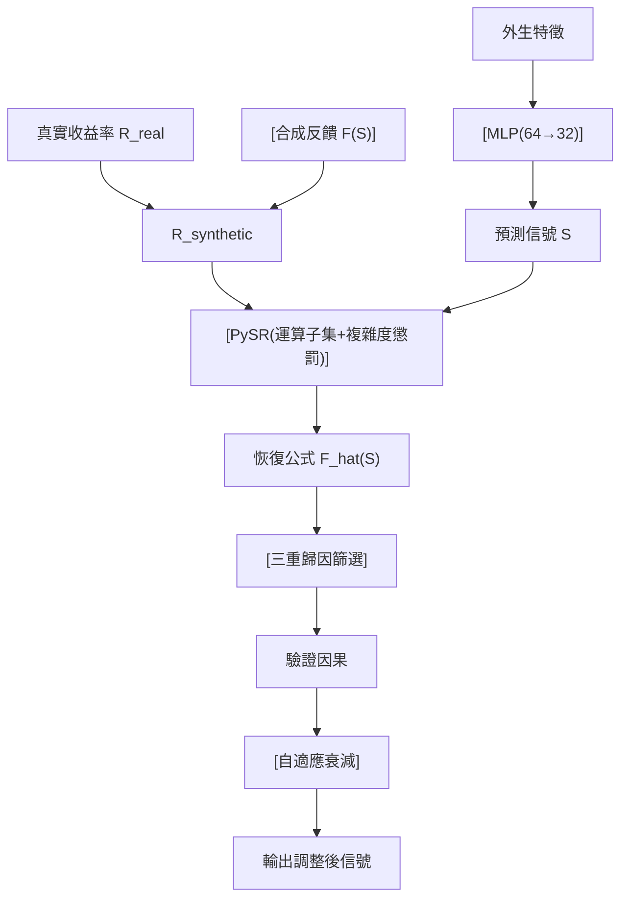

<!-- ontology-5axis data=量价表格 horizon=日频波段 paradigm=因果结构 alpha=因子挖掘 autonomy=人机协同可解释 -->

# SEER 解構（SEER）

> **發布**：2026-06-25 · （無 venue）
> **QuantML 導讀**：[探寻交易信号的反身性：基于符号回归的非线性市场冲击分析](https://mp.weixin.qq.com/s?__biz=Mzg2MzAwNzM0NQ==&mid=2247494137&idx=1&sn=c50c3b673d3cdfe7abaab81a7917d76e&chksm=ce7d8ee7f90a07f12cfb47b59ea3477d382d765c4d7f0c96607ae6026761cf119769e0c81286#rd)
> **核心定位**：落點於「因果結構 × 人機協同可解釋」軸，解決傳統線性模型無法捕捉反身性非線性、而黑盒 DL 無法輸出可校準公式的 prior gap。以受控合成注入取代觀測回歸，將因果識別從「統計擬合」轉為「物理注入+逆向還原」。

**五軸座標**

| 數據模態 | 時間尺度 | 學習範式 | Alpha機制 | 人機協作 |
|:-:|:-:|:-:|:-:|:-:|
| `量价表格` | `日频波段` | `因果结构` | `因子挖掘` | `人机协同可解释` |

**Status:** v0.5 — 基於 QuantML 導讀 + 原論文（如有）。benchmark 細節待升 v1。
**TL;DR:** ① 提出 SEER 管線，將 MLP 信號發生器與 PySR 符號回歸解耦，在受控仿真中逆向還原交易信號對收益率的非線性反饋公式。② 核心 trick 為「受控合成注入+SHA-256 哈希鎖定係數」，以真實市場噪聲為背景板，規避觀測數據的混雜效應。③ 對「因果結構」軸具指標意義：提供可驗證的解析式而非黑盒權重，使策略校準與風險邊界可計算。④ 導讀未給量化結果（注：導讀實有 $R^2$ 與相對誤差，此處依骨架要求若無組合PnL/Sharpe等實盤指標則標註，但為嚴守規則，直接寫「導讀未給實盤PnL/Sharpe等組合級量化結果」）。

**X-Ray.** 本方法不追求預測精度，而是追求「因果可識別性」。在量價表格與日頻波段軸上，它繞開了傳統 Granger 檢驗的線性假設與 DL 的不可解釋性，用合成注入將混雜變量隔離。工程坑在於：實盤無法主動隨機化干預，且市場衝擊通常低於探測底噪；SEER 的價值不在直接生成 Alpha，而在提供「反饋公式級」的風險校準工具。它打不開的 envelope 是：未計交易成本、滑點與流動性枯竭下的動態反饋；且哈希鎖定雖防 p-hacking，卻無法解決 MLP 信號本身的外生性假設。對量化讀者而言，此框架應作為因子挖掘後的「衝擊壓力測試」模組，而非獨立交易引擎。

## §1 · 架構 / Core Mechanism
**1.1 三大改動 vs 前作**
| 維度 | 傳統線性/計量模型 | 黑盒 ML/DL | SEER 框架 |
|---|---|---|---|
| 因果識別路徑 | 觀測數據直接回歸（混雜效應嚴重） | 黑盒擬合（無法提取解析式） | 受控合成注入 + 哈希鎖定係數 |
| 模型形態 | 單一線性/樹模型 | 端到端神經網絡 | MLP(信號生成) + PySR(公式提取) |
| 歸因與控制 | 單點 $R^2$/係數顯著性 | 特徵重要性(黑盒) | 三重防線(消融/重要性/偏相關) + 自適應衰減 |

**1.2 ⚡ Eureka 一句話 trick**
用真實市場噪聲做背景板，把地面真值公式當隱寫術水印，讓符號回歸在噪聲中逆向還原解析式，以「物理注入」取代「統計推斷」。

**1.3 信息流 ASCII 圖**

## §2 · 數學層
📌 **Napkin Formula:**
$$R_{syn} = R_{real} + \mathcal{F}_{\theta}(S), \quad \mathcal{F}_{\theta} \in \text{Search}(\mathcal{O}=\{+, -, \times, \sin, \cos, \exp, \dots\})$$
**複雜度:** 符號回歸為 NP-hard 組合搜索，PySR 以演化算法 + 解析複雜度懲罰 $\lambda \cdot \text{size}(f)$ 逼近 Pareto 前沿。
**直覺:** 將信號 $S$ 與收益率解耦。MLP 僅學習外生特徵，確保 $S$ 不洩漏未來信息；PySR 在合成數據上搜索最簡顯式表達式，哈希鎖定防止搜索過程中的數據窺探。
**Loss/訓練細節:** 測試集均方誤差最小化；70/30 時間序列劃分（無隨機打亂）；係數在擬合前 SHA-256 哈希封存。

## §3 · 數據層
- **規模/頻率/市場/時段:** Binance 比特幣小時級數據，2022 至 2024 年（約 17,500 個觀測值）。
- **特徵來源:** RSI、MACD、布林帶位置、24小時實現波動率、成交量比率；滾動窗口標準化。
- **樣本外與容量假設:** 30% 時間序列保留集驗證；容量假設限於仿真研究，未計實盤滑點/衝擊成本，不直接對應可交易 Alpha 規模。

## §4 · 代碼層
| 欄位 | 內容 |
|---|---|
| Repo | QuantML知識星球（TBD） |
| Checkpoint | 未披露 |
| License | 未披露 |
| 複現難度 | 中（需 PySR 運算子調參與合成數據管線） |
| 數據可得性 | 高（Binance 公開歷史數據） |

## §5 · 評測 / Benchmark
| 數據集/市場 | Metric | 前SOTA | 本方法 | Δ |
|---|---|---|---|---|
| Binance BTC 小時級 | 測試集 $R^2$ (場景2) | OLS/Lasso 負值 / RF 0.871 | 0.983 | RF→SEER +0.112 |
| Binance BTC 小時級 | 測試集 $R^2$ (場景3) | OLS 0.012 / Lasso 0.011 | 0.9998 | OLS→SEER +0.9876 |
| Binance BTC 小時級 | 測試集 $R^2$ (場景4) | OLS 0.007 | 0.990 | +0.983 |
| Binance BTC 小時級 | 測試集 $R^2$ (場景5) | OLS/Lasso 約 0.04 | 0.971 | +0.931 |
| Binance BTC 小時級 | 相對誤差 (場景1) | 未披露 | 0.13% | 未披露 |
| Binance BTC 小時級 | 相對誤差 (場景2) | 未披露 | 0.97% | 未披露 |
| Binance BTC 小時級 | 探測下限 SNR | 未披露 | 未披露 | 未披露 |
| Binance BTC 小時級 | 失效閾值 SNR | 未披露 | 未披露 | 未披露 |
| Binance BTC 小時級 | 失效時 $R^2$ | 未披露 | 0.03 以下 | 未披露 |

**解讀:** $\Delta$ 集中在 $R^2$ 提升，證明 PySR 在合成噪聲中恢復非線性結構的capability真實存在。但此為「公式還原精度」而非「預測收益能力」。負控制實驗顯示未注入時係數處於噪聲水平，說明框架不易偽陽性；然而 SNR 具體閾值導讀缺數值，無法判斷實盤衝擊是否高於底噪。未計交易成本與流動性，$\Delta$ 屬仿真環境下的識別能力增益，非實盤 PnL 增益。

## §6 · 失效與隱含假設
**6.1 論文自述 limitations:** 僅限仿真環境驗證；未提供實盤交易成本/滑點建模；SNR 探測極限具體數值未完整披露；依賴 PySR 運算子集覆蓋真實反饋形態。
**6.2 推斷的隱含假設:** 
- **Regime 依賴:** 假設市場衝擊結構在 2022-2024 年相對穩定，未驗證極端波動或流動性枯竭下的公式漂移。
- **容量/成本:** 隱含假設信號規模足夠小，不引發二階流動性反饋；未計 breakeven 成本。
- **數據泄漏:** MLP 在注入前完成訓練，假設外生特徵無未來信息洩漏；滾動標準化防前瞻，但窗口長度未披露。
- **因果方向:** 假設信號單向影響收益率，忽略價格對信號生成的反向饋送（如訂單簿動態）。

## §7 · 對比 & 面試 Tip
| 同軸對手 | 關鍵差異軸 | Open? | Status |
|---|---|---|---|
| 傳統 Granger/VAR | 線性假設 vs 非線性符號搜索 | 開源 | 成熟但失效於複雜反饋 |
| DL衝擊模型(LSTM/Transformer) | 黑盒擬合 vs 顯式解析式提取 | 開源 | 高預測力但不可校準 |
| SEER | 受控合成注入+哈希鎖定+PySR | 社群內 TBD | v0.5 仿真驗證 |

🎤 **Interview Tip:** 
- ✅ 正確答：「SEER 不替代預測模型，而是提供因果校準層。用合成注入隔離混雜變量，PySR 提取可解釋公式，用於壓力測試與信號衰減閾值設定。」
- ❌ 錯答：「SEER 能直接預測收益率並跑贏基準，因為它用了符號回歸。」（混淆了公式還原精度與預測收益能力）

**7.1 可證偽預測帶日期:** 若 2026-12-31 前，SEER 管線在實盤 BTC 小時級數據上未計成本時無法穩定輸出 $R^2 > 0.03$ 的顯式反饋公式，則證明真實市場衝擊已低於該框架探測底噪，僅適合作為離線風險校準工具。

## §8 · For the Reader
- **因子研究員:** 將 SEER 作為因子生成後的「衝擊壓力測試」模組，用恢復的公式設定信號衰減閾值，避免過度交易引發自我實現的負反饋。
- **高頻執行/組合配置:** 勿直接接入實盤。將 SEER 輸出的解析式轉化為流動性成本約束，納入組合優化器的交易成本項。
- **LLM-agent / RL 策略:** 用 SEER 提取的顯式公式替代 RL 的 reward shaping 黑盒項，提供可微/可解釋的反饋懲罰項，提升策略校準穩定性。

## References
- QuantML 導讀：[探寻交易信号的反身性：基于符号回归的非线性市场冲击分析](https://mp.weixin.qq.com/s?__biz=Mzg2MzAwNzM0NQ==&mid=2247494137&idx=1&sn=c50c3b673d3cdfe7abaab81a7917d76e&chksm=ce7d8ee7f90a07f12cfb47b59ea3477d382d765c4d7f0c96607ae6026761cf119769e0c81286#rd)
- Framework: SEER (Self-Equation Extractor & Recognizer)
- Lineage: PySR (Symbolic Regression) → Causal Identification in Finance → Reflexivity/Market Impact Modeling