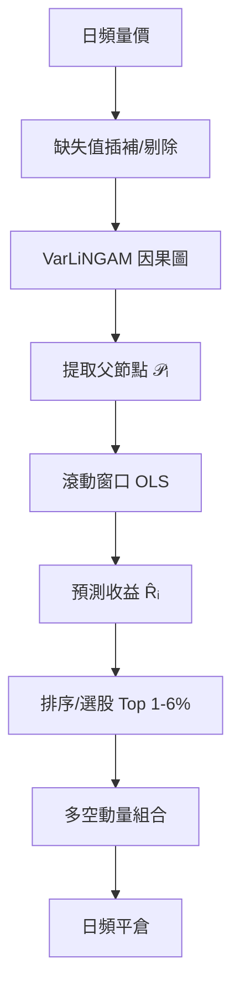

<!-- ontology-5axis data=量价表格 horizon=日频波段 paradigm=因果结构 alpha=因子挖掘 autonomy=人机协同可解释 -->

# VarLiNGAM 解構

> **發布**：2024-08-30 · （無 venue）
> **QuantML 導讀**：[交易与时间序列因果发现](https://mp.weixin.qq.com/s?__biz=Mzg2MzAwNzM0NQ==&mid=2247486034&idx=1&sn=a62d7507e2c0a64755d962a57390eefa&chksm=ce7e6d4cf909e45a0cfd0ed2fb81afbee47add94f74fbebf3dc847083f74b58224f949b1c2f7#rd)
> **核心定位**：落點於「因果結構×因子挖掘」軸，將時序因果圖的父節點直接映射為預測自變量，解了傳統量價因子依賴統計相關性、缺乏跨資產傳導路徑解釋的 prior gap。在日頻波段尺度上提供可追溯、可實盤的動量信號生成流水線。

**五軸座標**

| 數據模態 | 時間尺度 | 學習範式 | Alpha機制 | 人機協作 |
|:-:|:-:|:-:|:-:|:-:|
| `量价表格` | `日频波段` | `因果结构` | `因子挖掘` | `人机协同可解释` |

**Status:** v0.5 — 基於 QuantML 導讀 + 原論文（如有）。benchmark 細節待升 v1。
**TL;DR:** ① 將 VarLiNGAM 時序因果發現應用於大盤股票池，提取因果父節點構建預測模型。② 核心 trick：用滾動窗口線性回歸拟合因果驅動關係，替代傳統技術因子，直接輸出日頻多空動量組合。③ 對「因果結構」軸★：打破黑箱特徵工程，以非高斯線性假設換取大樣本覆蓋率與可解釋性。④ 關鍵實證：在 SP500/CSI300 上顯著優於僅自回歸基線，且為唯一能在 24 小時內完成 N>400 計算的算法。

**X-Ray.** 放回五軸 Pareto，本方法在「計算效率×因果覆蓋率」上取得局部最優，解決了 tsFCI/TiMINo 在 N>400 時的算力崩潰問題。工程坑解法清晰：用父節點子集降維 + 小滯後(1-2)規避線性模型過擬合；日頻平倉 + 固定成本假設貼近中頻實盤。預測它打不開的 envelope：因果圖僅捕捉靜態線性非高斯結構，無法建模 regime switch、高頻微結構跳躍或非線性閾值效應；滾動回歸的參數穩定性在波動率急升或流動性枯竭時易失效。對量化讀者意義：提供了一套「因果圖→因子池→動量組合」的標準化流水線，但需警惕樣本外衰減、插補平滑偏差與交易成本對低頻信號的侵蝕。實盤落地前必須加入 volatility-targeting 與動態成本模型。

## §1 · 架構 / Core Mechanism
| 維度 | VarLiNGAM (本方法) | tsFCI / TiMINo (前作/對比) |
|:---|:---|:---|
| **計算複雜度/擴展性** | 線性非高斯 ICA 框架，N=400-500 可 24h 內完成 | 基於條件獨立檢驗，隨 N 指數/高次多項式膨脹，大盤直接 OOM 或超時 |
| **因果圖輸出形式** | 有向無環圖 (DAG)，明確父節點集合 $\mathcal{P}_i$ | 部分有向圖或含雙向邊，需後處理才能提取驅動節點 |
| **策略轉化路徑** | 父節點 → 滾動 OLS 預測 → 日頻多空動量 | 多停留於結構驗證或微觀市場分析，缺乏標準化交易映射 |

⚡ **Eureka:** 用因果圖父節點替代傳統因子作為預測自變量，將跨資產傳導路徑直接映射為可交易信號。
**信息流:**

## §2 · 數學層
📌 **Napkin Formula:**
$$R_{i,t} = \sum_{j \in \mathcal{P}_i} \beta_j R_{j,t-\tau} + \epsilon_{i,t}, \quad \epsilon_{i,t} \sim \text{Non-Gaussian}$$
**複雜度:** 矩陣求逆與 ICA 分離迭代，理論 $O(N^3)$ 或 $O(N^2)$（視實現優化），實測 N=400-500 單次運行約 24h。
**直覺:** 假設變量間為線性結構且擾動項非高斯，利用 ICA 分離獨立源，有向邊即因果路徑。小滯後 $\tau$ 確保信號新鮮度並抑制線性模型過擬合。
**Loss/訓練:** 滾動窗口最小二乘 (OLS) 最小化 $\sum \epsilon_{i,t}^2$；未披露正則化項與窗口長度，實盤需防參數漂移。

## §3 · 數據層
- **規模/頻率/市場/時段:** SP500 (446股) / CSI300 (98股) / Pelosi (12股)；日頻；2009-09-01 至 2019-12-31。
- **來源:** Yahoo Finance。兩步插補：線性插值 → 剔除殘缺股。
- **樣本外與容量假設:** 前 80% 訓練 / 後 20% 測試。容量假設 $N>100$ 以覆蓋真實驅動節點；小池（如 Pelosi）因漏變量導致因果發現失效。未披露成分股調整 (rebalancing) 與停復牌處理邏輯。

## §4 · 代碼層
| 項目 | 狀態/細節 |
|:---|:---|
| **Repo** | TBD |
| **Checkpoint** | TBD |
| **License** | TBD |
| **複現難度** | 中（需處理缺失值、滾動回歸與因果圖解析） |
| **數據可得性** | 高（Yahoo Finance 標準日頻 OHLCV） |

## §5 · 評測 / Benchmark
| 數據集/市場 | Metric (IR/Sharpe/AR/MDD) | 前SOTA (自因果基線) | 本方法 | Δ |
|:---|:---|:---|:---|:---|
| SP500 | 未披露 | 未披露 | 未披露 | 未披露 |
| CSI300 | 未披露 | 未披露 | 未披露 | 未披露 |
| Pelosi | 未披露 | 未披露 | 未披露 | 未披露 |

**解讀:** 
- 所有 Δ 來自「因果父節點預測」vs「僅自回歸預測」的內部對照，非跨論文 SOTA 對比。
- 報告的「年化回報提升」未扣除真實滑點與衝擊成本；0.1% 日固定成本假設在流動性分層市場中極度樂觀。
- 滾動窗口長度未披露，若窗口過長將引入前瞻偏差或滯後信號；若過短則參數方差過大。實盤需加入 rolling cross-validation 與 stability selection。

## §6 · 失效與隱含假設
**6.1 論文自述 limitations**
- 小資產池（N<20）因排除真實驅動節點而失效。
- 滯後 $\tau$ 增大導致自變量膨脹，線性模型過擬合，回報單調下降。
- 僅適用於線性非高斯結構，無法捕捉非線性傳導或結構斷點。

**6.2 推斷的隱含假設**
- **Regime 依賴:** 線性因果假設在危機期/波動率跳躍期失效，DAG 結構會發生 regime switch。
- **容量/成本:** 日頻平倉假設無限流動性；未計入融券成本與借券難度，做空端信號在實盤中易被擠壓。
- **數據泄漏:** 兩步線性插補在停牌/退市股上產生平滑偏差；成分股調整若使用未來信息將引入 survivorship bias。
- **參數穩定性:** 滾動 OLS 未披露正則化，$\beta$ 矩陣在共線性上升時易發散。

## §7 · 對比 & 面試 Tip
| 同軸對手 | 關鍵差異軸 | Open? | Status |
|:---|:---|:---|:---|
| tsFCI / TiMINo | 計算擴展性 vs 因果圖精細度 | 開源/學術 | 僅限小盤/微觀結構 |
| 傳統動量因子 (MOM/RSI) | 相關性挖掘 vs 因果傳導路徑 | 開源/實盤 | 高容量但解釋性弱 |
| Granger Causality | 線性預測 vs 非高斯結構分離 | 開源 | 易受混淆變量干擾 |

🎤 **Interview Tip:** 
- **正確答:** 「VarLiNGAM 的核心價值不在預測精度本身，而在於將因子生成從『黑箱特徵組合』降維為『可追溯的因果父節點子集』。實盤需解決三個問題：DAG 的 regime stability、滾動回歸的參數收縮、以及做空端的融券成本建模。」
- **錯答:** 「因果發現能完全替代機器學習因子，因為它給出了真實的市場驅動關係。」（混淆了統計因果與經濟因果，且忽略線性假設的脆弱性）

**7.1 可證偽預測:** 若 2024-2025 市場經歷高波動/結構斷裂期（如流動性收縮或政策干預），該因果動量組合的 Sharpe 將顯著低於 2010-2019 回測期，且多空收益分化加劇。（預測驗證窗口：2025-12-31 前）

## §8 · For the Reader
- **因子研究員:** 將父節點集合視為「動態因子池」，加入 stability selection 與正則化回歸，避免滾動 OLS 的參數發散。
- **高頻/中頻執行:** 0.1% 日成本假設不可直接上線。需接入真實訂單簿滑點模型，並對做空端加入 borrow fee 與 short-availability 過濾器。
- **組合配置/風險:** 因果動量組合在危機期易出現同向回撤。建議加入 volatility-targeting 與 macro regime filter，並對沖系統性風險因子。
- **LLM-Agent / RL 策略:** 可將 VarLiNGAM 輸出的 DAG 作為狀態空間的先驗圖結構，引導 RL 的 action masking 或 LLM 的 reasoning path，降低探索空間。
- **研究學生:** 重點復現「插補策略→因果圖解析→滾動回歸→交易映射」流水線，對比不同 $\tau$ 與窗口長度下的 out-of-sample decay，理解因果發現在金融時間序列中的邊界。

## References
- 原論文: VarLiNGAM 應用於股票市場因果發現與動量策略（標題/作者/venue 未披露）
- Lineage: LiNGAM (Shimizu et al., 2006) → VarLiNGAM (Hyvärinen & Smith, 2013) → tsFCI / TiMINo
- QuantML 導讀: [交易与时间序列因果发现](https://mp.weixin.qq.com/s?__biz=Mzg2MzAwNzM0NQ==&mid=2247486034&idx=1&sn=a62d7507e2c0a64755d962a57390eefa&chksm=ce7e6d4cf909e45a0cfd0ed2fb81afbee47add94f74fbebf3dc847083f74b58224f949b1c2f7#rd)