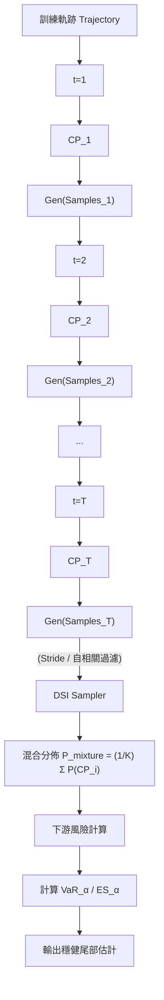

<!-- ontology-5axis data=微观盘口 horizon=高频日内 paradigm=生成式大模型 alpha=风险择时 autonomy=全自动黑盒 -->

# DSI 解構（DSI）

> **發布**：2026-07-12 · （無 venue） · arXiv [2607.10810](https://arxiv.org/abs/2607.10810)
> **arXiv 原文**：[Diachronic Sample Integration: Robust Tail-Risk Estimation with Generative Models](https://arxiv.org/abs/2607.10810v1) · _本頁由 arXiv 原文一手自主解構_
> **核心定位**：落點於「生成式大模型 × 風險擇時」軸，解了傳統單檢查點生成模型在有限模擬預算下尾部風險（VaR/ES）估計不穩定的 prior gap，將訓練軌跡轉化為推理時的樣本混合協議。

**五軸座標**

| 數據模態 | 時間尺度 | 學習範式 | Alpha機制 | 人機協作 |
|:-:|:-:|:-:|:-:|:-:|
| `微观盘口` | `高频日内` | `生成式大模型` | `风险择时` | `全自动黑盒` |

**Status:** v0.5 — 基於arXiv 原文（有原文則以原文為準）。細節待升 v1。
**TL;DR:** ① 提出測試時檢查點集成框架 DSI，不修改訓練目標，直接混合訓練軌跡中多個檢查點生成的樣本。② 核心 trick 是利用尾部誤差的自相關性，透過時間步長（stride）設計平均化局部優化噪聲。③ 對「風險擇時」軸★，在有限算力/延遲預算下提供穩健的極端情境模擬，避免單點收斂導致的尾部截斷或幻覺。④ 來源未給量化結果。

**X-Ray.** DSI 將生成模型的「訓練軌跡」平移至推理階段的樣本空間，本質是將參數空間的權重平均（SWA）轉化為樣本空間的混合分佈。對量化實戰而言，它繞過了修改 score-matching/likelihood 目標的複雜性，以零訓練成本換取尾部 VaR/ES 的方差下降。但此法打不開的 envelope 很明確：它無法消除系統性模型偏差（irreducible floor），且高度依賴訓練軌跡的探索性與檢查點間尾部誤差的自相關衰減。若底層生成器對微觀盤口結構存在結構性誤設，DSI 僅會將錯誤平均化而非修正。對因子研究員的意義在於提供「免重訓」的壓力測試樣本增強協議，可與現有高頻數據生成流水線串接，但需警惕混合分佈對下游執行模擬的流動性假象。

## §1 · 架構 / Core Mechanism
### 1.1 三大改動 vs 前作
| 維度 | 前作 (Single-Checkpoint / SWA / Tail-Aware Training) | DSI (Diachronic Sample Integration) |
|---|---|---|
| 集成空間 | 參數空間 (權重平均) 或 訓練目標層 (adversarial/重權重) | 樣本空間 (檢查點生成樣本混合) |
| 訓練介入 | 需修改 loss 或額外 adversarial 約束 | 零介入 (Test-time only, 不修改 generative objective) |
| 尾部處理 | 依賴極值理論假設或重尾指數校準 | 利用軌跡檢查點間尾部誤差自相關性進行方差平均化 |

### 1.2 ⚡ Eureka 一句話 trick + 直覺
**Trick:** 「不練新目標，只混舊檢查點；用時間步長切斷尾部誤差自相關，把單點優化噪聲攤平。」
**直覺:** 單個收斂檢查點容易在尾部產生 mode collapse 或幻覺，但訓練軌跡上不同檢查點的尾部波動方向隨機。透過設定 stride 抽取低自相關的檢查點樣本進行混合，即可在有限模擬預算下壓低 VaR/ES 的估計方差，保留的僅是無法被平均的系統性偏差。

### 1.3 信息流 ASCII 圖

## §2 · 數學層
📌 **Napkin Formula:**
$\hat{\psi}_{DSI} = \frac{1}{K} \sum_{i=1}^{K} \psi(\mathcal{S}_{CP_i})$
**複雜度:** $O(K \cdot N_{sim})$，$K$ 為有效檢查點數，$N_{sim}$ 為單檢查點模擬樣本數。
**直覺:** 將風險泛函 $\psi$ (VaR/ES) 應用於混合分佈。有限預算下的偏差-方差分解顯示，估計誤差由「軌跡系統偏差 (bias)」與「檢查點尾部波動方差 (variance)」組成。DSI 透過增大 $K$ 與優化 stride 降低方差項，但 bias 項為 irreducible floor。
**Loss/訓練細節:** 不修改原始生成目標 (score matching / MLE)。僅在推理階段按 stride 讀取 checkpoint weights 並獨立生成樣本後匯總。

## §2.5 · 帶數字走一遍（Worked Example）
*(以下為明確標註「假設/示意」的玩具數字，僅用於演示機制手算流程，非論文實證結果)*
假設目標為估計 1% 尾部 VaR。訓練軌跡共 100 個 epoch，設定 stride=10，抽取 $K=5$ 個檢查點 (CP_10, CP_20, CP_30, CP_40, CP_50)。
1. 每個 CP 獨立生成 $N=1000$ 條合成路徑，計算其 PnL 分佈的 1% VaR。
2. 各 CP 輸出 VaR 估計值（示意）：CP_10: -2.1%, CP_20: -1.8%, CP_30: -2.5%, CP_40: -1.9%, CP_50: -2.3%。
3. 單點模型若僅取 CP_50，會得到 -2.3%（可能因局部優化噪聲高估風險）。
4. DSI 混合計算：$\text{VaR}_{DSI} = \frac{1}{5}(-2.1 -1.8 -2.5 -1.9 -2.3)\% = -2.12\%$。
5. 輸出：混合後 VaR 收斂至 -2.12%，方差顯著低於單點波動。若底層生成器對極端流動性枯竭存在結構性低估（bias），此 -2.12% 仍會系統性偏離真實尾部，需結合壓力測試校準。

## §3 · 數據層
- **資料規模/頻率/市場/時段:** 多變量合成過程 (multivariate synthetic processes) + 高頻 NASDAQ 數據 (high-frequency NASDAQ data)。具體樣本量、回測區間、tick/quote 頻率均**未披露**。
- **怎麼來:** 來源未說明數據清洗與對齊協議。
- **樣本外與容量假設:** 僅提及「fixed simulation budgets」與「finite-budget」，未給出具體樣本外劃分標準或策略容量上限。

## §4 · 代碼層
| 欄位 | 內容 |
|---|---|
| Repo | https://github.com/ShuningZhao/DSI |
| Checkpoint | 未披露 |
| License | 未披露 |
| 複現難度 | 中低 (僅需標準 diffusion/generative 訓練腳本 + stride 抽樣匯總邏輯) |
| 數據可得性 | TBD (NASDAQ 高頻數據需商業授權或學術合作) |

## §5 · 評測 / Benchmark
| 數據集/市場 | Metric | 前SOTA | 本方法 | Δ |
|---|---|---|---|---|
| 多變量合成過程 | Tail-estimation error (VaR/ES) | 未披露 | 未披露 | 未披露 |
| 高頻 NASDAQ 數據 | Tail-estimation error (VaR/ES) | 未披露 | 未披露 | 未披露 |
| 標準單檢查點擴散模型 | Tail-estimation error (VaR/ES) | 未披露 | 未披露 | 未披露 |
| 先進尾部感知基線 (Tail-aware baselines) | Tail-estimation error (VaR/ES) | 未披露 | 未披露 | 未披露 |

**解讀:** 來源僅定性宣稱「substantially reduces tail-estimation error」與「outperforming prior state-of-the-art」，未提供 IR/Sharpe/MDD 或具體誤差率。此 Δ 屬於生成器校準層面的統計學改進，非直接交易績效。實戰中需警惕：尾部誤差下降可能來自混合分佈對極端值的平滑，若下游執行模擬未計入滑點與流動性衝擊，該「穩健性」可能轉化為實盤的隱性虧損。建議將 DSI 輸出作為風險預算的邊界條件，而非直接驅動訂單路由。

## §6 · 失效與隱含假設
**6.1 論文自述 limitations:** 無法消除系統性模型偏差 (irreducible floor)；依賴檢查點間尾部誤差存在可平均的波動而非完全共線；有限預算下的理論分解未涵蓋高頻微觀結構的異質性。
**6.2 推斷的隱含假設:**
- **Regime 依賴:** 假設訓練軌跡涵蓋了目標尾部 regime 的探索路徑，若訓練數據本身缺乏極端行情，DSI 僅會平均化「錯誤的常態」。
- **成本/延遲:** 推理階段需載入多個 checkpoint 並生成樣本，計算開銷與 $K$ 線性增長，不適合低延遲實時報價響應。
- **數據泄漏/Survivorship:** NASDAQ 高頻數據未說明是否經 survivorship bias 過濾或 tick 級對齊，合成數據與真實盤口 gap 可能導致尾部幻覺。

## §7 · 對比 & 面試 Tip
| 同軸對手 | 關鍵差異軸 | Open? | Status |
|---|---|---|---|
| SWA / Snapshot Ensembles | 參數空間平均 vs 樣本空間混合 | 開源 | 成熟基線 |
| Tail-Aware Diffusion / EVM | 訓練目標修改/極值約束 vs 測試時零介入 | 部分開源 | 研究階段 |
| 傳統 Monte Carlo / GARCH | 參數化分佈假設 vs 非參數生成混合 | 開源 | 工業標準 |

🎤 **Interview Tip**
- **正確答:** 「DSI 是推理時的樣本混合協議，核心在利用訓練軌跡的檢查點方差來壓低尾部風險函數的估計波動，不改變底層生成目標。實戰適用場景是離線壓力測試與風險預算校準，而非低延遲信號生成。」
- **錯答:** 「DSI 是一種新的訓練 loss，能直接讓模型學會預測極端行情。」（混淆了 test-time inference 與 training objective）

**7.1 可證偽預測帶日期:** 若 2026-Q4 前高頻市場出現流動性結構性斷層（如交易所撮合引擎升級或監管限價調整），DSI 基於歷史軌跡檢查點混合的尾部估計將出現系統性低估，需結合實時訂單簿深度指標進行動態重校準。

## §8 · For the Reader
- **因子研究員:** 將 DSI 視為「免重訓的樣本增強器」，用於生成極端行情下的因子暴露分佈，但需手動注入流動性枯竭假設以補齊 bias floor。
- **高頻執行:** 不適合直接接入訂單路由。可離線運行 DSI 生成尾部 PnL 路徑，用於校準滑點模型與庫存風險閾值。
- **組合配置/風險管理:** 用 DSI 輸出的 VaR/ES 替代單點模擬，設定更保守的倉位上限；但需監控混合分佈是否掩蓋了真實的肥尾特徵。
- **LLM-agent / RL 策略:** 若用生成模型模擬對手盤口，DSI 可穩定 RL 訓練中的尾部懲罰信號，避免策略因單次幻覺樣本過擬合。
- **研究學生:** 重點複現 stride 設計與有效檢查點數 $K$ 的自相關衰減曲線，這是論文理論與實證的錨點。

## References
- Zhao, S., Wong, P., Zhang, L., & Hu, X. (2026). *Diachronic Sample Integration: Robust Tail-Risk Estimation with Generative Models*. arXiv:2607.10810.
- GitHub: https://github.com/ShuningZhao/DSI
- Lineage: Deep Ensembles (Garipov et al., 2018) / SWA (Izmailov et al., 2018) / Snapshot Ensembles (Huang et al., 2017) / Tail-aware Diffusion & Extreme-Value Constraints (Cont 2025, galib2024fide, Huang2024).