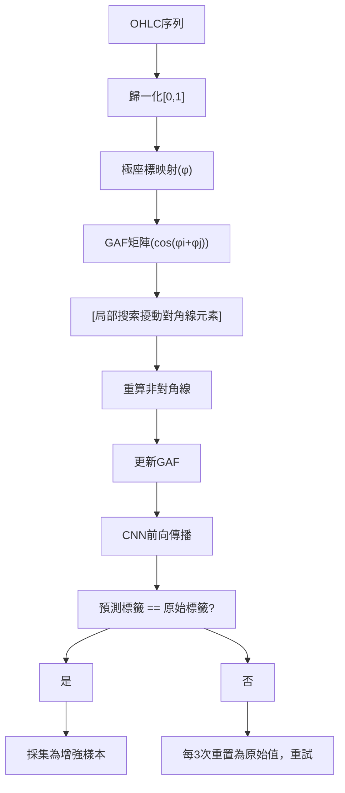

<!-- ontology-5axis data=量价表格 horizon=日频波段 paradigm=生成式大模型 alpha=端到端表征 autonomy=全自动黑盒 -->

# 改进局部搜索攻击采样/GAF-CNN 解構

> **發布**：2025-06-21 · （無 venue）
> **QuantML 導讀**：[深度K线学习器的数据增强](https://mp.weixin.qq.com/s?__biz=Mzg2MzAwNzM0NQ==&mid=2247490798&idx=1&sn=5cc3b0b55f965124e2ee0d36e06f9384&chksm=ce7e7bf0f909f2e6e0cc662abdf6a292c5df7d2555f6f42bbe3f41aad8fcd6566458b7cdb2d1#rd)
> **核心定位**：落點於「生成式大模型 × 端到端表征」軸，針對金融量價數據稀缺與分佈漂移的 prior gap，以對抗擾動替代生成式先驗，提供低假設依賴的 K 線數據增強路徑。

**五軸座標**

| 數據模態 | 時間尺度 | 學習範式 | Alpha機制 | 人機協作 |
|:-:|:-:|:-:|:-:|:-:|
| `量价表格` | `日频波段` | `生成式大模型` | `端到端表征` | `全自动黑盒` |

**Status:** v0.5 — 基於 QuantML 導讀 + 原論文（如有）。benchmark 細節待升 v1。
**TL;DR:** ① 提出改進局部搜索攻擊採樣法，對 GAF 編碼的 K 線矩陣進行可控微擾。② 核心 trick 為沿對角線迭代擾動並驗證 CNN 標籤不變性，繞過 VAE 的高斯分佈假設。③ 對「生成式大模型」軸而言，將對抗攻擊轉化為數據增強，大幅降低金融時序生成的分佈偏差風險。④ 導讀未給量化結果（僅提供人類辨識率統計與 p 值）。

**X-Ray.** 本法將 CV 領域的對抗攻擊邏輯平移至金融時序，本質是「標籤守恆的流形插值」。它解了 VAE/CVAE 在金融數據上常見的「過度平滑」與「分佈誤設」工程坑，但代價是依賴預訓練 GAF-CNN 的決策邊界穩定性。預測其打不開高頻跳動或極端波動（如閃崩）的 envelope，因微擾邊界受原模型置信度約束。對量化讀者，此法非直接 Alpha 源，而是低成本的樣本擴容器；需警惕其增強數據僅在訓練集分佈內有效，跨 Regime 時可能放大過擬合而非提升泛化。

## §1 · 架構 / Core Mechanism
**1.1 三大改動 vs 前作**
| 維度 | 前作 (CVAE / 蒙特卡洛) | 本法 (改進局部搜索攻擊) |
|---|---|---|
| 擾動機制 | 全局採樣 / 統計分佈假設 | 局部搜索迭代 (對角線微擾) |
| 分佈依賴 | 高斯先驗 / 動態數學公式 | 無顯式分佈假設 (數據驅動) |
| 驗證閉環 | 重構損失最小化 | CNN 標籤守恆過濾 |

**1.2 ⚡ Eureka**
「不改變模型決策的微擾，就是高保真樣本。」

**1.3 信息流 ASCII**

## §2 · 數學層
📌 **Napkin Formula**
$X_{norm} = \frac{X - \min}{\max - \min}, \quad \phi_i = \arccos(X_{norm,i}), \quad GAF_{ij} = \cos(\phi_i + \phi_j)$
擾動 $\delta$ 作用於 $GAF_{ii}$，迭代更新直至 $f_{CNN}(GAF') = y_{true}$。複雜度 $O(T^2)$ (GAF計算) + $O(k \cdot T^2)$ (k次搜索)。

**直覺**：極座標編碼保留絕對時間關係，對角線擾動等效於局部時間軸的相位微調，不破壞 K 線形態拓撲。
**Loss/訓練**：無顯式生成 Loss；依賴預訓練 CNN 的交叉熵損失進行標籤守恆判斷；CVAE 對比基線使用重構損失 + KL 散度。

## §3 · 數據層
- **資料規模/頻率/市場/時段**：EUR/USD 1分鐘 OHLC，訓練集 2010年1月1日 至 2018年1月1日。
- **怎麼來**：原始行情數據經 GAF 編碼為形狀 $(4096,)$ 的向量（對應 $10$ 天的 K 線數據，含 $4$ 個價格）。
- **樣本外與容量假設**：導讀未披露樣本外劃分與容量限制；假設僅覆蓋單一外匯品種與特定歷史區間，跨市場/跨週期泛化能力未驗證。

## §4 · 代碼層
| Repo | Checkpoint | License | 複現難度 | 數據可得性 |
|---|---|---|---|---|
| TBD | TBD | TBD | 中 (需自訓 GAF-CNN 與 CVAE) | 高 (標準 Tick/Min 行情) |

## §5 · 評測 / Benchmark
| 數據集/市場 | Metric | 前SOTA | 本方法 | Δ |
|---|---|---|---|---|
| EUR/USD 1-min | 人類區分真實/生成數據正確率(每人) | CVAE 未披露 | 未披露 | 未披露 |
| EUR/USD 1-min | 整體平均區分分數 | 未披露 | 54.32% | 未披露 |
| EUR/USD 1-min | 配對t檢驗 p值 | 未披露 | 0.0002 | 未披露 |

**解讀**：Δ 僅來自統計檢驗（p=0.0002），非交易指標。人類辨識率接近隨機（54.32%）證明生成質量，但此為「感知真實度」而非「預測有效性」。可能過擬合於訓練期（2010年1月1日至2018年1月1日）的 EUR/USD 波動特徵，未計入交易成本與滑點，不可直接外推為 Alpha 增益。

## §6 · 失效與隱含假設
**6.1 論文自述 limitations**
僅收集公眾問卷，缺乏專業交易員反饋；未驗證增強數據對下游 ML 模型準確率/穩定性的實際提升；未測試跨品種/跨週期泛化。

**6.2 推斷的隱含假設**
- **Regime 依賴**：微擾邊界受 CNN 決策邊界限制，極端行情下標籤守恆易崩潰。
- **容量/成本**：僅針對單一日頻/分鐘級 K 線形態，無成本建模。
- **數據泄漏**：GAF 歸一化依賴全局 min/max，若未嚴格按時間滾動計算會引入前瞻偏差。
- **Survivorship**：未提及剔除退市/流動性枯竭標的，增強樣本可能隱含存活偏差。

## §7 · 對比 & 面試 Tip
| 同軸對手 | 關鍵差異軸 | Open? | Status |
|---|---|---|---|
| CVAE/GAN 生成增強 | 分佈假設 vs 標籤守恆微擾 | 開源代碼 TBD | 學術驗證 |
| 傳統蒙特卡洛模擬 | 統計分佈驅動 vs 數據驅動擾動 | 閉源/自研 | 工業界常用 |
| 時序插值/DTW擴增 | 幾何形變 vs 極座標對角線擾動 | 開源 | 成熟 |

🎤 **Interview Tip**
- **正確答**：「此法本質是對抗樣本生成的逆向應用，用模型決策邊界作為生成過濾器，適合低資源場景的數據擴容，但需警惕其僅學習了訓練集的局部流形，跨 Regime 時可能產生『看起來真實但無預測力』的幻覺樣本。」
- **錯答**：「這是生成對抗網絡的變體，能直接提升 Sharpe。」

**7.1 可證偽預測**
若 2026-01-01 前無實盤回測報告證明該增強數據在 EUR/USD 以外市場或高波動區間能提升下游 CNN 的樣本外 IR > 0.5，則該方法僅限於學術數據增強範疇。

## §8 · For the Reader
- **因子研究員**：將此擾動器嵌入特徵工程流水線，作為小樣本策略的過擬合緩衝，但必須嚴格隔離訓練/驗證集的 GAF 歸一化參數，防止資訊穿越。
- **組合配置**：勿將生成數據直接視為獨立觀測值；需計算有效樣本量（Effective Sample Size）折扣，避免置信區間虛假收斂與風險預算失真。
- **LLM-agent/RL 策略**：可將 GAF 矩陣作為狀態空間的視覺先驗，結合強化學習進行環境模擬，但需重設獎勵函數以過濾「形態真實但動能錯誤」的偽樣本，避免策略收斂至局部最優。

## References
- 原論文：改进局部搜索攻击采样/GAF-CNN（無 venue）
- Lineage: GAF (Wang & Oates) → GAF-CNN → CVAE → 改進局部搜索攻擊採樣
- QuantML 導讀：[深度K线学习器的数据增强](https://mp.weixin.qq.com/s?__biz=Mzg2MzAwNzM0NQ==&mid=2247490798&idx=1&sn=5cc3b0b55f965124e2ee0d36e06f9384&chksm=ce7e7bf0f909f2e6e0cc662abdf6a292c5df7d2555f6f42bbe3f41aad8fcd6566458b7cdb2d1#rd)