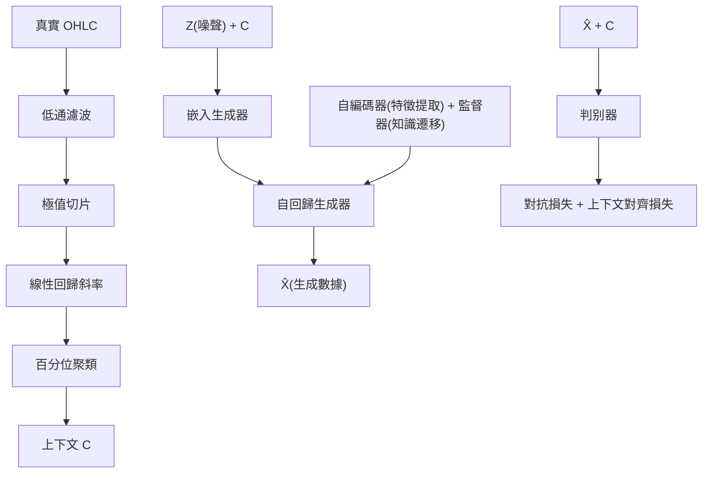

<!-- ontology-5axis data=量价表格 horizon=日频波段 paradigm=生成式大模型 alpha=端到端表征 autonomy=全自动黑盒 -->

# Market-GAN 解構

> **發布**：AAAI24
> **QuantML 導讀**：[AAAI 24 | Market-GAN 金融数据生成器](https://mp.weixin.qq.com/s?__biz=Mzg2MzAwNzM0NQ==&mid=2247485806&idx=1&sn=ac220f85358673a4c26e5c2d7da9aec7&chksm=ce7e6e70f909e766c7b815be2db25d9dee53a22795eb3959e7e8405b0c8221fca36f9b3531ed#rd)
> **核心定位**：落點於「生成式大模型 × 端到端表征」，解決金融量價數據缺乏語義標籤與非平穩性導致的生成失真，將上下文控制嵌入時序生成器以服務下游預測。

**五軸座標**

| 數據模態 | 時間尺度 | 學習範式 | Alpha機制 | 人機協作 |
|:-:|:-:|:-:|:-:|:-:|
| `量价表格` | `日频波段` | `生成式大模型` | `端到端表征` | `全自动黑盒` |

**Status:** 初版 — 基於 QuantML 導讀 + 原論文（如有）。benchmark 細節待升版。
**TL;DR:** ①提出 Market-GAN，結合 GAN 與自編碼器引入語義上下文控制，生成高保真金融時序數據。②核心 trick 為兩階段訓練（預訓練對齊上下文 + 對抗優化）搭配線性回歸聚類提取市場動態。③此設計直擊金融數據非平穩與標籤缺失痛點，對「端到端表征」軸具指標意義，因它將離散市場狀態轉為連續控制向量。④導讀未給量化結果。

**X-Ray.** 放回五軸 Pareto，Market-GAN 本質是「數據增強器」而非直接 Alpha 生成器。它解了舊工程坑：傳統 GAN/VAE 在金融時序上常因非平穩與噪聲產生分佈漂移，且缺乏業務語義錨點。該方法透過線性回歸斜率切片與百分位聚類，將連續價格軌跡離散化為可控制的市場動態標籤，再透過監督器進行知識遷移，強制生成器在隱空間對齊語義。這打通了「上下文控制 → 高保真生成 → 下游預測損失下降」的閉環。但需警惕其打不開的 Envelope：生成數據的統計保真度不等於交易可執行性。金融市場的流動性衝擊、滑點與跨資產相關性斷裂無法僅靠單資產 OHLC 的條件生成來模擬。對量化讀者而言，此架構的價值不在於直接回測跑分，而在於為因子合成、壓力測試與強化學習環境提供可控的「語義條件樣本」。

## §1 · 架構 / Core Mechanism
**1.1 三大改動 vs 前作**
| 維度 | 傳統時序生成 (TimeGAN/RCGAN) | Market-GAN | 工程意義 |
|---|---|---|---|
| 上下文錨點 | 無/隨機條件 | 線性回歸斜率 + 百分位聚類提取市場動態 | 解決金融數據缺乏語義標籤問題 |
| 生成架構 | 純 GAN / VAE | GAN + 自編碼器 + 知識轉移監督器 | 預訓練對齊隱特徵，降低對抗訓練崩潰率 |
| 訓練策略 | 單階段端到端 | 兩階段（預訓練對齊 + 對抗優化） | 提升非平穩數據的收斂穩定性與上下文一致性 |

**1.2 ⚡ Eureka 一句話 trick + 直覺**：用線性回歸擬合極值切片區間的斜率，再以百分位法將連續價格軌跡映射為離散市場動態類別，使生成器能「條件化」輸出特定趨勢片段。
**1.3 信息流 ASCII 圖**：

## §2 · 數學層
📌 **Napkin Formula**：
`L_total = L_adv(G, D) + λ_align * L_context(C, X̂) + λ_rec * L_recon(X, X̂)`
**複雜度**：線性回歸斜率計算 O(N·T)，聚類 O(N·log N)，兩階段訓練總體與標準 GAN 同階 O(G·D·T)。
**直覺**：損失函數將對抗博弈、上下文對齊與自編碼重建耦合，強制生成器在隱空間學習市場動態的條件分佈。預訓練階段利用監督器將真實數據的語義特徵遷移至生成器權重，對抗階段則微調分佈匹配。訓練細節依賴 4090 GPU，未披露具體學習率與 batch size。

## §3 · 數據層
- **資料規模/頻率/市場/時段**：道瓊斯工業平均指數（DJI），29只股票，日頻 OHLC，2000年1月至2023年6月。
- **怎麼來**：Contextual Market Dataset，經低通濾波去噪，按極值切片提取斜率。
- **樣本外與容量假設**：導讀未披露具體樣本外劃分比例與訓練/驗證/測試集切分細節。生成數據集 F 與真實數據集 R 大小相等，假設為逐日對齊的條件生成。

## §4 · 代碼層
| 欄位 | 狀態 |
|---|---|
| Repo | 未公開（導讀註「論文及代碼下載見星球」） |
| Checkpoint | TBD |
| License | TBD |
| 複現難度 | 中（需自行實現線性回歸聚類與兩階段訓練管道） |
| 數據可得性 | 高（DJI 日頻 OHLC 為公開數據，但上下文標籤需自行構建） |

## §5 · 評測 / Benchmark
| 數據集/市場 | Metric | 前SOTA | 本方法 | Δ |
|---|---|---|---|---|
| DJI 29股 日頻 | 上下文對齊度 (Ld) | TimeGAN/SigCWGAN/CGMMN/RCGAN 均未披露數值 | Ld=8.05 | 未披露 |
| DJI 29股 日頻 | 上下文對齊度 (Ll) | 基線模型均未披露數值 | 低於真實數據 | 未披露 |
| DJI 29股 日頻 | 市場事實合規性 | 未披露 | 完全符合 OHLC 市場事實，無違反 | 未披露 |
| DJI 29股 日頻 | 下游預測損失 (SMAPE) | 基線模型均未披露數值 | 最低預測 SMAPE 損失 | 未披露 |

**解讀**：導讀僅給出相對排名與單一指標值（Ld=8.05），未提供交易層面指標（Sharpe/IR/MDD）。Ld 降低與 SMAPE 最低反映的是「生成數據分佈與真實數據的統計距離縮小」及「下游監督學習任務的泛化提升」，屬數據增強維度的 capability。此 Δ 極可能包含過擬合風險：下游預測模型若僅在單資產條件下訓練，生成數據的語義控制可能僅學會複製歷史趨勢而非捕捉真實 Alpha 信號。此外，未計入交易成本與流動性假設，生成數據的「保真度」不等於「可交易性」。

## §6 · 失效與隱含假設
**6.1 論文自述 limitations**：導讀未明確列出 limitations 段落，僅提及金融數據非平穩與噪聲為固有難點。
**6.2 推斷的隱含假設**：
- **Regime 依賴**：線性回歸斜率切片假設市場動態在切片區間內呈近似線性，在跳空或極端波動時可能失效。
- **容量/成本**：未討論生成數據用於多資產組合時的跨截面相關性建模，假設單資產條件生成可獨立擴展。
- **數據泄漏**：上下文標籤由未來極值切片與歷史斜率共同構建，若切片邏輯未嚴格區分訓練/測試時間窗口，易引入前瞻偏差。
- **樣本外假設**：假設歷史市場結構在樣本外保持穩定，未驗證結構性斷點下的生成魯棒性。

## §7 · 對比 & 面試 Tip
| 同軸對手 | 關鍵差異軸 | Open? | Status |
|---|---|---|---|
| TimeGAN / RCGAN | 無語義上下文控制，純時序分佈匹配 | 開源 | 成熟基線 |
| Stock-GAN / FIN-GAN | 針對金融特性優化，但缺乏可解釋動態標籤 | 部分開源 | 領域專用 |
| Market-GAN | 引入線性回歸聚類提取市場動態，兩階段知識遷移 | 未公開 | AAAI24 |

🎤 **Interview Tip**
- **正確答**：「Market-GAN 的核心貢獻在於將離散的市場動態（斜率/趨勢）轉為連續上下文控制向量，透過兩階段訓練解決 GAN 在金融非平穩數據上的收斂問題。其價值在數據增強與壓力測試，而非直接產出交易信號。」
- **錯答**：「它是一個能直接預測股價的生成模型，因為 SMAPE 最低所以回測夏普比率會很高。」（混淆生成保真度與交易可執行性，無視成本與相關性假設）

**7.1 可證偽預測帶日期**：若後續無開源實現或實盤驗證報告，且下游任務僅限於單股票預測，則該架構將被歸類為「學術數據增強玩具」，無法進入機構 Alpha 研發流水線。

## §8 · For the Reader
- **因子研究員**：可將 Market-GAN 生成的條件樣本用於因子合成與過擬合壓力測試，但需自行驗證跨資產相關性是否失真。
- **高頻執行**：此架構為日頻波段設計，未建模訂單簿微結構與滑點，不適用 HFT 模擬。
- **組合配置**：若用於 Monte Carlo 組合壓力測試，需補上 Copula 或動態相關性約束，否則生成路徑將低估尾部共動風險。
- **LLM-agent / RL 策略**：可將提取的市場動態類別作為環境狀態空間的離散 Action/State 錨點，降低 RL 探索空間維度。
- **研究學生**：重點複現「線性回歸斜率切片 → 百分位聚類 → 上下文標籤構建」的 pipeline，這是連接傳統計量與生成式 AI 的關鍵橋樑。

## References
- 原論文：Market-GAN, AAAI 2024.
- Lineage: TimeGAN (Yoon et al. 2019), RCGAN, SigCWGAN, Stock-GAN, FIN-GAN, Conditional GAN.
- QuantML 導讀鏈接：[AAAI 24 | Market-GAN 金融数据生成器](https://mp.weixin.qq.com/s?__biz=Mzg2MzAwNzM0NQ==&mid=2247485806&idx=1&sn=ac220f85358673a4c26e5c2d7da9aec7&chksm=ce7e6e70f909e766c7b815be2db25d9dee53a22795eb3959e7e8405b0c8221fca36f9b3531ed#rd)