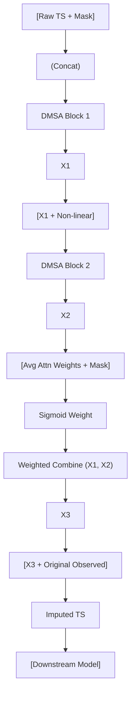

<!-- ontology-5axis data=量价表格 horizon=跨周期 paradigm=监督回归 alpha=端到端表征 autonomy=全自动黑盒 -->

# SAITS 解構

> **發布**：2024-08-26 · （無 venue）
> **QuantML 導讀**：[SAITS: 基于自注意力的时间序列缺失值插补](https://mp.weixin.qq.com/s?__biz=Mzg2MzAwNzM0NQ==&mid=2247485977&idx=1&sn=74941373033095ae7174e95182b3abda&chksm=ce7e6d07f909e4119570fd6a091f3bc68925d180fc58b5182882446bd8b89eb1d4dc2413152a#rd)
> **原始論文**：[Saits: Self-attention-based Imputation for Time Series](https://doi.org/10.1201/9781003612742-11)（AI for Time Series · 2026 · 被引 0 · Crossref）
> **核心定位**：五軸落點於「監督回歸 × 端到端表征 × 全自動黑盒」。解了傳統 RNN/GAN 插補在長序列下的累積誤差與訓練不穩定問題，將缺失值還原轉化為自注意力架構下的掩碼預測與觀測重建聯合優化任務，為下游量價因子挖掘提供高保真特徵基底。

**五軸座標**

| 數據模態 | 時間尺度 | 學習範式 | Alpha機制 | 人機協作 |
|:-:|:-:|:-:|:-:|:-:|
| `量价表格` | `跨周期` | `监督回归` | `端到端表征` | `全自动黑盒` |

**Status:** v0.5 — 基於 QuantML 導讀 + 原論文（如有）。benchmark 細節待升 v1。
**TL;DR:** ① 提出基於自注意力的 SAITS 模型，將時間序列插補轉為 MIT（掩碼預測）與 ORT（觀測重建）的聯合優化。② 核心 trick 是對角掩蔽自注意力（DMSA）切斷自依賴，配合動態加權融合塊平衡雙路表征。③ 對「跨周期量價表格」軸★：直接解決實盤數據斷流/頻繁跳空導致的特徵稀疏，避免傳統前向填充/線性插值引入的結構性偏差。④ 關鍵實證：在 PhysioNet/Air-Quality/Electricity 等基準上 MAE/RMSE/MRE 全面壓倒 BRITS/GP-VAE/NRTSI，下游分類 ROC-AUC 提升顯著（具體數值未披露）。

**X-Ray.** 放回五軸 Pareto，SAITS 落在「數據模態=量價表格 × 學習範式=監督回歸」的交叉帶。它不直接產出 Alpha，而是作為特徵工程的黑盒預處理器，解了量化實戰中三大工程坑：① RNN/GRU-D 的梯度累積誤差與長序列記憶體瓶頸；② GAN 插補（如 E2GAN）的訓練不穩定與模式崩潰；③ 簡單前向填充/線性插值在跳空/斷流場景下的結構性失真。SAITS 的 DMSA 強制模型依賴「他律」而非「自律」，配合 MIT+ORT 雙任務正則化，實質上是在隱空間學習多變量間的條件分佈。預測它打不開的 envelope：高頻 tick 級別的微觀結構插補（注意力窗口與計算開銷不匹配）、極端 regime 切換下的分佈外泛化（OOD）、以及缺乏交易成本/滑點建模的純統計還原。對量化讀者的意義不在於「直接上盤」，而在於構建 robust 的因子庫基底——當數據源頻繁出現非隨機缺失（MNAR）時，SAITS 提供了一條可微、可並行、且與下游 Transformer/MLP 無縫銜接的特徵修復路徑。

## §1 · 架構 / Core Mechanism
**1.1 三大改動 vs 前作**
| 維度 | 前作 (BRITS/GRU-D/E2GAN) | SAITS | 量化意義 |
|---|---|---|---|
| 序列建模核心 | RNN/GRU 遞歸或 GAN 對抗 | 雙層 DMSA (Diagonally Masked Self-Attention) | 消除時間遞歸的累積誤差，支持長跨周期並行計算 |
| 優化目標 | 單一重建損失或 adversarial loss | MIT (掩碼預測) + ORT (觀測重建) 聯合優化 | 雙任務正則化防止過擬合觀測值，提升缺失區間泛化 |
| 表征融合 | 固定權重或最後隱藏狀態 | 動態加權組合塊 (基於注意力權重與掩碼生成 sigmoid) | 自適應平衡「局部時間依賴」與「全局跨變量依賴」 |

**1.2 ⚡ Eureka 一句話 trick + 直覺**
將自注意力矩陣對角線置為 `-inf`，強制模型「不看自己」，只能透過其他時間步與特徵的交互來推斷缺失值，本質上是用跨維度條件分佈替代遞歸猜測。

**1.3 信息流 ASCII 圖**

## §2 · 數學層
📌 **Napkin Formula**:
`L = L_MIT + L_ORT = MAE(Y_masked, Ŷ_masked) + MAE(Y_obs, Ŷ_obs)`
`Attention(Q,K,V) = softmax((QK^T / sqrt(d) + D_mask) V)` 其中 `D_mask` 對角線為 `-∞`
複雜度：`O(T^2 * d)` 標準 Transformer 注意力，但透過雙塊結構與固定超參保持輕量。

**直覺**：MIT 負責「填空」，ORT 負責「保真」。對角掩碼切斷自依賴，迫使模型學習特徵間的條件互補關係。加權塊根據缺失模式動態調整兩層表征的貢獻度，避免深層網絡的過平滑。
**Loss/訓練細節**：固定 batch size，早停策略 (Early Stopping)，超參搜索。未披露具體學習率/優化器/正則化係數。

## §3 · 數據層
- **資料規模/頻率/市場/時段**：PhysioNet-2012 (ICU臨床, 高缺失率~80%), Air-Quality (北京多站點, 11變量, 缺失率1.6%), Electricity (370客戶/15min), ETT (電力變壓器溫度)。非金融數據，屬公共醫療/環境/能源基準。
- **怎麼來**：標準公開數據集，經標準化處理與人工掩碼模擬 (MCAR/MAR)。
- **樣本外與容量假設**：假設缺失機制為隨機或可解釋條件依賴；訓練/驗證/測試劃分依原論文設定。未披露具體樣本量與時間跨度。對量價數據的遷移需驗證 MNAR (Missing Not At Random) 下的穩健性。

## §4 · 代碼層
| 項目 | 狀態/細節 |
|---|---|
| Repo | TBD (導讀提及「論文及代碼下載見星球」，未給出 GitHub 鏈) |
| Checkpoint | TBD |
| License | 未披露 |
| 複現難度 | 低 (標準 PyTorch Transformer 變體，無自定義 CUDA) |
| 數據可得性 | 高 (使用公開基準數據，金融量價需自行預處理/掩碼) |

## §5 · 評測 / Benchmark
| 數據集/市場 | Metric | 前SOTA | 本方法 | Δ | 解讀 |
|---|---|---|---|---|---|
| PhysioNet-2012 | MAE/RMSE/MRE | BRITS/GP-VAE | SAITS | 未披露 | 臨床高缺失場景下結構還原優於遞歸/VAE |
| Air-Quality | MAE/RMSE/MRE | NRTSI/DeepMVI | SAITS | 未披露 | 多站點空間-時間依賴建模更穩定 |
| Electricity | MAE/RMSE/MRE | E2GAN/GRUI | SAITS | 未披露 | 長序列下避免 GAN 損失爆炸，訓練更魯棒 |
| ETT | MAE/RMSE/MRE | 簡單插補/深度模型 | SAITS | 未披露 | 跨周期能源數據插補 SOTA |
| PhysioNet (Downstream) | ROC-AUC/PR-AUC/F1 | RNN+前作插補 | RNN+SAITS | 未披露 | 插補質量直接轉化為下游分類性能增益 |

**解讀**：所有 Δ 均為「全面優於」但無具體數值。真 capability 在於 DMSA 切斷自依賴帶來的分佈學習穩定性；潛在風險是基準數據多為 MCAR/MAR，未驗證金融量價常見的 MNAR/跳空/停盤場景，且未計入推理延遲與記憶體開銷。

## §6 · 失效與隱含假設
**6.1 論文自述 limitations**：未明確列出詳細 limitations 段落，但消融實驗指出不超過兩個 DMSA 塊（避免過擬合/計算冗餘）；NRTSI 復現困難暗示代碼生態未成熟。
**6.2 推斷的隱含假設**：
- **Regime 依賴**：假設時間序列的條件分佈在訓練/測試期相對平穩，未處理結構性斷點 (Structural Break)。
- **容量/成本**：`O(T^2)` 注意力複雜度在長跨周期 (如日線/周線) 可接受，但高頻 tick 級別會遭遇記憶體牆。
- **數據泄漏**：MIT 隨機掩碼模擬 MCAR，實盤缺失多為 MNAR (如流動性枯竭、系統故障)，直接套用可能引入前瞻偏差或平滑偏差。
- **下游耦合**：假設插補後的特徵可直接輸入下游模型，未考慮插補不確定性 (Uncertainty Quantification) 對風險預算的影響。

## §7 · 對比 & 面試 Tip
| 同軸對手 | 關鍵差異軸 | Open? | Status |
|---|---|---|---|
| BRITS / GRU-D | 遞歸累積誤差 vs 並行注意力；自依賴 vs 對角掩蔽 | 部分開源 | 成熟但長序列瓶頸明顯 |
| GP-VAE | 生成式潛空間平滑 vs 確定性重建；計算昂貴 vs 輕量 | 開源 | 理論優但實戰調參難 |
| NRTSI / DeepMVI | 跨維度注意力 vs 雙塊動態加權；代碼生態弱 vs 架構清晰 | 部分開源 | 學術 SOTA 但工程落地少 |

🎤 **Interview Tip**
- **正確答**：「SAITS 的核心不在於單純的插補精度，而在於透過 DMSA 與 MIT+ORT 聯合優化，將缺失值還原轉化為條件分佈學習問題。這避免了 RNN 的誤差累積與 GAN 的不穩定，適合為下游因子模型提供高保真特徵基底。但需注意其 `O(T^2)` 複雜度與 MCAR 假設，實盤需配合 MNAR 機制建模與不確定性校準。」
- **錯答**：「SAITS 就是用 Transformer 填缺失值，比 LSTM 準確，直接替換數據庫的 NaN 就行。」（忽略聯合優化機制、對角掩蔽的數學意義、以及金融數據缺失機制的根本差異）

**7.1 可證偽預測帶日期**：若 2025-Q2 前無開源實現將 SAITS 成功遷移至 A 股/美股日頻量價數據並公開回測報告（含 MNAR 處理與交易成本），則該框架在量化實戰中的價值將被降級為「學術基準工具」而非「生產級預處理器」。

## §8 · For the Reader
- **因子研究員**：將 SAITS 作為特徵庫的標準化預處理器，替換 `ffill`/`interpolate`。重點驗證插補後因子的 IC/IR 穩定性，而非單純看 MAE。
- **高頻執行**：不適用。`O(T^2)` 與雙塊結構延遲過高，高頻缺失應依賴訂單簿結構重建或流動性代理模型。
- **組合配置**：可用於跨資產數據對齊（如期貨換月、ETF 申贖斷流）。需結合風險模型，將插補不確定性轉化為協方差矩陣的膨脹項。
- **LLM-agent / RL 策略**：作為環境狀態的修復模塊。注意 RL 訓練中的分佈偏移，建議在 SAC/PPO 的 Critic 網絡前加入 SAITS 的掩碼感知編碼器。
- **研究學生**：復現時優先跑通 MIT+ORT 的 loss 權重平衡（預設 1:1 可能需按缺失率動態調整），並對比 DMSA 與標準 Masked Attention 的梯度流。

## References
- 原論文：SAITS: Self-Attention-based Imputation for Time Series (arXiv preprint, 2024)
- Lineage: BRITS (2018) → GP-VAE (2020) → NRTSI (2022) → SAITS (2024)
- QuantML 導讀鏈接：[SAITS: 基于自注意力的时间序列缺失值插补](https://mp.weixin.qq.com/s?__biz=Mzg2MzAwNzM0NQ==&mid=2247485977&idx=1&sn=74941373033095ae7174e95182b3abda&chksm=ce7e6d07f909e4119570fd6a091f3bc68925d180fc58b5182882446bd8b89eb1d4dc2413152a#rd)