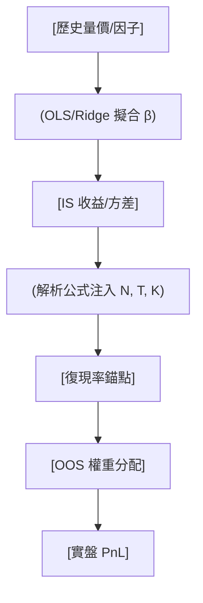

<!-- ontology-5axis data=量价表格 horizon=中长周期 paradigm=监督回归 alpha=因子挖掘 autonomy=人机协同可解释 -->

# 深度优于广度：线性模型样本外衰减 解構

> **發布**：2025-12-02 · （無 venue）
> **QuantML 導讀**：[深度优于广度：线性模型样本外衰减](https://mp.weixin.qq.com/s?__biz=Mzg2MzAwNzM0NQ==&mid=2247492562&idx=1&sn=85e5b2720526ec723739b3e94a35b1a9&chksm=ce7d84ccf90a0ddafd7357cb7c49acb9b791a5f305f7019dc2f479893662e9a078188065e6f8#rd)
> **核心定位**：落點於监督回归与因子挖掘的交叉軸，解決了量化實戰中「樣本內夏普虛高」缺乏理論錨點的 prior gap，將過擬合懲罰從經驗法則升級為可解析的封閉形式。

**五軸座標**

| 數據模態 | 時間尺度 | 學習範式 | Alpha機制 | 人機協作 |
|:-:|:-:|:-:|:-:|:-:|
| `量价表格` | `中长周期` | `监督回归` | `因子挖掘` | `人机协同可解释` |

**Status:** v0.5 — 基於 QuantML 導讀 + 原論文（如有）。benchmark 細節待升 v1。
**TL;DR:** ① 推導線性模型樣本外夏普衰減的解析公式，量化過擬合懲罰。② 核心 trick 基於高斯假設推導復現率封閉解，揭示參數維度與回測長度對過擬合的非線性影響。③ 對因子挖掘軸★：提供理論錨點，證明強信號優於弱信號堆砌，直接指導降維抗衰減。④ 完整模型復現率僅約38%，面板回歸提升至約70%。

**X-Ray.** 本文將過擬合從「黑箱經驗」拉回「白箱解析」。傳統量價因子挖掘常陷入廣度陷阱（堆砌弱信號），本文透過高斯線性框架證明：復現率隨信號數 $N$ 與資產數 $K$ 增加而非線性坍縮，除非資產間相關性趨近於零。這解構了實盤中常見的「樣本內打五折」粗糙法則，給出依賴 $T, N, K, \text{True SR}$ 的動態折扣錨點。其 envelope 限制在於嚴格依賴線性假設與馬科維茨權重結構，對非線性 Alpha（如樹模型/深度網絡）的參數膨脹懲罰不適用。對量化讀者而言，它不是預測模型，而是策略生命周期的「審計儀表」：在因子投產前，用解析式預判容量邊界與衰減斜率，強制執行 Simple things right。

## §1 · 架構 / Core Mechanism
**1.1 三大改動 vs 前作**
| 維度 | 前作/業界慣例 | 本法改動 |
|---|---|---|
| 過擬合量化 | 經驗法則（如 IS SR 打五折） | 推導封閉形式復現率解析近似 |
| 信號結構 | 單資產單信號（如 [KWZ24]） | 擴展至多資產多信號（$N>1$）矩陣回歸 |
| 風險模型 | 隱含依賴精確協方差估計 | 證明係數估計誤差主導衰減，協方差估計誤差影響微乎其微 |

**1.2 ⚡ Eureka 一句話 trick + 直覺**
利用高斯矩陣二次型期望，將樣本內收益的「虛高項」$\frac{N}{T}$ 與樣本外方差膨脹解耦，復現率本質是信號信噪比與自由度膨脹率的博弈。

**1.3 信息流 ASCII 圖**

## §2 · 數學層
**📌 Napkin Formula**
$$ \text{Replication Ratio} \approx \frac{E[SR_{OOS}]}{E[SR_{IS}]} \quad \text{where} \quad E[\mu_{IS}] \approx \mu + \frac{N}{T}\sigma^2, \quad E[\mu_{OOS}] \approx \mu $$
**直覺**：樣本內夏普被自由度膨脹 $\frac{N}{T}$ 強制灌水，樣本外回歸真實信噪比 $\mu$。復現率隨 $T$ 增加非線性上升，隨 $N, K$ 增加單調下降。
**Loss/訓練**：基於 OLS 或 Ridge 回歸最小化訓練集殘差平方和；權重設定為 $w \propto \Sigma^{-1}\hat{\beta}$（馬科維茨框架）。未涉及梯度下降或正則化超參搜索的動態調整。

## §3 · 數據層
**資料規模/頻率/市場/時段**：大宗商品期貨（12種）1998-2023；百年美股（39個宏觀/技術指標）1926-2024。頻率為日/周級（依 GP13/GWZ24 設定）。
**怎麼來**：公開學術數據集重構（GP13 動量信號 + 截距項共37因子；GWZ24 百年股權溢價預測因子）。
**樣本外與容量假設**：採用滾動窗口回測與大規模重採樣（5,000,000次）驗證；假設策略容量不受交易成本與市場衝擊限制（純夏普理論框架）。

## §4 · 代碼層
| 項目 | 細節 |
|---|---|
| Repo | TBD |
| Checkpoint | TBD |
| License | TBD |
| 複現難度 | 低（解析公式為封閉形式，模擬驗證需矩陣運算） |
| 數據可得性 | 高（依賴 GP13/GWZ24 公開因子與期貨/股票數據） |

## §5 · 評測 / Benchmark
| 數據集/市場 | Metric | 前SOTA | 本方法 | Δ |
|---|---|---|---|---|
| 大宗商品期貨 (GP13 複刻) | 完整模型復現率 | 未披露 | 約38% | 未披露 |
| 大宗商品期貨 (GP13 複刻) | 面板回歸復現率 | 未披露 | 約70% | 未披露 |
| 多信號線性框架 | 信號數 N=10 時夏普折扣 | [KWZ24] (N=1 設定) | 顯著更嚴重 | 未披露 |

**解讀**：Δ 欄留白因導讀未提供基線對照的具體數值，僅定性描述「嚴重得多」與「大幅提升」。完整模型 IS SR 8.2 降至 OOS SR 3.1 的衰減屬真實參數膨脹效應，非過擬合誤判；面板回歸將復現率從約38%提升至約70% 證明降維抗衰減有效。需警惕：該 Δ 未計入交易成本與滑點，實盤復現率可能進一步下修。

## §6 · 失效與隱含假設
**6.1 論文自述 limitations**
理論推導依賴信號與殘差 i.i.d. 多元高斯假設；雖模擬驗證對 AR(1) 與肥尾分佈具魯棒性，但若自回歸係數 $\rho$ 極度接近 1，解析公式精度下降。未涵蓋非線性模型與動態權重調整。
**6.2 推斷的隱含假設**
*Regime 依賴*：假設市場結構與因子協方差在 IS/OOS 期間穩定，未處理結構性斷點。
*容量/成本*：純理論夏普框架，假設無限容量與零交易成本，實盤執行摩擦會疊加在復現率衰減之上。
*數據泄漏*：因子構建若含未來函數或幸存者偏差，會扭曲 $\mu$ 與 $\sigma$ 的真實錨點，使解析式失效。

## §7 · 對比 & 面試 Tip
| 同軸對手 | 關鍵差異軸 | Open? | Status |
|---|---|---|---|
| [KWZ24] Kan, Wang, Zheng | 單信號 vs 多信號矩陣膨脹懲罰 | 未披露 | 已發表 |
| 業界經驗法則 (IS打五折) | 靜態折扣 vs 動態解析錨點 | 未披露 | 經驗規則 |

**🎤 Interview Tip**
*正確答*：「復現率不是固定折扣，而是 $N, T, K$ 與 True SR 的函數。當 $N/T$ 膨脹時，IS 收益被 $\frac{N}{T}\sigma^2$ 虛高，OOS 回歸真實 $\mu$。應優先提升信號強度而非堆砌因子，並用面板回歸限制自由度。」
*錯答*：「樣本外表現差就是過擬合，把訓練集切大一點或加 L2 正則就能解決。」（忽略了解析框架揭示的參數維度非線性坍縮與協方差估計誤差的主次關係）

**7.1 可證偽預測帶日期**
若 2026-TBD 前，實盤多因子組合在 N>TBD 且 T<TBD 條件下，實測復現率持續高於解析公式預測值，則本框架的高斯線性假設或馬科維茨權重結構在當前 regime 失效。

## §8 · For the Reader
* **因子研究員**：將解析式嵌入因子投產前審計流程，計算 $N/T$ 閾值，拒絕低 True SR 的因子堆砌。
* **組合配置**：在資產池擴展時，嚴格檢驗新增資產與現有組合的相關性；若相關性 >1%，盲目擴容將單調壓低復現率。
* **高頻執行/風控**：本框架為中長週期理論，高頻策略需疊加成本模型；但可用其估算「理論夏普天花板」，超額部分視為風險溢價而非 Alpha。
* **研究學生**：跳過黑箱調參，直接復現矩陣二次型期望推導，理解自由度膨脹對 OOS 的數學懲罰機制。

## References
* 原論文：帝國理工學院 & Qube Research & Technologies. 《深度优于广度：线性模型样本外衰减》. 2025.
* Lineage: Gârleanu & Pedersen [GP13]; Kan, Wang, Zheng [KWZ24]; Goyal, Welch, Zafirov [GWZ24].
* QuantML 導讀：[深度优于广度：线性模型样本外衰减](https://mp.weixin.qq.com/s?__biz=Mzg2MzAwNzM0NQ==&mid=2247492562&idx=1&sn=85e5b2720526ec723739b3e94a35b1a9&chksm=ce7d84ccf90a0ddafd7357cb7c49acb9b791a5f305f7019dc2f479893662e9a078188065e6f8#rd)