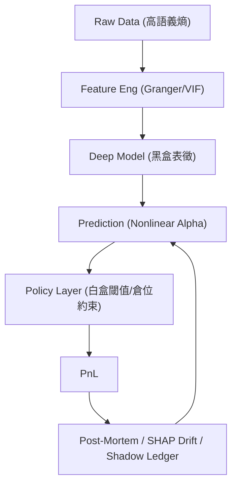

<!-- ontology-5axis data=量价表格 horizon=跨周期 paradigm=因果结构 alpha=端到端表征 autonomy=人机协同可解释 -->

# 非对称可解释性原则 解構（非对称可解释性原则）

> **發布**：2026-07-01 · （無 venue）
> **QuantML 導讀**：[重磅新作：为不可解释构建可解释系统](https://mp.weixin.qq.com/s?__biz=Mzg2MzAwNzM0NQ==&mid=2247494188&idx=1&sn=e0fbb16cfc8f26f61c819a82fd69d1bd&chksm=ce7d8d32f90a042400460e1e318e1c2a82c953195520c0f61dd42cfbb187db8ec0660f46483c#rd)
> **核心定位**：將透明度約束從特徵層後移至決策與監控層，以「預測黑盒、決策白盒」解耦深度學習的非線性表徵與合規審計需求。解決了傳統因子投資在特徵入口強加經濟敘事導致 Alpha 降維，以及標準正則化（L2/Dropout）在金融非平穩環境中失效的 Prior Gap。

**五軸座標**

| 數據模態 | 時間尺度 | 學習範式 | Alpha機制 | 人機協作 |
|:-:|:-:|:-:|:-:|:-:|
| `量价表格` | `跨周期` | `因果结构` | `端到端表征` | `人机协同可解释` |

**Status:** v0.5 — 基於 QuantML 導讀 + 原論文（如有）。benchmark 細節待升 v1。
**TL;DR:** ① 提出非對稱可解釋性原則，強制要求距離資金部署越近的層級透明度越高；② 核心 Trick 是放棄特徵層經濟敘事，改用 SHAP 穩定性、解釋漂移與事後鑒識替代傳統權重正則化；③ 對「端到端表徵」軸★ 的關鍵在於將過擬合控制從模型參數空間轉移至策略執行與監控協議；④ 導讀未給量化結果。

**X-Ray.** 放回五軸 Pareto，本法不追求在 `量价表格` 上榨取更高 IC，而是重構 `因果结构` 的審計路徑。它精準擊中了量化工程的老坑：傳統 L2/Dropout 無法區分「跨制度通用規律」與「特定 Regime 記憶」，且回測閾值優化本身就是正則化盲區。本法將透明度梯度錨定在 Policy 層與 Shadow Ledger，用結構可驗證性替代理論自洽性。預測它打不開的 Envelope：不解決 Alpha 衰減本身、不內建動態滑點/衝擊成本模型、SHAP 漂移屬事後指標（Reactive）而非前瞻防禦。對量化讀者的意義在於：提供了一套可落地的合規與風控協議棧，可與任何高維表徵模型（Transformer/RL）並行部署，將「黑盒恐懼」轉化為可計量的監控開銷。

## §1 · 架構 / Core Mechanism
**1.1 三大改動 vs 前作**
| 維度 | 傳統因子挖掘 | 標準深度學習 (L2/Dropout) | 非對稱可解釋性原則 |
|---|---|---|---|
| 解釋負擔落點 | 特徵入口（必須有經濟敘事） | 模型參數空間（權重衰減/隨機置零） | 決策層與監控層（結構透明+漂移鑒識） |
| 過擬合控制手段 | 多重檢驗校正、經濟邏輯過濾 | 權重懲罰、早停、數據增強 | SHAP 排序穩定性、解釋漂移檢驗、閾值 Breakeven 推導 |
| 透明度梯度 | 輸入高 → 決策低 | 全局黑盒或局部可視化 | 特徵可黑盒 → 策略/治理絕對白盒（單調遞增） |

**1.2 ⚡ Eureka 一句話 Trick**
> 「預測模式的數學發現過程不需要解釋，但交易決策必須永遠可被反事實重建；距離資金越近，透明度要求越嚴格。」

**1.3 信息流 ASCII 圖**

## §2 · 數學層
📌 **Napkin Formula**
$$
\max_{\theta} \mathbb{E}[\alpha_{\text{nonlinear}}(f_\theta(X))] \quad \text{s.t.} \quad \nabla_{d} \mathcal{T}(L) \ge 0, \quad \mathcal{T}_{\text{policy}} \to 1
$$
*直覺*：$d$ 為距離資金部署的層級距離，$\mathcal{T}$ 為透明度權重。約束要求政策層結構透明度趨近於 1，而特徵層經濟透明度 $\mathcal{T}_{\text{econ}}$ 被顯式放寬。
*複雜度/訓練*：無新增 Loss 項。訓練階段僅記錄架構先驗；部署階段引入 SHAP 排序相關性計算與漂移統計檢驗，計算開銷為 $O(N \cdot d_{\text{feat}})$ 監控週期性評估，不影響前向推理延遲。

## §3 · 數據層
| 維度 | 細節 |
|---|---|
| 資料規模/頻率 | 未披露（導讀僅提及涵蓋高頻訂單流與宏觀指標） |
| 市場/時段 | 未披露 |
| 樣本外假設 | 依賴 Regime Shift 可被 SHAP 分佈漂移檢測捕捉；假設特徵血緣無前向污染 |
| 容量假設 | 未披露（框架本身不限制容量，但監控層開銷隨特徵維度線性增長） |

## §4 · 代碼層
| 欄位 | 狀態 |
|---|---|
| Repo | TBD |
| Checkpoint | 未披露 |
| License | 未披露 |
| 複現難度 | 中高（需自建 SHAP 穩定性管道與 Shadow Ledger 審計模組） |
| 數據可得性 | 未披露 |

## §5 · 評測 / Benchmark
| 數據集/市場 | Metric | 前SOTA | 本方法 | Δ |
|---|---|---|---|---|
| 未披露 | IR / Sharpe / AR / MDD | 未披露 | 未披露 | 未披露 |

**解讀論斷**：導讀與原文均為**系統設計與認識論框架**，未提供任何實盤/回測量化指標或基線對比。Δ 欄無效。若強行解讀，本法的核心價值不在於單點 IR 提升，而在於將「過擬合風險」轉化為可計量的監控協議。缺乏成本計量（Slippage/Impact）與執行層建模，故不具備直接替換現有 Alpha 生成流水線的實證基礎，需與 YAND 或明確的組合優化器耦合後方可評估真實 Δ。

## §6 · 失效與隱含假設
**6.1 論文自述 Limitations**
- 不解決 Alpha 信號本身的生成與衰減問題，僅提供防過擬合與審計協議。
- 依賴事後鑒識（Post-Mortem）與漂移檢測，屬反應式（Reactive）而非前瞻式防禦。
- 決策閾值強制由 Breakeven 公式推導，禁止回測尋優，可能在動態波動率環境中導致信號利用率下降。

**6.2 推斷的隱含假設**
- **Regime 依賴**：假設市場狀態切換會顯著改變 SHAP 特徵排序；若 Alpha 來源為低頻結構性因子，漂移檢測可能產生大量誤報。
- **成本穩定性**：Breakeven 閾值推導假設交易成本結構相對穩定，未內建動態成本適應機制。
- **數據泄漏**：依賴 Layer 1 的無未來函數校驗與 Granger 檢驗，若特徵工程管道存在隱性前向污染，監控層將失效。
- **Survivorship**：未提及樣本選擇偏差處理，實盤部署需額外對接存續偏差校正模組。

## §7 · 對比 & 面試 Tip
| 同軸對手 | 關鍵差異軸 | Open? | Status |
|---|---|---|---|
| 傳統多因子模型 | 解釋負擔位置（輸入端 vs 決策端） | 閉源/內部 | 成熟但 Alpha 容量受限 |
| 標準 E2E RL/Transformer | 正則化機制（權重懲罰 vs 結構審計+漂移鑒識） | 開源/閉源混用 | 高維強但合規風險高 |
| YAND 組合優化 | 策略層透明度（可微黑盒 vs 確定性白盒優化器） | 開源 | 本法高度推薦的耦合對象 |

🎤 **Interview Tip**
- **正確答**：本法不替代特徵工程或模型訓練，而是將過擬合控制從參數空間轉移至策略執行與監控協議。核心是「預測黑盒、決策白盒」，用 SHAP 穩定性與解釋漂移替換 L2/Dropout 在金融非平穩環境中的失效正則化。
- **錯答**：認為本法能直接生成更高 Sharpe 的 Alpha，或聲稱它完全取代了特徵選擇與經濟邏輯驗證。

**7.1 可證偽預測帶日期**
若於 `2026-Q3` 前實證顯示 SHAP 漂移觸發後策略 MDD 未顯著放大（滯後 >TBD 交易日），則監控層的領先指標假設失效，需引入高階矩（偏度/峰度）動態閾值。

## §8 · For the Reader
- **因子研究員**：停止在特徵入口強行編造經濟敘事。將精力轉向 Layer 1 的血緣追蹤與 Granger 檢驗，把解釋權讓渡給深度表徵。
- **高頻執行**：本法未內建滑點/衝擊模型。需將 Layer 4 的 Breakeven 閾值與你的執行算法（VWAP/IS）耦合，否則白盒決策在實盤會因成本穿透失效。
- **組合配置**：優先採用 YAND 替代 E2E 權重輸出。預測模型只給 $\hat{r}$，組合層用確定性優化器施加行業中性與總倉位約束，天然符合非對稱原則。
- **LLM-Agent / RL 策略**：將 Policy 層的約束條件外置為硬編碼規則（Hard Constraints），禁止模型通過 Reward Shaping 隱式學習倉位限制，確保反事實計算可解。
- **研究學生**：不要追逐 SOTA 表徵架構。複現重點應放在 SHAP 穩定性管道、解釋漂移統計檢驗與 Shadow Ledger 的審計流水線設計上。

## References
- Tensor Systems & AlphaNet Research Team. *Explainable Systems for the Inextricable*. 2026.
- QuantML 導讀. *重磅新作：为不可解释构建可解释系统*. 2026-07-01.
- Lineage: Fama-French (1993) → SVM/Tree Ensembles (2000s) → Deep Representation Learning (2018+) → Asymmetric Explainability Framework (2026).