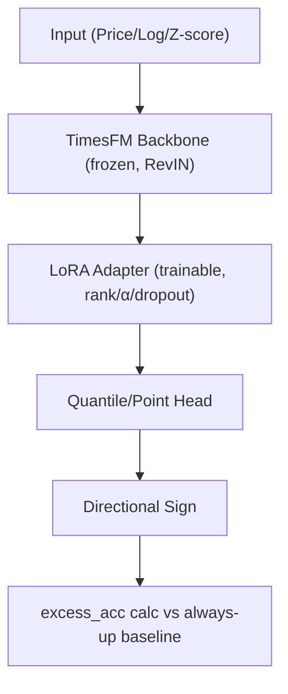

<!-- ontology-5axis data=量价表格 horizon=中长周期 paradigm=生成式大模型 alpha=风险择时 autonomy=全自动黑盒 -->

# Base-Rate-Honest Benchmark 解構（Base-Rate-Honest Benchmark）

> **發布**：2026-07-14 · （無 venue） · arXiv [2607.12248](https://arxiv.org/abs/2607.12248)
> **arXiv 原文**：[When Directional Accuracy Lies: A Base-Rate-Honest Benchmark for LoRA-Adapted TimesFM on Equity Forecasting](https://arxiv.org/abs/2607.12248v2) · _本頁由 arXiv 原文一手自主解構_
> **核心定位**：定位於生成式時間序列大模型在長週期量價預測的評估協議層，解決了傳統方向性準確率在單邊牛市中被基線漂移（base-rate drift）嚴重高估的 prior gap。

**五軸座標**

| 數據模態 | 時間尺度 | 學習範式 | Alpha機制 | 人機協作 |
|:-:|:-:|:-:|:-:|:-:|
| `量价表格` | `中长周期` | `生成式大模型` | `风险择时` | `全自动黑盒` |

**Status:** v0.5 — 基於arXiv 原文（有原文則以原文為準）。細節待升 v1。
**TL;DR:** ① 提出 Base-Rate-Honest Benchmark 協議，以 rolling walk-forward 與 stratified held-out 取代傳統靜態劃分。② 核心 trick 是棄用隱含 50% 拋硬幣假設，改以 `excess_acc = acc - always_up_accuracy` 作為 headline metric。③ 對「生成式大模型」軸而言，徹底剝離了牛市漂移帶來的偽 Alpha，迫使模型回歸真實條件分佈學習。④ 實證顯示 pooled LoRA 在兩市場各週期 excess accuracy 均圍繞零分佈，六個月週期甚至為負，方向預測無顯著技能。

**X-Ray.** 本文將量化評測從「拼準確率」拉回「拼基線對齊」的 Pareto 前沿。舊工程坑在於長週期預測天然承載市場 beta 漂移，原始 accuracy 實為 beta + alpha 的混雜信號。本協議透過 always-up 錨定與 FDR 控制，強制剝離漂移項，暴露出 LoRA 微調僅能壓低 point-forecast error，卻無法轉化為可交易的 directional edge。它打不開的 envelope 是：在缺乏高頻微結構或基本面異動輸入時，純量價生成模型在長週期仍受限于隨機漫步特性。對量化讀者的意義在於：任何長週期方向模型上線前，必須先通過 excess_acc 與 always-up 的零假設檢驗，否則回測曲線只是市場趨勢的鏡像。

## §1 · 架構 / Core Mechanism
**1.1 三大改動 vs 前作**
| 維度 | 傳統靜態評測 | Base-Rate-Honest Benchmark |
|---|---|---|
| 基線假設 | 隱含 50% 拋硬幣 | `always-up` 實測基線率 |
| 驗證協議 | 單次 train/test split | Expanding walk-forward folds |
| 泛化檢驗 | 隨機打亂或全量訓練 | Stratified held-out-ticker split |

**1.2 ⚡ Eureka**
棄用 50% 隱含基線，改以 `excess_acc = acc - always_up_accuracy` 直接錨定市場漂移，將方向預測轉化為對絕對漂移的殘差估計。

**1.3 信息流 ASCII**

## §2 · 數學層
**📌 Napkin Formula**
`excess_acc = acc_model - acc_always_up`
Loss = `MSE + 0.3 * directional`

**直覺**：方向性預測被轉化為對絕對漂移的殘差估計。Loss 中的 directional 項僅作為正則化輔助，主體仍依賴 MSE 壓低點預測誤差。訓練採用 expanding walk-forward，seed=42，取 best-validation checkpoint，嚴格隔離 test window。

## §2.5 · 帶數字走一遍（Worked Example）
（以下為**假設/示意**玩具數字，僅演示協議計算邏輯，非論文實證結果）
1. **假設**某 6 個月視窗內，標的實際上漲比例為 70%（`always_up_accuracy = 70%`）。
2. 模型預測方向，原始準確率 `acc_model = 72%`。
3. 計算 `excess_acc = 72% - 70% = +2pp`。
4. 經 Diebold-Mariano 檢驗，p=0.45，未達顯著。結論：+2pp 屬隨機波動，非真實技能。
5. 若換成熊市視窗（`always_up_accuracy = 30%`），模型 `acc_model = 31%`，`excess_acc = +1pp`，同樣不顯著。協議確保牛熊市基線對齊。

## §3 · 數據層
- **規模/頻率**：日頻，2005-01-01 至 2026-01-01。
- **市場**：NASDAQ-100 (100 stocks + QQQ) & S&P 500 (501 stocks + 11 SPDR ETFs)。
- **來源**：凍結版 checksum-verified artifact，調整後收盤價。
- **樣本外與容量**：Stratified held-out (~20% per sector)，ETF 排除於 holdout。容量假設：單 sector 樣本過薄時（如 NASDAQ-100 金融業僅 1 檔）不訓練 per-sector adapter。

## §4 · 代碼層
| 欄位 | 內容 |
|---|---|
| Repo | TBD |
| Checkpoint | TBD |
| License | TBD |
| 複現難度 | 中（需凍結數據與完整環境依賴 freeze，seed=42 單次確定性） |
| 數據可得性 | 需自行對齊 GICS sector 與當前成分股快照 |

## §5 · 評測 / Benchmark
| 數據集/市場 | Metric | 前SOTA | 本方法 | Δ |
|---|---|---|---|---|
| NASDAQ-100 / S&P 500 | excess_acc | always-up 基線率 | pooled LoRA | centered on zero / negative at six-month |
| S&P 500 (held-out, h=128) | directional skill | per-sector LoRA | pooled LoRA | p<0.001 |
| Both | point-forecast error | zero-shot TimesFM | LoRA fine-tuned | 顯著降低 |

**解讀**：方向性 Δ 均不顯著，證實高原始準確率純為牛市基線陷阱。點預測誤差改善屬數學收斂，未轉化為可交易 edge。per-sector 劣於 pooled 反映長週期 sector rotation 信號稀釋，過擬合風險高。協議透過 block-bootstrap 與 FDR 控制，確保殘差檢驗的統計嚴謹性。

## §6 · 失效與隱含假設
**6.1 論文自述 limitations**
當前成分股快照（非 point-in-time），生存者偏差推高 up base rate 與長期漂移；結果為凍結基準測試，非真實可投資模擬；未啟用 fully deterministic CUDA kernels，僅單 seed 確定性。

**6.2 推斷的隱含假設**
依賴 GICS sector 分類穩定性；假設長週期方向預測需對齊市場 beta 漂移；容量受限於 sector 內樣本厚度；成本未計（僅評估預測能力，未計交易滑點/手續費）。

## §7 · 對比 & 面試 Tip
| 同軸對手 | 關鍵差異軸 | Open? | Status |
|---|---|---|---|
| 傳統靜態劃分評測 | 基線錨定方式 (50% vs always-up) | N/A | 已證偽 |
| 純點預測模型 | 優化目標 (MSE vs directional edge) | N/A | 未轉化為 Alpha |

**🎤 Interview Tip**
- **正確答**：長週期方向預測必須先剝離市場漂移（base-rate），以 `excess_acc` 檢驗殘差技能；原始準確率受牛市結構性抬升，不具 Alpha 指示性。
- **錯答**：原始準確率達 80% 即代表模型具備強大預測能力，可直接上線交易。

**7.1 可證偽預測**
若未來引入基本面異動或高頻微結構特徵，LoRA 在 h=128 的 excess_acc 仍無法顯著脫離零分佈，則證實純量價生成模型在長週期存在結構性天花板。（驗證期限：2026-12-31）

## §8 · For the Reader
- **因子研究員**：將 `always-up` 納入所有長週期方向因子的 baseline 對照，避免將 beta 暴露誤判為 alpha。
- **組合配置**：長週期生成模型輸出宜用於點預測（價格區間/波動率），而非直接驅動多空倉位。
- **LLM-agent/RL 策略**：若需方向信號，應改用短週期（日頻/小時頻）或結合事件驅動特徵，避開長週期隨機漫步陷阱。

## References
- Cheung, T. (2026). When Directional Accuracy Lies: A Base-Rate-Honest Benchmark for LoRA-Adapted TimesFM on Equity Forecasting. arXiv:2607.12248.
- Lineage: TimesFM [1] → LoRA [2] → RevIN [3] → Fu et al. (2024) [4] → Standard forecast eval (MASE [5], Pinball [6], DM [7,8], McNemar [9], Block bootstrap [10], BH FDR [11]).
- 來源鏈接：https://arxiv.org/abs/2607.12248