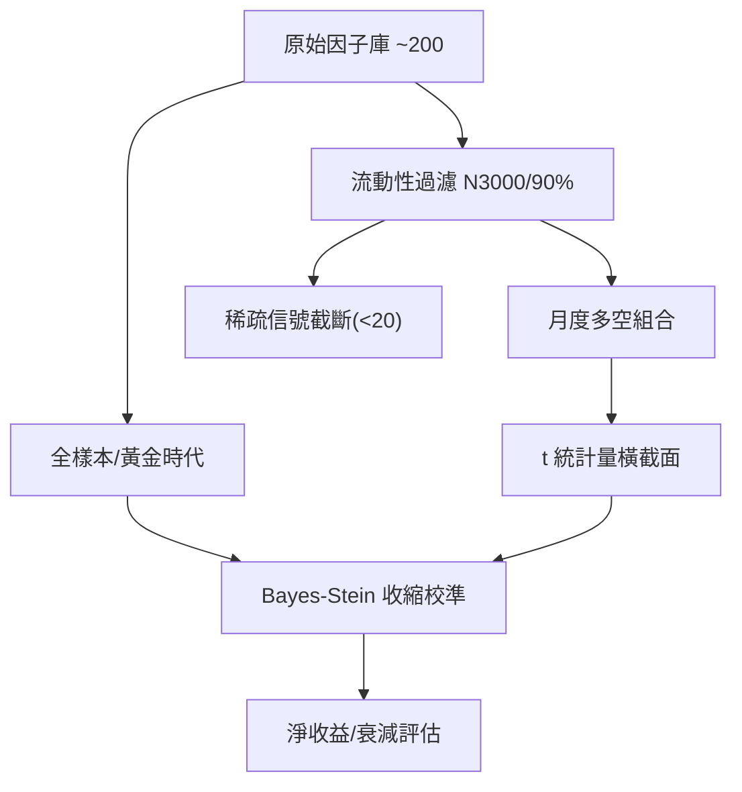

<!-- ontology-5axis data=量价表格 horizon=中长周期 paradigm=监督回归 alpha=因子挖掘 autonomy=人机协同可解释 -->

# Bayes-Stein Shrinkage 解構（Bayes-Stein Shrinkage）

> **發布**：2026-07-08 · （無 venue）
> **QuantML 導讀**：[美联储 X UCLA ｜ 经典学术Alpha还有用吗？](https://mp.weixin.qq.com/s?__biz=Mzg2MzAwNzM0NQ==&mid=2247494230&idx=1&sn=346d79e04f29b6bbc873e0f25ef9e729&chksm=ce7d8d48f90a045e97192f4fbb0d249f73412a9fe2024df69bc65ed124edbeceab3f95e6b9f7#rd)
> **核心定位**：五軸落點於量價表格與中长周期監督回歸，透過流動性過濾與經驗貝葉斯收縮，解構學術回測與實盤執行間的 prior gap，揭示經典因子在現代市場中的真實衰減路徑。

**五軸座標**

| 數據模態 | 時間尺度 | 學習範式 | Alpha機制 | 人機協作 |
|:-:|:-:|:-:|:-:|:-:|
| `量价表格` | `中长周期` | `监督回归` | `因子挖掘` | `人机协同可解释` |

**Status:** v0.5 — 基於 QuantML 導讀 + 原論文（如有）。benchmark 細節待升 v1。
**TL;DR:** ① 針對學術因子實盤失效問題，引入 N3000/90% 流動性過濾與 Bayes-Stein Shrinkage 去噪。② 核心 trick 在於利用 t 統計量橫截面方差自動收縮純運氣信號，量化剔除微盤股溢價與幸存者偏差。③ 對因子挖掘軸★，提供了一套可證偽的「發布後衰退」評估框架，強制研究從統計顯著性轉向實盤可執行性。④ 導讀給出關鍵實證數字：2006 年後大市值宇宙中，因子中位數多空收益僅每月 7 個基點。

**X-Ray.** 本方法在五軸 Pareto 中明確放棄了「高頻/複雜模型」的內捲，轉向「數據宇宙定義」與「信號純度校準」的基礎設施層。它解了量化工程中最隱蔽的坑：學術回測的幸存者偏差與流動性錯配。預測其打不開的 envelope 在於無法處理非線性因子交互與動態擇時，僅提供靜態橫截面衰減基線。對量化讀者而言，這是一份強制重設先驗的審計報告，提醒所有因子研究必須將交易成本與宇宙過濾內生化，而非依賴事後成本扣除。

## §1 · 架構 / Core Mechanism
### 1.1 三大改動 vs 前作
| 維度 | 傳統學術回測 | 本方法架構 |
|---|---|---|
| 股票宇宙 | 全市場無差別（含微盤股） | N3000/90% 與 N1000/80% 流動性過濾 |
| 信號評估 | 依賴原始 t 值與毛收益 | 引入 Bayes-Stein Shrinkage 收縮純運氣 |
| 稀疏處理 | 忽略或強制持倉 | 成分股<20 只時多空收益記為零 |

### 1.2 ⚡ Eureka
當 t 統計量橫截面方差趨近於 1 時，收縮係數自動將所有因子收益抹平至零，實現「無信號即零收益」的實盤對齊。

### 1.3 信息流 ASCII

## §2 · 數學層
📌 **Napkin Formula**: `r_shrunk = r_initial * shrinkage_factor(t_var)` （公式細節導讀未完整披露，僅給出直覺：當 $\sigma_t^2 \approx 1$ 時收縮係數 $\to 0$，收益 $\to 0$）
**複雜度**: `O(N_factors * T_periods)` 橫截面方差計算與逐期收縮。
**直覺**: 利用經驗貝葉斯框架，將因子表現分解為「真實預測力」與「橫截面運氣」。方差越接近隨機基準，信號被收縮的比例越高，強制模型在無統計優勢時歸零。
**Loss/訓練**: 無傳統梯度訓練。屬事後評估與信號校準框架，依賴歷史月度收益與 t 統計量進行解析解收縮。

## §3 · 數據層
**資料規模/頻率/市場/時段**: 約 200 個橫截面預測因子，月度頻率，美國市場，時段劃分為 2005 年底前（黃金時代）與 2006 年起（現代市場）。
**怎麼來**: 開源數據集 openassetpricing.com，標準化代碼重構。
**樣本外與容量假設**: 導讀未披露具體樣本外劃分與容量壓力測試細節。

## §4 · 代碼層
| 欄位 | 內容 |
|---|---|
| Repo | openassetpricing.com（導讀提及） |
| Checkpoint | 未披露 |
| License | 未披露 |
| 複現難度 | 低（邏輯為解析解過濾與收縮，無深度學習依賴） |
| 數據可得性 | 中（需標準化因子庫與流動性/市值數據，開源庫已提供部分） |

## §5 · 評測 / Benchmark
| 數據集/市場 | Metric | 前SOTA | 本方法 | Δ |
|---|---|---|---|---|
| 2005 年底前 + 全股票 | 多空收益中位數 | 48 個基點 | 未披露 | 未披露 |
| 2005 年底前 + N3000-90% | 多空收益中位數 | 48 個基點 | 26 個基點 | -22 個基點 |
| 2006 年起 + 全股票 | 多空收益中位數 | 48 個基點 | 19 個基點 | -29 個基點 |
| 2006 年起 + N3000-90% | 多空收益中位數 | 48 個基點 | 7 個基點 | -41 個基點 |
| 2006 年起 + N3000-90% | CAPM alpha 中位數 | 未披露 | 9 個基點 | 未披露 |
| 2006 年起 + N3000-90% (明星因子) | 原始收益 | 66 個基點 | 6 個基點 | -60 個基點 |
| 2006 年起 + N3000-90% | 扣除成本後淨收益 | 未披露 | -1 個基點到 4 個基點 | 未披露 |

**解讀**: Δ 的斷崖式下跌（-41 個基點）並非模型過擬合，而是市場結構性效率提升與流動性約束的真實映射。Bayes-Stein 收縮進一步將明星因子從 66 個基點壓至 6 個基點，證明橫截面信號方差已收斂至純隨機基準（1.09），大部分「Alpha」實為幸存者偏差。每月 20 個基點的交易成本（基於 40% 換手率與 25 個基點半張角）構成致命最後一擊，使淨收益確定性落入負值區間。此 Δ 反映的是實盤可執行性閾值，而非預測能力缺陷。

## §6 · 失效與隱含假設
**6.1 論文自述 limitations**: 未明確披露模型本身的技術限制，主要強調學術 Alpha 在現代市場的結構性失效。
**6.2 推斷的隱含假設**: 
- **Regime 依賴**: 假設 2006 年後市場結構與套利效率恆定，未涵蓋極端流動性危機或政策干預。
- **容量/成本**: 假設半張角 25 個基點與 40% 換手率為常態，未計入滑點、借券稀缺性溢價與機構申贖摩擦。
- **數據泄漏**: 依賴開源標準化因子，可能已過濾部分原始數據清洗偏差，但歷史市值數據的存活者校正細節未披露。
- **靜態假設**: 未處理因子權重的動態漂移與宏觀狀態轉換。

## §7 · 對比 & 面試 Tip
| 同軸對手 | 關鍵差異軸 | Open? | Status |
|---|---|---|---|
| 傳統多因子模型 | 靜態權重 vs 動態收縮校準 | 開源 | 穩定 |
| ML 因子融合 | 黑盒非線性 vs 白盒貝葉斯先驗 | 閉源/部分開源 | 快速迭代 |
| 交易成本模型 | 事後扣除 vs 事前宇宙過濾 | 閉源 | 成熟 |

🎤 **Interview Tip**: 
- **正確答**: 本方法不生產 Alpha，而是提供一套「Alpha 審計協議」，透過流動性過濾與橫截面方差收縮，區分真實預測力與幸存者偏差。
- **錯答**: 認為該方法能直接生成可交易因子，或誤將收縮後的零收益歸咎於模型欠擬合。

**7.1 可證偽預測帶日期**: 若 2027-07-08 前，機構資金規模未進一步擠壓微盤股溢價，或市場電子化套利效率未提升，則 N3000-90% 宇宙中的因子中位數收益應維持在 7 個基點附近，不會出現結構性反彈。

## §8 · For the Reader
- **因子研究員**: 停止追求 t 值爆表的全市場回測，將 N3000/90% 過濾與 Bayes-Stein 收縮納入因子開發流水線，作為上線前的必過閾值。
- **組合配置/風控**: 將每月 20 個基點的交易成本與 40% 換手率內生化為組合優化約束，而非事後扣除項。
- **研究學生**: 理解「發布後衰退」的數學本質是橫截面信號方差收斂至 1，學術創新應轉向動態擇時與非線性交互，而非靜態多空構建。

## References
- Andrew Y. Chen & Ivo Welch, "What Useful Alphas?", 2026.
- openassetpricing.com (Open Source Asset Pricing Database)
- QuantML 導讀: [美联储 X UCLA ｜ 经典学术Alpha还有用吗？](https://mp.weixin.qq.com/s?__biz=Mzg2MzAwNzM0NQ==&mid=2247494230&idx=1&sn=346d79e04f29b6bbc873e0f25ef9e729&chksm=ce7d8d48f90a045e97192f4fbb0d249f73412a9fe2024df69bc65ed124edbeceab3f95e6b9f7#rd)