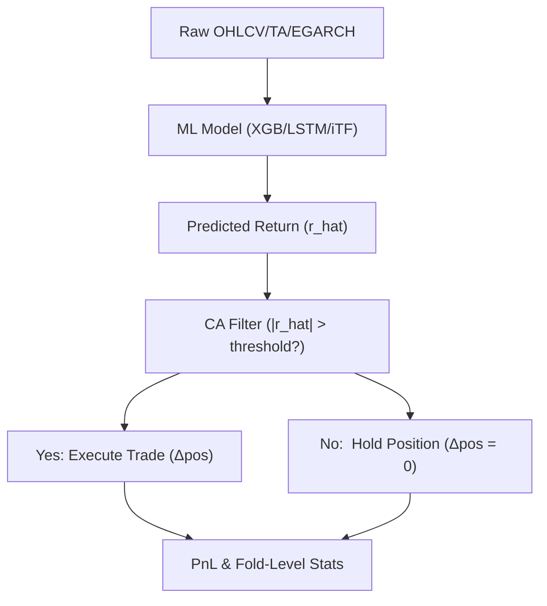

<!-- ontology-5axis data=量价表格 horizon=高频日内 paradigm=监督回归 alpha=组合执行优化 autonomy=人机协同可解释 -->

# Cost-Aware Execution Filter 解構

> **發布**：2026-05-31 · （無 venue）
> **QuantML 導讀**：[从年化 129% 到巨亏 -83.9% 仅需 10bps 成本？](https://mp.weixin.qq.com/s?__biz=Mzg2MzAwNzM0NQ==&mid=2247493963&idx=1&sn=9e239a51619ce3ed480a3c9b71d18894&chksm=ce7d8e55f90a07434f83e370e9208c2c3be0ac1d2cfcb28d927375c119a05b3676cb7020d5a0#rd)
> **原始論文**：[Machine Learning-Based Bitcoin Trading Under Transaction Costs: Evidence From Walk-Forward Forecasting](https://doi.org/10.2139/ssrn.6795938)（2026 · 被引 0 · Crossref）
> **核心定位**：落點於「組合執行優化」與「監督回歸」的交叉軸，解決了高頻預測中「統計誤差最小化」與「實盤淨值最大化」的 Prediction-to-Trading Gap。將優化重心從預測端架構複雜度後移至執行端摩擦覆蓋邏輯。

**五軸座標**

| 數據模態 | 時間尺度 | 學習範式 | Alpha機制 | 人機協作 |
|:-:|:-:|:-:|:-:|:-:|
| `量价表格` | `高频日内` | `监督回归` | `组合执行优化` | `人机协同可解释` |

**Status:** v0.5 — 基於 QuantML 導讀 + 原論文（如有）。benchmark 細節待升 v1。
**TL;DR:** ① 提出成本感知執行過濾器（CA），將預測信號轉化為交易決策的觸發條件從「符號判斷」升級為「幅度覆蓋摩擦成本」。② 核心 trick 是動態閾值過濾：僅當 `|預測收益| > 成本係數 × 調倉幅度` 時才執行，否則維持原倉位。③ 對「組合執行優化」軸而言，它證明執行端紀律的邊際貢獻遠超預測端架構複雜度。④ 關鍵實證：引入 CA 後，XGBoost 做多策略交易次數從 10,619 次銳減至 251 次，年化收益率從 -64.00% 修復至 65.40%。

**X-Ray.** 該方法本質是將「預測模型」降維為「信號生成器」，將優化重心後移至執行層。它解決了傳統 ML 策略在短週期高摩擦資產中因微弱信號頻繁翻轉導致的「換手率自殺」問題。但 envelope 受限於 BTC 的趨勢共振特性：27 個測試折中僅 14 個 Sharpe 為正，中位數年化僅 7.98%，標準差高達 866.66%，顯示策略高度依賴少數極端行情。對量化讀者的意義在於：在實盤驗證前，必須將「交易成本覆蓋閾值」與「非錨定 WFO 的折級分佈」納入核心評測儀表板，而非盲目追逐測試集 MSE 的微小下降。執行過濾器的引入實質是將策略的 Pareto 前沿從「高換手-高毛收益」強制拉回「低換手-高淨收益」的可行域。

## §1 · 架構 / Core Mechanism
### 1.1 三大改動 vs 前作
| 維度 | 前作 / Naive 執行 | 本法 (CA Filter) | 改動本質 |
|---|---|---|---|
| 執行觸發邏輯 | `sign(pred)` 決定多空/平倉 | `|pred| > k * c * |Δpos|` 才觸發 | 將摩擦成本內生化為執行閾值 |
| 回測驗證框架 | 單次劃分或錨定窗口 | 27 折非錨定滑動窗口 (12M/3M/3M) | 強制跨 Regime 壓力測試，阻斷時間泄漏 |
| 特徵工程策略 | 固定指標池或全量輸入 | 動態分組篩選 (Spearman 秩相關選每類 1 個) | 抑制特徵共線性與過擬合，提升時變穩健性 |

### 1.2 ⚡ Eureka
**Trick:** 交易決策不依賴「方向對錯」，而依賴「信號強度是否足以支付摩擦成本」。
**直覺:** 過濾掉 0 軸附近的雜訊翻轉，用空間換時間，讓策略在震盪市「裝死」，在趨勢市「重拳出擊」。執行層紀律直接切斷了微弱信號對淨值的慢性失血。

### 1.3 信息流


## §2 · 數學層
📌 **Napkin Formula:**
```
Execute if |r_hat_t| > k * c * |w_t - w_{t-1}|
Else: w_t = w_{t-1}
```
`k=2.0`, `c=10 bps`。過濾邏輯複雜度 `O(1)`，不增加模型推理負擔。
**直覺:** 調倉幅度越大（如多空反轉需跨越 2 個單位），要求預測收益的覆蓋倍數越高。這在數學上等价於對預測分佈施加了一個以 0 為中心的死區（Dead-zone），直接截斷低信噪比信號。
**Loss/訓練細節:** XGBoost 預設 MSE，對比 MAE；LSTM/iTransformer 採用標準回歸 Loss。訓練採用 12 個月窗口配合早停，每折結束後使用「訓練集+驗證集」合併數據重新訓練。

## §3 · 數據層
**資料規模/頻率/市場/時段:** BTC/USDT 期貨小時級數據。總計約 70,000 小時，覆蓋 2018 年 1 月至 2026 年 1 月。
**來源:** 導讀提及 Binance 永續合約等交易所數據。
**樣本外與容量假設:** 採用 27 折非錨定 WFO，每次滑動 3 個月。小時級頻率與極低交易次數（中位數 4.0 次/季）暗示單策略容量壓力極小，但未驗證多資產組合或更高頻下的滑點動態變化。

## §4 · 代碼層
| Repo | Checkpoint | License | 複現難度 | 數據可得性 |
|---|---|---|---|---|
| TBD | TBD | TBD | 中（需自行實現 WFO 循環與動態 TA 篩選邏輯） | 高（Binance 歷史 K 線公開） |

## §5 · 評測 / Benchmark
| 數據集/市場 | Metric | 前SOTA/基線 | 本方法(CA) | Δ |
|---|---|---|---|---|
| BTC/USDT 小時級 | ARC (LO) | XGBoost Naive: -64.00% | XGBoost LO CA: 65.40% | 129.40pp |
| BTC/USDT 小時級 | ARC (LO) | iTransformer Naive: -83.93% | iTransformer LO CA: 34.87% | 118.80pp |
| BTC/USDT 小時級 | Sharpe (LO) | Buy & Hold: 0.82 | XGBoost LO CA: 1.09 | 0.27 |
| BTC/USDT 小時級 | Trades (LO) | XGBoost Naive: 10,619 次 | XGBoost LO CA: 251 次 | -10,368 次 |

**解讀:** Δ 的修復主要來自換手率斷崖式下降（-10,368 次），而非預測精度提升。Sharpe 提升 0.27 但 Holm 調整後 p 值 0.89，置信區間包含 0，說明描述性領先缺乏統計顯著性。過擬合風險低（WFO 嚴格），成本已明確計入 10 bps。真正的 capability 在於執行過濾的魯棒性，而非模型本身。收益分佈極端不均，單一路徑回測的高收益在寬幅置信區間面前往往只是特定牛市區間的貝塔共振。

## §6 · 失效與隱含假設
### 6.1 論文自述 limitations
統計檢驗無法拒絕與 Buy & Hold 無差異的零假設；收益分佈極端不均，高度依賴少數牛市區間；低交易次數導致部分折樣本不足（<20 次），喪失實盤評估意義。

### 6.2 推斷的隱含假設
**Regime 依賴:** 極強。僅在趨勢共振時開倉，震盪市長期處於「裝死」或微虧狀態。
**容量/成本:** 固定 10 bps 假設對高頻過高，未測試滑點動態變化；單資產未驗證組合相關性風險。
**數據泄漏/Survivorship:** 非錨定 WFO 有效阻斷時間泄漏；涵蓋 2018-2026 全週期無生存偏差。

## §7 · 對比 & 面試 Tip
| 同軸對手 | 關鍵差異軸 | Open? | Status |
|---|---|---|---|
| Naive ML Trading | 執行觸發邏輯（符號 vs 幅度覆蓋成本） | 閉源 | 學術基線 |
| Standard WFO | 窗口劃分（錨定 vs 非錨定滑動） | 閉源 | 學術基線 |

🎤 **Interview Tip**
**正確答:** 「CA 過濾器本質是將交易成本內生化為執行閾值，用換手率下降換取淨值修復，其統計顯著性需經塊引導檢驗確認。」
**錯答:** 「只要模型預測準確率夠高，就能覆蓋交易成本，不需要額外過濾器。」

### 7.1 可證偽預測
若 2026-06-30 前 BTC 進入長期低波動震盪市（小時級波動率持續偏低），該策略季度交易次數將持續低於 10 次，且 Sharpe 無法維持正區間。

## §8 · For the Reader
- **因子研究員:** 將 CA 邏輯視為「信號質量閾值」，可移植至多因子打分後的倉位控制層，替代靜態閾值。
- **高頻執行:** 10 bps 成本假設對高頻過高，需將 `k` 參數動態化以適配真實盤口深度與滑點模型。
- **組合配置:** 警惕單一路徑回測的「幸存者偏差」，必須檢視折級分佈中位數與標準差，而非僅看年化均值。
- **LLM-agent/RL 策略:** CA 可作為 RL 的 reward shaping 項或 Agent 的 guardrail，避免策略在摩擦成本上過度探索。

## References
- 原論文: 《Machine Learning-Based Bitcoin Trading Under Transaction Costs: Evidence From Walk-Forward Forecasting》
- Lineage: Naive ML Trading → Walk-Forward Optimization → Cost-Aware Execution Filtering
- QuantML 導讀鏈接: [从年化 129% 到巨亏 -83.9% 仅需 10bps 成本？](https://mp.weixin.qq.com/s?__biz=Mzg2MzAwNzM0NQ==&mid=2247493963&idx=1&sn=9e239a51619ce3ed480a3c9b71d18894&chksm=ce7d8e55f90a07434f83e370e9208c2c3be0ac1d2cfcb28d927375c119a05b3676cb7020d5a0#rd)