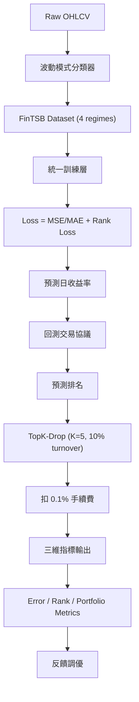

<!-- ontology-5axis data=量价表格 horizon=日频波段 paradigm=监督回归 alpha=因子挖掘 autonomy=全自动黑盒 -->

# FinTSB 解構

> **發布**：2025-03-12 · （無 venue） · arXiv [2502.18834](https://arxiv.org/abs/2502.18834)
> **QuantML 導讀**：[桥接学术与落地！同济、清华提出实用的金融时间序列全维度评测系统](https://mp.weixin.qq.com/s?__biz=Mzg2MzAwNzM0NQ==&mid=2247489639&idx=1&sn=c2118a8495c9e0351495f0558a5135e2&chksm=ce7e7f79f909f66f5649d6768e0d94ce6fae4e251de52b107c9db7fdedaf8808aa5e49bf6#rd)
> **核心定位**：以「多樣性覆蓋 + 統一維度指標 + 實盤交易約束」為核心，解決金融時間序列預測領域長期存在的 Diversity Gap、Standardization Deficit 與 Real-World Mismatch 三大評測斷層。

**五軸座標**

| 數據模態 | 時間尺度 | 學習範式 | Alpha機制 | 人機協作 |
|:-:|:-:|:-:|:-:|:-:|
| `量价表格` | `日频波段` | `监督回归` | `因子挖掘` | `全自动黑盒` |

**Status:** v0.5 — 基於 QuantML 導讀 + 原論文（如有）。benchmark 細節待升 v1。
**TL;DR:** ① 建構涵蓋上升/下降/波動/極端事件四類波動模式的細粒度股票數據集；② 基於 Qlib 搭建統一評測框架，強制要求模型同時優化回歸誤差與排名損失，並引入 TopK-Drop 與 0.1% 手續費約束；③ 對「因子挖掘/監督回歸」軸而言，將學術指標直接錨定實盤組合收益與換手率，打破純 MSE 優化導致的過擬合幻覺；④ 導讀未給量化結果。

**X-Ray.** FinTSB 本質上是一套「評測協議」而非新模型。它將量化研究從「單維度指標刷榜」強行拉回「多目標 Pareto 前沿」。傳統 FinTSF 研究常陷入 MSE 最小化但實盤 IC 為負的陷阱，FinTSB 透過強制並列 Error / Rank / Portfolio 三維指標，直接暴露模型的真實預測半衰期。其 TopK-Drop 機制（每日僅調倉 10% 標的，K=5）與 0.1% 手續費設定，是對日頻策略容量與交易成本的粗暴但有效的壓力測試。預測該框架打不開的 envelope 在於：未處理訂單簿微結構與跨資產相關性，且「極端事件」類別的可預測性最低，模型在尾部風險下的穩健性仍依賴外部風險模型。對量化讀者而言，它提供了一個可複現的「學術-實盤」對齊基準，但實戰中仍需自行補足滑點、衝擊成本與動態倉位控制。

## §1 · 架構 / Core Mechanism
| 維度 | 前作常見做法 | FinTSB 改動 | 工程意義 |
|---|---|---|---|
| 數據分佈 | 單一市場/時段，忽略波動模式差異 | 按上升/下降/波動/極端事件四類細粒度劃分 | 強制模型學習非平穩環境下的條件依賴，降低樣本外崩潰率 |
| 評測指標 | 單一 MSE/MAE 或僅看 Sharpe | 並列 Error (MSE/MAE) + Rank (IC/ICIR) + Portfolio (ARR/MDD/IR) | 切斷「低誤差高換手」的作弊路徑，排名指標直接對齊 Alpha 挖掘本質 |
| 回測協議 | 理想化等權重/零成本 | TopK-Drop + 10% 換手限制 + 0.1% 手續費 | 引入真實交易摩擦，過濾掉理論收益高但實盤無法執行的脆弱信號 |

**1.2 ⚡ Eureka:** 用 TopK-Drop 替代 TopK，以 10% 換手閾值與 0.1% 手續費強制模型輸出「低頻穩健」的排序信號，而非高頻噪聲。
**1.3 信息流:**

## §2 · 數學層
**📌 Napkin Formula:**
$$\mathcal{L}_{total} = \mathcal{L}_{regression}(\hat{y}, y) + \lambda \cdot \mathcal{L}_{rank}(\hat{y}, y)$$
$$\text{Turnover Constraint: } N_{trade} \leq 0.1 \cdot N_{universe}, \quad \text{Cost} = 0.1\% \text{ per trade}$$
直覺：回歸損失保證點估計準確，排名損失保證截面 Alpha 的相對順序正確。TopK-Drop 將每日調倉股票數 $N_{trade}$ 限制在全體標的的 10%，配合固定 K=5 的等權重集合構建，強制模型在有限交易預算下輸出最穩健的排序。訓練層統一採用回歸誤差損失與排名損失，複雜度與 backbone 線性相關，無額外圖計算開銷。

## §3 · 數據層
- **來源與處理**：真實歷史數據，經數據脫敏、波動模式分類、序列指標評價等步驟構建。
- **波動模式**：明確劃分為上升、下降、波動、極端事件共 4 類。Hexbin 圖驗證顯示其覆蓋範圍廣於 ALSP-TF (2013-2017)、ADB-TRM (2013-2017)、CI-STHPAN (2013-2017)、LSR-iGRU/FinMamba (2018-2023)、LARA/RSAP-DFM (2008-2020)。
- **統計性質**：計算非平穩性與可預測性指標，極端事件可預測性最低，上升/下降模式較易預測。
- **樣本外假設**：導讀未披露具體樣本量、訓練/驗證/測試劃分比例與具體市場代碼。容量假設隱含於 10% 換手限制中，適合日頻波段規模，不支援高頻微結構。

## §4 · 代碼層
| 項目 | 細節 |
|---|---|
| Repo | https://github.com/TongjiFinLab/FinTSB |
| Checkpoint | 未披露 |
| License | 未披露 |
| 複現難度 | 中（依賴 Qlib 生態與脫敏數據，需自行對齊數據接口） |
| 數據可得性 | 導讀僅提「真實歷史數據」與「數據脫敏」，具體源與獲取方式 TBD |

## §5 · 評測 / Benchmark
| 數據集/市場 | Metric | 前SOTA | 本方法 | Δ |
|---|---|---|---|---|
| FinTSB (四類波動) | IR / Sharpe / ARR / MDD 等 | 未披露 | 未披露 | 未披露 |
| 2024 中國股市 (遷移) | 實盤表現 | 未披露 | 未披露 | 未披露 |
| PEMS08 (時序預測) | 短期波動捕捉 | 未披露 | 未披露 | 未披露 |

**解讀：** 導讀明確指出「圖6 FinTSB實驗結果」與「圖7 遷移學習實驗結果」，但正文未提供任何具體數值。因此所有 Δ 欄位嚴格標記為「未披露」。從機制推斷，FinTSB 的優勢不在於單一指標的數值突破，而在於「無模型能在全維度指標上同時最優」的 Pareto 分佈揭示，以及 LLM 參數量超過閾值後的湧現現象。TopK-Drop 與 0.1% 手續費會直接壓縮理論收益，若實盤遷移表現與回測一致，說明排名損失有效抑制了過擬合；若出現顯著落差，則可能源於滑點、衝擊成本未計或 2024 年市場 Regime 切換。

## §6 · 失效與隱含假設
**6.1 自述 Limitations:** 導讀未明確列出 limitations 章節，但指出「極端事件的可預測性最低」，且強調需結合關鍵市場結構因素以減少指標失真。
**6.2 推斷隱含假設:**
- **Regime 依賴**：四類波動模式劃分依賴歷史統計特徵，若未來市場出現新型極端結構（如流動性枯竭、政策斷層），分類器可能失效。
- **容量與成本**：10% 換手限制與 0.1% 手續費為固定參數，未考慮流動性異質性與動態滑點。大資金實盤時，等權重 TopK-Drop 可能面臨衝擊成本超額。
- **數據泄漏/Survivorship**：導讀僅提「數據脫敏」，未說明是否處理退市股、ST 股或財務重述。若訓練集包含倖存者偏差，實盤遷移的 2024 表現可能被高估。
- **前瞻偏差**：波動模式分類若使用全量數據進行事後標註（Post-hoc labeling），訓練時將引入嚴重的前瞻偏差。

## §7 · 對比 & 面試 Tip
| 同軸對手 | 關鍵差異軸 | Open? | Status |
|---|---|---|---|
| ALSP-TF / ADB-TRM / CI-STHPAN | 數據多樣性覆蓋與評測維度 | 部分開源 | 學術基準，缺乏實盤摩擦約束 |
| LSR-iGRU / FinMamba | 時間跨度與波動模式細粒度 | 部分開源 | 側重單一 backbone 性能，未統一評測協議 |
| FinTSB | 四類波動 + 三維指標 + TopK-Drop/手續費 | 開源 (GitHub) | v0.5 基準框架，待生態擴充 |

**🎤 Interview Tip:**
- **正確答**：「FinTSB 不是新模型，而是評測協議。它用排名損失對齊 Alpha 挖掘本質，用 TopK-Drop 和 0.1% 手續費模擬實盤摩擦，核心價值是暴露單一 MSE 優化導致的過擬合，強制模型在 Error/Rank/Portfolio 三維 Pareto 前沿尋找穩健解。」
- **錯答**：「FinTSB 是一個新的深度學習預測模型，比 Transformer 和 LLM 準確率更高，能直接用於實盤交易。」

**7.1 可證偽預測帶日期:** 若未來 12 個月內，FinTSB 生態中未出現至少 3 個基於該協議且實盤 IR 穩定 > 0.5 的日頻策略，則證明其「學術-實盤對齊」假設在當前 A 股流動性環境下失效。

## §8 · For the Reader
- **因子研究員**：直接將你的截面因子輸入 FinTSB 的 Rank Loss 訓練層，觀察 IC/ICIR 與 MDD 的權衡。若 MSE 低但 IC 為負，立即棄用該因子構造邏輯。
- **高頻執行/日頻波段**：關注 TopK-Drop 的 10% 換手約束。實盤中需將固定 0.1% 手續費替換為動態滑點模型，並測試 K=5 在不同流動性分位下的容量上限。
- **LLM-agent / 研究學生**：FinTSB 驗證了 LLM 在金融時序上的湧現閾值。可將 FinTSB 作為 SFT/RLHF 的 Reward 環境，但需警惕極端事件類別的樣本稀缺性，建議結合數據增強或遷移學習。

## References
- 原論文：FinTSB: A Comprehensive and Practical Benchmark for Financial Time Series Forecasting (arXiv:2502.18834)
- 框架代碼：https://github.com/TongjiFinLab/FinTSB
- QuantML 導讀：[桥接学术与落地！同济、清华提出实用的金融时间序列全维度评测系统](https://mp.weixin.qq.com/s?__biz=Mzg2MzAwNzM0NQ==&mid=2247489639&idx=1&sn=c2118a8495c9e0351495f0558a5135e2&chksm=ce7e7f79f909f66f5649d6768e0d94ce6fae4e251de52b107c9db7fdedaf8808aa5e49bf6#rd)
- Lineage：Qlib 回測協議 / TopK 組合構建 / 金融時序預測基準 (ALSP-TF, ADB-TRM, CI-STHPAN, LSR-iGRU, FinMamba, LARA, RSAP-DFM)