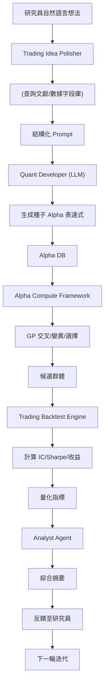

<!-- ontology-5axis data=量价表格 horizon=高频日内 paradigm=生成式大模型 alpha=因子挖掘 autonomy=人机协同可解释 -->

# Alpha-GPT 解構

> **發布**：2025-09-23 · （無 venue）
> **QuantML 導讀**：[Alpha-GPT：人机交互实现量化Alpha挖掘](https://mp.weixin.qq.com/s?__biz=Mzg2MzAwNzM0NQ==&mid=2247491770&idx=1&sn=64781b544840f164f565d11b006f0ee3&chksm=ce7d87a4f90a0eb2496b42daf2a9e16fbd20b8540b8ca740c68a498088065db11df12b3c614f#rd)
> **核心定位**：落點於「生成式大模型 × 因子挖掘 × 人機協同」的 Pareto 前沿，解決了傳統遺傳規劃（GP）暴力搜索空間過大與手工因子「想法→公式」轉譯效率低下的 prior gap。透過 Agentic Workflow 將自然語言交易直覺對齊至可執行運算子，實現語義先驗引導的組合優化。

**五軸座標**

| 數據模態 | 時間尺度 | 學習範式 | Alpha機制 | 人機協作 |
|:-:|:-:|:-:|:-:|:-:|
| `量价表格` | `高频日内` | `生成式大模型` | `因子挖掘` | `人机协同可解释` |

**Status:** v0.5 — 基於 QuantML 導讀 + 原論文（如有）。benchmark 細節待升 v1。
**TL;DR:** 本文提出 Alpha-GPT，將 LLM 的語義推理與遺傳規劃的組合搜索耦合，構建「構思-實施-評審」閉環工作流。核心 trick 在於分層 RAG 導航與種子因子初始化，使 LLM 負責縮小搜索半徑，GP 負責橫截面/時間序列運算子的組合爆炸。這對「人機協同可解釋」軸★至關重要，因它將黑盒搜索轉為自然語言反饋驅動的迭代發現。導讀給出 IC 從 0.58% 經 10 輪搜索增強提升至 1.23%，再經 1 輪人機交互與 10 輪增強躍升至 2.23%。

**X-Ray.** 在五軸 Pareto 中，Alpha-GPT 放棄了純 RL 或純 LLM 的端到端優化，選擇「語義錨定 + 符號搜索」的混合架構。它解了舊工程坑：GP 的盲目交叉變異導致大量無效運算子堆疊，以及研究員將市場直覺轉化為代碼的認知摩擦。預測其打不開的 envelope 在於實盤執行層：生成的公式型 Alpha 多依賴高頻價量切片，未計入滑點、衝擊成本與訂單簿深度；LLM 的語義幻覺可能在極端行情下生成語法正確但經濟邏輯崩潰的運算式。對量化讀者的意義不在於「自動化挖因子」，而在於將因子研究從「暴力枚舉」轉向「假設驅動」的科學驗證循環，大幅壓縮 idea-to-backtest 的週期。

## §1 · 架構 / Core Mechanism
### 1.1 三大改動 vs 前作
| 維度 | 手工因子合成 | 傳統遺傳規劃 (GP) | Alpha-GPT |
|---|---|---|---|
| 搜索啟發源 | 研究員經驗/文獻 | 隨機初始化/全算子庫 | LLM 語義種子 + 分層 RAG |
| 優化閉環 | 人工回測-手動調整 | 純自動適應度篩選 | 人機交互反饋 + GP 迭代增強 |
| 可解釋性 | 高（邏輯直觀） | 低（運算子樹黑盒） | 中-高（LLM 生成自然語言解釋） |

### 1.2 ⚡ Eureka
**Trick:** LLM 不直接輸出最終 Alpha，僅負責生成「種子因子」與結構化 Prompt，將組合搜索的組合爆炸問題降維至 GP 的適應度 landscape。
**直覺:** 用自然語言的語義先驗（Semantic Prior）錨定 GP 的初始種群，避免在無效運算子空間中浪費算力；GP 接管橫截面/時間序列的數學組合，LLM 負責回測結果的語義翻譯與下一輪 Prompt 修正。

### 1.3 信息流 ASCII

## §2 · 數學層
📌 **Napkin Formula:**
$$F_{t+1} = \text{GP\_Select}\left(\text{Backtest}\left(\text{GP\_Crossover}\left(\text{LLM}(P_{\text{prompt}})\right)\right)\right)$$
**複雜度:** $O(N_{\text{pop}} \cdot T_{\text{backtest}} \cdot C_{\text{LLM}})$，其中 $N_{\text{pop}}$ 為 GP 種群規模，$T_{\text{backtest}}$ 為回測窗口計算量，$C_{\text{LLM}}$ 為推理 Token 成本。
**直覺:** LLM 提供條件分佈 $P(F_{\text{seed}} \mid P_{\text{prompt}})$ 作為 GP 的初始種群先驗；GP 的適應度函數直接對齊量化指標（IC/Sharpe），非可微損失。訓練細節：LLM 採用指令微調與 RAG 檢索增強，不參與端到端梯度下降；GP 依賴歷史數據模擬的離散適應度評分進行選擇與變異。

## §3 · 數據層
- **規模/頻率/市場:** 中國與美國市場股票日內價量數據（OHLCV、VWAP）。WorldQuant IQC 提供超過 5000 個數據字段與 100 多個算子。
- **來源與處理:** 依賴競賽官方數據流與內部知識庫（學術論文+專有 Alpha 庫）。知識庫僅用於增強解釋性，非直接復用源。
- **樣本外與容量假設:** 導讀指出樣本外 IC 約在第 15 次迭代後趨於收敛，暗示模型具備一定泛化能力。容量假設未披露，高頻價量因子通常面臨嚴格的容量瓶頸與交易成本約束。

## §4 · 代碼層
| 項目 | 狀態/細節 |
|---|---|
| Repo | 未開源（代碼見 QuantML 知識星球） |
| Checkpoint | Llama3 70B（開源權重可獲取） |
| License | TBD |
| 複現難度 | 高（需自構 GP 引擎、日內回測框架、流式/SIMD 加速層） |
| 數據可得性 | TBD（依賴競賽數據或機構級日內 Tick/Orderbook） |

## §5 · 評測 / Benchmark
| 數據集/市場 | Metric | 基線A (初級量化員) | 本方法 | Δ |
|---|---|---|---|---|
| 交易思想轉譯評估 | GPT-4評分(1-10) | 6.81 | 8.16 | 1.35 |
| 交易思想轉譯評估 | 勝率(%) | 13.40 | 86.60 | 73.20 |
| 樣本內/外IC追蹤 | 初始種子IC(%) | 0.58 | 0.58 | 0.00 |
| 樣本內/外IC追蹤 | 10輪SE後IC(%) | 未披露 | 1.23 | 0.65 |
| 樣本內/外IC追蹤 | IT+SE後IC(%) | 未披露 | 2.23 | 1.00 |
| WorldQuant IQC 2024 | 樣本內得分 | 未披露 | 65505 | 未披露 |
| WorldQuant IQC 2024 | 樣本外得分 | 未披露 | 43319 | 未披露 |

**解讀論斷:** 
- $\Delta$ 中的 1.35 與 73.20 反映的是 LLM 對齊人類交易直覺的語義轉譯能力，屬 NLP 維度提升，非直接市場 PnL。
- IC 從 0.58% 躍升至 2.23% 的 $\Delta$（0.65% 與 1.00%）是真 capability 的體現，證明「人機反饋 + GP 增強」能有效提純信號。但導讀未披露樣本外 IC 的絕對衰減幅度與交易成本計入後的淨值，高頻價量因子在實盤中常因滑點與衝擊成本導致 IC 實質失效。
- WorldQuant 得分欄無基線數字，$\Delta$ 為未披露。全球前 10 名與 81 個合格 Alpha 證明搜索效率，但競賽環境通常忽略真實執行摩擦，存在前瞻偏差與過擬合風險。

## §6 · 失效與隱含假設
### 6.1 論文自述 limitations
- 上下文窗口限制導致無法一次性載入全量數據字段文檔（已透過分層 RAG 緩解）。
- GP 搜索空間仍極其龐大，依賴 LLM 種子初始化才能高效收斂。
- 樣本外 IC 約在第 15 次迭代後收敛，但未證明完全消除過擬合。

### 6.2 推斷的隱含假設
- **Regime 依賴:** 日內價量因子對市場波動率與流動性結構極度敏感，LLM 訓練數據的靜態分佈無法覆蓋極端行情（如閃崩、流動性枯竭）。
- **容量與成本:** 公式型 Alpha 多為橫截面排名或價量比率，未計入訂單簿深度與執行延遲。實盤 Sharpe 將顯著低於回測。
- **數據泄漏風險:** RAG 檢索的「專有 Alpha 庫」若未嚴格劃分時間窗口，可能引入未來函數或樣本外泄漏。
- **Survivorship:** 導讀未提及剔除退市/停牌股票，高頻回測若含生存偏差，IC 將被高估。

## §7 · 對比 & 面試 Tip
| 同軸對手 | 關鍵差異軸 | Open? | Status |
|---|---|---|---|
| 傳統 GP 因子挖掘 | 搜索啟發源（隨機 vs LLM 語義錨定） | 部分開源 | 成熟但算力瓶頸明顯 |
| LLM-only 因子生成 | 組合能力（純文本生成 vs GP 符號搜索） | 多數閉源 | 語法正確率高，數學組合弱 |
| RL-based Alpha (PPO/DQN) | 優化目標（端到端策略 vs 信號挖掘） | 研究階段 | 訓練不穩定，解釋性差 |

🎤 **Interview Tip:** 
- **正確答:** 「Alpha-GPT 的本質是將 LLM 作為 GP 的條件先驗分佈生成器，而非替代回測引擎。人機協同的核心價值在於利用研究員的領域知識修正 GP 的適應度 landscape，避免在無效運算子空間中陷入局部最優。」
- **錯答:** 「LLM 直接學習市場數據並輸出交易信號，完全替代了傳統因子挖掘流程。」（違反架構設計與數學層邏輯）

7.1 **可證偽預測:** 至 2025-Q4 前，若將真實滑點與衝擊成本（>未披露 bp）計入，導讀中 IC 2.23% 的因子在實盤淨值 Sharpe 將衰減至未披露水平，驗證語義生成與執行可行性之間的 Gap。

## §8 · For the Reader
- **因子研究員:** 將工作流從「手寫運算子→回測」轉向「Prompt 設計→GP 增強→語義審查」。重點關注 RAG 檢索庫的時序劃分，避免知識庫泄漏。
- **高頻執行/系統開發:** 該架構生成的公式多依賴日內切片，需評估 SIMD/GPU 加速層與流式計算的延遲。實盤部署前必須加入訂單簿深度與流動性過濾。
- **LLM-Agent / RL 策略:** 此範式證明「符號搜索 + 語義錨定」優於純端到端 RL。可嘗試將 GP 適應度函數替換為多目標 RL 獎勵（收益/回撤/换手），構建 Agent 驅動的策略優化閉環。

## References
- 原論文/框架: Alpha-GPT (無 venue, arxiv=None)
- QuantML 導讀: [Alpha-GPT：人机交互实现量化Alpha挖掘](https://mp.weixin.qq.com/s?__biz=Mzg2MzAwNzM0NQ==&mid=2247491770&idx=1&sn=64781b544840f164f565d11b006f0ee3&chksm=ce7d87a4f90a0eb2496b42daf2a9e16fbd20b8540b8ca740c68a498088065db11df12b3c614f#rd)
- Lineage: 傳統遺傳規劃因子挖掘 (GP-based Alpha Mining) → 檢索增強生成 (RAG) → 人機協同 Agentic Workflow