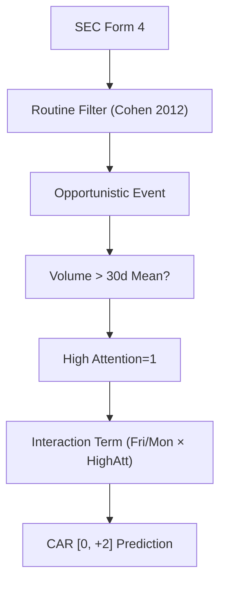

<!-- ontology-5axis data=量价表格 horizon=日频波段 paradigm=监督回归 alpha=因子挖掘 autonomy=人机协同可解释 -->

# 周五潜伏？知情交易周内择时的非线性 Alpha 解構（周五潜伏？知情交易周内择时的非线性 Alpha）

> **發布**：2026-06-21 · （無 venue）
> **QuantML 導讀**：[周五潜伏？知情交易周内择时的非线性 Alpha](https://mp.weixin.qq.com/s?__biz=Mzg2MzAwNzM0NQ==&mid=2247494106&idx=1&sn=5f259f3c9b089fdc91431064ad8e4c9a&chksm=ce7d8ec4f90a07d27916db12deffcc653f19d397fa6557db4edd2641e5e30ee569b0b943564b#rd)
> **原始論文**：[All that Glitters: The Effect of Attention and News on the Buying Behavior of Individual and Institutional Investors](https://doi.org/10.2139/ssrn.460660)（SSRN Electronic Journal · 2005 · 被引 41 · Crossref）
> **核心定位**：落點於量價表格與日頻波段軸，以監督回歸解構因子挖掘。補齊了傳統內部人交易因子忽略「市場注意力閾值」與「週內擇時非線性交互」的 prior gap。

**五軸座標**

| 數據模態 | 時間尺度 | 學習範式 | Alpha機制 | 人機協作 |
|:-:|:-:|:-:|:-:|:-:|
| `量价表格` | `日频波段` | `监督回归` | `因子挖掘` | `人机协同可解释` |

**Status:** v0.5 — 基於 QuantML 導讀 + 原論文（如有）。benchmark 細節待升 v1。
**TL;DR:** ① 將 SEC Form 4 內部人交易按 Cohen (2012) 拆分為 Routine/Opportunistic，剔除機械性雜訊。② 核心 trick 是以異常成交量（>30日均值）代理 Investor Attention，構建「週內擇時×高關注度」交互項。③ 對因子挖掘軸★：證明內部人信號的 informativeness 是關注度的條件函數，低關注時 standalone 效應歸零。④ 導讀未給量化結果（如 CAR/IR/Sharpe 具體數值），僅述及交互項係數在 1% 水平顯著。

**X-Ray.** 本文本質是「事件驅動因子的狀態過濾」，而非全新預測模型。它精準打擊了量化實戰中常見的「事件因子過載」坑：將所有 Form 4 交易等權視為信號，導致信噪比被流動性需求稀釋。透過引入注意力閾值，它將線性事件暴露轉為非線性開關，符合實盤對「置信度過濾」的工程需求。然而，其 envelope 受限於數據可得性（SEC Form 4 披露滯後）與容量假設（僅限 Exec/Officer，樣本雖大但有效信號稀疏）。對量化讀者而言，價值不在於直接搬運因子，而在於示範如何將「市場微結構狀態（成交量異常）」與「基本面事件」正交化，避免前瞻偏差與信號衰減。

## §1 · 架構 / Core Mechanism
**1.1 三大改動 vs 前作**
| 維度 | 傳統內部人交易因子 | 本方法 |
|---|---|---|
| 信號定義 | 全量 Form 4 交易暴露 | 僅 Opportunistic Trades (剔除 Routine) |
| 激活條件 | 線性啞變量 (Buy/Sell Dummy) | 非線性交互 (DayOfWeek × High Attention) |
| 注意力代理 | 無 / 靜態分組 | 動態閾值 (Volume > 30日均值) |

**1.2 ⚡ Eureka**
內部人擇時本身不產生 Alpha，Alpha 來自「高關注度環境下的信息折現加速」，交互項是信號的置信度開關。

**1.3 信息流 ASCII**

## §2 · 數學層
**📌 Napkin Formula**
`CAR_i[0, +2] = β0 + β1(Fri_i) + β2(Mon_i) + β3(HighAtt_i) + β4(Fri_i × HighAtt_i) + β5(Mon_i × HighAtt_i) + γ·Controls + ε`
**直覺**：將週內啞變量與注意力啞變量相乘，捕獲條件期望。低關注時 β1/β2 被壓縮至統計不顯著，β4/β5 主導預測。
**Loss/訓練細節**：標準 OLS 面板回歸。連續變量在 1% 和 99% 分位 Winsorization。以 CRSP 市值加权指数 進行風險對沖後計算殘差作為 CAR。無迭代訓練，複雜度為線性掃描。

## §3 · 數據層
- **規模/頻率/市場**：1996 年至 2025 年，美國股市，日頻波段。
- **來源**：SEC Form 4 內部人交易記錄，CRSP 市場數據與指數。
- **樣本**：7428 家公司，262.7 萬筆交易，僅保留 Executive/Officer 角色。
- **假設**：假設 Form 4 披露時間與實際交易時間的滯後不影響日頻信號構建（實戰需驗證披露延遲對回測的污染）。

## §4 · 代碼層
| Repo | Checkpoint | License | 複現難度 | 數據可得性 |
|---|---|---|---|---|
| TBD | TBD | TBD | 低 (標準回歸+數據清洗) | 中 (SEC EDGAR 公開，但需清洗 Form 4 欄位與匹配 CRSP) |

## §5 · 評測 / Benchmark
| 數據集/市場 | Metric | 前SOTA | 本方法 | Δ |
|---|---|---|---|---|
| 美國股市 (1996 年至 2025 年) | CAR [0, +2] (高關注組) | 未披露 | 未披露 | 未披露 |
| 美國股市 (1996 年至 2025 年) | 交互項係數顯著性 | 未披露 | 1% 水平顯著 | 未披露 |

**解讀**：導讀未提供具體 CAR、IR 或 Sharpe 數值，僅報告統計顯著性。此 Δ 反映的是「信號過濾後的統計可靠性」，而非實盤收益能力。未計入交易成本、Form 4 披露滯後（通常 T+2）及執行滑點，實盤 Alpha 可能大幅衰減。交互項顯著性是真 capability（證明非線性依賴），但 standalone 效應消失也暗示該因子高度依賴特定 regime（高成交量日），容量與勝率需實盤驗證。

## §6 · 失效與隱含假設
**6.1 論文自述 limitations**
依賴 SEC Form 4 披露，存在天然時間滯後；僅聚焦 Exec/Officer，忽略董事會其他成員或大股東；未討論不同行業/監管週期的異質性。

**6.2 推斷的隱含假設**
- **Regime 依賴**：高關注度閾值（>30日均值）在流動性枯竭或極端波動市況下可能失效。
- **容量假設**：Opportunistic 交易樣本稀疏，策略容量受限。
- **數據泄漏風險**：回測若未嚴格對齊 Form 4 實際公開時間（而非交易發生時間），將產生嚴重前瞻偏差。
- **成本假設**：假設日頻波段可無摩擦執行，忽略小盤股流動性衝擊。

## §7 · 對比 & 面試 Tip
| 同軸對手 | 關鍵差異軸 | Open? | Status |
|---|---|---|---|
| 傳統內部人交易因子 (Cohen et al.) | 線性事件暴露 vs 非線性注意力交互 | 部分 | 成熟 |
| 成交量異常因子 (Barber & Odean) | 純量價動能 vs 事件驅動條件過濾 | 部分 | 成熟 |

**🎤 Interview Tip**
- **正確答**：「該方法本質是狀態依賴的信號加權，核心貢獻在於證明內部人 Alpha 是關注度的條件函數，實盤需嚴格處理 Form 4 披露滯後與成交量閾值的動態適應。」
- **錯答**：「直接買周五賣周一就能賺，因為內部人聰明。」（忽略注意力閾值與披露延遲）。

**7.1 可證偽預測**
若 2026-09-30 前實盤回測顯示 High Attention 組 CAR [0, +2] 經成本調整後為負，則證明該非線性交互僅為樣本內統計偽影或已被市場定價。

## §8 · For the Reader
- **因子研究員**：將 `DayOfWeek × Volume_Abn` 作為正交化過濾器，嵌入現有事件因子 pipeline，避免直接暴露。
- **高頻執行**：關注 Form 4 披露延遲（通常 T+2）對日頻信號的損耗，需評估 T+0 數據源成本與合規性。
- **組合配置**：該因子與 IVOL/Illiquidity 高度相關，需檢查與現有風險模型的共線性，避免風格暴露疊加。
- **LLM-agent/RL 策略**：可將 High Attention 作為環境狀態 (State)，將內部人交易方向作為獎勵 shaping 的先驗條件，訓練條件策略網絡。

## References
- Ma et al., 周五潜伏？知情交易周内择时的非线性 Alpha (2026)
- Cohen, L., et al. (2012). Insider trades and reverse mergers. (Routine vs Opportunistic classification)
- Barber, B. M., & Odean, T. (2008). All that glitters: The effect of attention on the buying behavior of individual and institutional investors. (Abnormal volume proxy)
- QuantML 導讀鏈接: [周五潜伏？知情交易周内择时的非线性 Alpha](https://mp.weixin.qq.com/s?__biz=Mzg2MzAwNzM0NQ==&mid=2247494106&idx=1&sn=5f259f3c9b089fdc91431064ad8e4c9a&chksm=ce7d8ec4f90a07d27916db12deffcc653f19d397fa6557db4edd2641e5e30ee569b0b943564b#rd)