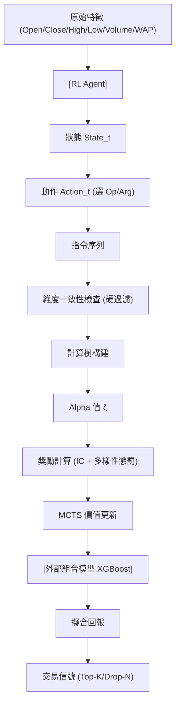

<!-- ontology-5axis data=量价表格 horizon=日频波段 paradigm=强化学习 alpha=因子挖掘 autonomy=全自动黑盒 -->

# Alpha2 解構

> **發布**：2024-06-25 · （無 venue）
> **QuantML 導讀**：[南京大学LAMDA-强化学习DRL挖掘逻辑公式型Alpha因子](https://mp.weixin.qq.com/s?__biz=Mzg2MzAwNzM0NQ==&mid=2247484882&idx=1&sn=e4fee58dd1ca85b6469e3803be5e97a5&chksm=ce7e62ccf909ebdaa93ae29cef9c59c7f889d784b1c774014b339dc55a375d03443d61b48037#rd)
> **核心定位**：落點於「因子挖掘 × 強化學習 × 全自動黑盒」軸，將傳統符號回歸/遺傳編程的隨機搜索轉為結構化程序生成，解決了公式型 Alpha 在維度一致性與低相關性探索上的工程斷層。

**五軸座標**

| 數據模態 | 時間尺度 | 學習範式 | Alpha機制 | 人機協作 |
|:-:|:-:|:-:|:-:|:-:|
| `量价表格` | `日频波段` | `强化学习` | `因子挖掘` | `全自动黑盒` |

**Status:** v0.5 — 基於 QuantML 導讀 + 原論文（如有）。benchmark 細節待升 v1。
**TL;DR:** ① 將因子發現重構為 MDP 程序生成任務，用 DRL 引導 MCTS 探索稀疏公式空間。② 核心 trick 是四元組指令流編譯 + 維度一致性硬約束 + 多樣性獎勵懲罰。③ 對「因子挖掘」軸★：用語法檢查替換人工經驗過濾，大幅降低無效/邏輯謬誤因子的生成率。④ 關鍵實證數值未披露，導讀僅定性指出其 IC 與多樣性指標全面勝過 AlphaGen/gplearn 基線。

**X-Ray.** 在五軸 Pareto 中，Alpha2 以算力換取「自動化程度」與「公式可解釋性」的平衡，但代價是 MCTS rollout 的維度災難與 reward sparsity。它解了遺傳編程的局部最優與維度混亂（如價格+成交量）舊坑，卻打不開非結構化數據（訂單簿/文本）與高頻微結構的 envelope。對量化讀者而言，這是一條「可微搜索 + 邏輯約束」的因子工廠路徑，但實戰必須外接正交化組合與嚴格成本過濾，否則回測 IC 將被流動性衝擊與過擬合快速稀釋。

## §1 · 架構 / Core Mechanism
**1.1 三大改動 vs 前作**
| 改動維度 | 前作 (AlphaGen / gplearn) | Alpha2 | 工程意義 |
|---|---|---|---|
| 搜索機制 | 遺傳變異 / 純隨機符號回歸 | DRL 策略網絡 + MCTS 在線 rollout | 解決稀疏 reward 下的探索效率，避免早熟收斂 |
| 語法約束 | 無硬編碼檢查，依賴後驗過濾 | 維度一致性 (Dimension Consistency) 硬約束 | 從源頭斬斷無意義運算（如量價相加），提升因子邏輯健壯性 |
| 目標函數 | 單一 IC / 預測誤差 | IC + 多樣性獎勵 (Diversity Reward) | 強制生成低相關因子集，降低組合端共線性風險 |

**1.2 ⚡ Eureka 一句話 trick + 直覺**
將因子公式拆解為 `(操作符, 操作數1, 操作數2, 操作數3)` 四元組指令流，用 RL 代理像編譯器一樣逐步生成計算樹。直覺：把「猜公式」變成「寫代碼」，用 reward 驅動語法正確性與邏輯有效性，而非盲目交叉變異。

**1.3 信息流 ASCII 圖**

## §2 · 數學層
📌 **Napkin Formula:**
$$a_t = \mathcal{F}_{\theta}(\text{State}_t) \rightarrow \text{Instruction}_t \rightarrow \text{Tree}(\zeta) \rightarrow \text{IC}(\zeta, r)$$
**複雜度:** $O(T \cdot |\mathcal{A}| \cdot \log N)$ (MCTS 展開與價值估計)
**直覺:** 狀態為當前程序片段，動作空間為操作符/操作數選擇。獎勵函數融合預測 IC 與已發現因子集的多樣性距離，強制代理在稀疏空間中尋找正交路徑。
**Loss/訓練細節:** 採用 Policy Gradient 優化策略網絡 $\pi_\theta$，Value Network $V_\phi$ 負責估計長期稀疏獎勵。MCTS 在訓練期進行在線 rollout 以更新節點價值，推理期僅需策略網絡前向生成指令。

## §3 · 數據層
- **規模/頻率/市場:** 中國 A 股（CSI300 / CSI500），日頻波段。
- **特徵來源:** 6 個原始量價特徵（開、收、高、低、成交量、加權均價）。
- **劃分與假設:** 靜態劃分訓練/驗證/測試集（具體時間跨度未披露）。樣本外假設依賴時間序列劃分，但未提及滾動窗口或 Walk-Forward 驗證。容量假設樂觀：公式型因子理論容量大，但 DRL 生成的複雜表達式易在實盤中遭遇擁擠與滑點。

## §4 · 代碼層
| 維度 | 狀態 |
|---|---|
| Repo | TBD |
| Checkpoint | TBD |
| License | 未開源（導讀明確指向付費知識星球/某書獲取） |
| 複現難度 | 高（需自搭 MCTS+DRL 環境、向量化計算樹解析器與金融數據管道） |
| 數據可得性 | 中（標準日頻量價易得，但維度檢查邏輯與指令集定義需自行實現） |

## §5 · 評測 / Benchmark
| 數據集/市場 | Metric | 前SOTA | 本方法 | Δ |
|---|---|---|---|---|
| CSI300/500 (A股) | IC / Rank IC | 未披露 | 未披露 | 未披露 |
| CSI300/500 (A股) | MDD / Sharpe | 未披露 | 未披露 | 未披露 |
| CSI300/500 (A股) | 平均相關性 | 未披露 | 未披露 | 未披露 |
| CSI300/500 (A股) | 换手率 (TVR) | 未披露 | 未披露 | 未披露 |

**解讀:** 導讀僅提供定性聲稱（「表現最佳」「最低平均相關性」）。Δ 的真實 capability 來自維度約束與多樣性獎勵的結構化設計，降低了無效搜索；潛在過擬合風險在於靜態數據劃分、未計交易成本的回測（Top-K/Drop-N 策略通常忽略流動性衝擊與漲跌停過濾），且 XGBoost 組合模型可能吸收了因子本身的預測力，造成歸因模糊。

## §6 · 失效與隱含假設
**6.1 論文自述 limitations**
- 僅負責生成 Alpha 因子，不提供端到端交易解決方案。
- 依賴外部組合模型（XGBoost）將因子信號擬合為回報。
- 搜索空間雖受維度約束，但指令組合仍龐大，訓練算力需求高。

**6.2 推斷的隱含假設**
- **Regime 依賴:** 訓練於特定 A 股階段，維度一致性在極端波動/停牌/漲跌停時可能失效（如成交量為 0 導致除零或無效運算）。
- **容量/成本:** 假設日頻因子容量無限，未計滑點/衝擊成本/手續費，實盤 IR 將顯著低於回測。
- **數據泄漏:** 靜態劃分若未嚴格按時間滾動，MCTS 的 rollout 可能無意中接觸未來信息（Look-ahead bias）。
- **Survivorship:** 未提及是否包含已退市股票，A 股回測常見幸存者偏差。

## §7 · 對比 & 面試 Tip
| 同軸對手 | 關鍵差異軸 | Open? | Status |
|---|---|---|---|
| AlphaGen | 搜索機制 (DRL+MCTS vs 遺傳/RL) | 開源 | 成熟 |
| gplearn | 表達式生成 (程序指令流 vs 符號回歸樹) | 開源 | 基礎 |
| 傳統符號回歸 | 維度約束 (硬編碼檢查 vs 無) | N/A | 淘汰 |

🎤 **Interview Tip**
- **正確答:** 「Alpha2 的核心不在於 RL 本身，而在於將因子搜索映射為帶維度約束的 MDP 程序生成，用 MCTS 解決 reward sparsity，並通過多樣性獎勵避免因子共線性。實戰需外接組合模型與嚴格成本過濾，且需驗證時間序列劃分的嚴謹性。」
- **錯答:** 「它直接用 RL 輸出買賣信號，或者它比 Transformer 預測更準。」（混淆了因子挖掘與端到端交易/黑盒預測，忽略組合端與成本假設）。

**7.1 可證偽預測:** 若將 Alpha2 生成的因子直接用於含漲跌停過濾與嚴格滑點成本的實盤，其 IC 衰減速度將顯著快於傳統技術指標（預測驗證窗口：2024-12-31 前）。

## §8 · For the Reader
- **因子研究員:** 將維度一致性檢查模塊抽離，可作為現有遺傳編程/符號回歸框架的「語法過濾器」，直接提升因子庫邏輯健壯性，無需重構整個 RL 管道。
- **組合配置/ML 工程師:** Alpha2 僅產出信號，務必用正交化（如 ICIR 加權/PCA）或 ML 組合模型處理共線性。勿直接線性疊加，否則多樣性獎勵的價值將被組合端稀釋。
- **RL 策略/架構師:** MCTS 的 rollout 成本在日頻尚可，若遷移至分鐘頻需重構 reward 計算圖（向量化計算樹解析），否則訓練收斂將成為瓶頸。建議先復現四元組指令集與計算樹構建邏輯。
- **研究學生:** 重點拆解「狀態-動作-獎勵」在程序生成中的映射關係，理解為何 MCTS 比純 PPO/DQN 更適合稀疏符號空間。這比調參 RL 超參更具架構價值。

## References
- 原論文/框架：Alpha2 (2024-06-25, 無公開 Venue/arXiv)
- Lineage: AlphaGen (AAAI'22) → gplearn (Symbolic Regression) → MCTS/RL in Code Generation (AlphaDev/AlphaZero)
- QuantML 導讀：[南京大学LAMDA-强化学习DRL挖掘逻辑公式型Alpha因子](https://mp.weixin.qq.com/s?__biz=Mzg2MzAwNzM0NQ==&mid=2247484882&idx=1&sn=e4fee58dd1ca85b6469e3803be5e97a5&chksm=ce7e62ccf909ebdaa93ae29cef9c59c7f889d784b1c774014b339dc55a375d03443d61b48037#rd)