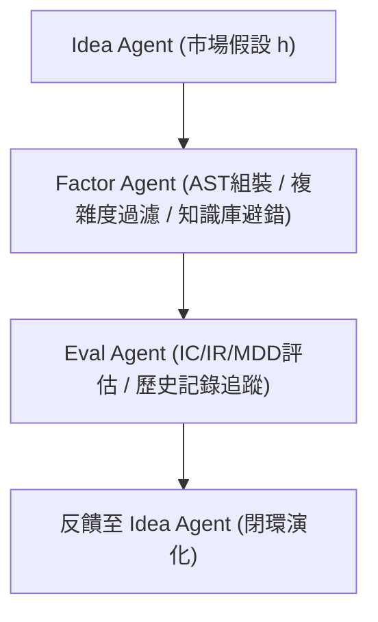

<!-- ontology-5axis data=量价表格 horizon=日频波段 paradigm=生成式大模型 alpha=因子挖掘 autonomy=Agent自主演进 -->

# AlphaAgent 解構

> **發布**：2025-08-20 · （無 venue）
> **QuantML 導讀**：[AlphaAgent：LLM如何终结Alpha衰减，挖掘持久有效的量化因子](https://mp.weixin.qq.com/s?__biz=Mzg2MzAwNzM0NQ==&mid=2247491423&idx=1&sn=cd28fd7401005a782d146b95a5bb69ce&chksm=ce7e7841f909f15766be17d859aef9e90f2c006800ba728878b99bf69e0b6094ef795ceaab94#rd)
> **核心定位**：落點於「生成式大模型 × Agent自主演進」軸，解決了傳統LLM挖因子時缺乏結構化約束導致信號同質化與Alpha快速衰减的Prior Gap。

**五軸座標**

| 數據模態 | 時間尺度 | 學習範式 | Alpha機制 | 人機協作 |
|:-:|:-:|:-:|:-:|:-:|
| `量价表格` | `日频波段` | `生成式大模型` | `因子挖掘` | `Agent自主演进` |

**Status:** v0.5 — 基於 QuantML 導讀 + 原論文（如有）。benchmark 細節待升 v1。
**TL;DR:** ① 提出LLM驅動的三智能體閉環框架，將市場假設轉化為抗衰减的因子表達式。② 核心trick是基於AST的相似度懲罰與假設語義對齊，強制探索非擁擠因子空間。③ 對「Agent自主演進」軸的關鍵意義在於將因子挖掘從靜態搜索升級為帶反饋的動態演化。④ 導讀給出CSI 500年化超額收益11.00%、IR 1.488，且IC穩定在0.02至0.025區間。

**X-Ray.** AlphaAgent在五軸Pareto前沿上，用「AST結構化約束」換取了「LLM生成自由度」的邊界收斂。它解決了舊工程坑：LLM直接寫代碼的語義-執行衝突，以及GP/RL過度擬合歷史IC的過拟合陷阱。然而，其Envelope打不開的邊界在於：AST相似度僅捕捉語法樹同構，無法識別金融經濟學意義上的「功能等價」（Functional Equivalence），且LLM評估假設對齊的本質仍是概率生成，缺乏嚴格的因果驗證。對量化讀者而言，這不是替代因子庫的銀彈，而是將「因子搜索」轉為「假設驗證-代碼生成」的自動化流水線；其價值在於降低試錯成本與規避語法擁擠，而非消除市場有效性或提升單因子預測上限。

## §1 · 架構 / Core Mechanism
**1.1 三大改動 vs 前作**
| 維度 | 傳統GP/RL | 純LLM因子生成 | AlphaAgent |
|---|---|---|---|
| 表達式構建 | 代碼/符號直接變異 | 自然語言轉代碼 | 基於算子庫O的AST組裝 |
| 約束機制 | 歷史IC/Sharpe優化 | 無結構約束 | AST相似度懲罰 + 假設語義對齊 |
| 演進路徑 | 單次搜索/靜態訓練 | 單次Prompt生成 | Idea/Factor/Eval三智能體閉環反饋 |

**1.2 ⚡ Eureka 一句話 trick**
用AST最大公共子樹大小量化「語法新奇度」，用LLM打分「假設-描述-表達式」鏈路一致性，將黑盒生成轉為可約束的符號優化。

**1.3 信息流 ASCII**


## §2 · 數學層
📌 **Napkin Formula**
```
max_f E[L(y, f(X_t))] - λ * R(f)
R(f) = α*|T(f)| + β*|params| + γ*ER(f)
ER(f) = (1 - max_{z∈Z} s(f,z)) + C(h,d,f) - δ*|features|
```
**複雜度**：AST匹配本質為NP-hard，實戰以最大公共子樹大小近似；LLM評估引入O(N_tokens) API調用開銷。
**直覺**：損失函數將預測性能與結構正則化剝離，交替優化避免梯度被複雜度懲罰淹沒。AST節點數與參數量直接懲罰過擬合，ER項強制脫離Alpha101等已知庫。
**Loss/訓練細節**：非凸交替優化，未披露具體學習率或迭代輪次，依賴LLM API調用與LightGBM次日收益率預測訓練。

## §3 · 數據層
- **規模/頻率/市場/時段**：CSI 500 & S&P 500，日頻OHLCV，2021年至2025年1月。
- **來源/處理**：Qlib框架，回測採用top-k剔除策略，並考慮交易成本。
- **樣本外與容量假設**：未披露具體樣本外劃分比例與單因子容量上限，僅提及「過去四年」持續有效。

## §4 · 代碼層
| 項目 | 狀態 |
|---|---|
| Repo | QuantML知识星球 |
| Checkpoint | GPT-3.5-turbo |
| License | TBD |
| 複現難度 | 高（依賴閉源LLM API與AST解析庫，需自構算子庫O） |
| 數據可得性 | 中（需標準OHLCV日頻數據，Qlib可獲取） |

## §5 · 評測 / Benchmark
| 數據集/市場 | Metric | 前SOTA | 本方法 | Δ |
|---|---|---|---|---|
| CSI 500 | IC | 未披露 | 0.0212 | 未披露 |
| CSI 500 | ICIR | 未披露 | 0.1938 | 未披露 |
| CSI 500 | AR (年化超額收益) | 未披露 | 11.00% | 未披露 |
| CSI 500 | MDD | 未披露 | <10% | 未披露 |
| CSI 500 | IR | 未披露 | 1.488 | 未披露 |
| S&P 500 | AR (年化超額收益) | 未披露 | 8.74% | 未披露 |
| S&P 500 | IR | 未披露 | 1.0545 | 未披露 |
| S&P 500 | MDD | 未披露 | <10% | 未披露 |

**解讀**：基線數值未披露，Δ欄留白。導讀強調的「IC穩定在0.02至0.025」與傳統因子「從0.022-0.036下降至接近零」形成對比，此為真實的抗衰减能力體現。但需注意：回測採用top-k剔除與計入交易成本，未披露具體剔除比例與滑點模型，IR與AR的優勢可能部分來自於未充分定價的流動性溢價或樣本內數據挖掘殘留；LLM評估環節的隨機性未做多次種子驗證，存在評估偏差風險。

## §6 · 失效與隱含假設
**6.1 論文自述 limitations**
未明確列出limitations段落，但隱含指出LLM直接應用缺乏約束會加劇擁擠；框架依賴人類市場假設輸入，若假設本身失效則鏈路崩潰。

**6.2 推斷的隱含假設**
- **Regime依賴**：AST相似度與LLM語義評估在極端波動或結構性斷裂（如政策突變）時可能失效，因歷史語法樹無法捕捉新機制。
- **容量/成本**：日頻波段+LLM API調用成本高昂，未披露單策略容量上限，大資金可能面臨執行滑點吞噬Alpha。
- **數據泄漏/Survivorship**：假設生成依賴「研究報告和市場洞察」，若未嚴格隔離未來信息，存在前瞻偏差；CSI 500與S&P 500為指數成分股，未提及是否處理退市/並購樣本。

## §7 · 對比 & 面試 Tip
| 同軸對手 | 關鍵差異軸 | Open? | Status |
|---|---|---|---|
| AlphaForge / RD-Agent | 探索激勵機制與反饋閉環設計 | TBD | v0.5 |
| GP / RL因子挖掘 | 優化目標（歷史IC vs 結構正則化） | 開源 | 成熟 |
| 純LLM因子生成 | 約束機制（AST/假設對齊 vs 無） | TBD | v0.5 |

🎤 **Interview Tip**
- **正確答**：「該框架本質是將因子搜索空間從連續代碼映射為離散AST算子組合，並用LLM做語義過濾，核心價值是降低試錯成本與規避語法擁擠，而非提升單因子預測上限。」
- **錯答**：「LLM能直接預測股價，AST只是代碼格式化。」

**7.1 可證偽預測帶日期**
若2025年Q3前，該框架在CSI 500上的RankIC持續低於0.015且IR跌破0.8，則證明AST相似度懲罰無法抵禦新一輪因子擁擠或LLM評估漂移。

## §8 · For the Reader
- **因子研究員**：將AST算子庫O視為「因子原子」，可提取其成功生成的語法模式作為先驗規則，縮小個人搜索空間。
- **高頻執行/組合配置**：該方法產出為日頻波段因子，不適合直接接入高頻執行；組合層面需警惕多智能體生成的因子間潛在共線性，建議加入正交化或風險預算模塊。
- **LLM-Agent/RL策略**：借鑒其「Idea-Factor-Eval」閉環設計，將LLM的生成能力與環境反饋（回測指標）解耦，避免Prompt工程陷入局部最優。

## References
- 原論文：AlphaAgent（框架名，具體標題/作者/venue未披露）
- Lineage：GP/RL因子挖掘 → LLM因子生成 → Agent閉環演化
- QuantML 導讀鏈接：[AlphaAgent：LLM如何终结Alpha衰减，挖掘持久有效的量化因子](https://mp.weixin.qq.com/s?__biz=Mzg2MzAwNzM0NQ==&mid=2247491423&idx=1&sn=cd28fd7401005a782d146b95a5bb69ce&chksm=ce7e7841f909f15766be17d859aef9e90f2c006800ba728878b99bf69e0b6094ef795ceaab94#rd)