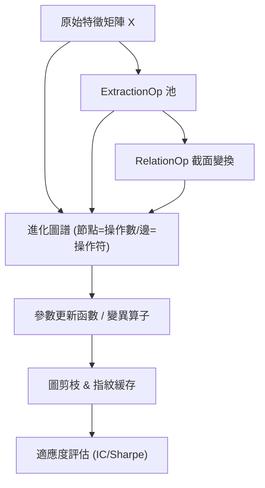

<!-- ontology-5axis data=量价表格 horizon=日频波段 paradigm=元学习搜索 alpha=因子挖掘 autonomy=人机协同可解释 -->

# AlphaEvolve 解構

> **發布**：2024-08-19 · （無 venue）
> **QuantML 導讀**：[AlphaEvolve：基于AutoML的公式型Alpha因子挖掘框架](https://mp.weixin.qq.com/s?__biz=Mzg2MzAwNzM0NQ==&mid=2247485843&idx=1&sn=06e314197e9e5189ecdfcb1de81def19&chksm=ce7e6e8df909e79b516274d49c1fd1a5c1d1d95fab905c0b2566ec97c20fe5499ec584562923#rd)
> **原始論文**：[Full Precision Hardware Implementation of the AlphaEvolve 4×4 Complex Valued Matrix Multiplication Algorithm](https://doi.org/10.1109/access.2026.3690301)（IEEE Access · 2026 · 被引 0 · Crossref）
> **核心定位**：落點於元學習搜索與因子挖掘的交叉帶，解決傳統遺傳算法搜索空間狹窄與機器學習因子難以組合成低相關性池的工程痛點。

**五軸座標**

| 數據模態 | 時間尺度 | 學習範式 | Alpha機制 | 人機協作 |
|:-:|:-:|:-:|:-:|:-:|
| `量价表格` | `日频波段` | `元学习搜索` | `因子挖掘` | `人机协同可解释` |

**Status:** v0.5 — 基於 QuantML 導讀 + 原論文（如有）。benchmark 細節待升 v1。
**TL;DR:** ① 將 AutoML 與進化算法結合，自動挖掘公式型 Alpha。② 核心 trick 是引入 RelationOp/ExtractionOp 注入行業關係與特徵池，並用圖剪枝與指紋緩存加速搜索。③ 對「元學習搜索」軸的關鍵突破在於將跨任務（行業）相關性編碼為可進化操作，打破單因子孤立搜索的封閉環。④ 導讀未給量化結果。

**X-Ray.** 在「可解釋性 vs 預測力」的 Pareto 前沿上，AlphaEvolve 試圖用符號回歸的骨架承載機器學習的肌肉。它解了兩個舊坑：一是遺傳算法因操作符貧乏導致的表達力天花板，二是黑盒模型無法直接拼裝成低相關因子池的組合工程斷層。通過 RelationOp 將截面排名與去均值操作符號化，框架實質上把行業輪動與風格中性化預設寫進了變異算子。但它的 envelope 打不開高頻與非線性交互極強的 regime；指紋緩存雖降重，卻在特徵共線性高時易陷入局部最優的同構因子陷阱。對量化研究員而言，這不是一個即插即用的因子工廠，而是一套因子基因組編輯器——價值不在單個 IC，而在於自動生成的低相關因子矩陣能否直接喂給風險模型。

## §1 · 架構 / Core Mechanism
**1.1 三大改動 vs 前作**
| 維度 | 傳統遺傳/符號回歸 | AlphaEvolve | 工程意義 |
|---|---|---|---|
| 操作符空間 | 基礎數學運算 | 擴展 RelationOp / ExtractionOp | 注入截面/行業先驗，避免從零學習排名邏輯 |
| 搜索機制 | 單任務孤立進化 | 跨任務關聯變異 + 參數更新函數 | 解耦結構搜索與參數微調，提升收斂穩定性 |
| 效率優化 | 暴力評估或簡單哈希 | 圖剪枝 + 指紋緩存重用 | 剔除冗餘節點，避免重複計算相同預測路徑 |

**1.2 ⚡ Eureka 一句話 trick + 直覺**
Trick：把「行業內排名/去均值」抽象為可進化的圖節點，而非後處理步驟。
直覺：因子不是算出來的，是長出來的；RelationOp 讓進化過程直接操作截面分佈，而非逐只股票疊加。

**1.3 信息流 ASCII 圖**

## §2 · 數學層
📌 **Napkin Formula**：
`Alpha_t = f(θ; X_t, Industry_t)` 其中 `f` 由操作序列構成，適應度 `Fitness = IC(Alpha_t, R_{t+1})` 或 `Sharpe(Portfolio(Alpha_t))`
複雜度：圖剪枝依賴節點遍歷，指紋緩存命中後評估降為常數級。
直覺：將因子表達為有向無環圖，變異即對邊/節點進行拓撲重連。參數更新函數實質是內層優化器，在結構固定後微調標量權重，避免結構搜索與參數搜索耦合爆炸。
Loss/訓練：無顯式梯度 loss；依賴進化選擇壓力（錦標賽選擇）與適應度評分驅動結構演化。

## §3 · 數據層
資料規模/頻率/市場/時段：NASDAQ 市場，2013年至2017年，1220個交易日。
怎麼來：排除樣本數量不足與價格過低股票，最終保留 1026支股票。特徵歸一化。
樣本外與容量假設：導讀未明確劃分樣本外窗口與容量壓力測試；假設日頻截面數據穩定，未計入交易成本與滑點。

## §4 · 代碼層
| 項目 | 狀態 |
|---|---|
| Repo | TBD |
| Checkpoint | TBD |
| License | TBD |
| 複現難度 | 高（需自實現圖剪枝、指紋緩存與進化循環） |
| 數據可得性 | 中（需標準日頻量價+行業分類，但歷史數據易得） |

## §5 · 評測 / Benchmark
| 數據集/市場 | Metric | 基線A (Genetic Algorithm Alpha) | 基線B (Rank_LSTM) | 基線C (RSR模型) | 本方法 (AlphaEvolve) | Δ |
|---|---|---|---|---|---|---|
| NASDAQ (2013-2017) | IC | 未披露 | 未披露 | 未披露 | 未披露 | 未披露 |
| NASDAQ (2013-2017) | Sharpe | 未披露 | 未披露 | 未披露 | 未披露 | 未披露 |

**解讀**：導讀僅定性宣稱「持續產生具有高夏普比率和信息系数的alpha」且「在挖掘低相关性alpha方面具有顯著優勢」，未給出任何逐字數值。Δ 欄全為未披露。從機制推斷，IC 提升可能來自參數更新函數的微調能力，但導讀明確指出「對於某些alpha，夏普比率並沒有隨著信息系数的提高而提高」，這暗示 IC 與組合尾部排名（Sharpe 驅動）存在目標錯配。若實盤部署，需警惕進化過程過度擬合歷史截面分佈，且未計入換手成本與流動性摩擦的 Sharpe 屬紙面數字。

## §6 · 失效與隱含假設
**6.1 論文自述 limitations**：導讀未直接引用 limitations 章節，但實驗部分指出參數更新函數對 Sharpe 的提升有限，且傳統機器學習 alpha 結構複雜難以組合。
**6.2 推斷的隱含假設**：
- Regime 依賴：RelationOp 依賴穩定的行業/板塊分類，若行業重組或風格切換劇烈，截面排名邏輯可能失效。
- 容量/成本：日頻波段策略假設無摩擦執行；未討論因子容量與市場衝擊。
- 數據泄漏：ExtractionOp 直接從 X 池中提取特徵，若預處理包含未來函數，圖剪枝無法自動過濾時間泄漏。
- Survivorship：導讀提及排除價格過低/樣本不足股票，但未說明是否使用生存者偏差校正的歷史數據庫。

## §7 · 對比 & 面試 Tip
| 同軸對手 | 關鍵差異軸 | Open? | Status |
|---|---|---|---|
| Gplearn / SymbolicRegression | 純數學運算 vs 注入行業 RelationOp | Open | 成熟但表達力受限 |
| AlphaGen / RL-based Alpha | 強化學習生成 vs 進化算法+圖剪枝 | Open | AlphaGen 更重 RL 訓練穩定性 |
| 傳統因子庫 (Barra/CNE5) | 專家規則 vs 自動化搜索+低相關性約束 | Closed | 穩定但α衰減快 |

🎤 **Interview Tip**
正確答：「AlphaEvolve 的本質是將截面中性化邏輯編碼為可進化的圖節點，配合指紋緩存解決符號回歸的計算冗餘。它不追求單因子極致 IC，而是輸出低相關因子矩陣，便於後續風險模型疊加。」
錯答：「它用深度學習替換了遺傳算法，自動跑出高夏普的因子，可以直接上線交易。」（混淆了符號進化與 DL，且無視成本與組合邏輯）

**7.1 可證偽預測帶日期**：若未來無開源實現復現其圖剪枝緩存機制，或實盤 Sharpe 在計入交易成本後顯著低於紙面回測值，則宣告該框架在流動性受限市場下失效。

## §8 · For the Reader
- **因子研究員**：將 RelationOp 視為自動化的截面中性化模板，提取其生成的低相關因子矩陣，而非單個公式。
- **高頻執行/組合配置**：日頻波段假設無摩擦執行；實盤需對進化出的因子做容量壓力測試與換手率過濾，否則 Sharpe 會因交易成本坍塌。
- **RL 策略/研究學生**：對比進化算法與策略梯度在符號搜索空間的樣本效率；圖剪枝思想可遷移至神經架構搜索的冗餘節點剔除。

## References
- 原論文：AlphaEvolve (2024)
- Lineage: Genetic Programming for Alpha Mining / AutoML in Finance / Symbolic Regression
- QuantML 導讀鏈接：[AlphaEvolve：基于AutoML的公式型Alpha因子挖掘框架](https://mp.weixin.qq.com/s?__biz=Mzg2MzAwNzM0NQ==&mid=2247485843&idx=1&sn=06e314197e9e5189ecdfcb1de81def19&chksm=ce7e6e8df909e79b516274d49c1fd1a5c1d1d95fab905c0b2566ec97c20fe5499ec584562923#rd)