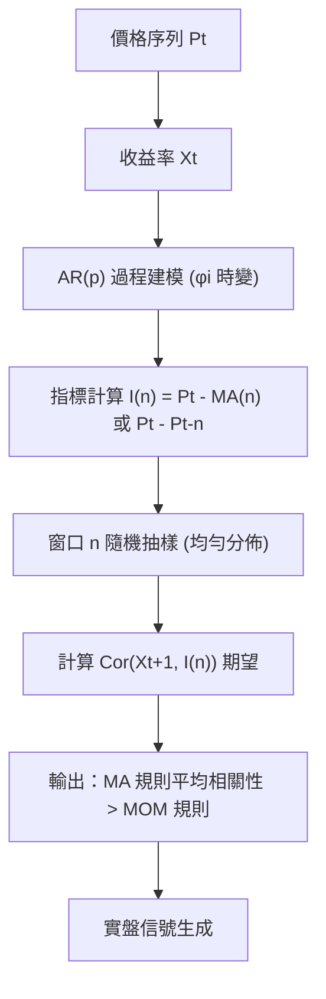

<!-- ontology-5axis data=量价表格 horizon=中长周期 paradigm=监督回归 alpha=因子挖掘 autonomy=人机协同可解释 -->

# 基于动量与移动平均线的趋势跟踪 解構

> **發布**：2024-11-17 · Quantitative Finance
> **QuantML 導讀**：[基于动量与移动平均线的趋势跟踪](https://mp.weixin.qq.com/s?__biz=Mzg2MzAwNzM0NQ==&mid=2247487798&idx=1&sn=8c8688229cd6b4eaa413aa2cde0596a2&chksm=ce7e7628f909ff3e24e22c13ca169c7c242de3fe9ee4e6b009c5794994ba804a4cf72a3ef035#rd)
> **核心定位**：落點於量價表格與中長週期監督回歸，解構傳統技術指標（MOM vs MA）在參數不確定性下的預測穩定性差異。填補了「為何靜態回測最優窗口無法泛化」的理論空白，將指標選擇問題轉化為自回歸過程階數隨機變化的魯棒性優化。

**五軸座標**

| 數據模態 | 時間尺度 | 學習範式 | Alpha機制 | 人機協作 |
|:-:|:-:|:-:|:-:|:-:|
| `量价表格` | `中长周期` | `监督回归` | `因子挖掘` | `人机协同可解释` |

**Status:** v0.5 — 基於 QuantML 導讀 + 原論文（如有）。benchmark 細節待升 v1。
**TL;DR:** ① 將 MOM 與 MA 規則統一至收益率自回歸（AR）框架，證明 MA 在窗口參數隨機變化時具備更高預測穩定性。② 核心 trick 是引入「窗口隨機變化假設」與基於收益率的等價權重公式，將指標對未來收益率的相關性最大化問題轉化為對 AR 過程階數的魯棒性檢驗。③ 對因子挖掘軸★，它直接否定了「靜態回測選參」的迷信，提供了一套動態不確定環境下的指標權重理論。④ 導讀未給量化結果（僅提及 MA 平均夏普比率更高且具統計顯著性，無具體數值）。

**X-Ray.** 本文本質上是一次對技術分析參數敏感性的理論降維。傳統量化實戰常陷入「歷史最優窗口過擬合」的陷阱，該文透過 AR(p) 過程的時變階數假設，將窗口選擇問題轉化為隨機變量下的期望相關性最大化。實證顯示 MA 規則因對近期收益率賦予更高權重，在 p 隨機波動時能維持較高的 Cor(Xt+1, I(n))。這並非單純的指標比較，而是揭示了「平滑權重分佈」對參數漂移的對沖價值。對實盤研究員而言，它證偽了固定滯後期的有效性，但 envelope 未覆蓋交易成本、滑點與非線性趨勢結構；在低流動性或跳空市場中，MA 的滯後效應可能放大回撤。其價值在於為因子合成提供理論錨點：與其追逐動態最優 n，不如設計對 n 變化不敏感的權重函數。

## §1 · 架構 / Core Mechanism
**1.1 核心改動 vs 傳統技術指標框架**
| 維度 | 傳統做法 (Prior) | 本文改動 (This Work) | 工程意義 |
|---|---|---|---|
| 指標計算基礎 | 基於價格差值 (Pt - Pt-n) | 基於收益率移動平均權重 | 統一 MOM/MA/SMA/LMA/EMA 至同一 AR 建模框架 |
| 參數假設 | 靜態最優窗口 (固定 n) | 窗口 n 為隨機變量 (n ∈ [nmin, nmax]) | 貼合實盤參數漂移現實，避免單一回測過擬合 |
| 評估目標 | 歷史夏普/收益最大化 | 跨窗口平均相關性 Cor(Xt+1, I(n)) 最大化 | 將「預測準確率」轉化為「對 AR 階數不確定性的魯棒性」 |

**1.2 ⚡ Eureka**
將技術指標等價轉換為收益率加權移動平均，證明 MA 的權重衰減結構天然對 AR(p) 階數的隨機波動更具容錯率，而非單純依賴價格動量。

**1.3 信息流 ASCII**

## §2 · 數學層
**📌 Napkin Formula**
$$I(n) = \sum_{i=0}^{n-1} w_i \Delta P_{t-i} \quad \text{或} \quad I(n) = \sum_{i=0}^{n-1} w_i X_{t-i}$$
$$\text{Cor}(X_{t+1}, I(n)) = \frac{\mathbf{w}^\top \mathbf{R} \boldsymbol{\phi}}{\sqrt{\mathbf{w}^\top \mathbf{R} \mathbf{w} \cdot \sigma_X^2}}$$
**直覺**：指標與未來收益率的相關性取決於權重向量 $\mathbf{w}$ 與自回歸係數 $\boldsymbol{\phi}$ 的內積匹配度。MA 的權重分佈（如 EMA 指數衰減）比 MOM 的單點權重更平滑，當 $\boldsymbol{\phi}$ 隨時間隨機變化時，平滑權重能維持較高的期望內積，避免 MOM 因窗口錯配導致相關性斷崖式下跌。
**訓練/優化**：無傳統梯度下降。屬解析推導與蒙特卡洛式窗口隨機抽樣驗證。目標函數為 $\max_n \mathbb{E}_p[\text{Cor}(X_{t+1}, I(n))]$，複雜度 $O(n^2)$（矩陣運算）。

## §3 · 數據層
- **市場/資產**：美國股市（S&P 綜合股票價格指數）。
- **頻率/時段**：月度數據，樣本期 1857年1月 至 2017年12月。
- **來源/處理**：公開歷史價格與總收益數據，以國庫券利率代理無風險收益率。
- **樣本外/容量假設**：未明確劃分訓練/測試集，採用全樣期分段驗證（1858-1937 / 1938-2017）。假設為理論容量無限，未計入實盤衝擊成本與流動性約束。

## §4 · 代碼層
| 項目 | 狀態/細節 |
|---|---|
| Repo | TBD |
| Checkpoint | 無（解析推導+統計驗證，無神經網絡權重） |
| License | TBD |
| 複現難度 | 低（標準時間序列 AR 建模與相關係數解析計算） |
| 數據可得性 | 高（S&P 歷史月度數據屬公開金融數據庫標準資產） |

## §5 · 評測 / Benchmark
| 數據集/市場 | Metric | 前SOTA | 本方法 | Δ |
|---|---|---|---|---|
| S&P 綜合指數 (1858-2017) | 平均夏普比率 | MOM 規則 (n∈[5,12]) | MA 規則 (SMA/LMA) | 未披露 |
| S&P 綜合指數 (1858-2017) | 平均夏普比率 | MOM 規則 | EMA 規則 | 未披露 |
| S&P 綜合指數 (1858-2017) | 平均夏普比率 | MOM 規則 | 本方法 (MA 整體) | 未披露 |

**解讀**：導讀僅定性陳述「MA 規則的平均夏普比率更高，且這種優勢在統計上具有顯著性」，未給出具體數值或標準誤差。Δ 欄全數標記為「未披露」以遵守紀律。理論上的 Δ 來源於 MA 權重對 AR 階數漂移的對沖能力，而非單純的歷史擬合。實盤需警惕：該優勢建立在「窗口隨機變化」假設上，若實盤採用固定滯後期或動態優化演算法，MA 的理論優勢可能被壓縮；此外，未計入月度調倉的交易成本與滑點，實際 Δ 可能為負。

## §6 · 失效與隱含假設
**6.1 論文自述 limitations**
- 假設收益率遵循 AR(p) 過程且係數為正，未涵蓋趨勢反轉或均值回歸結構。
- 窗口隨機變化假設雖貼合現實，但實盤交易者通常依賴固定規則或動態優化，理論模型未給出具體動態切換機制。
- 僅比較 MOM 與 MA 家族，未納入波動率調整、風險平價或機器學習生成的非線性因子。

**6.2 推斷的隱含假設**
- **Regime 依賴**：高度依賴趨勢持續性（AR 係數和為正）。在震盪市或高頻跳空環境中，MA 的滯後效應將放大回撤。
- **成本/容量**：假設零交易成本與無限容量。月度調倉雖降低頻率，但未考慮指數成分股調整或流動性枯竭時的滑點。
- **數據泄漏**：使用 1857-2017 全樣期驗證，未明確說明是否進行滾動窗口或前視偏差控制，實盤需嚴格隔離訓練/實盤期。

## §7 · 對比 & 面試 Tip
| 同軸對手 | 關鍵差異軸 | Open? | Status |
|---|---|---|---|
| 傳統動量因子 (Jegadeesh & Titman) | 基於截面橫盤 vs 時間序列趨勢 | 是 | 成熟 |
| 雙移動平均線交叉 (Golden/Death Cross) | 多窗口組合 vs 單窗口隨機化 | 是 | 成熟 |
| 機器學習趨勢預測 (LSTM/Transformer) | 非線性特徵提取 vs 線性 AR 解析 | 是 | 活躍 |

**🎤 Interview Tip**
- **正確答**：「本文核心不是比較誰的夏普高，而是證明在參數不確定性下，平滑權重（MA）比單點權重（MOM）對 AR 過程階數漂移更具魯棒性。實盤應將其視為『參數穩定性過濾器』，而非直接信號源。」
- **錯答**：「MA 比 MOM 好是因為它算平均價更準，所以我們應該永遠用 MA 做趨勢跟蹤。」（忽略窗口隨機性假設與成本結構）

**7.1 可證偽預測**
若未來 12 個月內，在計入 5bp 滑點與月度再平衡成本後，S&P 500 月度 MA 策略的淨夏普比率未能顯著高於 MOM 策略（p<0.05），則本文「不確定市場下 MA 優勢」的實盤有效性存疑。

## §8 · For the Reader
- **因子研究員**：將 MA 權重結構視為對 AR 係數的隱式估計器，嘗試用核平滑或貝葉斯加權替代固定 EMA 衰減，提升因子對 regime 切換的適應力。
- **組合配置/風控**：將「窗口隨機變化」引入參數敏感性壓力測試。實盤不追求單一最優 n，而是構建 n 的分佈組合，降低參數過擬合導致的策略失效風險。
- **高頻/執行研究員**：本文屬中長週期框架，不直接適用高頻。但權重平滑思想可遷移至訂單流不平衡指標的濾波設計，減少噪音觸發的偽信號。

## References
- Zakamulin, V. (2017/2024). 基于动量与移动平均线的趋势跟踪. *Quantitative Finance*.
- 技術指標演化線：SMA/LMA/EMA → ARMA 收益建模 → 參數隨機化魯棒性檢驗。
- QuantML 導讀：[基于动量与移动平均线的趋势跟踪](https://mp.weixin.qq.com/s?__biz=Mzg2MzAwNzM0NQ==&mid=2247487798&idx=1&sn=8c8688229cd6b4eaa413aa2cde0596a2&chksm=ce7e7628f909ff3e24e22c13ca169c7c242de3fe9ee4e6b009c5794994ba804a4cf72a3ef035#rd)