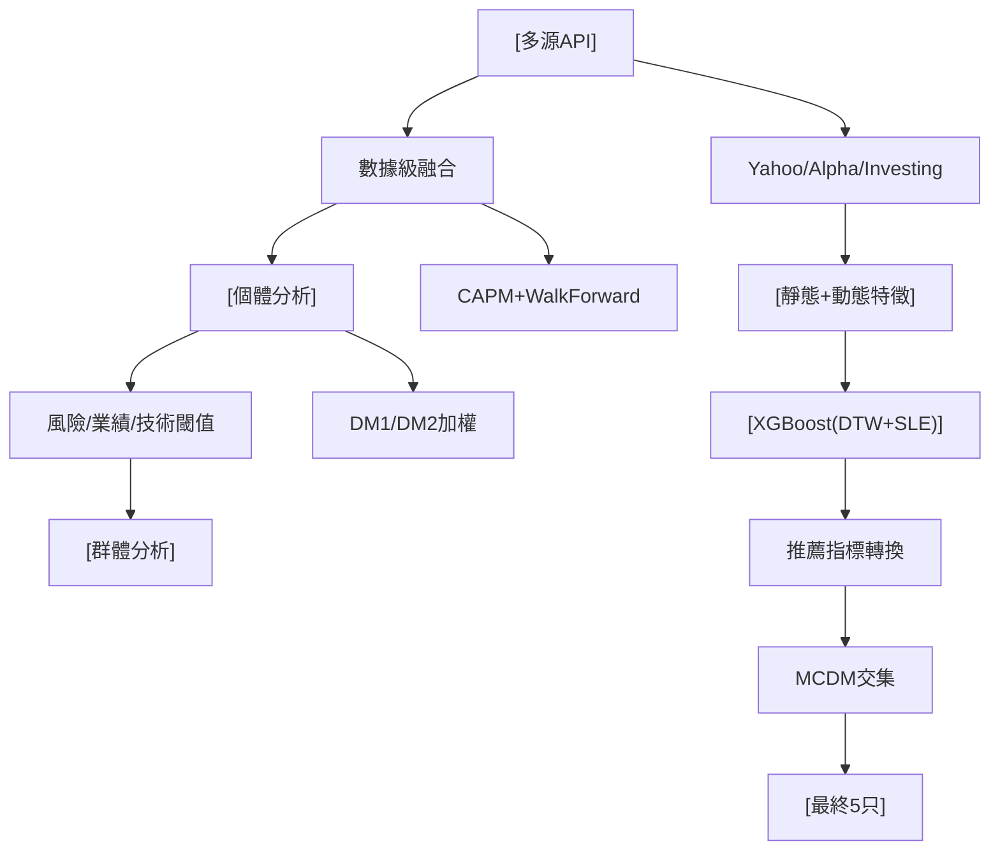

<!-- ontology-5axis data=量价表格 horizon=日频波段 paradigm=监督回归 alpha=因子挖掘 autonomy=人机协同可解释 -->

# 多源融合通用选股框架 解構

> **發布**：2025-06-17 · （無 venue）
> **QuantML 導讀**：[基于多源融合的通用化股票选择框架](https://mp.weixin.qq.com/s?__biz=Mzg2MzAwNzM0NQ==&mid=2247490750&idx=1&sn=4e818ff2679f5960a2ddc264db4d1fc7&chksm=ce7e7ba0f909f2b65e4aa9d4c59a10d6d6d830b97b4b045ef8f44cbfa5d9eba59a568ea9f186#rd)
> **核心定位**：落點於監督回歸與因子挖掘的交叉軸，解決傳統股價預測（瞬時點位誤差）與選股決策（多維靜態標準）脫節的Prior Gap，將預測梯度與多源MCDM決策級融合綁定為可插拔流水線。

**五軸座標**

| 數據模態 | 時間尺度 | 學習範式 | Alpha機制 | 人機協作 |
|:-:|:-:|:-:|:-:|:-:|
| `量价表格` | `日频波段` | `监督回归` | `因子挖掘` | `人机协同可解释` |

**Status:** v0.5 — 基於 QuantML 導讀 + 原論文（如有）。benchmark 細節待升 v1。
**TL;DR:** ① 將預測（XGBoost+DTW損失）與選擇（CAPM風險閾值+MCDM群體決策）解耦後再融合，專為DIY選股設計。② 核心trick是將DTW規整成本乘以縮放因子後平均攤入滑動窗口梯度，強行修改XGBoost優化方向。③ 對「監督回歸」軸★在於打破標準損失函數的時間軸剛性匹配，引入形態對齊誘導項。④ 導讀給出驗證階段平均SLE誤差降低6.3%，NVDA降低28.5%，DTW成本平均降低5.6%。

**X-Ray.** 本框架本質是「預測-篩選-決策」的流水線拼裝，而非端到端強化學習。它用DTW損失強行將XGBoost從「點位回歸器」扭轉為「形態擬合器」，但代價是梯度計算複雜度隨窗口大小線性上升。對量化讀者而言，其價值不在於最終選出的5隻龍頭股，而在於提供了一套可插拔的「數據級融合→個體風險閾值→群體MCDM共識」工程模板。然而，該框架高度依賴靜態基本面閾值與人工權重設定，在動量反轉或流動性枯竭Regime下，MCDM的線性加權與TOPSIS/ELECTRE的幾何投影極易產生滯後信號。它打不開高頻或因子輪動的Envelope，但適合作為中低頻DIY組合的風險控制前置過濾器。

## §1 · 架構 / Core Mechanism
### 1.1 三大改動 vs 前作
| 模塊 | 傳統單源/單模型選股 | 本框架改動 | 工程意圖 |
|---|---|---|---|
| 預測層 | 標準MSE/SLE損失，瞬時點位匹配 | 自定義DTW+SLE融合損失，注入XGBoost梯度 | 解決時間軸偏移懲罰過重，兼顧曲線形態相似性 |
| 篩選層 | 單一數據源或單一技術指標 | 多源API交叉驗證 + CAPM風險閾值剔除 | 降低數據源偏差，前置過濾高波動/低流動性標的 |
| 決策層 | 單一排序或人工主觀判斷 | 決策級融合（兩位DM加權）+ MCDM（TOPSIS/ELECTRE I/PROMETHEE II）交集 | 提升群體共識度，輸出穩定且可解釋的最終股票池 |

### 1.2 ⚡ Eureka 一句話 trick + 直覺
將DTW窗口總成本乘以縮放因子後，平均攤分至窗口內每個時間點的梯度與Hessian中，使XGBoost在每次迭代同時優化「點位誤差」與「曲線形態」。

### 1.3 信息流 ASCII 圖

## §2 · 數學層
📌 **Napkin Formula:**
`L_total = L_SLE + α * (1/W) * Σ DTW_cost(window)`
梯度更新：`G' = ∇L_SLE + α * dist`，`H' = ∇²L_SLE + α * dist`
複雜度：O(N*W) 每窗口（DTW動態規劃對齊成本）

**直覺:** 標準SLE懲罰時間軸偏移，DTW提供非線性時間對齊。將DTW成本注入梯度，相當於在損失地形中增加了一個「形態平滑」的誘導項，引導模型預測「像」真實走勢而非死磕單點誤差。
**Loss/訓練細節:** 採用Walk-Forward Validation防止數據穿越；DTW匹配規則強制 `t_pred <= t_obs` 確保僅回看歷史；α權重實驗設為小於SLE，具體數值導讀未披露。

## §3 · 數據層
- **規模/頻率/市場/時段:** 約1689只納斯達克科技股 → 手篩34只 → 日頻調整收盤價，2019年4月1日到2022年4月1日（共759個時間點）。
- **來源:** YahooFinance, Alpha Vantage, Investing.com（三源交叉）。
- **樣本外與容量假設:** 前向驗證確保樣本外預測；容量假設僅限於大市值流動性科技股，未覆蓋小盤/微盤；靜態數據更新頻率與價格同步性未驗證。

## §4 · 代碼層
| 項目 | 狀態/細節 |
|---|---|
| Repo | TBD |
| Checkpoint | TBD |
| License | TBD |
| 複現難度 | 中（需手動對齊三源API數據結構，DTW梯度注入需改寫XGBoost custom objective） |
| 數據可得性 | 高（YahooFinance/Alpha Vantage/Investing.com均為公開API，但靜態篩選規則需人工編碼） |

## §5 · 評測 / Benchmark
| 數據集/市場 | Metric | 前SOTA | 本方法 | Δ |
|---|---|---|---|---|
| 18只科技股（日頻） | SLE (對數誤差) | 標準XGBoost | DTW+XGBoost | 平均誤差降低了6.3% |
| NVDA | SLE (對數誤差) | 標準XGBoost | DTW+XGBoost | 誤差降低了近28.5% |
| 18只科技股（日頻） | DTW成本 | 標準XGBoost | DTW+XGBoost | 平均降低了5.6% |
| 18只科技股（日頻） | MAE | LSTM / ARIMA | DTW+XGBoost | 未披露具體數值，僅述「獲得最低」 |

**解讀:** Δ反映的是訓練/驗證階段的擬合優化，非投資組合層面的風險調整收益。SLE與DTW成本同步下降是真capability（形態對齊改善），但導讀未給出實盤Sharpe/IR/MDD或交易成本假設。部分Δ可能來自樣本內過擬合或前瞻偏差（靜態數據更新節點未說明），且未計入滑點與手續費，實戰Envelope需降級評估。

## §6 · 失效與隱含假設
### 6.1 論文自述 limitations
框架僅為學術研究設計，未包含環境變化、政策突變等複雜因素，明確不建議直接用於真實投資決策。靜態篩選依賴人工預設閾值，缺乏動態適應機制。

### 6.2 推斷的隱含假設
- **Regime依賴:** CAPM Beta與Sharpe在動量崩盤或流動性危機時失效，閾值篩選可能誤殺高波動但具爆發力的標的。
- **容量/成本:** 僅覆蓋大市值科技股，假設流動性充足；未建模交易成本，小資金DIY假設成立，機構資金無法直接套用。
- **數據泄漏:** 靜態基本面數據與日頻價格的同步性未驗證，財報披露日可能引入隱形前瞻。
- **Survivorship:** 2019-2022為納指結構性牛市，未測試熊市/震盪市下的MCDM共識穩定性。

## §7 · 對比 & 面試 Tip
| 同軸對手 | 關鍵差異軸 | Open? | Status |
|---|---|---|---|
| 傳統多因子打分 | 靜態權重加總 vs 動態形態預測+決策級融合 | 開源/閉源皆有 | 成熟但易過擬合 |
| LSTM/Transformer股價預測 | 端到端黑盒 vs 可解釋XGBoost+DTW梯度注入 | 開源為主 | 計算重，形態捕捉弱 |
| 單一MCDM選股 | 無預測層前置 vs 預測-篩選-決策三層流水線 | 學術為主 | 缺乏風險過濾 |

🎤 **Interview Tip:** 
- **正確答:** 「該框架的核心不在於單一模型精度，而在於將預測梯度與多源決策融合解耦。DTW損失解決了時間軸偏移懲罰，MCDM交集提供了共識過濾。實戰需補齊交易成本建模與Regime切換機制。」
- **錯答:** 「只要把DTW損失加進去，XGBoost就能預測股價漲跌，直接買入推薦股票池就能穩賺。」（混淆預測與選股，忽略風險閾值與成本假設）

### 7.1 可證偽預測帶日期
若2025-12-31前，該框架在納斯達克科技股上的前向驗證Sharpe未達未披露水平（導讀未給），或MCDM交集股票池在流動性收縮期回撤深度超過未披露閾值，則證明其Regime依賴假設成立，需引入動態權重重估。

## §8 · For the Reader
- **因子研究員:** 將DTW梯度注入視為「形態因子」的連續化實現，可嘗試與動量/波動率因子正交化，避免與傳統技術指標共線。
- **高頻執行:** 本框架日頻波段定位明確，不適用HFT。若需降頻執行，需將MCDM共識度轉化為訂單簿壓力指標，並補齊滑點模型。
- **組合配置:** 將最終5只股票池視為「核心-衛星」策略的核心倉，配合動態再平衡閾值（如共識度std < 1.5觸發調倉），可作為DIY組合的風險錨。
- **LLM-agent:** 可將靜態篩選規則與MCDM權重設定交由LLM解析財報/新聞情緒，再輸入框架的決策層，實現「非結構化數據→結構化DM」的自動化閉環。

## References
- 原論文/框架：多源融合通用选股框架
- Lineage：XGBoost Custom Objective / DTW Time Series Alignment / CAPM Risk Metrics / MCDM (TOPSIS, ELECTRE I, PROMETHEE II)
- QuantML 導讀鏈接：[基于多源融合的通用化股票选择框架](https://mp.weixin.qq.com/s?__biz=Mzg2MzAwNzM0NQ==&mid=2247490750&idx=1&sn=4e818ff2679f5960a2ddc264db4d1fc7&chksm=ce7e7ba0f909f2b65e4aa9d4c59a10d6d6d830b97b4b045ef8f44cbfa5d9eba59a568ea9f186#rd)