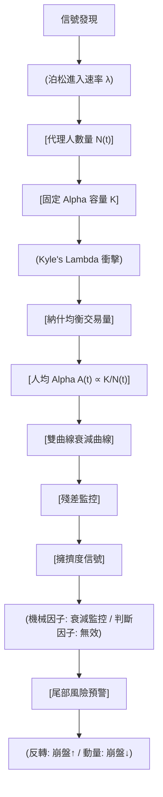

<!-- ontology-5axis data=量价表格 horizon=中长周期 paradigm=因果结构 alpha=风险择时 autonomy=人机协同可解释 -->

# 双曲线衰减模型 解構

> **發布**：2025-12-17 · （無 venue）
> **QuantML 導讀**：[因子拥挤度启示录：Alpha 衰减机制](https://mp.weixin.qq.com/s?__biz=Mzg2MzAwNzM0NQ==&mid=2247492697&idx=1&sn=8ac0e4b0c82cb3b2c6bdcdd944cc9663&chksm=ce7d8347f90a0a51083f013f288ccf33a3894773c26e295ef59afe2ba88b532338bfbe8603e7#rd)
> **核心定位**：落點於因果結構與風險擇時軸，解了「因子發表後溢價消失的函數形式與博弈機制」prior gap，將傳統經驗性觀察轉為可微分的納什均衡動態。

**五軸座標**

| 數據模態 | 時間尺度 | 學習範式 | Alpha機制 | 人機協作 |
|:-:|:-:|:-:|:-:|:-:|
| `量价表格` | `中长周期` | `因果结构` | `风险择时` | `人机协同可解释` |

**Status:** v0.5 — 基於 QuantML 導讀 + 原論文（如有）。benchmark 細節待升 v1。
**TL;DR:** 基於博弈論推導因子 Alpha 雙曲線衰減機制，實證表明擁擠度不預測收益而有效預警反轉類因子尾部風險。核心 trick 是將固定 Alpha 容量下的競爭建模為泊松進入過程，導出人均利潤 $1/N$ 的雙曲線衰減形式。這對風險擇時軸★關鍵，因它證偽了「擁擠擇時」的 Alpha 生成能力，並將信號用途精準錨定於崩盤概率預警。導讀給出樣本外反轉因子擁擠狀態崩盤風險為未擁擠狀態的 1.65-1.84 倍。

**X-Ray.** 該模型在五軸 Pareto 上明確放棄了「高頻 Alpha 生成」，轉而錨定「中長週期因果結構」與「風險擇時」。它解了量化工程長期混淆「擁擠度與預期收益」的坑，用納什均衡與泊松過程將經驗性衰減觀察轉為可驗證的動態方程。實證直接證偽了將擁擠度作為均值回歸或動量擇時信號的有效性，這在市場有效性假說下是必然結果。其真正 envelope 在於異質性尾部風險定價：順勢擁擠降低崩盤概率，逆勢擁擠放大協同清算風險。對量化讀者的意義是：因子研究應從「預測漲跌」轉向「監控容量邊界與極端損耗」，擁擠信號應接入組合風險預算模塊而非信號生成模塊。

## §1 · 架構 / Core Mechanism
**1.1 三大改動 vs 前作**
| 維度 | 傳統文獻 (McLean & Pontiff / Falck) | 博弈均衡模型 (DeMiguel) | 本方法 (雙曲線衰減) |
|---|---|---|---|
| 衰減假設 | 經驗性觀察/線性/指數特設 | 利潤與投資者數量成比例 | 固定容量競爭導出 $1/N$ 雙曲線形式 |
| 動態機制 | 靜態截面或簡單時間趨勢 | 靜態均衡 | 泊松過程驅動的時間動態 $N(t)=\lambda t$ |
| 信號用途 | 解釋溢價消失 | 侵蝕利潤 | 區分機械/判斷因子，專註尾部風險預警 |

**1.2 ⚡ Eureka 一句話 trick + 直覺**
將「因子溢價消失」重構為「多代理人在固定容量下的納什競爭」，代理人以泊松速率進入，人均利潤自然呈現 $1/(1+\lambda t)$ 的雙曲線厚尾衰減，而非指數斷崖。

**1.3 信息流 ASCII 圖**

## §2 · 數學層
📌 **Napkin Formula**:
$N(t) = \lambda t$ （泊松進入）
$A(t) = \frac{K}{1 + \lambda t}$ （雙曲線衰減，源自單期納什均衡人均利潤 $1/N$）
**複雜度**: $O(1)$ 閉式解，參數僅容量 $K$ 與進入速率 $\lambda$。
**直覺**: 競爭者越多，單人分得蛋糕越小；泊松進入使分母線性增長，整體呈雙曲線。初期衰減慢，但長期存在「厚尾」殘留。
**Loss/訓練細節**: 導讀未披露具體 Loss 函數，實證採用滾動 36 個月夏普比率作為 Alpha 代理指標，以擬合優度 ($R^2$) 進行模型比較。

## §3 · 數據層
- **資料規模/頻率/市場/時段**: 1963-2024 年美股月度數據，涵蓋 8 個 Fama-French 因子 (MKT, SMB, HML, RMW, CMA, Mom, ST_Rev, LT_Rev)。
- **怎麼來**: Kenneth French 數據庫。
- **樣本外與容量假設**: 訓練窗口最小 120 個月；2016-2024 為預測期；2017-2025 為策略樣本外測試期。假設因子 ETF 交易量代理資金涌入速率，但未披露具體容量（AUM）數字。

## §4 · 代碼層
| 項目 | 詳情 |
|---|---|
| Repo | TBD |
| Checkpoint | TBD |
| License | TBD |
| 複現難度 | 低 (閉式雙曲線擬合 + 滾動夏普計算) |
| 數據可得性 | 高 (Kenneth French 公開數據 + 因子 ETF 成交量) |

## §5 · 評測 / Benchmark
| 數據集/市場 | Metric | 基線A (線性模型) | 基線B (指數模型) | 本方法 (雙曲線) | Δ (vs 線性) |
|---|---|---|---|---|---|
| 美股月度 (1995-2024) | 動量因子擬合 $R^2$ | 0.51 | 未披露 | 0.65 | 0.14 |
| 美股月度 (1995-2024) | 長期反轉擬合 $R^2$ | 未披露 | 未披露 | 未披露（導讀稱雙曲線模式清晰，數值缺失） | 未披露 |
| 美股月度 (1995-2024) | 判斷因子擬合 $R^2$ | 未披露 | 未披露 | 未披露（導讀僅述「擬合度極差」） | 未披露 |

| 數據集/市場 | Metric | 基線A (因子動量) | 基線B (等權配置) | 本方法 (擁擠擇時) | Δ (vs 動量) |
|---|---|---|---|---|---|
| 樣本外 (2017-2025) | 夏普比率 | 0.39 | 0.17 | 0.22 | -0.17 |

**解讀**: 擬合優度提升（動量 $R^2$ 從 0.51 至 0.65）屬真 capability，驗證了納什均衡導出的函數形式優於經驗特設模型。策略夏普比率落後因子動量 0.17，屬市場有效性下的必然失效，證明公共擁擠信號無法轉化為均值 Alpha。判斷因子（價值/盈利/投資）擬合度極差（導讀未披露具體 $R^2$），顯示信號模糊性導致單一衰減路徑失效，模型邊界清晰。

## §6 · 失效與隱含假設
**6.1 論文自述 limitations**: 僅涵蓋 8 個美股因子，更多因子加入可能增強穩健性；動量因子相反風險模式統計顯著但深層機制待探究。
**6.2 推斷的隱含假設**:
- **Regime 依賴**: 假設泊松進入速率 $\lambda$ 在訓練期相對穩定，但實證發現 2015 年後 ETF 資金涌入導致 $\lambda$ 加速，模型產生系統性高估（預測 0.30 vs 實際 0.15）。
- **容量/成本**: 假設 Kyle's Lambda 線性衝擊與固定容量 $K$，未計入交易滑點與 ETF 申贖摩擦成本。
- **數據泄漏**: 滾動夏普比率計算依賴歷史回報，若頻率低（月度），實時殘差計算存在滯後。
- **Survivorship**: 使用 Kenneth French 數據庫，通常包含已消亡因子/股票，但導讀未明確說明是否進行生存者偏差校正。

## §7 · 對比 & 面試 Tip
| 同軸對手 | 關鍵差異軸 | Open? | Status |
|---|---|---|---|
| 傳統擁擠度指標 (如 CFTC 持倉/波動率分位) | 靜態截面 vs 動態博弈衰減路徑 | 是 | 經驗性/本方法為結構性 |
| 因子擇時模型 (如宏觀狀態切換) | 預測均值回報 vs 預警尾部崩盤概率 | 是 | 收益導向/本方法為風險導向 |
| 線性/指數衰減假設 | 薄尾快速歸零 vs 厚尾長期殘留 | 是 | 特設/本方法為均衡推導 |

🎤 **Interview Tip** 
**正確答**: 「擁擠度不預測因子漲跌，只預測極端回撤概率。雙曲線模型源於固定容量下的納什競爭，對機械因子擬合好，但信號無法用於 Alpha 擇時，應接入風險預算模塊監控反轉類因子的協同清算風險。」
**錯答**: 「擁擠度高說明因子要跌了，我們可以做空該因子來賺取 Alpha。模型顯示指數衰減比雙曲線更準確。」

**7.1 可證偽預測帶日期**: 若 2026 年 Q1 前，基於實時擁擠殘差的動量/反轉因子多空組合在扣除交易成本後 Sharpe 仍顯著為正，則證偽「擁擠信號無法產生 Alpha」的核心結論。

## §8 · For the Reader
- **因子研究員**: 放棄將擁擠度作為截面 Alpha 預測器。改用雙曲線殘差監控機械因子（動量/反轉）的容量邊界，將信號輸出對接組合優化器的風險約束項。
- **高頻執行/組合配置**: 反轉類因子擁擠時，執行端需警惕流動性枯竭與滑點放大；配置端應動態收縮逆勢策略權重，動量擁擠時可視為趨勢確認信號而非減倉信號。
- **LLM-agent/RL 策略**: 將「泊松進入速率 $\lambda$」作為環境狀態變量，RL Agent 的 Reward 函數應從「最大化夏普」改為「最小化尾部 CVaR + 規避擁擠狀態下的協同清算」，避免 Agent 學習到無效的均值擇時策略。

## References
- 原論文: TBD (QuantML 導讀未提供具體作者/標題，僅標註無 venue)
- Lineage: McLean & Pontiff (2016) / Falck et al. (2021) / DeMiguel et al. (2021) / Kang et al. (2021) / Barroso et al. (2022)
- QuantML 導讀鏈接: [因子拥挤度启示录：Alpha 衰减机制](https://mp.weixin.qq.com/s?__biz=Mzg2MzAwNzM0NQ==&mid=2247492697&idx=1&sn=8ac0e4b0c82cb3b2c6bdcdd944cc9663&chksm=ce7d8347f90a0a51083f013f288ccf33a3894773c26e295ef59afe2ba88b532338bfbe8603e7#rd)