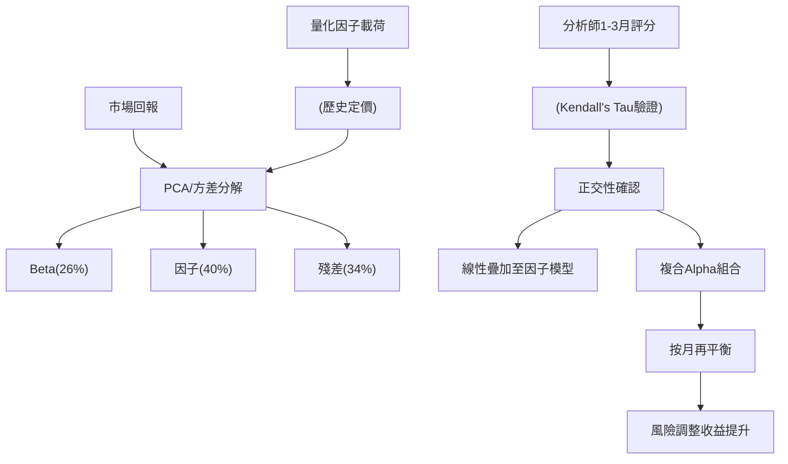

<!-- ontology-5axis data=文本另类 horizon=日频波段 paradigm=监督回归 alpha=因子挖掘 autonomy=人机协同可解释 -->

# 协同智能 解構

> **發布**：2025-12-26 · （無 venue）
> **QuantML 導讀**：[如何结合人类观点与量化模型以提高Alpha？](https://mp.weixin.qq.com/s?__biz=Mzg2MzAwNzM0NQ==&mid=2247492835&idx=1&sn=11191c27f54680989a3d8e3ddb0c3547&chksm=ce7d83fdf90a0aeb6e04cb06cf3f197cf159aab5f527a98058de03b417e43c07fb53150a04e6#rd)
> **核心定位**：落點於「人机协同可解释」與「因子挖掘」軸的交叉帶。解了傳統 Quantamental 因信號時間跨度錯配（1-3個月再平衡 vs 12個月目標價）導致的信號歸零與共線性污染工程坑。

**五軸座標**

| 數據模態 | 時間尺度 | 學習範式 | Alpha機制 | 人機協作 |
|:-:|:-:|:-:|:-:|:-:|
| `文本另类` | `日频波段` | `监督回归` | `因子挖掘` | `人机协同可解释` |

**Status:** v0.5 — 基於 QuantML 導讀 + 原論文（如有）。benchmark 細節待升 v1。
**TL;DR:** ① 提出協同智能框架，強制對齊1-3個月分析師短期觀點與量化再平衡頻率。② 核心 trick 是將人類觀點經正交性驗證後，視為純粹的特质性风险（Idiosyncratic Risk）線性疊加至因子模型。③ 這對「人机协同可解释」軸的關鍵意義在於：將長期敘述降維為短期殘差項，避免用長期噪音稀釋短期信號。④ 複合模型年化超額收益28%，夏普比率3.2。

**X-Ray.** 本框架將「人机协同可解释」從經驗主義拉回統計正交性驗證。傳統整合的失效模式源於時間跨度錯配：機器按1-3個月再平衡，人類給12個月目標價，直接疊加導致信號相互抵消。本法強制要求 Analyst 輸出匹配頻率的短期觀點，並經 Kendall’s Tau 驗證其與主流因子無系統性相關（僅動量輕微耦合），從而將其定義為純粹的特质性风险。這解決了因子疊加中的共線性污染與前瞻偏差工程坑。然而，該方法打不開的 envelope 在於：高度依賴 Analyst 覆蓋的廣度與評分紀律，且未處理交易成本與滑點對1-3個月頻率的侵蝕；在低流動性標的中，特質性風險的線性疊加可能迅速轉為執行風險。對量化讀者而言，此架構提供了一條可證偽的 Alpha 組合路徑：將人類觀點降維為正交殘差項，而非替代因子選股，適合用於多因子模型的尾部修正與風險預算分配。

## §1 · 架構 / Core Mechanism
**1.1 三大改動 vs 前作**
| 維度 | 傳統 Quantamental | 協同智能框架 | 工程意義 |
|---|---|---|---|
| 信號時間跨度 | 12個月目標價預測 | 強制1-3個月短期觀點 | 消除再平衡頻率錯配，防止信號歸零 |
| 風險歸類 | 混合 Beta/因子/特質性 | 嚴格剝離為純特质性风险 | 避免共線性污染，確保線性疊加數學成立 |
| 疊加邏輯 | 經驗權重或直接排序 | 正交殘差項線性疊加 | 將人類觀點轉為可計量的 Alpha 殘差 |

**1.2 ⚡ Eureka 一句話 trick + 直覺**
強制時間跨度對齊 + 正交殘差疊加。直覺：機器負責解釋已知方差（Beta與因子），人類負責捕捉未知方差（特質性事件），兩者正交時線性組合的風險調整收益必然提升。

**1.3 信息流 ASCII 圖**

## §2 · 數學層
📌 **Napkin Formula**：
$R_{t} = \beta R_{m,t} + \sum_{i} \gamma_i F_{i,t} + \alpha_{idio}(S_{t}) + \epsilon_{t}$
其中 $S_{t}$ 為分析師1-5分短期評分，經秩相關檢驗與 $F_{i,t}$ 解耦後，$\alpha_{idio}$ 作為獨立殘差項線性注入。
**複雜度**：O(N) 截面疊加，無梯度下降訓練循環。
**直覺**：不試圖讓模型「學習」人類觀點，而是將其視為已驗證的獨立風險源，直接加權至組合構建端。
**Loss/訓練細節**：無傳統 ML Loss。依賴統計驗證（Kendall’s Tau 秩相關、PCA 特徵值匹配、0.2 閾值篩選），本質是風險模型的殘差分解與正交投影。

## §3 · 數據層
- **資料規模/頻率/市場**：全球股市，月度回報數據，5年期滾動窗口構建區域風險模型。
- **來源**：基本面分析師常規覆蓋評分 + 標準量化風格因子載荷。
- **樣本外與容量假設**：導讀未披露具體樣本量與交易成本假設；按月再平衡暗示容量假設偏向中大型流動性標的，小盤股執行摩擦未建模。

## §4 · 代碼層
| 項目 | 狀態/細節 |
|---|---|
| Repo | TBD |
| Checkpoint | TBD |
| License | TBD |
| 複現難度 | 中高（需機構級分析師評分數據與標準因子庫） |
| 數據可得性 | 低（分析師短期評分屬私有/機構數據，公開數據僅能模擬） |

## §5 · 評測 / Benchmark
| 數據集/市場 | Metric | 前SOTA (基線) | 本方法 | Δ |
|---|---|---|---|---|
| 全球股市 | 超額收益 | 純分析師策略 14% | 協同智能模型 28% | +14% |
| 全球股市 | 波動率 | 純分析師策略 7% | 協同智能模型 9% | +2% |
| 全球股市 | 夏普比率 | 純分析師策略 2.0 | 協同智能模型 3.2 | +1.2 |
| 全球股市 | 命中率 | 純分析師策略 64% | 協同智能模型 68% | +4% |
| 全球股市 | 超額收益 | 未披露 | Value+看多 33% | 未披露 |
| 全球股市 | 超額收益 | 未披露 | Income+看多 31% | 未披露 |
| 全球股市 | 超額收益 | 未披露 | Momentum+看多 25% | 未披露 |
| 全球股市 | 超額收益 | 未披露 | Growth+看多 22% | 未披露 |
| 全球股市 | 超額收益 | 未披露 | Low Vol+看多 16% | 未披露 |
| 全球股市 | 超額收益 | 未披露 | Quality+看多 6% | 未披露 |

**解讀**：Δ 欄中 +14% 超額收益與 +1.2 夏普比率的提升是真 capability，源於正交殘差項有效填補了因子模型在特質性風險區的盲區。但需注意：導讀未計入1-3個月頻率的交易成本與滑點，實盤中夏普比率可能因 turnover 侵蝕而回落；此外，分析師評分分佈偏向樂觀（33% 正向 vs 16% 負向），若未做中性化處理，超額收益可能部分承載了市場 Beta 或行業暴露，非純 Alpha。

## §6 · 失效與隱含假設
**6.1 論文自述 limitations**
- 分析師情緒略微偏向樂觀，極端正面與負面比例不對稱。
- 僅動量因子與分析師觀點存在輕微相關，其餘因子正交，但動量耦合可能引入週期性疊加風險。
- 質量因子本身具防禦屬性，對意外信息敏感度低，負面情境下僅具預警價值而非直接 Alpha。

**6.2 推斷的隱含假設**
- **Regime 依賴**：在極端估值倍數（Extreme Multiples）與盈利預期修正（Upgrade/Downgrade）階段表現最佳，平穩市況下特質性風險溢價可能收斂。
- **容量/成本**：未披露 breakeven 成本；按月再平衡若疊加多空操作，實盤摩擦成本可能吞噬部分 Δ。
- **數據泄漏**：分析師評分若已部分反映於共識預期或價格動量中，Kendall’s Tau 的「低相關」結論可能低估隱含共線性。
- **Survivorship**：全球股市覆蓋通常偏向存活企業，未提及退市/破產樣本的處理邏輯。

## §7 · 對比 & 面試 Tip
| 同軸對手 | 關鍵差異軸 | Open? | Status |
|---|---|---|---|
| 傳統 Quantamental | 時間跨度對齊 vs 經驗混合 | 閉源 | 成熟但失效頻發 |
| NLP Sentiment Alpha | 公開文本情緒 vs 機構私有評分 | 開源/閉源混合 | 研究熱點，實盤摩擦大 |
| RL Agent Trading | 端到端策略優化 vs 殘差正交疊加 | 開源 | 實驗階段，可解釋性弱 |

🎤 **Interview Tip**
- **正確答**：「協同智能的核心不是讓模型學習人類觀點，而是通過強制時間跨度對齊與正交性檢驗，將人類觀點降維為獨立的特质性风险殘差項，線性疊加至因子模型。這避免了信號錯配導致的歸零效應，並保留了機器的廣度與人類的深度。」
- **錯答**：「把分析師評級直接當特徵喂給神經網絡，讓模型自動學習權重。」（違反正交殘差設計，引入共線性與黑箱風險）

**7.1 可證偽預測帶日期**
若 2026-Q2 全球流動性收緊，低波與質量因子防禦屬性增強，分析師短期觀點對該類因子的疊加增益將顯著低於 6% 超額收益基準，且夏普比率提升幅度收斂至 +0.5 以內。

## §8 · For the Reader
- **因子研究員**：將人類觀點視為正交殘差項而非替代特徵，用 Kendall’s Tau 驗證疊加前的共線性，避免因子庫污染。
- **組合配置**：在極端估值或盈利修正階段提高特質性風險預算，平穩市況下收斂至純因子暴露，動態調整疊加權重。
- **LLM-Agent / RL 策略**：不要讓 Agent 直接輸出交易信號，而是讓其生成匹配再平衡頻率的短期觀點評分，經正交檢驗後注入風險模型殘差層，保留可解釋性與統計嚴謹性。

## References
- 框架：协同智能（Collaborative Intelligence）
- QuantML 導讀：[如何结合人类观点与量化模型以提高Alpha？](https://mp.weixin.qq.com/s?__biz=Mzg2MzAwNzM0NQ==&mid=2247492835&idx=1&sn=11191c27f54680989a3d8e3ddb0c3547&chksm=ce7d83fdf90a0aeb6e04cb06cf3f197cf159aab5f527a98058de03b417e43c07fb53150a04e6#rd)
- Lineage：風險模型方差分解 / PCA 因子識別 / Kendall’s Tau 秩相關檢驗 / 多因子殘差疊加架構