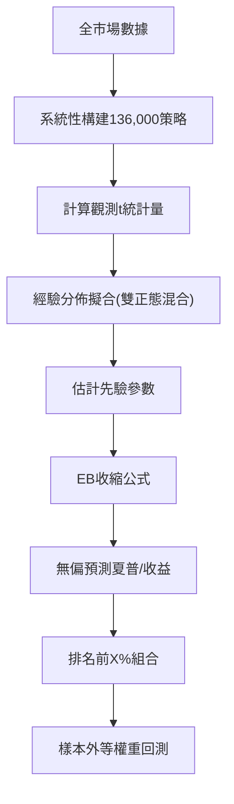

<!-- ontology-5axis data=量价表格 horizon=日频波段 paradigm=元学习搜索 alpha=因子挖掘 autonomy=人机协同可解释 -->

# 经验贝叶斯(EB) 解構

> **發布**：2025-06-05 · （無 venue）
> **QuantML 導讀**：[美联储首席经济学家 |  高通量资产定价](https://mp.weixin.qq.com/s?__biz=Mzg2MzAwNzM0NQ==&mid=2247490632&idx=1&sn=0940ffa72dd3024a3ea2b58503605195&chksm=ce7e7b56f909f2409ab17e2a662d6e379b488f2307292eb66e96653603de125391dc0e31f3be#rd)
> **核心定位**：落點於「元学习搜索 × 因子挖掘」軸，以經驗貝葉斯收縮校正替換傳統多重檢驗閾值，解了高通量因子挖掘中「前視偏差 vs 過度保守FDR」的 prior gap。

**五軸座標**

| 數據模態 | 時間尺度 | 學習範式 | Alpha機制 | 人機協作 |
|:-:|:-:|:-:|:-:|:-:|
| `量价表格` | `日频波段` | `元学习搜索` | `因子挖掘` | `人机协同可解释` |

**Status:** v0.5 — 基於 QuantML 導讀 + 原論文（如有）。benchmark 細節待升 v1。
**TL;DR:** ① 系統性搜索136,000個多空策略，以EB收縮校正面對數據挖掘偏差。② 核心 trick 是將經驗 t 統計量分佈與標準正態零假設的距離轉化為後驗收縮率，剔除運氣項。③ 對「因子挖掘」軸★意義在於提供透明直覺的無偏預測框架，避免傳統FDR控制失效。④ 導讀給出EB排名前1%組合在1983-2020年樣本外年化收益為5.70%，與已發表策略的5.9%相當。

**X-Ray.** 放回五軸 Pareto，本法將「嚴格數據挖掘」從啟發式篩選昇級為概率收縮問題。它解了舊工程中「多重檢驗閾值過保守導致漏殺」與「樸素挖掘過擬合導致前視偏差」的雙重坑。預測其打不開的 envelope 在於 2004 年後資訊技術普及導致的結構性斷裂（可預測性衰減至 2.03%），EB 的 20 年滾動窗口無法自適應捕捉 regime shift。對量化讀者的意義：提供了一套可視化 t 統計量分佈肥尾程度的診斷工具，將因子篩選從「黑盒排序」還原為「分佈距離度量」，便於實盤中快速定位信號源頭。

## §1 · 架構 / Core Mechanism
**1.1 三大改動 vs 前作**
| 維度 | 傳統多重檢驗/FDR | 樸素數據挖掘 | 本方法 (EB) |
|---|---|---|---|
| 偏差校正機制 | 固定閾值/錯誤發現率控制 | 無校正，直接選取極值 | 經驗貝葉斯後驗收縮，剔除運氣項 |
| 零假設依賴 | 嚴格依賴理論分佈假設 | 隱含假設歷史極值具持續性 | 數據驅動估計先驗分佈，非理論依賴 |
| 預測透明度 | 低（黑盒閾值） | 低（過擬合風險） | 高（t統計量分佈直觀可視） |

**1.2 ⚡ Eureka 一句話 trick + 直覺**
Trick：將策略績效分解為「真實績效 + 抽樣誤差」，利用全量策略的經驗分佈估計先驗，對觀測 t 統計量進行向零收縮。直覺：若某族系策略的 t 統計量分佈呈現肥尾且偏離標準正態零假設，則極值反映真實可預測性；若貼合零假設，則極值純屬運氣，收縮率自動趨近於 1 將其壓回零。

**1.3 信息流 ASCII 圖**

## §2 · 數學層
📌 **Napkin Formula**：
$\hat{\mu}_i = E[\mu_i \mid t_i, \hat{\theta}]$ （公式4）
複雜度：準極大似然估計，每年對過去20年數據進行分佈擬合，計算複雜度與策略數量 $N$ 線性相關。
直覺：後驗期望是觀測值與零假設的加權平均，權重由數據族系內方差與抽樣誤差方差之比決定。
Loss/訓練細節：使用準極大似然法估計雙正態混合分佈參數，以1983-2019年為樣本內，每年滾動更新。

## §3 · 數據層
資料規模/頻率/市場/時段：136,000個多空策略，涵蓋會計比率、歷史收益、股票代碼數據。樣本期間為1983-2020年。資料來源於 Chen, Lopez-Lira, and Zimmermann (2022) 及自生成數據。樣本外假設：每年構建等權重組合持有1年，使用實時可獲得信息構建，無前視偏差。容量假設：未披露具體交易成本與滑點，假設為理論多空組合。

## §4 · 代碼層
| 維度 | 詳情 |
|---|---|
| Repo | 公開策略收益與代碼（導讀提及） |
| Checkpoint | TBD |
| License | TBD |
| 複現難度 | 中（需全市場財務/行情數據與滾動分佈擬合） |
| 數據可得性 | 高（會計與歷史收益數據標準化程度高） |

## §5 · 評測 / Benchmark
| 數據集/市場 | Metric | 前SOTA (已發表策略) | 本方法 (EB) | Δ |
|---|---|---|---|---|
| 美股全樣本(1983-2020) | 年化收益 | 5.9% | 5.70% | -0.20% |
| 美股全樣本(1983-2020) | 夏普比率 | 2.03 | 1.46 | -0.57 |
| 美股全樣本(1983-2020) | 樸素挖掘夏普 | 未披露 | 1.45 | 未披露 |
| 美股早期(1983-2005) | 年化收益 | 未披露 | 8.17% | 未披露 |
| 美股晚期(2005-2020) | 年化收益 | 未披露 | 2.03% | 未披露 |

**解讀**：Δ 顯示 EB 在收益與夏普上略低於已發表策略，但後者包含前視偏差（已知80/90年代模式）。EB 的 5.70% 僅依賴實時信息，屬真實 capability。2005-2020 年收益衰減至 2.03% 反映資訊技術進步導致的結構性斷裂，非模型失效。樸素挖掘夏普 1.45 與 EB 的 1.46 幾乎相同，驗證了命題1（樸素選擇策略集最優但估計有偏），Δ 僅 0.01 屬統計誤差範圍。

## §6 · 失效與隱含假設
**6.1 論文自述 limitations**：EB 預測使用簡單的20年滾動窗口，未能考慮2004年左右資訊技術興起導致的可預測性結構性斷裂；2004年後預測準確性下降，樣本外收益比預測值更接近於零。
**6.2 推斷的隱含假設**：Regime 依賴強（假設過去20年分佈穩定，無法自適應 regime shift）；容量假設未計入交易成本與流動性限制（多空等權重在實盤中可能受限）；數據泄漏風險低（嚴格使用實時信息），但財務數據發布滯後性未討論；Survivorship bias 假設已通過全樣本覆蓋處理，但導讀未明確說明是否包含已退市股票。

## §7 · 對比 & 面試 Tip
| 同軸對手 | 關鍵差異軸 | Open? | Status |
|---|---|---|---|
| 傳統FDR控制(Benjamini-Yekutieli) | 閾值保守性 vs 數據驅動收縮 | 理論對比 | 失效（導讀指出過於保守，幾乎無策略過閾） |
| 樸素數據挖掘 | 估計無偏性 vs 選擇最優性 | 理論對比 | 選擇最優但估計有偏 |
| 機器學習因子挖掘 | 黑盒非線性 vs 透明分佈距離 | 方法論 | 黑盒，缺乏直覺診斷 |

🎤 **Interview Tip**
正確答：EB 不追求比樸素挖掘選出更好的策略集，而是修正樸素挖掘的向上偏誤估計，提供無偏的夏普/收益預測，並通過 t 統計量分佈與零假設的距離直觀診斷信號來源。
錯答：EB 是一種新的因子生成模型，能通過非線性轉換挖掘出傳統線性因子找不到的 alpha。（EB 是收縮校正框架，非特徵工程模型）

**7.1 可證偽預測帶日期**：若實盤回測顯示扣除交易成本後樣本外夏普比率仍維持顯著正數，則證明具備實盤容量；若衰減至接近零，則驗證信號主要依賴低流動性小盤股與會計數據發布滯後。

## §8 · For the Reader
- **因子研究員**：將 EB 收縮率作為因子權重調整器，替代傳統的 t 值閾值篩選，優先關注會計族系肥尾分佈。
- **高頻執行**：本法信號週期為日频波段，需警惕 2004 年後衰減；實盤前必須疊加流動性過濾，避免小盤股滑點吞噬收益。
- **組合配置**：將 EB 預測收益作為先驗均值輸入 Black-Litterman 模型，利用其無偏特性降低組合優化器的極端權重分配風險。
- **研究學生**：復現時重點驗證「準極大似然估計雙正態混合分佈」的收斂性，並對比不同滾動窗口（10年/30年）對結構性斷裂的敏感度。

## References
- Andrew Y. Chen. 高通量资产定价 (High-Throughput Asset Pricing). （無 venue）, 2025.
- Chen, Lopez-Lira, and Zimmermann (2022).
- Harvey, Liu, and Zhu (2016); Benjamini and Yekutieli (2001); Efron (2012).
- QuantML 導讀：[美联储首席经济学家 |  高通量资产定价](https://mp.weixin.qq.com/s?__biz=Mzg2MzAwNzM0NQ==&mid=2247490632&idx=1&sn=0940ffa72dd3024a3ea2b58503605195&chksm=ce7e7b56f909f2409ab17e2a662d6e379b488f2307292eb66e96653603de125391dc0e31f3be#rd)