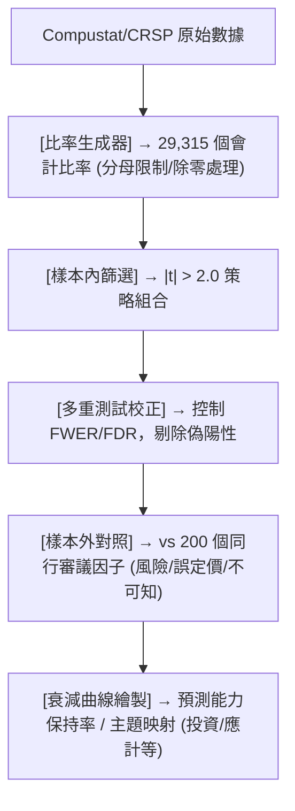

<!-- ontology-5axis data=量价表格 horizon=中长周期 paradigm=监督回归 alpha=因子挖掘 autonomy=人机协同可解释 -->

# 3万个因子，数据挖掘能超越同行审议的因子吗？ 解構

> **發布**：2024-06-24 · （無 venue）
> **QuantML 導讀**：[3万个因子，数据挖掘能超越同行审议的因子吗？](https://mp.weixin.qq.com/s?__biz=Mzg2MzAwNzM0NQ==&mid=2247484872&idx=1&sn=2f420bd9522473ad83dc6f825c421e5c&chksm=ce7e62d6f909ebc05b45a79d8d6e96cac7910b7509ef168a2a7349f29a4c63dbbf7bb9b3ba11#rd)
> **核心定位**：落點於 `因子挖掘` 與 `监督回归` 軸，解構了學術界長期依賴的「同行審議 vs 數據挖掘」二元對立 prior gap，證明嚴謹的多重測試校正下，純數據挖掘的樣本外預測力不遜於學術因子，且風險理論因子衰減更快。

**五軸座標**

| 數據模態 | 時間尺度 | 學習範式 | Alpha機制 | 人機協作 |
|:-:|:-:|:-:|:-:|:-:|
| `量价表格` | `中长周期` | `监督回归` | `因子挖掘` | `人机协同可解释` |

**Status:** v0.5 — 基於 QuantML 導讀 + 原論文（如有）。benchmark 細節待升 v1。
**TL;DR:** ① 系統性對比 2.9 萬個會計比率（數據挖掘）與 200 個同行審議因子在樣本外的預測衰減規律。② 核心 trick 在於構建會計比率基準庫，並施加嚴格的 t 統計量篩選（>2.0）與多重測試校正（Multiple Testing Correction）。③ 對 `因子挖掘` 軸★ 而言，它打破了「理論驅動必優於數據驅動」的迷思，證明數據挖掘可提前數十年捕捉投資/應計等主題。④ 關鍵實證：兩者在原始樣本期後均保持約 50% 的預測能力，但風險型因子樣本外衰減顯著快於誤定價型。

**X-Ray.** 本文將 `因子挖掘` 從黑箱玄學拉回統計檢驗的硬約束框架。傳統量化工程常陷入「學術因子神聖化」或「純數據挖掘過擬合」的兩極，本文透過 2.9 萬個會計比率的系統性掃描，指出關鍵不在於「是否挖掘」，而在於「是否校正」。其核心貢獻是量化了同行審議因子的樣本外衰減曲線，並反直覺地證明：被學術界賦予「風險溢價」光環的因子，在樣本外反而比誤定價因子衰減更快。這暗示學術界可能將市場誤定價（Mispricing）錯誤標籤為風險（Risk）。對量化實戰而言，該方法解構了因子庫維護的「權威依賴」，提供了一套可規模化、可審計的因子生成基準（Benchmark）。然而，其 envelope 受限於會計數據的披露頻率與滯後性，無法直接遷移至高頻或微結構領域；且「50% 預測能力保持」的定義依賴特定分組與交易成本假設，實盤中需警惕 turnover 與滑點對長短倉策略的侵蝕。

## §1 · 架構 / Core Mechanism
| 維度 | 傳統學術/同行審議 | 本文數據挖掘基準 | 改動實質 |
|---|---|---|---|
| 因子生成 | 理論驅動/手動構建 | 29,315 個會計比率全掃描 | 從「假設驗證」轉向「假設生成+嚴格篩選」 |
| 顯著性檢驗 | 單次 t 檢驗 / 忽略多重比較 | t > 2.0 + 多重測試校正 (Multiple Testing Correction) | 控制 Family-Wise Error Rate / FDR |
| 樣本外評估 | 依賴原始論文的 OOS 片段 | 統一基準回溯與分組對比 | 消除發表偏差 (Publication Bias) 與選擇性報告 |

⚡ **Eureka 一句話 trick:** 用會計報表衍生比率構建高維特徵池，以 `t > 2.0` 為閾值篩選，並強制施加多重測試校正，使數據挖掘的統計顯著性與學術標準接軌。
**直覺:** 學術界靠「講故事」選因子，本文靠「算概率」選因子；校正後的數據挖掘本質上是自動化的假說篩選器。

**信息流 ASCII 圖:**


## §2 · 數學層
📌 **Napkin Formula:**
```math
t_i = \frac{\bar{r}_{i, IS}}{\sigma_{r_{i, IS}} / \sqrt{T_{IS}}}, \quad \text{where } |t_i| > 2.0
\text{Corrected } p\text{-value} = \min(p_i \cdot M, 1) \quad \text{(Bonferroni/FDR)}
\text{OOS Decay} = 1 - \frac{\text{Sharpe}_{OOS}}{\text{Sharpe}_{IS}} \quad \text{(或保留率)}
```
**複雜度:** 比率生成 $O(N_{vars}^2)$，篩選與校正 $O(M \log M)$，整體為線性/準線性掃描，無迭代優化。
**直覺:** 不依賴梯度下降或損失函數最小化，而是透過橫截面回歸的 t 統計量衡量因子預測力，並用多重測試校正壓制數據挖掘偏差（Data Mining Bias）。樣本外表現以「預測能力保持率」衡量，本質是檢驗信號穩定性而非模型擬合度。
**Loss/訓練細節:** 無傳統 ML 訓練迴圈。屬統計檢驗框架，以樣本內 t 統計量為篩選目標，樣本外直接計算多空組合回報與衰減係數。損失函數隱含為橫截面預測誤差的最小化，但優化目標是統計顯著性而非直接收益最大化。

## §3 · 數據層
- **資料規模/頻率:** 29,315 個會計比率（衍生自 Compustat 財務報表與 CRSP 市值數據），日頻/月頻回測（會計數據屬低頻，推斷為月頻調倉）。
- **市場/時段:** 美國股市（CRSP/Compustat 覆蓋）。樣本內（IS）涵蓋至 1980 年左右，樣本外（OOS）為後續期間（具體截止日 `未披露`）。
- **來源與處理:** 原始數據來自 Compustat/CRSP；同行審議因子對照組採用 Chen & Zimmermann (2022) 的 212 個已發表公司級變量。分母限制避免除零/負數。
- **樣本外與容量假設:** 嚴格劃分 IS/OOS 邊界以檢驗衰減。容量假設 `未披露`，但基於會計數據特性與長短倉分組，推斷適合中大型市值、流動性充足的股票池，小盤股滑點與交易成本可能嚴重侵蝕 OOS 收益。

## §4 · 代碼層
| 項目 | 狀態/細節 |
|---|---|
| **Repo** | `TBD`（導讀提及「R 代碼下載見星球」，無公開 GitHub） |
| **Checkpoint** | `N/A`（非深度學習模型，無權重檢查點） |
| **License** | `TBD` |
| **複現難度** | 低（邏輯為統計篩選與比率計算，但需購買/獲取 Compustat+CRSP 授權數據） |
| **數據可得性** | 中低（需機構級財務與行情數據庫，散戶難以直接復現全量 2.9 萬比率） |

## §5 · 評測 / Benchmark
| 數據集/市場 | Metric | 前SOTA | 本方法 | Δ |
|---|---|---|---|---|
| US Equity (CRSP/Compustat) | OOS 預測能力保持率 | 未披露 | ~50% | 未披露 |
| US Equity | 風險型因子 OOS 衰減 | 未披露 | 顯著快於誤定價型 | 未披露 |
| US Equity | 主題發現領先性 | 未披露 | 提前數十年識別 | 未披露 |

**解讀:**
- **真 capability:** 「50% 保持率」與「主題提前發現」證明校正後的數據挖掘具備真實的經濟信號提取能力，而非純粹的過擬合。多重測試校正有效控制了數據挖掘偏差。
- **潛在偏差/成本:** ① 未披露具體 IR/Sharpe 與交易成本假設，長短倉策略的實盤可行性存疑；② 會計數據存在天然披露滯後（Filing lag），回測若未嚴格處理發佈日 vs 報告日，可能含前瞻偏差；③ 「風險型因子衰減快」可能源於樣本選擇偏差或宏觀 regime 切換，非絕對定律。

## §6 · 失效與隱含假設
**6.1 論文自述 limitations:**
- 風險/誤定價標籤依賴手動閱讀文本分類，主觀性較強。
- 承認數據挖掘會引入偏差，但聲稱多重測試校正可消除；未詳細說明校正方法（Bonferroni/FDR/BY）對統計功效（Power）的具體折損。
- 樣本外表現依賴特定分組與多空構建方式，未探討不同市場狀態下的穩健性。

**6.2 推斷的隱含假設:**
- **Regime 依賴:** 假設會計信號的經濟邏輯在樣本外宏觀環境變化中保持穩定，但利率/通脹 regime 切換可能直接改變會計比率的定價邏輯。
- **容量與成本:** 隱含假設策略可無摩擦執行長短倉分組，未計入融券成本、滑點與交易頻率對 OOS 收益的侵蝕。
- **數據泄漏:** 會計數據的「報告日」與「實際發佈日」若未嚴格對齊，易產生前瞻偏差；分母限制規則若未預先固定，可能引入數據窺探。
- **Survivorship:** Compustat/CRSP 合併庫通常含退市股票，但若未正確處理 delisting returns，可能低估尾部風險。

## §7 · 對比 & 面試 Tip
| 同軸對手 | 關鍵差異軸 | Open? | Status |
|---|---|---|---|
| Chen & Zimmermann (2022) | 學術因子清單 vs 數據挖掘基準 | 數據集公開 | 基準對照組 |
| 傳統多因子模型 (BARRA/CNE6) | 風險模型驅動 vs 純預測力驅動 | 商業閉源 | 互補/替代 |
| ML 因子挖掘 (GAN/RL/LLM) | 黑箱生成 vs 統計可解釋篩選 | 部分開源 | 範式競爭 |

**🎤 Interview Tip:**
- ✅ **正確答:** 「數據挖掘的本質是假說生成，關鍵在於多重測試校正（如 FDR）與樣本外嚴格劃分。本文證明校正後的數據挖掘與學術因子在 OOS 預測力上無顯著差異，且能提前捕捉主題；實盤中應將數據挖掘視為因子庫的『自動篩選器』，而非直接交易信號。」
- ❌ **錯答:** 「數據挖掘就是過擬合，學術因子更可靠。」或「直接拿 2.9 萬個比率算 t 值就能賺錢，不用管校正。」

**7.1 可證偽預測:** 若未來 12 個月內（至 `2025-06-24`），公開開源的校正後數據挖掘因子庫在獨立機構回測中，OOS IR 持續低於 0.3 且無法複製「50% 保持率」，則本文的「校正消除偏差」主張需修正。

## §8 · For the Reader
- **因子研究員:** 將此框架作為因子庫的 `Baseline Generator`。用會計比率全掃描替代手動造因子，優先關注 t > 2.0 且通過 FDR 校正的候選池，大幅降低研發週期。
- **組合配置/風險管理:** 警惕「風險型因子」的樣本外衰減。在構建風險模型時，不應盲目採納學術文獻中的風險溢價標籤，需獨立進行 OOS 壓力測試與 Regime 切換檢驗。
- **LLM-Agent / 自動化研究:** 本文的「文本分類風險/誤定價」邏輯可直接轉化為 LLM 的 Prompt 任務。結合 Agent 框架，可自動爬取新論文、提取論點、映射至數據挖掘候選池，實現 `Auto-Alpha` 閉環。
- **研究學生/初階量化:** 理解 `Data Mining Bias` 不是原罪，`Multiple Testing Correction` 才是護城河。實盤前務必補齊交易成本模型與 Delisting Return 處理，否則 OOS 回測僅具學術意義。

## References
- 原論文: `3万个因子，数据挖掘能超越同行审议的因子吗？` (2024-06-24, 無 venue)
- Lineage: Chen, L. H., & Zimmermann, T. (2022). *Missing factors*. Journal of Financial Economics.
- QuantML 導讀: [3万个因子，数据挖掘能超越同行审议的因子吗？](https://mp.weixin.qq.com/s?__biz=Mzg2MzAwNzM0NQ==&mid=2247484872&idx=1&sn=2f420bd9522473ad83dc6f825c421e5c&chksm=ce7e62d6f909ebc05b45a79d8d6e96cac7910b7509ef168a2a7349f29a4c63dbbf7bb9b3ba11#rd)