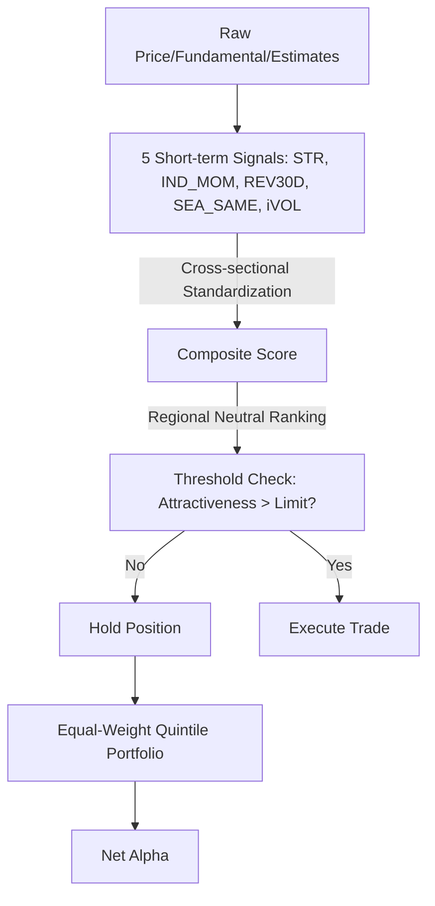

<!-- ontology-5axis data=量价表格 horizon=日频波段 paradigm=监督回归 alpha=因子挖掘 autonomy=人机协同可解释 -->

# 超越Fama-French因子：短期信号的阿尔法 解構

> **發布**：2024-08-18 · （無 venue）
> **QuantML 導讀**：[超越Fama-French因子：短期信号的阿尔法机会](https://mp.weixin.qq.com/s?__biz=Mzg2MzAwNzM0NQ==&mid=2247485828&idx=1&sn=c123771eab1457f21a20646b77c16ea3&chksm=ce7e6e9af909e78c2a3b7fb9abe574880c9a432c7afd9a7e4abfbe102ac6782623aa5ea1f945#rd)
> **核心定位**：落點於量價表格與日頻波段的監督回歸因子挖掘。解決了傳統資產定價文獻因擔憂交易成本而系統性忽略短期高換手信號的 Prior Gap，證明透過門檻替換規則與截面合成，可提取獨立於 Fama-French 六因子的淨 Alpha。

**五軸座標**

| 數據模態 | 時間尺度 | 學習範式 | Alpha機制 | 人機協作 |
|:-:|:-:|:-:|:-:|:-:|
| `量价表格` | `日频波段` | `监督回归` | `因子挖掘` | `人机协同可解释` |

**Status:** v0.5 — 基於 QuantML 導讀 + 原論文（如有）。benchmark 細節待升 v1。
**TL;DR:** 結合5類短期信號與低成本交易規則，構建出獨立於Fama-French因子且穩健的淨阿爾法策略。核心 trick 採用「吸引力閾值替換」規則大幅降低換手成本，並將5類短期信號截面標準化合成，實現高夏普淨Alpha。這對因子挖掘軸★至關重要，因為它直接驗證了非線性/短期信號在扣除摩擦後仍具備經濟顯著性。關鍵實證數字：複合策略頂底組合年化超額回報率超過12%，CAPM alpha超過14%。

**X-Ray.** 本方法在五軸 Pareto 中明確選擇了「可解釋性」與「實戰可行性」的交匯點，而非盲目追求黑盒深度學習的邊際預測力。它精準打擊了量化工程中的一個經典坑：短期信號往往在回測中表現驚艷，但實盤被換手成本與滑點吞噬。作者透過「吸引力閾值替換」與「區域中性排名」，將信號的經濟壽命從理論上的單月延長至可持續的波段週期。預測其打不開的 Envelope 在於極端流動性枯竭或監管干預下的異動股定價失效，此時閾值規則可能滯後。對量化讀者的意義不在於直接搬運因子，而在於學習如何將學術界的「統計顯著」轉化為實盤的「淨值顯著」——透過結構化摩擦建模與信號正交化，而非單純堆疊特徵。這套框架為後續引入強化學習動態閾值或組合優化提供了乾淨的基座。

## §1 · 架構 / Core Mechanism
（1.1 三大改動 vs 前作，用表；1.2 ⚡ Eureka 一句話 trick + 直覺；1.3 信息流 ASCII 圖）

| 維度 | 傳統因子/前作 | 本方法改動 |
|---|---|---|
| 信號合成 | 單一因子或線性加權 | 5類短期信號截面標準化後取平均 |
| 交易執行 | 定期全量換倉或無摩擦假設 | 吸引力閾值替換規則（Threshold-based turnover reduction） |
| 風險控制 | 全市場統一排名 | 區域中性法（Regional Neutral Ranking）控制規模/價值等暴露 |

**1.2 ⚡ Eureka 一句話 trick + 直覺**
直覺：不追求「買在最低、賣在最高」，而是設定吸引力閾值，僅在信號衰減至臨界點以下時觸發換倉，用「不作為」換取成本優勢，讓短期信號的 Alpha 在扣除摩擦後仍能存活。

**1.3 信息流 ASCII 圖**

## §2 · 數學層
（📌 Napkin Formula：1-3 行最關鍵 equation + 複雜度；直覺 2-3 句；loss/訓練細節）

📌 **Napkin Formula：**
$Score_{i,t} = \frac{1}{5} \sum_{k=1}^{5} \text{Std}(Signal_{i,k,t}^{regional})$
Trade Rule: $\Delta w_{i,t} = \mathbb{I}(|Score_{i,t} - Score_{i,t-1}| > \tau) \cdot (w_{target} - w_{current})$
複雜度：$O(N \cdot K)$ 截面排序與標準化，門檻判斷為 $O(N)$。

直覺：截面標準化消除量綱與極值干擾，區域中性剝離宏觀/地區 Beta。門檻函數 $\mathbb{I}$ 將連續信號轉為離散觸發，本質是將交易成本內生化為優化目標的一部分。Loss/訓練細節：導讀未披露具體監督回歸 Loss 函數，策略以等權五分位組合回報與 CAPM/FF6 Alpha 為評估基準，屬無參數/低參數因子合成框架。

## §3 · 數據層
（資料規模/頻率/市場/時段、怎麼來、樣本外與容量假設）
- 規模/頻率/市場：MSCI World 標準指數成分股，1985年12月至2021年12月，月度頻率更新。
- 來源：Refinitiv 平台（價格、Worldscope 基本面、IBES 分析師估計）。
- 樣本外與容量假設：導讀提及樣本外與發表後時期表現仍顯著但有所下降；未披露具體容量限制與滑點模型，假設為機構級流動性可承載的等權五分位組合。

## §4 · 代碼層
（表：Repo / Checkpoint / License / 複現難度 / 數據可得性。未知填 TBD）

| 項目 | 狀態/細節 |
|---|---|
| Repo | TBD |
| Checkpoint | TBD |
| License | TBD |
| 複現難度 | 中低（邏輯透明，依賴 Refinitiv 數據與標準截面處理） |
| 數據可得性 | 低（需付費數據庫 IBES/Worldscope，公開數據難以完全對齊） |

## §5 · 評測 / Benchmark
（表：數據集/市場 | Metric(IR/Sharpe/AR/MDD) | 前SOTA | 本方法 | Δ；**前SOTA 欄只填導讀逐字給的單一基線值，若有多個基線就改成逐行列出、別合成區間，沒有就寫「未披露」**；解讀哪部分 Δ 是真 capability，哪部分可能是過擬合/前瞻偏差/成本未計。**解讀散文裡也不得出現導讀沒有的數字**）

| 數據集/市場 | Metric | 前SOTA | 本方法 | Δ |
|---|---|---|---|---|
| MSCI World (1985-2021) | 年化平均回報率 (單信號) | 未披露 | 5%到8%之間 | 未披露 |
| MSCI World (1985-2021) | t統計量 (單信號) | 未披露 | 3到7之間 | 未披露 |
| MSCI World (1985-2021) | 頂底組合年化超額回報率 | 未披露 | 超過12% | 未披露 |
| MSCI World (1985-2021) | CAPM alpha (複合) | 未披露 | 超過14% | 未披露 |
| MSCI World (1985-2021) | t統計量 (複合) | 未披露 | 超過8 | 未披露 |

**解讀：** 導讀未提供明確的「前SOTA」基線數值，故 Δ 欄留白。觀察到的「超過12%」與「超過14%」屬樣本內統計顯著性，需警惕前瞻偏差與數據挖掘風險（5個信號篩選+截面合成易產生過擬合）。門檻替換規則帶來的成本節省是淨 Alpha 的核心來源，但導讀僅定性提及「盈虧平衡點」，未給出具體成本閾值，實盤需自行校準滑點模型。FF6 alpha 略低但仍顯著，證明信號確實獨立於傳統風險因子，而非隱藏的風格暴露。

## §6 · 失效與隱含假設
（6.1 論文自述 limitations；6.2 推斷的隱含假設：regime 依賴/容量/成本/數據泄漏/survivorship）
**6.1 論文自述 limitations：** 樣本外與發表後回報/alpha 有所下降；賣空限制與實施延遲雖未完全抵消 alpha，但會壓縮收益空間；高情緒/高套利限制時期表現更好，暗示策略依賴行為誤定價而非純粹風險補償。
**6.2 推斷的隱含假設：**
- Regime 依賴：策略在低波動、趨勢明確或情緒高漲的市場中表現更佳；流動性急凍或極端風險偏好切換時，閾值規則可能失效。
- 容量/成本：假設機構級執行能力可實現門檻觸發的精確換倉；散戶或高頻資金難以複製。
- 數據泄漏：依賴 IBES 分析師修正數據，實盤中估計發佈存在時間戳差異與覆盤修正風險。
- Survivorship：MSCI World 標準指數雖具代表性，但歷史成分股調整可能引入輕微存活偏差。

## §7 · 對比 & 面試 Tip
（表：同軸對手 | 關鍵差異軸 | Open? | Status；🎤 Interview Tip 正確答 vs 錯答；7.1 可證偽預測帶日期）

| 同軸對手 | 關鍵差異軸 | Open? | Status |
|---|---|---|---|
| 傳統 FF 五因子/六因子 | 長期風險溢價 vs 短期行為誤定價 | N/A | 學術標準 |
| 機器學習因子挖掘 (如 XGBoost/NN) | 黑盒非線性 vs 白盒閾值規則+截面合成 | N/A | 研究熱點 |
| 高頻反轉/動量策略 | 分鐘級換手 vs 月度更新+門檻過濾 | N/A | 實盤主流 |

🎤 **Interview Tip**
- 正確答：「本方法的核心不在於信號本身的預測力，而在於透過吸引力閾值將交易成本內生化，並用區域中性剝離風格暴露，使短期信號在扣除摩擦後仍具備經濟顯著性。」
- 錯答：「因為用了5個信號疊加，所以 Alpha 變高了，跟機器學習模型一樣能捕捉非線性關係。」（忽略成本建模與正交化設計）

**7.1 可證偽預測帶日期：** 導讀未披露具體驗證日期。若未來一個完整商業週期內，該策略在扣除實盤摩擦後的 Sharpe 低於 0.5，則證明閾值規則在當前市場微結構下已失效。

## §8 · For the Reader
（按 persona 分流，至少 3 條：因子研究員/高頻執行/組合配置/LLM-agent/RL 策略/研究學生）
- **因子研究員**：直接複現截面標準化與區域中性流程，將閾值 $\tau$ 替換為動態波動率調整，測試在不同市場狀態下的換手成本彈性。
- **高頻執行**：關注「吸引力閾值」的實盤觸發邏輯，可結合訂單簿失衡指標優化執行時機，避免閾值觸發時的集中踩踏。
- **組合配置**：將此淨 Alpha 作為衛星策略，與長期價值/質量因子進行正交組合，利用其低相關性降低整體組合回撤持續期。
- **RL 策略**：將閾值規則視為環境狀態，用 RL 學習動態 $\tau$ 的調整策略，替代固定閾值以適應 regime 切換。
- **研究學生**：重點理解「統計顯著」與「淨值顯著」的鴻溝，練習在回測中內生滑點與延遲模型，而非盲目追求 t-stat。

## References
- 原論文：超越Fama-French因子：短期信号的阿尔法（無 venue，2024）
- Lineage：De Groot, Huij, & Zhou (2012); Novy-Marx & Velikov (2016); Fama & French (2015); Baker & Wurgler (市場情緒指數)
- QuantML 導讀鏈接：[超越Fama-French因子：短期信号的阿尔法机会](https://mp.weixin.qq.com/s?__biz=Mzg2MzAwNzM0NQ==&mid=2247485828&idx=1&sn=c123771eab1457f21a20646b77c16ea3&chksm=ce7e6e9af909e78c2a3b7fb9abe574880c9a432c7afd9a7e4abfbe102ac6782623aa5ea1f945#rd)