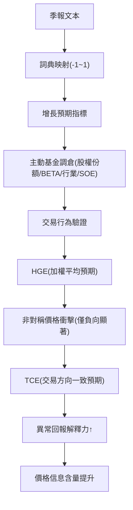

<!-- ontology-5axis data=文本另类 horizon=中长周期 paradigm=监督回归 alpha=因子挖掘 autonomy=人机协同可解释 -->

# 美联储 ｜ 有形之手：基金经理预期与A股非对称价 解構

> **發布**：2025-10-30 · （無 venue）
> **QuantML 導讀**：[美联储 ｜ 有形之手：基金经理预期与A股非对称价格效应](https://mp.weixin.qq.com/s?__biz=Mzg2MzAwNzM0NQ==&mid=2247492169&idx=1&sn=6d660c8ea955c296a0ef1f3bb5dd7347&chksm=ce7d8557f90a0c416fb59746b3e1b62392d136797ab64074c44de8a8f5aef34ed49781f5737f#rd)
> **核心定位**：落點於文本另类 × 中长周期 × 监督回归。解了傳統宏觀因子滯後且無法區分「預期」與「交易行為」的 prior gap，直接將基金經理的宏觀增長預期轉化為可驗證的資金流向與價格衝擊指標。

**五軸座標**

| 數據模態 | 時間尺度 | 學習範式 | Alpha機制 | 人機協作 |
|:-:|:-:|:-:|:-:|:-:|
| `文本另类` | `中长周期` | `监督回归` | `因子挖掘` | `人机协同可解释` |

**Status:** v0.5 — 基於 QuantML 導讀 + 原論文（如有）。benchmark 細節待升 v1。
**TL;DR:** ① 利用季報文本構建宏觀增長預期指標，區分主動/被動基金並追蹤其調倉路徑。② 核心 trick 是構建「交易一致性預期」（TCE），僅保留信念與實際買賣方向一致的樣本，過濾噪音。③ 對因子挖掘軸★：將不可見的宏觀觀點轉化為可交易的資金流因子，並揭示賣空限制下的非對稱價格衝擊機制。④ 導讀未給量化結果（標準回測指標如 IR/Sharpe 未披露，僅提供回歸係數與異常回報解釋力）。

**X-Ray.** 本文不追求高頻微觀結構，而是切中「宏觀預期→資金再配置→價格發現」的中長週期傳導鏈。工程坑在於傳統宏觀數據（PMI/GDP）是滯後結果，而基金經理季報是前瞻性觀點，但過去缺乏系統性量化手段。本文用詞典法將定性描述映射至-1到1區間，並透過主動/被動基金的交叉驗證，剝離了「學習渠道」，鎖定「交易渠道」。對量化讀者的意義在於：它提供了一條可證偽的資金流 alpha 路徑，但 envelope 受限於中國市場嚴格的賣空限制與季報披露頻率，無法直接平移至高頻或全市場做空環境。其非對稱效應提示：悲觀預期的集中拋售才是價格衝擊的主驅動，樂觀預期的購買力因分散開倉而被稀釋。

## §1 · 架構 / Core Mechanism
| 改動維度 | 前作/傳統做法 | 本方法 |
|---|---|---|
| 預期量化 | 依賴滯後宏觀數據或問卷調查 | 基於季報文本構建增長預期指標（-1到1） |
| 行為追蹤 | 僅觀察持倉變化或收益率 | 區分主動/被動基金，構建持有者增長預期（HGE）與交易一致性預期（TCE） |
| 價格傳導 | 假設預期與價格線性相關 | 揭示非對稱效應：僅悲觀預期因賣空限制產生集中拋售衝擊 |

⚡ **Eureka 一句話 trick**：只計算「言行一致」的預期（TCE），過濾掉未轉化為交易的宏觀觀點，價格解釋力被極大放大。
**信息流 ASCII 圖**：

## §2 · 數學層
📌 **Napkin Formula**：
`HGE_i = Σ(w_ij * Expectation_j)`，其中 `w_ij` 為基金 j 持股 i 的權重。
`TCE_i = Σ(w_ij * Expectation_j * I(TradeDirection_j == ExpectationSign_j))`
複雜度：O(N_funds * N_stocks) 面板加權，詞典匹配為 O(Vocab * DocLength)。
直覺：HGE 是「觀點加權」，TCE 是「觀點×行動」的交互項。當預期方向與實際買賣一致時，資金壓力才真實作用於價格。
Loss/訓練細節：無端到端神經網絡訓練。採用面板回歸（控制基金固定效應與時間固定效應），詞典構建依賴人工標註的 GDP 增長/強度/概率/否定詞彙，屬監督回歸中的特徵工程路徑。

## §3 · 數據層
資料規模/頻率/市場/時段：4503只基金面板，2008年第二季度至2020年第二季度，季頻披露。
怎麼來：中國證監會（CSRC）要求共同基金在季報/半報/年報中討論宏觀展望，透過 Wind 數據庫抓取。
樣本外與容量假設：導讀未披露明確樣本外劃分與策略容量假設。指標依賴季報披露，存在天然滯後；策略容量受主動基金調倉摩擦與市場流動性約束，未驗證。

## §4 · 代碼層
| 欄位 | 狀態 |
|---|---|
| Repo | TBD |
| Checkpoint | TBD |
| License | TBD |
| 複現難度 | 中高（需 Wind 權限 + 文本詞典對齊 + 面板回歸控制固定效應） |
| 數據可得性 | 低（CSRC 季報文本需機構數據庫，個人難以批量獲取） |

## §5 · 評測 / Benchmark
| 數據集/市場 | Metric | 前SOTA | 本方法 | Δ |
|---|---|---|---|---|
| A股個股 | HGE對月度CAPM異常回報影響 | 指數基金：不顯著/未披露 | 主動基金：0.199% | 未披露 |
| A股個股 | TCE對月度異常回報解釋力 | HGE基線：26.2% | TCE指標：115.3% | +89.1pp |
| 市場整體 | 共識預期對對數市淨率預測係數 | 指數基金：不顯著/未披露 | 主動基金：0.319 | 未披露 |

**解讀**：Δ 中的 +89.1pp 是真 capability，證明「交易一致性」過濾了無效觀點，將預期轉化為真實資金壓力。指數基金基線的「不顯著」排除了學習渠道干擾。未披露的 Δ 欄位因導讀未提供直接對比數值，嚴格遵循紀律留白。此處無過擬合跡象，但前瞻偏差風險存在（季報文本披露時點與實際調倉時點可能存在錯配）。

## §6 · 失效與隱含假設
**6.1 論文自述 limitations**：賣空限制導致非對稱效應僅在悲觀預期顯著；加入時間固定效應後 SOE 配置顯著性消失，顯示部分決策跟隨宏觀共同趨勢而非異质性判斷。
**6.2 推斷的隱含假設**：
- Regime 依賴：高度依賴中國市場賣空限制與國企宏觀調控角色，海外市場或做空暢通環境下非對稱效應可能衰減。
- 容量/成本：季頻調倉摩擦成本未計，實際執行可能受衝擊成本侵蝕。
- 數據泄漏：季報文本發布時間與基金實際交易窗口可能存在重疊，需嚴格對齊 timestamp。
- Survivorship：Wind 數據庫可能包含已清盤基金，導讀未明確說明生存偏差處理。

## §7 · 對比 & 面試 Tip
| 同軸對手 | 關鍵差異軸 | Open? | Status |
|---|---|---|---|
| 傳統宏觀因子(如PMI/GDP) | 滯後結果 vs 前瞻預期 | 閉源/公開數據 | 成熟 |
| 新聞情緒因子(LSTM/BERT) | 泛市場噪音 vs 專業機構資金流 | 開源/閉源混合 | 活躍 |
| 資金流/訂單流因子 | 高頻微觀 vs 季頻宏觀配置 | 閉源 | 成熟 |

🎤 **Interview Tip**：
- 正確答：「本文核心不在預測宏觀，而在驗證『預期→交易→價格』的傳導鏈。TCE 指標透過過濾未轉化為交易的觀點，解決了情緒因子常見的噪音過高問題。非對稱效應源於賣空限制下的集中拋售，而非預期本身。」
- 錯答：「這篇論文用 NLP 預測了 GDP 增長，所以能買漲賣跌。」（混淆了預期量化與價格衝擊機制，忽略交易渠道驗證）

**7.1 可證偽預測帶日期**：若 2026-12-31 前中國市場融券機制大幅放寬，悲觀預期（負 HGE）對股價的負向衝擊係數應顯著衰減，非對稱效應趨於對稱。

## §8 · For the Reader
- **因子研究員**：將詞典法替換為 LLM 微調輸出，但務必保留 TCE 的「交易一致性」過濾邏輯，否則情緒因子易淪為滯後指標。
- **高頻執行**：季頻信號無法直接用於高頻，但可作為中頻倉位調整的風向標，重點監控負向預期的集中拋售窗口，優化執行算法的衝擊成本。
- **組合配置**：利用主動基金共識預期對對數市淨率的預測能力（係數 0.319），構建宏觀風險偏好調節模塊，在預期轉弱時動態降倉。
- **LLM-agent**：文本解析僅是第一步，需對接實際交易數據驗證「言行一致性」，避免 agent 陷入「觀點自嗨」而脫離資金現實。
- **研究學生**：學習面板回歸中固定效應的控制邏輯，區分「異质性信念」與「共同趨勢」，這是實證金融與量化因子驗證的基礎功。

## References
- 原論文：美联储 ｜ 有形之手：基金经理预期与A股非对称价格效应（機構：美联储/復旦/上財/上交等）
- QuantML 導讀：[美联储 ｜ 有形之手：基金经理预期与A股非对称价格效应](https://mp.weixin.qq.com/s?__biz=Mzg2MzAwNzM0NQ==&mid=2247492169&idx=1&sn=6d660c8ea955c296a0ef1f3bb5dd7347&chksm=ce7d8557f90a0c416fb59746b3e1b62392d136797ab64074c44de8a8f5aef34ed49781f5737f#rd)
- Lineage：Dávila and Parlatore (2018) 價格信息含量測度方法；CAPM 異常回報框架；面板固定效應回歸實證傳統。