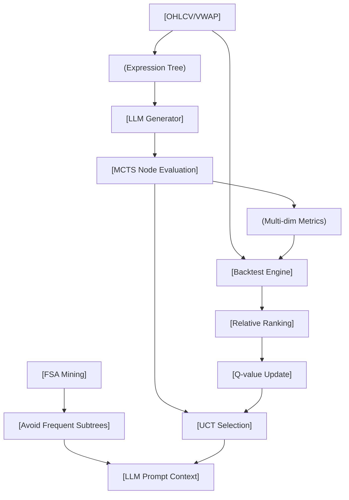

<!-- ontology-5axis data=量价表格 horizon=日频波段 paradigm=生成式大模型 alpha=因子挖掘 autonomy=人机协同可解释 -->

# LLM+MCTS Alpha Mining 解構

> **發布**：2025-06-07 · （無 venue）
> **QuantML 導讀**：[清华IIIS学院 | LLM+MCTS驱动的Alpha因子挖掘框架](https://mp.weixin.qq.com/s?__biz=Mzg2MzAwNzM0NQ==&mid=2247490641&idx=1&sn=88a150a7bb8b2016d3e1c295cda7f9d9&chksm=ce7e7b4ff909f2594700e7ad90ae6ca0f148c6efbb2ccfac783068712f25dfcf8cdfb79f9d13#rd)
> **核心定位**：落點於「生成式大模型×因子挖掘×人機協同可解釋」軸，解決傳統 GP/RL 自動化挖掘中「搜索效率低」與「公式黑箱/晦澀」的 Prior Gap，將 Alpha 發現建模為帶金融回測即時反饋的樹搜索過程。

**五軸座標**

| 數據模態 | 時間尺度 | 學習範式 | Alpha機制 | 人機協作 |
|:-:|:-:|:-:|:-:|:-:|
| `量价表格` | `日频波段` | `生成式大模型` | `因子挖掘` | `人机协同可解释` |

**Status:** v0.5 — 基於 QuantML 導讀 + 原論文（如有）。benchmark 細節待升 v1。
**TL;DR:** ① 將 Alpha 因子挖掘重構為 MCTS 驅動的樹搜索，LLM 負責節點擴展與優化建議生成。② 核心 Trick 是以多維度回測指標直接評分 MCTS 節點，並引入「頻繁子樹規避 (FSA)」抑制結構同質化。③ 對「人機協同可解釋」軸★，LLM 的邏輯推理與 FSA 機制強制輸出符合金融直覺的表達式樹，打破 RL/GP 的黑箱困境。④ 導讀未給量化結果。

**X-Ray.** 放回五軸 Pareto，本法將「生成式大模型」的組合能力與「MCTS」的探索/利用平衡耦合，本質上是把 Alpha 挖掘從「暴力枚舉」升級為「帶金融反饋的啟發式搜索」。它解了兩個舊工程坑：一是傳統 GP/RL 缺乏領域知識引導導致公式結構晦澀難懂，本法透過 LLM 的 Few-shot 提示與 FSA 機制，強制模型避開濫用的根基因，維持因子多樣性；二是回測反饋滯後問題，本法將多維度評估直接映射為節點 Q 值更新信號，實現即時導航。預測其打不開的 envelope 在於：LLM 的 Token 生成成本與回測引擎的並行瓶頸將限制高頻迭代；且相對排名機制在有效庫膨脹後易陷入局部最優。對量化讀者的意義在於，提供了一套可插拔的「因子結構演化器」，可與現有組合模型對接，但需警惕 LLM 幻覺導致的語法正確卻經濟邏輯空洞的偽因子。

## §1 · 架構 / Core Mechanism
| 維度 | 傳統 GP/RL 自動化挖掘 | LLM+MCTS Alpha Mining | 工程意義 |
|---|---|---|---|
| 搜索策略 | 隨機變異/交叉或策略梯度暴力探索 | UCT 準則引導的樹搜索 + 虛擬動作擴展 | 平衡探索與利用，避免無效分支膨脹 |
| 反饋機制 | 單一目標函數或延遲獎勵 | 多維度回測指標即時評分 + 相對排名 | 細粒度導航，降低過擬合與換手率失控風險 |
| 結構控制 | 無顯式結構約束，易生成晦澀公式 | 頻繁子樹規避 (FSA) + LLM 優化歷史上下文 | 抑制同質化，維持因子庫多樣性與可解釋性 |

⚡ **Eureka 一句話 trick + 直覺**：用金融回測多維指標直接評估 MCTS 節點，結合頻繁子樹規避機制，引導 LLM 迭代生成高預測力且可解釋的 Alpha 公式。直覺：把因子挖掘當成「下棋」，每一步優化都看實戰回測分數，並記住「別再走別人走爛的套路」。

**信息流 ASCII 圖**

## §2 · 數學層
📌 **Napkin Formula**：
1. UCT Selection: $UCT(a) = Q(s, a) + c \sqrt{\frac{\ln N(s)}{N(s, a)}}$
2. Dimension Sampling: $P(d_i) = \frac{\exp(-score_{d_i} / \tau)}{\sum_j \exp(-score_{d_j} / \tau)}$ （低分維度被選中概率高）
3. Relative Ranking: $Rank_{IC}(\alpha) = \frac{1}{|S|} \sum_{\alpha' \in S} \mathbb{I}(IC(\alpha) > IC(\alpha'))$

**複雜度**：節點擴展依賴 LLM 推理與回測引擎，單次迭代成本為 $O(T_{LLM} + T_{BT})$；FSA 挖掘頻繁子樹需遍歷有效庫，近似 $O(|S| \cdot L_{tree})$。
**直覺**：內層優化學習組合模型參數以最大化性能指標，外層優化搜索 Alpha 集合使指標最大。本法將外層搜索離散化為樹節點擴展，用多維得分平均作為獎勵信號更新 Q 值。
**Loss/訓練細節**：無傳統梯度下降 Loss。訓練為迭代式提示優化與回測評估循環；過擬合風險分數由 LLM 基於公式結構與優化歷史生成定性評分，其餘維度基於回測指標相對排名計算。

## §3 · 數據層
- **資料規模/頻率/市場/時段**：導讀提及「真實世界股票市場」，未披露具體市場、樣本區間與股票數量。頻率為日频（Lookback window $w$，預測未來 $h$ 日收益率）。
- **怎麼來**：原始特徵為 OHLC、Volume、VWAP 等日频量價數據，組織為三維張量。
- **樣本外與容量假設**：未披露訓練/驗證/測試劃分細節與因子庫容量上限。假設回測引擎支持跨週期樣本外驗證，但具體滑點/手續費模型未說明。

## §4 · 代碼層
| 項目 | 狀態/細節 |
|---|---|
| Repo | TBD |
| Checkpoint | TBD |
| License | TBD |
| 複現難度 | 高（需自搭 MCTS 框架 + 對接 LLM API + 實現回測引擎與 FSA 挖掘） |
| 數據可得性 | 標準日频量價數據（TBD 具體數據源） |

## §5 · 評測 / Benchmark
| 數據集/市場 | Metric | 前SOTA | 本方法 | Δ |
|---|---|---|---|---|
| 未披露 | IC / RankIC | 未披露 | 未披露 | 未披露 |
| 未披露 | 交易表現/Sharpe | 未披露 | 未披露 | 未披露 |
| 未披露 | 可解釋性評分 | 未披露 | 未披露 | 未披露 |

**解讀**：導讀明確指出實證檢驗表明因子預測準確性、交易表現與可解釋性超越現有方法，但截斷處未給出任何具體數值、基線模型名稱或統計顯著性。因此所有欄位均為未披露。若未來補全，需警惕「相對排名」機制在樣本內訓練集上可能產生的前瞻偏差，以及 LLM 生成因子在樣本外是否具備經濟邏輯支撐而非數據窺探。

## §6 · 失效與隱含假設
**6.1 論文自述 limitations**：未完整披露（導讀截斷）。推測可能包括：LLM 生成成本高昂、回測引擎並行瓶頸、有效庫膨脹後搜索效率下降、FSA 參數 $k$ 敏感。
**6.2 推斷的隱含假設**：
- **Regime 依賴**：多維度評分權重固定，未說明如何適應波動率 regimes 切換。
- **容量/成本**：假設日频換手率控制在理想範圍，但未披露具體交易成本模型（滑點/衝擊），高頻迭代可能忽略執行摩擦。
- **數據泄漏**：相對排名依賴「有效 Alpha 庫」，若庫內包含樣本外信息或未來數據，將導致嚴重泄漏。
- **Survivorship**：未說明股票池是否處理退市/ST 股票，實盤需補齊生存者偏差校正。

## §7 · 對比 & 面試 Tip
| 同軸對手 | 關鍵差異軸 | Open? | Status |
|---|---|---|---|
| GP (GPLearn/AutoAlpha) | 搜索效率/結構約束 | 部分開源 | 成熟但易過擬合 |
| RL (AlphaGen) | 反饋粒度/可解釋性 | 閉源/部分 | 黑箱嚴重 |
| FAMA (LLM+CoT) | 搜索架構/多樣性控制 | 閉源 | 缺乏樹搜索導航 |
| LLM+MCTS Alpha Mining | 多維回測即時反饋+FSA | TBD | v0.5 |

🎤 **Interview Tip**：
- **正確答**：「本法核心不在於 LLM 本身，而在於將金融回測的多維指標轉化為 MCTS 的節點獎勵信號，並用 FSA 解決結構同質化。它本質是帶約束的組合優化搜索。」
- **錯答**：「就是讓 LLM 隨機寫公式然後跑回測，跑得好就留下。」（忽略 UCT 探索/利用平衡、相對排名機制與 FSA 的系統性設計）

**7.1 可證偽預測帶日期**：若 2025-Q4 前開源代碼未提供 FSA 挖掘的並行實現與回測引擎的樣本外劃分腳本，則該框架在實盤環境下的迭代成本將超過傳統 GP，導致研究價值大於工程價值。

## §8 · For the Reader
- **因子研究員**：關注 FSA 如何提取「根基因」，可將其嵌入現有因子庫管理流程，作為結構去重的自動化過濾器。
- **高頻執行/組合配置**：本法輸出為日频波段因子，需搭配線性/NN 組合模型；注意換手率維度評分，實盤前務必用真實滑點模型重算。
- **LLM-agent/RL 策略**：學習「虛擬動作擴展」機制，解決傳統 MCTS 在連續生成任務中模擬階段耗時的問題；多維評分權重可動態調整以適應不同市場狀態。
- **研究學生**：複現難點在於回測引擎與 LLM 的異步通訊架構，建議先用 Mock Backtest 跑通 UCT+FSA 閉環，再替換真實數據。

## References
- 原論文：LLM+MCTS Alpha Mining (2025-06-07, 無 venue)
- Lineage: Genetic Programming (GPLearn, AutoAlpha, AlphaEvolve) / Reinforcement Learning (AlphaGen) / LLM Reasoning (CoT, ToT, RethinkMCTS)
- QuantML 導讀鏈接：[清华IIIS学院 | LLM+MCTS驱动的Alpha因子挖掘框架](https://mp.weixin.qq.com/s?__biz=Mzg2MzAwNzM0NQ==&mid=2247490641&idx=1&sn=88a150a7bb8b2016d3e1c295cda7f9d9&chksm=ce7e7b4ff909f2594700e7ad90ae6ca0f148c6efbb2ccfac783068712f25dfcf8cdfb79f9d13#rd)