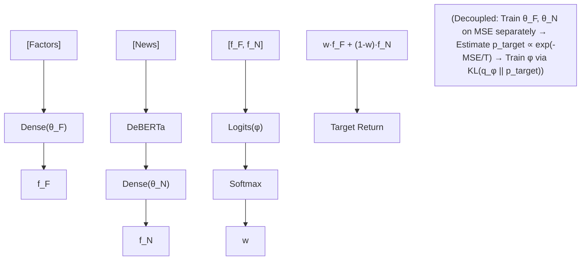

<!-- ontology-5axis data=多模态 horizon=日频波段 paradigm=监督回归 alpha=端到端表征 autonomy=全自动黑盒 -->

# Mixture Decoupled 解構

> **發布**：2025-11-04 · （無 venue）
> **QuantML 導讀**：[如何破解传统因子与新闻的融合困境？](https://mp.weixin.qq.com/s?__biz=Mzg2MzAwNzM0NQ==&mid=2247492230&idx=1&sn=312ebe8b991232cc59c42dbbb7a19c75&chksm=ce7d8598f90a0c8ee5fc0dfeeb9114bf022d5c4e1ae57b674ab4b0db8b5730e613d6e81a55ee#rd)
> **核心定位**：落點於多模態日頻波段監督回歸，解決傳統融合學習中結構化因子與非結構化新聞在梯度更新時的方差纏結與訓練不穩定問題，實現模態預測能力的解耦與動態加權。

**五軸座標**

| 數據模態 | 時間尺度 | 學習範式 | Alpha機制 | 人機協作 |
|:-:|:-:|:-:|:-:|:-:|
| `多模态` | `日频波段` | `监督回归` | `端到端表征` | `全自动黑盒` |

**Status:** v0.5 — 基於 QuantML 導讀 + 原論文（如有）。benchmark 細節待升 v1。
**TL;DR:** ① 提出因子與新聞的混合預測架構，將單一融合表徵拆分為獨立因子組件與融合組件。② 核心 trick 為解耦訓練：獨立優化各組件平方誤差，並透過 KL 散度讓可訓練混合機率匹配基於負誤差的目標分佈。③ 對「端到端表徵」軸的關鍵在於打破多模態注意力機制的梯度方差放大效應，避免低相關新聞稀釋因子訊號。④ NA 全域多空組合年化收益達 33.77% / 1.78 Sharpe。

**X-Ray.** 本方法在五軸 Pareto 中切中「多模態融合」與「訓練穩定性」的經典權衡。傳統 Attention 或表徵拼接在金融噪音環境下易產生梯度方差纏結，導致新聞模態的弱訊號稀釋高信噪比因子，最終在多空組合的空頭端失效。Mixture Decoupled 的解耦訓練實質是將端到端黑盒拆解為「專家獨立訓練 + 門控分佈匹配」，用 KL 散度替代聯合反向傳播，切斷了混合機率與密集網路參數的協方差項。這對量化讀者的意義在於：它提供了一種可證偽的模態路由機制，而非依賴黑盒注意力權重。然而，其 envelope 受限於新聞標題的離散性與 LLM 表徵的靜態聚合，無法捕捉盤中微結構或跨資產聯動；且解耦訓練依賴歷史誤差估計目標分佈，在 regime shift 時可能產生滯後加權。實戰中適合作為日頻波段因子庫的動態路由層，而非高頻執行信號。

## §1 · 架構 / Core Mechanism
**1.1 三大改動 vs 前作**
| 改動維度 | 傳統融合學習 (Fusion) | 常規混合訓練 (Mixture Conventional) | 本方法 (Mixture Decoupled) |
|---|---|---|---|
| 模態處理 | 統一表徵拼接/求和/注意力 | 獨立組件但聯合優化最終預測 | 因子組件與融合組件完全獨立優化 |
| 梯度更新 | 聯合反向傳播，方差纏結放大 | 聯合最小化最終平方誤差，收斂不穩 | 解耦訓練：獨立平方誤差 + KL 散度匹配目標分佈 |
| 權重生成 | 靜態或實例級注意力 | 依賴最終殘差動態調整 | 基於最近參數估計的負誤差分佈，門控機率獨立學習 |

**1.2 ⚡ Eureka 一句話 trick**
用 KL 散度讓門控機率去擬合「誰在當前數據上負誤差更小」，而不是讓梯度硬扛混合權重的方差放大。

**1.3 信息流 ASCII 圖**

## §2 · 數學層
📌 **Napkin Formula**: 
`L = L_indep(θ_F, θ_N) + L_KL(q_φ || p_target)`
`p_target ∝ exp(-MSE_i / T)`
**複雜度**: 單步前向/反向 O(N·d)，解耦後避免交叉項梯度計算。
**直覺**: 將混合模型的梯度方差拆解項強制歸零，各組件先達局部最優，再透過溫度參數 T 控制門控對誤差的敏感度。
**Loss/訓練**: 兩階段/交替優化，獨立最小化各組件平方誤差後，單獨更新門控參數以對齊目標分佈，切斷聯合反向傳播時的梯度衝突。

## §3 · 數據層
- **資料規模/頻率/市場/時段**: 北美(NA)、新興市場(EM)、歐洲(EU)全域，各最多約1000只股票。約200個量化因子。公司層面金融新聞標題。預測1個月遠期收益。測試期2023年和2024年。
- **怎麼來**: 新聞輸入DeBERTa聚合token表徵。回看窗口期內新聞。
- **樣本外與容量假設**: 每月再平衡。假設新聞標題能捕捉事件驅動增量資訊，未披露具體樣本量與交易成本假設。

## §4 · 代碼層
| Repo | Checkpoint | License | 複現難度 | 數據可得性 |
|---|---|---|---|---|
| TBD | TBD | TBD | 中（需對齊新聞時間戳與因子計算，實現KL解耦訓練循環） | 低（需機構級新聞標題數據庫與因子庫） |

## §5 · 評測 / Benchmark
| 數據集/市場 | Metric | 基線A (Fusion Combination) | 基線B (Factors Alone) | 本方法 (Mixture Decoupled) | Δ |
|---|---|---|---|---|---|
| NA 全域 | 多空組合 年化收益 | 28.41% | 未披露 | 33.77% | +5.36% |
| NA 全域 | 多空組合 Sharpe | 未披露 | 未披露 | 1.78 | 未披露 |
| EM 全域 | 多頭組合 年化收益 | 13.36% | 17.14% | 18.5% | +1.36% |
| EM 全域 | 多空組合 年化收益 | 未披露 | 42.17% | 42.07% | -0.10% |
| NA 全域 | IC | 0.031 | 未披露 | 0.027 | -0.004 |

**解讀**: Δ 的真 capability 體現在多空組合空頭端（第0十分位）的負回報捕捉，解耦訓練避免了新聞噪音稀釋因子，使空頭腿更有效。低 MAPE 但組合回報弱的現象證明排序能力（IC）優於絕對誤差。部分 Δ 可能受測試期 LLM 記憶偏差控制影響，且未計入交易成本與滑點，實盤多空收益需嚴格扣除融券與執行摩擦。

## §6 · 失效與隱含假設
**6.1 論文自述 limitations**
新聞相關性隨市場條件波動；融合學習在EM全域落後於僅因子；LLM微調在高效市場(NA)損害性能，在低效市場(EM/EU)改善；MAPE與組合表現脫節。
**6.2 推斷的隱含假設**
Regime依賴於新聞增量資訊的持續性；容量假設未披露，但日頻多空組合受融券成本與流動性限制；隱含數據泄漏風險：新聞標題聚合與因子計算若未嚴格對齊時間戳，易產生前瞻偏差；解耦訓練依賴「最近參數值」估計目標分佈，在快速切換的市場中可能產生加權滯後。

## §7 · 對比 & 面試 Tip
| 同軸對手 | 關鍵差異軸 | Open? | Status |
|---|---|---|---|
| 傳統多模態融合 (Attention/Concat) | 梯度更新機制 (聯合方差纏結 vs 解耦KL匹配) | 未披露 | 廣泛應用但易過擬合噪音 |
| 常規混合專家 (MoE) | 門控信號來源 (輸入特徵直接映射 vs 基於負誤差分佈匹配) | 未披露 | 常見於NLP，金融實盤少見 |

🎤 **Interview Tip**
- **正確答**: 解耦訓練的核心是切斷混合機率與密集網路參數的梯度協方差項，用KL散度將門控權重與組件實際負誤差對齊，避免低相關新聞稀釋高信噪比因子。
- **錯答**: 只是把新聞和因子分開訓練然後簡單加權平均，或者認為注意力機制已經能自動過濾噪音。

**7.1 可證偽預測帶日期**
若2026-01-01（TBD）全球宏觀波動率突破TBD且新聞標題同質化加劇，解耦模型的門控分佈將趨於均勻，多空組合收益將收斂至「僅因子」基線。

## §8 · For the Reader
- **因子研究員**: 將解耦訓練視為多模態因子路由的替代方案，優先驗證IC而非MAPE，注意新聞標題的時滯對齊與表徵維度災難。
- **組合配置/多空策略**: 關注第0十分位（空頭端）的負回報貢獻，解耦模型在多空價差上的優勢來自空頭腿的穩定性，實盤需嚴格計入融券成本與借券難度。
- **LLM-agent/研究學生**: 不要盲目微調LLM；在高效市場中，凍結LLM參數僅做表徵聚合往往更穩，微調僅在低效市場或特定事件驅動場景下嘗試，並監控訓練誤差曲線的收斂穩定性。

## References
- 原論文: Mixture Decoupled (無 venue, 2025-11-04)
- Lineage: 融合學習 (Representation Combination/Summation/Attention), 常規混合模型訓練
- QuantML 導讀鏈接: [如何破解传统因子与新闻的融合困境？](https://mp.weixin.qq.com/s?__biz=Mzg2MzAwNzM0NQ==&mid=2247492230&idx=1&sn=312ebe8b991232cc59c42dbbb7a19c75&chksm=ce7d8598f90a0c8ee5fc0dfeeb9114bf022d5c4e1ae57b674ab4b0db8b5730e613d6e81a55ee#rd)