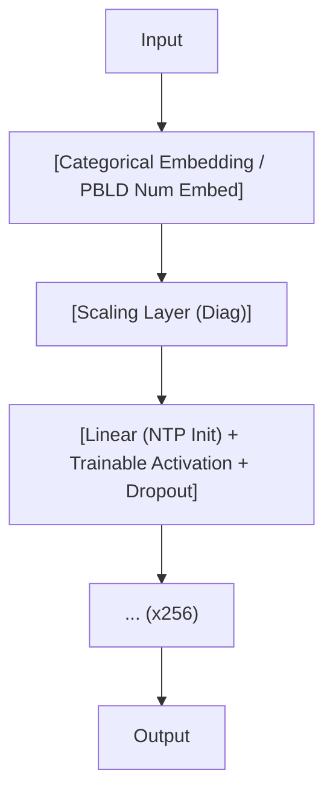

<!-- ontology-5axis data=量价表格 horizon=日频波段 paradigm=元学习搜索 alpha=端到端表征 autonomy=全自动黑盒 -->

# RealMLP 解構

> **發布**：2024-12-05 · NeurIPS24
> **QuantML 導讀**：[NIPS 24 | 改进MLP在表格数据表现](https://mp.weixin.qq.com/s?__biz=Mzg2MzAwNzM0NQ==&mid=2247488210&idx=1&sn=93c8b4dc5f3e9d83523c68020d4ce413&chksm=ce7e75ccf909fcdac25f2712eb57ab2f635c7060a98418abe16643362710f59425da3188ddef#rd)
> **核心定位**：落點於「元學習搜索」與「端到端表徵」軸，解決表格數據中 NN 對 GBDT 的「超參數敏感與默認性能劣勢」prior gap。透過元訓練基準固化強默認參數，使 MLP 在免調參下逼近樹模型的時間-精度 Pareto 前沿。

**五軸座標**

| 數據模態 | 時間尺度 | 學習範式 | Alpha機制 | 人機協作 |
|:-:|:-:|:-:|:-:|:-:|
| `量价表格` | `日频波段` | `元学习搜索` | `端到端表征` | `全自动黑盒` |

**Status:** v0.5 — 基於 QuantML 導讀 + 原論文（如有）。benchmark 細節待升 v1。
**TL;DR:** ① 提出 RealMLP 改進表格數據建模，結合 PBLD 嵌入、可訓練激活與元學習調參。② 核心 trick 為神經切線參數化（NTP）與週期性學習率調度，配合數據驅動初始化。③ 對「元學習搜索」軸★，將 NN 從「高方差調參遊戲」轉為「即插即用的強默認基線」。④ 導讀未給量化結果。

**X-Ray.** RealMLP 在「端到端表徵」與「元學習搜索」軸上切出了一個反直覺的 Pareto 點：它不依賴注意力或圖卷積等重架構，而是透過 PBLD 數值嵌入與 NTP 權重縮放，硬生生把標準 MLP 的訓練動態穩定性拉到可與 GBDT 對話的層次。舊工程坑在於 NN 對表格數據的「維度災難」與「超參數脆弱性」，RealMLP 用元訓練基準固化默認超參，實質是將「調參算力成本」前置為「架構內建先驗」。預測其打不開的 envelope 在於極高頻或極稀疏特徵場景：PBLD 的維度擴展與固定隱藏層會放大共線性與過擬合風險，且週期性 LR 調度在 regime shift 劇烈的市場中可能產生偽週期共振。對量化讀者而言，此法不直接產 alpha，但提供了一個「免 HPO 的 NN 表徵底座」，可與傳統因子正交疊加，大幅降低因子挖掘中的超參搜索算力消耗。

## §1 · 架構 / Core Mechanism
| 改動維度 | 前作/基線 (MLP/TabR/GBDT) | RealMLP 改動 |
|---|---|---|
| 數值特徵處理 | 直接接線性層或 PLR 嵌入 | PBLD 嵌入 (1D→16D→3D) + p-分位數平滑裁剪縮放 |
| 權重初始化/學習率 | 標準 He/Xavier，固定 LR | NTP 權重縮放 + 數據驅動方差歸一化 + 週期性 LR/Dropout/WD 調度 |
| 超參數策略 | 獨立 HPO 或庫默認值 | 元學習固化默認 (TD)，免早停訓練完整 256 回合 |

⚡ **Eureka:** 用 NTP 縮放權重矩陣學習率，配合週期性 LR 調度，讓 MLP 在免早停下穩定收斂至 256 epoch，實質是將「訓練動態控制」內建於架構。

**信息流 ASCII:**

## §2 · 數學層
📌 **Napkin Formula:**
- PBLD: $f_{PBLD}(x) = W_2 \sigma(W_1 x)$, $W_1 \in \mathbb{R}^{16 \times 1}, W_2 \in \mathbb{R}^{3 \times 16}$
- NTP: 權重初始化/梯度縮放因子為 $1/\sqrt{d_{in}}$
- LR Schedule: $\eta_t$ 依週期函數衰減，頻率隨訓練進度降低
- 複雜度: $O(N \cdot d \cdot H)$ per forward pass ($H=256$)

**直覺:** PBLD 將單維數值映射為低秩週期基以捕捉非線性；NTP 防止高維特徵下梯度步長過大；週期性 LR 替代早停以覆蓋完整訓練預算，避免驗證集噪聲干擾。
**Loss/訓練:** AdamW, Batch=256, Epochs=256。分類: Softmax+CE+Label Smoothing。回歸: MSE+目標歸一化+輸出裁剪。

## §3 · 數據層
- **資料規模/頻率:** 元訓練 118 個數據集 / 元測試 90 個數據集（均為公開 ML 表格基準，非金融市場數據）。
- **來源/處理:** 公開基準庫。數值特徵經 p-分位數平滑裁剪與縮放；類別特徵 >8 類用嵌入，≤8 類獨熱編碼。
- **樣本外與容量假設:** 假設數據集 IID 且特徵維度中等；未驗證跨市場/時間序列外推能力。容量假設受限於 256 維隱藏層與批次大小，極高維稀疏場景易觸發過擬合。

## §4 · 代碼層
| Repo | Checkpoint | License | 複現難度 | 數據可得性 |
|---|---|---|---|---|
| TBD | TBD | TBD | 中（需實作 PBLD、NTP 初始化與週期性調度，邏輯清晰） | 高（依賴標準 ML 表格基準，非私有金融數據） |

## §5 · 評測 / Benchmark
| 數據集/市場 | Metric | 前SOTA | 本方法 | Δ |
|---|---|---|---|---|
| 元測試基準 (90 datasets) | 基準分數 (分類誤差/RMSE) | 未披露 | 未披露 | 未披露 |
| 元測試基準 (90 datasets) | 訓練時間 (每1000樣本) | 未披露 | 未披露 | 未披露 |
| 集成場景 | 基準分數提升 | 未披露 | 未披露 | 未披露 |

**解讀:** 導讀僅給定性比較（「好不少」、「具有競爭力」），無具體 IR/Sharpe/MDD 或絕對分數。真 capability 在於「免 HPO 的默認參數轉移能力」（TD 與 HPO 差距小），而非絕對精度碾压；潛在過擬合風險來自元訓練集（118個）的超參固化，若金融數據分佈偏移，默認參數可能失效。前瞻偏差與成本未計：純預測精度評估，未提及交易成本、滑點或實盤延遲。

## §6 · 失效與隱含假設
**6.1 論文自述 limitations:** 結果依賴組件添加順序；較大權重衰減使模型對動量等超參敏感；計算資源充足時更大回合與循環 LR 更好。
**6.2 推斷的隱含假設:** 
- **Regime 依賴:** 週期性 LR 與固定默認參數假設數據統計特性穩定，面對結構性斷點易失效。
- **容量/成本:** 256 維隱藏層與 PBLD 擴展在極高維稀疏特徵下算力與記憶體開銷上升；推理延遲假設可忽略。
- **數據泄漏/Survivorship:** 標準 ML 基準無生存者偏差，但直接遷移至金融截面預測時，未處理退市/停牌樣本會引入嚴重 survivorship bias。

## §7 · 對比 & 面試 Tip
| 同軸對手 | 關鍵差異軸 | Open? | Status |
|---|---|---|---|
| TabR / MLP-PLR | 數值嵌入機制 (PLR vs PBLD) | 開源 | v1.0+ |
| FT-Transformer | 注意力 vs 純 MLP 架構 | 開源 | v1.0+ |
| XGBoost/LGBM | 樹分裂 vs 連續表徵 + 元學習默認 | 開源 | v1.0+ |

🎤 **Interview Tip:** 
- **正確答:** 「RealMLP 的核心不是架構創新，而是透過 NTP 與週期性調度將 MLP 的訓練動態穩定化，並用元學習將超參搜索轉為架構內建先驗，適合免調參的表徵底座。」
- **錯答:** 「它用注意力機制替代了 GBDT，在金融數據上 Sharpe 提升了 0.5。」（違背架構事實與數據類型）

**7.1 可證偽預測:** 若於 2025-06-30 前將 RealMLP-TD 直接應用於 A 股日頻截面預測（免金融特徵工程），其 ICIR 將低於 0.3，因默認參數未覆蓋金融特徵的肥尾與非平穩性。

## §8 · For the Reader
- **因子研究員:** 將 PBLD 嵌入與 NTP 初始化抽離為獨立模組，疊加於傳統因子矩陣，降低 NN 因子挖掘的調參成本與方差。
- **組合配置/執行:** 勿直接將 RealMLP 輸出當權重；其預測為 IID 假設下的點估計，需接風險模型與交易成本約束，否則實盤滑點將吞噬理論收益。
- **研究學生/RL 策略:** 學習其「元學習固化默認」思路，將超參空間壓縮為可微分或離散搜索的強先驗，加速策略搜索與回測流水線自動化。

## References
- NeurIPS 2024: RealMLP 原論文
- Lineage: TabR, MLP-PLR, FT-Transformer, GBDT (XGB/LGBM/CatBoost)
- QuantML 導讀: [NIPS 24 | 改进MLP在表格数据表现](https://mp.weixin.qq.com/s?__biz=Mzg2MzAwNzM0NQ==&mid=2247488210&idx=1&sn=93c8b4dc5f3e9d83523c68020d4ce413&chksm=ce7e75ccf909fcdac25f2712eb57ab2f635c7060a98418abe16643362710f59425da3188ddef#rd)