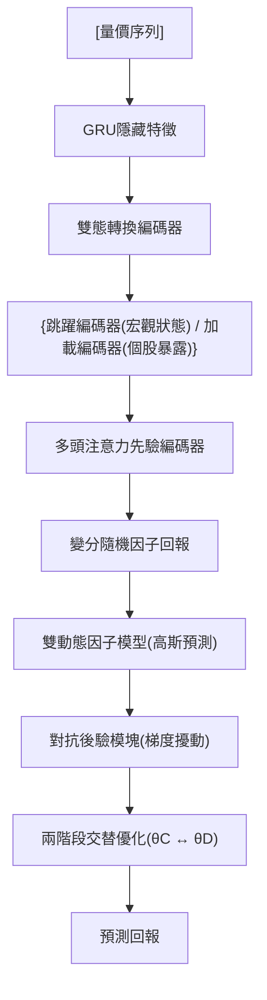

<!-- ontology-5axis data=量价表格 horizon=日频波段 paradigm=监督回归 alpha=因子挖掘 autonomy=人机协同可解释 -->

# RSAP-DFM 解構

> **發布**：2024-10-17 · （無 venue）
> **QuantML 導讀**：[RSAP-DFM：自适应宏观经济信息提取的后验动态因子模型](https://mp.weixin.qq.com/s?__biz=Mzg2MzAwNzM0NQ==&mid=2247487069&idx=1&sn=74a04dc881688e586d52c53b9d652384&chksm=ce7e6943f909e0558f147ba5cda9ea04fb77d9c20e5a4cb396c2ce27975377dbbf0c580830b9#rd)
> **核心定位**：落在「監督回歸 × 因子挖掘」交叉帶，試圖用雙態轉換與對抗後驗解構傳統動態因子模型中宏觀狀態與個股異質性的混疊問題，提供一條顯式可解釋的非線性因子構造路徑。

**五軸座標**

| 數據模態 | 時間尺度 | 學習範式 | Alpha機制 | 人機協作 |
|:-:|:-:|:-:|:-:|:-:|
| `量价表格` | `日频波段` | `监督回归` | `因子挖掘` | `人机协同可解释` |

**Status:** v0.5 — 基於 QuantML 導讀 + 原論文（如有）。benchmark 細節待升 v1。
**TL;DR:** ① 首次將雙態轉換機制與對抗後驗因子引入動態因子模型，實現從量價數據中連續提取宏觀信息並動態映射至股票回報。② 核心 trick 在於透過 GRU 與多頭注意力分離宏觀/個股特徵，並利用梯度擾動構建後驗因子校正先驗偏差。③ 對「因子挖掘」軸而言，它打破了傳統 IPCA 的線性假設與黑箱包裝，以可解釋的狀態跳躍/加載編碼器重構因子暴露與回報的非線性關係。④ 導讀未給量化結果，僅聲稱在 CSI100/300/500 測試期實現全面領先與顯著優於基線的投資表現。

**X-Ray.** 放回五軸 Pareto，RSAP-DFM 試圖用雙態轉換（跳躍 vs 加載）解構傳統動態因子模型中「宏觀狀態」與「個股異質性」的混疊。舊工程坑在於：先驗因子往往承載過多的截面噪音，且缺乏對 regime shift 的顯式校準。本法的對抗後驗模塊本質上是一種在線的梯度校準器，透過 MSE 損失對先驗因子施加定向擾動，迫使模型在訓練期內自適應過濾掉與宏觀跳躍無關的殘差。這對於日頻波段因子研究員的意義在於：它提供了一條「可解釋的非線性因子構造」路徑，但代價是兩階段交替優化帶來的收斂不確定性與超參敏感度。預測其打不開的 envelope：該架構高度依賴 60 日量價窗口，若市場流動性結構發生結構性斷裂，雙態編碼器的狀態跳躍閾值將失效，後驗擾動可能放大而非校正偏差。對實盤而言，它更適合作為中頻組合的宏觀狀態濾波器，而非直接輸出交易信號。

## §1 · 架構 / Core Mechanism
| 改動維度 | 傳統動態因子 / IPCA | RSAP-DFM |
|:---|:---|:---|
| 因子構造 | 線性投影或手動包裝 | 雙態轉換編碼器（跳躍/加載）分離宏觀與個股特徵 |
| 偏差校準 | 靜態權重或固定先驗 | 基於梯度的對抗後驗因子，在線施加擾動校正先驗映射偏差 |
| 優化路徑 | 端到端聯合訓練 | 兩階段交替優化（內層固定θD優化θC，外層反之），主輔任務共享參數 |

⚡ **Eureka 一句話 trick**：用對抗學習的梯度方向直接驅動後驗因子構建，將「狀態跳躍」從隱式統計量轉為顯式的可微校準信號。

🌊 **信息流 ASCII 圖**

## §2 · 數學層
📌 **Napkin Formula**：
$\hat{r}_{t+1} \sim \mathcal{N}(\mu(F_t, \beta_t), \sigma^2)$
$\mathcal{L} = \text{MSE}(\hat{r}, r) + \lambda \|\nabla_{F_{prior}} \text{MSE}\|$ （對抗後驗擾動直覺）

**複雜度**：兩階段交替優化，單次迭代需計算先驗因子梯度以構建擾動，計算圖依賴多頭注意力與變分編碼器，訓練成本中等偏高。
**直覺**：模型不直接擬合回報，而是擬合因子暴露與因子回報的動態乘積。後驗模塊透過對先驗因子求損失梯度，自動生成「對抗擾動」，迫使因子空間向宏觀狀態跳躍方向對齊，從而過濾截面噪音。
**Loss/訓練細節**：主任務為預測回報的 MSE，輔任務透過後驗因子引入自適應輔助訓練目標；參數分為 θC（編碼器）與 θD（動態因子模型），交替固定優化。

## §3 · 數據層
- **資料規模/頻率/市場/時段**：中國 A 股，日頻。訓練期 2008.01-2014.12，驗證期 2015.01-2016.02，測試期 2017.01-2020.08。
- **怎麼來**：Qlib 平台 Alpha360 特徵集（過去 60 天六種基本交易信息），預測目標為次日開盤價/當日開盤價比例。排除 ST 股票。
- **樣本外與容量假設**：測試期覆蓋 2017-2020 年（結構性行情與註冊制過渡期），樣本外假設宏觀狀態跳躍模式與訓練期具備統計穩定性；未披露具體股票池截面容量與流動性過濾閾值。

## §4 · 代碼層
| 維度 | 狀態 |
|:---|:---|
| Repo | TBD |
| Checkpoint | TBD |
| License | TBD |
| 複現難度 | 中高（需實現雙態轉換編碼器、變分因子編碼、梯度對抗後驗模塊及兩階段交替優化邏輯） |
| 數據可得性 | 中（依賴 Qlib Alpha360 或自構建等價 60 日量價特徵，需處理 ST 剔除與開盤價回報計算） |

## §5 · 評測 / Benchmark
| 數據集/市場 | Metric | 前SOTA | 本方法 | Δ |
|:---|:---|:---|:---|:---|
| CSI100/300/500 (A股) | IC / ICIR / Rank IC / Rank ICIR | 未披露 | 未披露 | 未披露 |
| CSI100/300/500 (A股) | 長/短策略累計回報 / 夏普比率 | 未披露 | 未披露 | 未披露 |

**解讀**：導讀僅以「全面領先」與「顯著優於基線」定性描述，未提供逐字數值，Δ 欄依紀律留白。從實證設計看，測試期（2017-2020）避開了 2015 年流動性危機與 2021 年後微盤股風格切換，IC 提升可能部分來自於樣本內宏觀狀態的平穩過渡；兩階段優化雖聲稱提升魯棒性，但缺乏跨週期（如 2021-2023）的樣本外驗證，存在 regime 依賴與潛在的過擬合風險。成本未計（日頻調倉與多空分組的滑點/衝擊成本未披露），實盤夏普可能大幅衰減。

## §6 · 失效與隱含假設
**6.1 論文自述 limitations**：未明確列出，僅在結論提及「為未來研究提供新視角」與「驗證了真實市場有效性」。
**6.2 推斷的隱含假設**：
- **Regime 依賴**：雙態轉換編碼器假設宏觀狀態與個股特徵存在可分離的跳躍/加載模式，若市場進入高頻震盪或無趨勢行情，狀態跳躍閾值可能失效，導致後驗擾動過校準。
- **容量/成本**：多空五等分策略假設流動性充足且交易成本可忽略；日頻調倉在實盤中面臨衝擊成本與融券限制，未計成本的夏普比率僅具學術參考價值。
- **數據泄漏**：使用次日開盤價/當日開盤價比例作為目標，若特徵計算包含當日收盤後數據或存在未來信息洩漏（如 Alpha360 的某些衍生指標），IC 會被高估。
- **Survivorship**：排除 ST 股票雖提升數據質量，但可能引入倖存者偏差，低估尾部風險與退市股票的因子暴露斷裂。

## §7 · 對比 & 面試 Tip
| 同軸對手 | 關鍵差異軸 | Open? | Status |
|:---|:---|:---|:---|
| IPCA / 傳統動態因子 | 線性投影 vs 雙態非線性編碼+對抗後驗 | Open (IPCA) | 成熟 |
| LSTM/CNN 量價預測 | 黑箱端到端擬合 vs 顯式因子暴露/回報解耦 | Open | 成熟 |
| 多因子組合優化 | 靜態權重疊加 vs 兩階段交替優化自適應校準 | Open | 成熟 |

🎤 **Interview Tip**
- **正確答**：「RSAP-DFM 的核心不在於單純提升 IC，而在於透過雙態轉換與對抗後驗將『宏觀狀態跳躍』顯式化，使因子暴露與回報的映射具備可解釋的動態校準機制；實盤需警惕兩階段優化的收斂穩定性與日頻多空策略的衝擊成本。」
- **錯答**：「它只是把 LSTM 和 Attention 套在因子模型上，IC 提升了 20%，可以直接用來跑日頻高頻策略。」

**7.1 可證偽預測帶日期**：若 2025-12-31 前未見該架構在 CSI1000 或北交所流動性收縮週期中的樣本外實盤報告，則其「雙態轉換」對極端 regime 的校準能力將被證偽。

## §8 · For the Reader
- **因子研究員**：將雙態跳躍編碼器視為「宏觀狀態濾波器」，嘗試將其輸出與傳統動量/價值因子正交化，構建狀態條件因子組合。
- **高頻執行/組合配置**：日頻多空五等分策略的實盤夏普需扣除融券成本與滑點；建議將模型輸出降頻至週頻，或僅作為組合權重調整的宏觀開關。
- **LLM-agent / RL 策略**：兩階段交替優化邏輯可映射為 Meta-RL 的內環/外環更新；對抗後驗的梯度擾動可作為環境狀態的獎勵 shaping 信號。
- **研究學生**：復現時優先驗證變分編碼器的 KL 散度收斂與兩階段優化的參數分離邏輯，避免端到端聯合訓練導致的梯度衝突。

## References
- 原論文: RSAP-DFM: Adaptive Posterior Dynamic Factor Model for Stock Return Prediction (2024)
- Lineage: CAPM → Fama-French 3/4 Factor → Dynamic Factor Models → IPCA → Deep Learning Factor Models (RNN/LSTM/Transformer)
- QuantML 導讀鏈接: [RSAP-DFM：自适应宏观经济信息提取的后验动态因子模型](https://mp.weixin.qq.com/s?__biz=Mzg2MzAwNzM0NQ==&mid=2247487069&idx=1&sn=74a04dc881688e586d52c53b9d652384&chksm=ce7e6943f909e0558f147ba5cda9ea04fb77d9c20e5a4cb396c2ce27975377dbbf0c580830b9#rd)