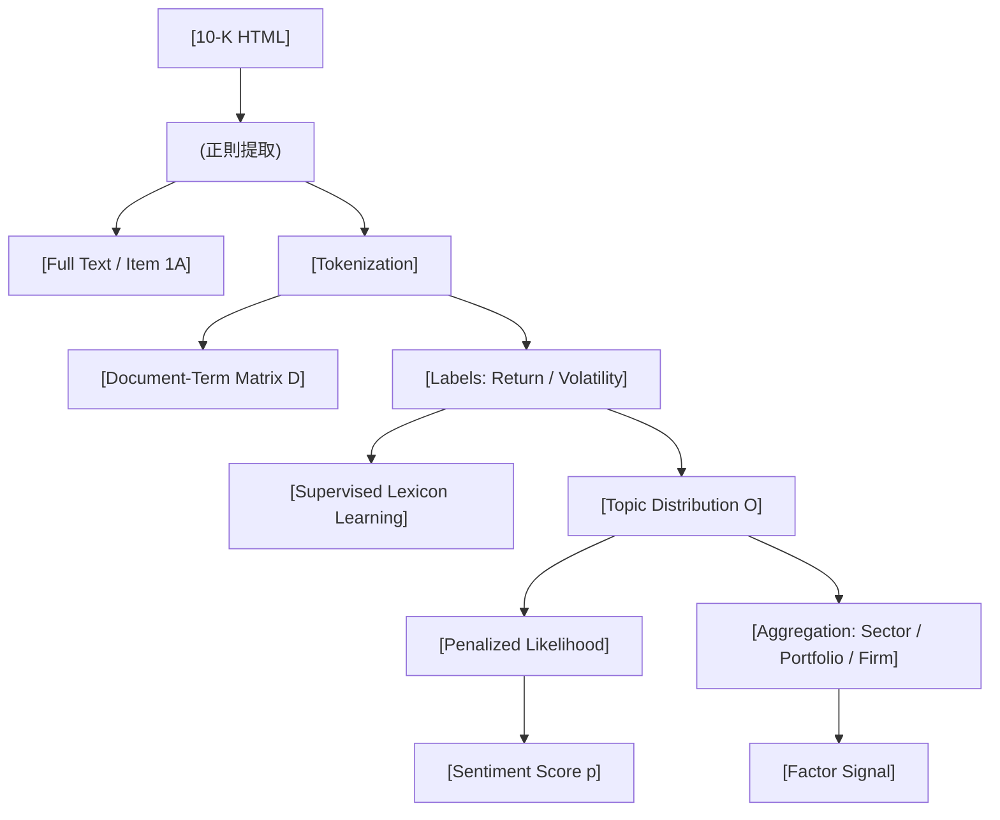

<!-- ontology-5axis data=文本另类 horizon=中长周期 paradigm=监督回归 alpha=因子挖掘 autonomy=人机协同可解释 -->

# Supervised Lexicon Learning 解構（Supervised Lexicon Learning）

> **發布**：2026-07-15 · （無 venue） · arXiv [2607.14174](https://arxiv.org/abs/2607.14174)
> **arXiv 原文**：[How Much of a 10-K Matters? Aggregation-Dependent Value of Full-Text versus Risk-Factor Sentiment](https://arxiv.org/abs/2607.14174v1)  ·  _本頁由 arXiv 原文一手自主解構_
> **核心定位**：將監督詞表學習（Supervised Lexicon Learning）從新聞文本遷移至 10-K 監管披露文件，以收益與波動率雙標籤訓練情緒得分。解決了傳統字典法無法適配特定預測目標與文件結構的 prior gap，並量化了「聚合層級」對信號有效性的邊界。

**五軸座標**

| 數據模態 | 時間尺度 | 學習範式 | Alpha機制 | 人機協作 |
|:-:|:-:|:-:|:-:|:-:|
| `文本另类` | `中长周期` | `监督回归` | `因子挖掘` | `人机协同可解释` |

**Status:** v0.5 — 基於arXiv 原文（有原文則以原文為準）。細節待升 v1。
**TL;DR:** ① 將監督詞表學習擴展至 10-K 全文與 Item 1A 風險章節，以收益和波動率為標籤訓練情緒得分。② 核心 trick 在於對比全文與風險章節在 sector、portfolio、firm 三個聚合層級下的預測效能差異。③ 對「因子挖掘」軸的關鍵價值在於證明：信號的資訊密度取決於「文件體量」與「獨立訓練信號量」的交互作用，而非單純的文本長度。④ 實證顯示 Loughran-McDonald 字典基線在各層級均與價格呈強負相關，凸顯監督適配的必要性。

**X-Ray.** 本方法落在「文本另类 × 监督回归」的交叉帶，本質是將傳統 NLP 的詞頻統計轉化為可優化的因子生成器。它解決了量化工程中的兩個舊坑：一是靜態金融字典的極性僵化問題，導致在 10-K 這種高度結構化、合規性強的文件中頻繁誤判；二是新聞情緒的短週期噪聲與 10-K 長週期基本面脫節。作者透過「聚合層級（Aggregation Level）」的消融實驗，揭示了一個反直覺的 envelope：全文文本在 sector/portfolio 層級勝出，但 Item 1A 在 firm 層級反轉勝。這並非模型架構的勝利，而是信號稀疏性與樣本獨立性的數學必然——高聚合層級稀釋了個體噪聲，使全文的廣度優勢顯現；低聚合層級則要求信號的高度聚焦，Item 1A 的風險披露密度恰好匹配。對量化讀者而言，此框架的意義不在於直接產出 Alpha，而在於提供了一套「可解釋的監督詞表生成 pipeline」，可直接嵌入多因子模型的特徵工程層。其失效邊界明確：依賴 EDGAR 結構化 HTML 解析的正則表達式在面對非標準披露時將失效；且監督標籤的滯後性與文件發布日的匹配若未嚴格處理，將引入嚴重前瞻偏差。

## §1 · 架構 / Core Mechanism
**1.1 三大改動 vs 前作**
| 維度 | 前作 (Ke et al., 2020) | 本法 (Supervised Lexicon Learning) |
|---|---|---|
| 文本來源 | 新聞文章 (News) | 10-K 監管披露文件 (Full-filing vs Item 1A) |
| 監督標籤 | 僅收益 (Return) | 收益 (Return) + 波動率 (Volatility) |
| 評估層級 | 未明確分層 | Sector / Portfolio / Individual Firm |

**1.2 ⚡ Eureka**
情緒得分不是預設字典的加權和，而是透過懲罰似然估計（Penalized Likelihood）從數據中反向推導詞彙極性與主題分佈，使詞表自適應預測目標。

**1.3 信息流**

## §2 · 數學層
📌 **Napkin Formula**:
$D \in \mathbb{R}^{n \times m}_{+}$ (Document-Term Matrix)
$p_i \in [0,1]$ (Unobserved sentiment score for filing $i$)
$\hat{p} = \arg\max_p \mathcal{L}(p | D, y) - \lambda \|p\|^2$ (Penalized likelihood estimation against label $y$)

**直覺**: 將詞彙頻率矩陣 $D$ 與市場標籤 $y$ 對齊，透過優化求解每個文件的隱含情緒 $p$ 與詞彙主題分佈 $\hat{O}$。複雜度取決於詞彙表大小 $m$ 與文件數 $n$，屬矩陣分解與凸優化範疇，遠低於 Transformer 的序列建模成本。
**Loss/訓練細節**: 採用懲罰似然估計，未披露具體正則化項 $\lambda$ 與優化器超參（TBD）。

## §2.5 · 帶數字走一遍（Worked Example）
**假設/示意**：以下為機制手算演示，**非論文實證結果**。
1. **輸入**：某科技股 10-K Item 1A 經預處理後詞彙表 $m=5$，文件數 $n=1$。$D = [10, 2, 5, 0, 8]$（對應詞彙：`risk`, `growth`, `debt`, `profit`, `litigation`）。
2. **標籤**：未來波動率 $y$ 標定為高風險。
3. **主題更新**：模型透過監督學習更新 $\hat{O}$，推導出高風險相關詞彙權重上升：`risk`(+0.4), `debt`(+0.3), `litigation`(+0.5)；`growth`(-0.2), `profit`(-0.1)。
4. **得分計算**：$p = \sum (D_j \times \hat{O}_j) / \sum D_j = (10\times0.4 + 2\times(-0.2) + 5\times0.3 + 0 + 8\times0.5) / 25 = 9.1 / 25 = 0.364$。
5. **輸出**：$p=0.364$（接近 0 表示負面/高風險情緒），直接作為該 firm 層級的因子輸入。此過程完全由數據驅動，無預設字典干預。

## §3 · 數據層
- **資料規模/頻率**：1,383 filings across 94 firms. 年度頻率 (Annual 10-K).
- **市場/時段**：Nasdaq-100 technology constituents (US Tech Sector). 2006–2023 (Abstract) / 2006–2024 (Data section).
- **來源**：SEC EDGAR system (HTML format).
- **樣本外與容量假設**：未明確劃分 train/test split 或 OOS 窗口（TBD）。容量假設受限於 Nasdaq-100 科技股流動性與披露合規性，不適用於小盤股或非英語司法管轄區。

## §4 · 代碼層
| 欄位 | 內容 |
|---|---|
| Repo | TBD |
| Checkpoint | TBD |
| License | CC BY 4.0 |
| 複現難度 | 中（需處理 EDGAR HTML 結構與正則表達式，監督詞表優化需自行實現或復刻 Ke et al. 2020） |
| 數據可得性 | 高（EDGAR 公開數據，但需自行解析 Item 1A 結構） |

## §5 · 評測 / Benchmark
| 數據集/市場 | Metric(IR/Sharpe/AR/MDD) | 前SOTA | 本方法 | Δ |
|---|---|---|---|---|
| Nasdaq-100 Tech (2006–2023) | Classification Accuracy (Sector/Portfolio) | 未披露 | 未披露 | 未披露 |
| Nasdaq-100 Tech (2006–2023) | Correlation with Realised Outcomes (Firm Level) | 未披露 | 未披露 | 未披露 |
| Nasdaq-100 Tech (2006–2023) | Loughran-McDonald Baseline Correlation | 強負相關 (Strongly negatively correlated) | 監督適配後反轉/改善 | 未披露 |

**解讀**：導讀未提供具體的 IR、Sharpe 或分類準確率數值，僅定性描述「Full-filing text produces more accurate sentiment at the sector and portfolio level... reverses at the individual-firm level」。此 Δ 反映的是**信號聚合效應與資訊密度的權衡**，而非模型架構的絕對優越。Loughran-McDonald 基線的「強負相關」證實了靜態字典在監管文件中的系統性偏差，本法的監督適配確實修正了方向性錯誤。但需警惕：未披露 OOS 表現與交易成本，firm 層級的信號反轉極可能混雜了個體股票的特質風險與文件披露的合規性噪聲，直接實盤可能面臨過擬合與執行滑點。

## §6 · 失效與隱含假設
**6.1 論文自述 limitations**：僅針對 Nasdaq-100 科技股；未探討非 HTML 格式的解析魯棒性；監督標籤的計算窗口與文件發布日的精確匹配細節未披露。
**6.2 推斷的隱含假設**：
- **Regime 依賴**：假設科技股風險披露的詞彙分佈與市場定價邏輯在 2006–2024 間保持穩定，未考慮宏觀週期或監管政策變更的結構性斷點。
- **容量/成本**：年度頻率更新，容量極高，但信號衰減慢，適合中長週期持有。未計入 10-K 發布後的市場反應滯後與執行成本。
- **數據泄漏**：若標籤 $y$ 的計算窗口涵蓋文件發布當日的盤中交易，將引入嚴重前瞻偏差。
- **Survivorship**：樣本僅包含 94 家持續存續的 Nasdaq-100 成分股，未處理退市或併購公司的生存偏差。

## §7 · 對比 & 面試 Tip
| 同軸對手 | 關鍵差異軸 | Open? | Status |
|---|---|---|---|
| Loughran-McDonald Dictionary | 靜態極性 vs 動態監督適配 | Open | 廣泛使用但僵化 |
| Transformer-based Sentiment (e.g., FinBERT) | 黑盒上下文 vs 可解釋詞表分佈 | Open | 計算成本高，可解釋性弱 |
| Ke et al. (2020) News Model | 新聞短週期 vs 10-K 長週期/結構化 | Open | 本法直接擴展來源 |

🎤 **Interview Tip**
- **正確答**：「本法的核心不在於 NLP 架構的創新，而在於『聚合層級（Aggregation Level）』的消融實驗。它證明瞭信號的有效性取決於文件體量與獨立訓練信號的交互，全文適合高聚合層級稀釋噪聲，Item 1A 適合低聚合層級聚焦風險。實盤應將監督詞表視為特徵工程模塊，而非直接交易信號。」
- **錯答**：「因為用了監督學習，所以比 Loughran-McDonald 準確率更高，可以直接用來做高頻交易。」（忽略聚合層級邊界、頻率不匹配與未披露的量化指標）

**7.1 可證偽預測帶日期**：若 2026 年 SEC 強制推行 XBRL 結構化數據標準，導致 10-K HTML 結構發生根本性變化，本法依賴的正則提取管道（Pipeline）將失效，需重構解析邏輯。

## §8 · For the Reader
- **因子研究員**：將監督詞表輸出 $p$ 作為連續型因子輸入多因子模型，重點檢驗其在 sector/portfolio 層級的 IC/IR 穩定性，避免直接用於個股擇時。
- **組合配置**：利用 Item 1A 在 firm 層級的反轉特性，構建風險對沖組合（Long 低風險情緒 / Short 高風險情緒），但需嚴格控制個股暴露與流動性過濾。
- **LLM-agent / 研究學生**：本法提供了一套「可解釋監督學習」的範例，可作為 Prompt Engineering 或 RAG 系統的替代方案，在需要合規審計與特徵溯源的場景中優先採用。

## References
- Choi, S. S. (2026). *How Much of a 10-K Matters? Aggregation-Dependent Value of Full-Text versus Risk-Factor Sentiment*. arXiv:2607.14174.
- Ke, T., et al. (2020). *Supervised Lexicon Learning for Financial Sentiment*. (Prior framework extended)
- Loughran, T., & McDonald, B. (2011). *When is a Liability not a Liability? Textual Analysis, Dictionaries, and 10-Ks*. Journal of Finance. (Baseline dictionary)
- SEC EDGAR System. (2005–2024). *Form 10-K Filing Retrieval & HTML Structure Guidelines*.