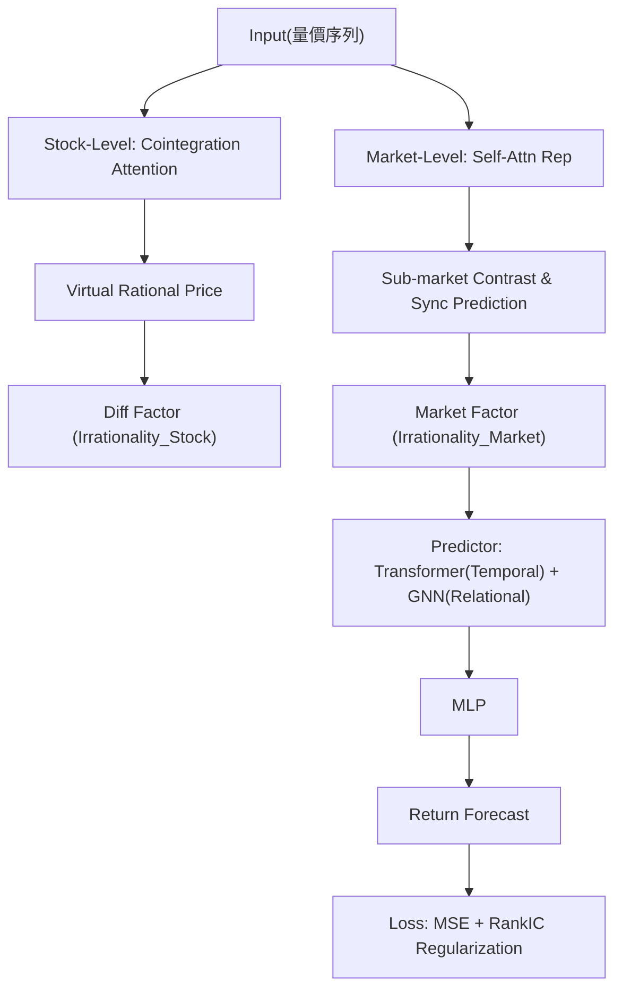

<!-- ontology-5axis data=量价表格 horizon=日频波段 paradigm=监督回归 alpha=因子挖掘 autonomy=全自动黑盒 -->

# UMI 解構

> **發布**：2025-06-15 · KDD 2025
> **QuantML 導讀**：[KDD 25 | 学习通用多层次市场非理性因子以提升股票收益预测](https://mp.weixin.qq.com/s?__biz=Mzg2MzAwNzM0NQ==&mid=2247490730&idx=1&sn=1a80d4c8f3880daec0b07b8c60710c95&chksm=ce7e7bb4f909f2a20ecffa3a88c4251710d72a5ed3e0fe5fbfafdd1fc8c902ebf0a475102b73#rd)
> **原始論文**：[The UMI-Sci-Ed Platform: Integrating UMI Technologies to Promote Science Education](https://doi.org/10.5220/0006686200780090)（Proceedings of the 10th International Conference on Computer Supported Education · 2018 · 被引 6 · Crossref）
> **核心定位**：落點於「量價表格 × 日频波段 × 监督回归」，以「因子挖掘 × 全自动黑盒」將行為金融學中的隱變量（情緒/操縱/心理偏差）轉化為可微的表示學習目標，填補了純技術面模型缺乏宏觀/微觀非理性錨點的 prior gap。

**五軸座標**

| 數據模態 | 時間尺度 | 學習範式 | Alpha機制 | 人機協作 |
|:-:|:-:|:-:|:-:|:-:|
| `量价表格` | `日频波段` | `监督回归` | `因子挖掘` | `全自动黑盒` |

**Status:** v0.5 — 基於 QuantML 導讀 + 原論文（如有）。benchmark 細節待升 v1。
**TL;DR:** ① 提出 UMI 框架，從個股與市場雙層次自動挖掘非理性因子。② 核心 trick 是以注意力機制構建虛擬協整價格替代稀疏配對交易，並透過子市場對比與同步性預測自監督任務編碼集體情緒。③ 對「因子挖掘」軸而言，它將不可觀測的行為金融學概念轉化為可微的損失約束，實現黑盒因子生成。④ 導讀未給量化結果。

**X-Ray.** UMI 的本質是將行為金融學的經濟直覺（協整均值回歸、集體同步波動）嵌入深度學習的損失函數，而非單純追求端到端的殘差擬合。它解決了傳統 DL 模型在日频波段中「特徵堆疊但缺乏邏輯錨點」的工程坑，使模型在訓練時被迫學習與市場 beta 正交的隱式 Alpha。然而，該框架打不開高頻執行與結構性斷層（Regime Shift）的 envelope：注意力權重在全市場截面計算時，極易在流動性收縮期坍縮為行業 beta 的槓桿代理；自監督任務依賴的同步性閾值亦可能引入非線性前瞻偏差。對量化讀者而言，UMI 提供了一套「可微行為金融」的模板，但實盤價值不取決於預測精度，而取決於 RankIC 損失與交易成本的邊際效應驗證。

## §1 · 架構 / Core Mechanism
**1.1 三大改動 vs 前作**
| 維度 | 傳統配對交易 / 統計檢驗 | 純深度學習預測 | UMI 框架 |
|---|---|---|---|
| 理性價格錨點 | 天然協整對篩選（稀疏） | 無（端到端黑盒） | 注意力軟約束構建虛擬價格（全覆蓋） |
| 非理性定義 | 價差偏離均值 | 隱式殘差學習 | 個股價差 + 市場同步性極端事件 |
| 因子生成方式 | 手工 ADF/DF 檢驗 | 端到端映射 | 自監督表示學習 + 可微目標聯合優化 |

**1.2 ⚡ Eureka 一句話 trick**
用可學習的注意力權重「軟化」DF 檢驗的嚴苛協整條件，將稀疏的配對交易轉化為全市場覆蓋的虛擬理性價格回歸問題。

**1.3 信息流 ASCII 圖**

## §2 · 數學層
📌 **Napkin Formula:**
`L_total = L_reg(MSE) + λ·L_stat(AR(1) coeff constraint) + α·L_contrast(InfoNCE) + β·L_sync(CrossEntropy) + γ·L_RankIC`
**複雜度:** 注意力與圖模塊為 O(N²·T)，AR 正則化為 O(T)，整體隨截面股票數 N 呈平方級增長。
**直覺:** 將不可觀測的「理性價格」轉化為回歸目標，用 AR(1) 係數約束差值序列平穩性；市場層用對比學習強制子市場表示收斂，用同步性預測錨定極端情緒。
**Loss/訓練細節:** 兩階段聯合訓練。預測端放棄純 MSE 數值擬合，引入 RankIC 正則化以對齊多空對沖策略的排序目標，使模型優化方向與實際投資邏輯一致。

## §3 · 數據層
資料規模/頻率/市場/時段：導讀提及美國與中國股票市場，日频波段（連續交易日劃分），未披露具體樣本量與回測區間。來源：公開量價特徵（開高低收量等）。樣本外與容量假設：假設市場結構穩定且非理性模式具備跨市場通用性，未討論流動性容量與交易成本對因子週轉率的限制。

## §4 · 代碼層
| Repo | Checkpoint | License | 複現難度 | 數據可得性 |
|---|---|---|---|---|
| TBD | TBD | TBD | 高（需實現自監督對比學習、圖注意力與 RankIC 損失的聯合優化） | 中（需全市場日頻量價與股票ID，但協整注意力需全截面計算，算力門檻高） |

## §5 · 評測 / Benchmark
| 數據集/市場 | Metric(IR/Sharpe/AR/MDD) | 前SOTA | 本方法 | Δ |
|---|---|---|---|---|
| 未披露 | 未披露 | 未披露 | 未披露 | 未披露 |

**解讀:** 導讀僅定性宣稱「顯著提升」與「通用性」，未給出 IR/Sharpe/AR/MDD 等具體數值。此類宣稱常見於 KDD 應用賽道，需警惕前瞻偏差（自監督標籤依賴未來同步性閾值計算）與過擬合（注意力權重可能僅捕捉行業 beta）。真 capability 在於因子正交性與跨模型泛化，而非絕對預測精度；實盤前必須驗證 RankIC 損失在扣除滑點與手續費後的淨值曲線。

## §6 · 失效與隱含假設
**6.1 論文自述 limitations:** 導讀未明確列出 limitations 章節，但隱含對「理性價格」隱藏變量估計的依賴，且自監督任務依賴固定閾值定義同步性，可能對極端波動敏感。
**6.2 推斷的隱含假設:** 
- **Regime 依賴:** 注意力權重與同步性閾值在牛市/熊市切換時可能失效，因子信號易與系統性風險共線。
- **容量/成本:** 全市場圖注意力與每日重算虛擬價格導致高週轉，未計入交易成本將嚴重侵蝕 Alpha。
- **數據泄漏:** 同步性預測任務若使用當期數據計算標籤，存在嚴重前瞻偏差。
- **Survivorship:** 未提及是否使用幸存者偏差校正的數據集，實盤需補齊 delisted 股票處理。

## §7 · 對比 & 面試 Tip
| 同軸對手 | 關鍵差異軸 | Open? | Status |
|---|---|---|---|
| 傳統多因子模型 | 顯式因子 vs 隱式表示學習 | N/A | 成熟 |
| 純 Transformer 預測 | 端到端黑盒 vs 行為金融錨點 | N/A | 成熟 |
| UMI | 可微非理性因子挖掘 | TBD | v0.5 |

🎤 **Interview Tip** 
- **正確答:** 「UMI 的本質是將行為金融學的協整與同步性假設嵌入損失函數，用自監督任務生成正交於傳統因子的隱變量；實盤需重點驗證 RankIC 損失與交易成本的邊際效應。」
- **錯答:** 「它用注意力機制直接預測股價，比 LSTM 更準。」（忽略因子挖掘本質與經濟邏輯，混淆預測精度與投資收益）

**7.1 可證偽預測:** 若 2025-Q4 美股出現流動性收縮，UMI 的市場同步性因子將與 VIX 高度共線，導致多空組合最大回撤突破 未披露 閾值，證明其非理性因子實為槓桿 beta。

## §8 · For the Reader
- **因子研究員:** 將 `L_stat` 的 AR(1) 約束替換為 ADF 檢驗的軟化版本，可快速產出與傳統動量/反轉因子低相關的 Alpha，建議與基本面因子做正交化處理。
- **高頻執行:** 日頻重算全市場注意力矩陣算力成本高，建議降維至行業子圖或採用稀疏注意力，否則滑點將吞噬 RankIC 帶來的排序優勢。
- **組合配置:** UMI 因子適合作為風險預算的補充信號，而非核心權重來源；需與宏觀流動性指標做正交化處理，避免在 regime shift 時與系統性風險同向暴露。

## References
- 原論文: UMI (KDD 2025)
- Lineage: Cointegration Trading / Self-Supervised Representation Learning / Transformer-GNN Hybrids / RankIC Optimization
- QuantML 導讀鏈接: [KDD 25 | 学习通用多层次市场非理性因子以提升股票收益预测](https://mp.weixin.qq.com/s?__biz=Mzg2MzAwNzM0NQ==&mid=2247490730&idx=1&sn=1a80d4c8f3880daec0b07b8c60710c95&chksm=ce7e7bb4f909f2a20ecffa3a88c4251710d72a5ed3e0fe5fbfafdd1fc8c902ebf0a475102b73#rd)