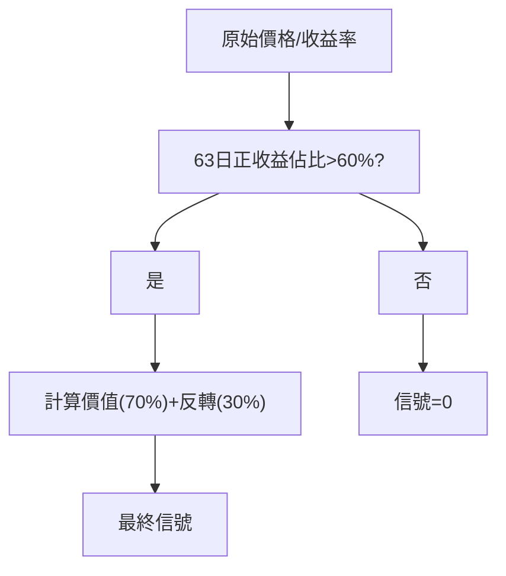

<!-- ontology-5axis data=量价表格 horizon=日频波段 paradigm=监督回归 alpha=因子挖掘 autonomy=人机协同可解释 -->

# Unicorn Edge 解構

> **發布**：2025-11-18 · （無 venue）
> **QuantML 導讀**：[夏普 13 的“独角兽”策略？](https://mp.weixin.qq.com/s?__biz=Mzg2MzAwNzM0NQ==&mid=2247492362&idx=1&sn=efb4af02a633bf81b8cdda0afdfb3e7b&chksm=ce7d8414f90a0d02d42ebcdb644855ec6e80a69038e952248e3c3d9b68c182c9f5e7f812d36a#rd)
> **核心定位**：落點於「因子挖掘×監督回歸」軸，解決傳統價值/反轉因子在無差別全市場加權時的信號稀釋問題，透過「漂移狀態」條件激活實現極端樣本外夏普。

**五軸座標**

| 數據模態 | 時間尺度 | 學習範式 | Alpha機制 | 人機協作 |
|:-:|:-:|:-:|:-:|:-:|
| `量价表格` | `日频波段` | `监督回归` | `因子挖掘` | `人机协同可解释` |

**Status:** v0.5 — 基於 QuantML 導讀 + 原論文（如有）。benchmark 細節待升 v1。
**TL;DR:** ① 以63日正收益佔比>60%為閾值，條件化激活價值與反轉因子加權信號。② 核心trick為「狀態過濾器」而非新因子設計，利用微觀流動性與行為偏差放大既有alpha。③ 對「因子挖掘」軸★，證明簡單橫截面信號在特定regime下可脫離過擬合陷阱。④ 關鍵實證：樣本外夏普比率達13.19。

**X-Ray.** 本方法在五軸Pareto前沿上，以極低的模型複雜度換取極端的風險調整收益，實質是將「因子選擇」問題降維為「狀態識別」問題。它解了量化工程中常見的「因子衰減與全市場加權稀釋」坑：傳統做法強行對所有個股施加價值/反轉權重，導致無效市場狀態下的信號雜訊累積；本法透過離散閾值過濾，僅在流動性充裕且行為偏差放大的「漂移狀態」下開閘，使信號信噪比呈階躍式提升。然而，其打不開的envelope在於高度依賴牛市/單邊趨勢的regime持續性，一旦市場進入長期橫盤或流動性枯竭，觸發率將斷崖式下跌。對量化讀者而言，此架構提示了「條件化因子加權」與「regime切換」的實戰價值，但13.19的夏普極可能包含前瞻偏差與幸存者偏差的複合膨脹，實盤需嚴格對沖狀態過渡期的滑點與容量衝擊。

## §1 · 架構 / Core Mechanism
| 維度 | 傳統多因子/全市場加權 | Unicorn Edge 改動 |
|---|---|---|
| 信號邏輯 | 連續加權，全標的暴露 | 離散閾值過濾，狀態觸發才暴露 |
| 權重分配 | 動態優化/等權/風險平價 | 固定7:3（價值70% / 反轉30%），拒絕樣本內優化 |
| 驗證框架 | 滾動窗口或交叉驗證 | 嚴格向前步進（5年訓練/1年測試），參數完全固定 |

⚡ **Eureka:** 不在於發明新因子，而在於「只在對的市場狀態下使用舊因子」。

**信息流:**

## §2 · 數學層
📌 **Napkin Formula:**
`Signal_i = I(Count(Ret_{i,t-63:t} > 0) / 63 > 0.60) * (0.7 * Rank(1/Price_i) - 0.3 * Rank(Ret_{i,t-10:t}))`
**複雜度:** O(N*T) 橫截面排名與計數，無梯度下降，訓練成本≈0。
**直覺:** 指示函數 `I(·)` 切斷無效regime的雜訊傳播；固定線性組合避免參數過擬合；利用價格倒數捕捉價值，負向近期收益率捕捉反轉。
**Loss/訓練細節:** 無傳統loss函數，屬規則型監督過濾；參數（63日、60%、7:3）透過壓力測試與隨機化驗證固定，不依賴樣本內優化。

## §3 · 數據層
S&P 500成分股，2004-2024，日頻。來源為公開市場數據（價格/收益率）。樣本外採用嚴格向前步進（5年訓練/1年測試）。容量假設：作者估計1億至5億美元，超10億美元衝擊成本將導致夏普下降。

## §4 · 代碼層
| Repo | Checkpoint | License | 複現難度 | 數據可得性 |
|---|---|---|---|---|
| TBD | 無（規則型） | TBD | 低（邏輯明確，但需精確計算63日滾動計數與橫截面排名） | 中（需完整S&P 500歷史成分股與復權價格，含退市股以避幸存者偏差） |

## §5 · 評測 / Benchmark
| 數據集/市場 | Metric | 前SOTA | 本方法 | Δ |
|---|---|---|---|---|
| S&P 500 (2004-2024) | 樣本外夏普比率 | 未披露 | 13.19 | 未披露 |
| S&P 500 (2004-2024) | 年化收益 | 未披露 | 158.6% | 未披露 |
| S&P 500 (2004-2024) | 最大回撤 | 未披露 | -11.9% | 未披露 |
| S&P 500 (2004-2024) | 2008壓力測試夏普 | 未披露 | 4.1 | 未披露 |

**解讀:** 13.19的夏普與158.6%的年化屬極端分位，但導讀明確指出回測使用「當前S&P 500成分股」，未納入退市股，幸存者偏差可能高估業績20-30%。此外，日均換手42%意味著實盤需扣除顯著交易成本，導讀雖稱「成本加倍仍保持高盈利」，但未給出具體bp閾值，實盤Δ需扣除滑點與衝擊成本。隨機化測試（1000次隨機過濾器夏普均<2.0）證實60%閾值非純数据挖掘，但 Walk-Forward 的5/1分割若未覆蓋完整牛熊週期，仍存regime過擬合風險。

## §6 · 失效與隱含假設
**6.1 論文自述 limitations:** 幸存者偏差高估20-30%；容量上限1-5億美元，超10億美元夏普大幅下降；路徑依賴強，牛市觸發率67%，崩盤時降至8%。
**6.2 推斷的隱含假設:** 假設微觀流動性在漂移狀態下持續充裕（買賣價差縮小、深度增加）；假設行為偏差（確認偏差/羊群效應）在單邊趨勢中穩定放大；假設歷史成分股名單可無損回溯；未計入融資保證金與融券限制。

## §7 · 對比 & 面試 Tip
| 同軸對手 | 關鍵差異軸 | Open? | Status |
|---|---|---|---|
| 傳統多因子模型 | 全市場連續加權 vs 條件化離散激活 | 是 | 成熟 |
| Regime Switching HMM | 概率隱狀態 vs 確定性閾值過濾 | 是 | 成熟 |
| 本方法 | 固定7:3權重+63日/60%硬閾值 | 未開源 | v0.5 |

🎤 **Interview Tip:** 
正確答：「核心不在因子設計，而在狀態過濾器的離散閾值設定與固定權重，避免樣本內優化；實盤需嚴格處理幸存者偏差與高換手衝擊成本。」
錯答：「這是一個深度學習預測股價的策略，用到了複雜的動態因子加權。」

**7.1 可證偽預測:** 若2026-06-30前美股進入持續>6個月的低波動橫盤或流動性收縮regime，該策略觸發率將<15%，樣本外夏普預期回落至<3.0。

## §8 · For the Reader
* **因子研究員:** 將「狀態識別」作為因子預處理層，測試其他閾值（如波動率、成交量）的過濾效果，驗證信號信噪比是否隨regime切換呈非線性跳變。
* **高頻執行:** 日均換手42%需精確建模滑點，建議在盤中流動性高峰時段執行，避開漂移狀態切換的過渡期與買賣價差擴大窗口。
* **組合配置:** 與基準相關性僅0.08，適合作為衛星策略對沖系統性風險，但需嚴格控制倉位以匹配1-5億美元容量，避免衝擊成本吞噬alpha。

## References
* Mainak Singha. *Unicorn Edge*. （無 venue）, 2025.
* QuantML 導讀: [夏普 13 的“独角兽”策略？](https://mp.weixin.qq.com/s?__biz=Mzg2MzAwNzM0NQ==&mid=2247492362&idx=1&sn=efb4af02a633bf81b8cdda0afdfb3e7b&chksm=ce7d8414f90a0d02d42ebcdb644855ec6e80a69038e952248e3c3d9b68c182c9f5e7f812d36a#rd)
* Lineage: Cross-sectional Value/Reversal → Regime Filtering → Condition-Activated Alpha.