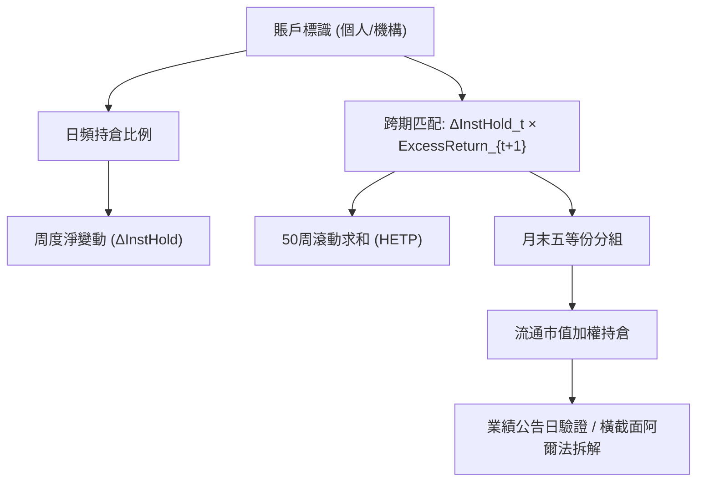

<!-- ontology-5axis data=量价表格 horizon=日频波段 paradigm=监督回归 alpha=因子挖掘 autonomy=人机协同可解释 -->

# 耶鲁 X 牛津 | 知情交易与预期收益 解構（耶鲁 X 牛津 | 知情交易与预期收益）

> **發布**：2026-06-29 · （無 venue）
> **QuantML 導讀**：[耶鲁 X 牛津 | 知情交易与预期收益](https://mp.weixin.qq.com/s?__biz=Mzg2MzAwNzM0NQ==&mid=2247494158&idx=1&sn=105559ebbced3bd5942e74da1c2f9316&chksm=ce7d8d10f90a0406ef144857c9d5d8deded9e6046bd439968f44e5223e5d1df6939099fd9566#rd)
> **核心定位**：落點於「因子挖掘 × 日频波段」軸，以機構持倉變動 × 後續超額收益直接構建歷史利潤指標，解了傳統 PIN/資金流因子受流動性與價格衝擊污染的 prior gap，將微觀交易賬本轉譯為宏觀定價因子。

**五軸座標**

| 數據模態 | 時間尺度 | 學習範式 | Alpha機制 | 人機協作 |
|:-:|:-:|:-:|:-:|:-:|
| `量价表格` | `日频波段` | `监督回归` | `因子挖掘` | `人机协同可解释` |

**Status:** v0.5 — 基於 QuantML 導讀 + 原論文（如有）。benchmark 細節待升 v1。
**TL;DR:** ① 利用上交所賬戶數據構建機構歷史超額交易利潤指標，直接代理信息不對稱。② 核心 trick 為持倉變動乘以後續超額收益求和，剝離流動性與價格衝擊。③ 對「因子挖掘」軸★的意義在於證明信息優勢的持續性才是橫截面定價的決定變量，而非單純的知情概率。④ 導讀給出多空組合年化超額收益 6.6%（四因子阿爾法 0.55%）。

**X-Ray.** 本框架在五軸 Pareto 上選擇了「可解釋性優先於非線性擬合」的極端點。它解決了量化工程中最棘手的因果混淆坑：機構買入究竟是因為有信息，還是單純製造價格衝擊？透過 50 周滾動利潤求和與業績公告日外推驗證，它將「信息不對稱」從黑盒代理變量還原為可追蹤的交易利潤流。然而，其 envelope 明確受限於大盤股流動性結構與賬戶數據可得性，中小盤信息優勢無持續性的結論意味著該因子無法直接擴展至微盤或高頻執行場景。對量化讀者的意義不在於直接抄因子，而在於掌握「如何設計排除性檢驗（價格衝擊/流動性控制）來驗證因子因果鏈」的實證工程范式。

## §1 · 架構 / Core Mechanism
| 改動維度 | 前作/傳統做法 | 本方法改動 | 工程價值 |
|---|---|---|---|
| 信息代理變量 | PIN、買賣價差、資金流 | 歷史超額交易利潤（持倉變動×後續超額收益） | 直接度量知情者利潤，繞開流動性污染 |
| 因果驗證機制 | 橫截面回歸控制 | 業績公告日利潤預測 + 市值分組持續性檢驗 | 區分「運氣/事件驅動」與「結構性信息優勢」 |
| 定價邏輯 | 逆向選擇補償（全市場） | 僅高信息不對稱分位（最高五等份）觸發風險折價 | 避免均值回歸誤傷，聚焦尾部定價失效 |

⚡ **Eureka:** 歷史持倉變動 × 後續超額收益求和，將「知情交易」從概率估計轉為利潤會計。
📊 **信息流 ASCII:**

## §2 · 數學層
📌 **Napkin Formula:**
`HETP_{i,t} = Σ_{k=1}^{50} (ΔInstHold_{i,t-k} × ExcessReturn_{i,t-k+1})`
複雜度: O(N×T×50)，無梯度優化，屬統計構造型因子。
直覺: 若機構淨買入後股價跑贏市場，即計入利潤；持續為正代表結構性信息優勢。該指標本質是「知情交易利潤的歷史積分」，而非預測模型輸出。
Loss/訓練: 無學習過程。依賴 Fama-MacBeth 跨期回歸與組合排序檢驗，統計顯著性由 t 統計量與 p 值判定。

## §3 · 數據層
- **規模/頻率/市場**: 上交所日頻賬戶數據，樣本內股票數量從 186 只擴張到 802 只。
- **時段**: 1996年1月至2007年5月。
- **來源**: 交易所歷史脫敏數據，開戶時強制標識個人/機構身份，唯一永久標識符。
- **樣本外與容量假設**: 內生驗證依賴業績公告日窗口；容量嚴格受限於大盤股（流通市值加權機構持倉比例從 4.6% 暴增至 46.7%），中小盤因信息優勢無持續性無法貢獻有效容量。

## §4 · 代碼層
| 欄位 | 狀態 |
|---|---|
| Repo | TBD |
| Checkpoint | 未披露 |
| License | 未披露 |
| 複現難度 | 高（依賴交易所級別脫敏賬戶數據，公開市場無法直接獲取） |
| 數據可得性 | 未披露 |

## §5 · 評測 / Benchmark
| 數據集/市場 | Metric | 前SOTA | 本方法 | Δ |
|---|---|---|---|---|
| 上交所日頻賬戶數據 | 月度原始超額收益 (多空) | 未披露 | 0.65% | 未披露 |
| 同上 | 四因子阿爾法 (多空) | 未披露 | 0.55% | 未披露 |
| 同上 | 年化超額收益 (多空) | 未披露 | 6.6% | 未披露 |
| 同上 | 業績公告日預測係數 (大盤) | 未披露 | 1.01 | 未披露 |
| 同上 | 流動性控制後係數 | 未披露 | 0.32% | 未披露 |

**解讀:** Δ 反映的是內部五等份分組的定價分化，而非外部 SOTA 領先幅度。0.65% 月度多空收益與 6.6% 年化溢價屬於真實的橫截面定價能力，但需警惕樣本期早（1996年1月至2007年5月）帶來的制度紅利與流動性結構差異。業績公告日預測係數 1.01 僅在大盤股顯著，證明該因子本質是「大盤信息優勢持續性」的代理，非通用 Alpha。流動性控制後係數 0.32% 仍顯著，排除了非流動性補償假說，但實盤需計入大盤股交易成本與滑點。

## §6 · 失效與隱含假設
**6.1 論文自述 limitations:** 依賴交易所脫敏賬戶數據（極難獲取）；樣本期僅覆蓋 1996年1月至2007年5月；信息優勢持續性假設在中小盤失效。
**6.2 推斷的隱含假設:** 
- **Regime 依賴**: 假設機構身份標識準確且長期穩定，未考慮近年量化私募/游資身份模糊化帶來的信號稀釋。
- **容量/成本**: 僅大盤股有效，微盤/中盤無法擴展；未計入實盤交易成本與衝擊成本，0.65% 月度收益在扣除雙邊費用後可能收斂。
- **數據泄漏**: 50 周滾動窗口使用未來一周超額收益計算歷史利潤，屬標準因子構建邏輯，但實盤需嚴格對齊 T+1 調倉延遲。
- **Survivorship**: 樣本內股票數量從 186 只擴張到 802 只，未明確說明退市股處理，可能存在倖存偏差。

## §7 · 對比 & 面試 Tip
| 同軸對手 | 關鍵差異軸 | Open? | Status |
|---|---|---|---|
| 傳統 PIN/資金流因子 | 直接利潤積分 vs 概率/流量代理 | 未披露 | 本方法剝離流動性污染 |
| 機構調倉動量因子 | 信息優勢持續性 vs 短期價格衝擊 | 未披露 | 本方法僅大盤有效，中小盤失效 |
| 基本面信息事件驅動 | 結構性追蹤網絡 vs 單次內幕 | 未披露 | 本方法依賴 50 周持續性驗證 |

🎤 **Interview Tip:** 
- ✅ 正確答: 「該因子核心不在預測收益率，而在驗證信息不對稱的持續性是否觸發風險折價。實盤需嚴格分市值層疊加，並用業績公告日窗口做因果檢驗。」
- ❌ 錯答: 「這是一個高勝率的機構跟單因子，可以直接全市場適用並替代傳統資金流。」

**7.1 可證偽預測帶日期:** 若 2026-12-31 前 A 股機構持倉數據公開度提升且量化機構占比突破 50%，該因子在大盤股的四因子阿爾法應收斂至 0.55% 以下，因信息優勢競爭將壓縮持續性溢價。

## §8 · For the Reader
- **因子研究員**: 將 50 周利潤積分邏輯移植至 ETF 申贖數據或融資餘額變動，構建機構行為的公開代理變量。
- **高頻執行**: 該框架揭示價格衝擊與知情交易的區分方法，可用於優化大單拆單算法的隱藏期設定。
- **組合配置**: 僅在大盤市值層使用該因子做多，中小盤層疊加流動性因子或動量反轉，避免持續性失效帶來的回撤。
- **LLM-agent**: 將業績公告日文本情感與機構持倉變動交叉驗證，構建多模態信息優勢強度指標。
- **研究學生**: 學習 Fama-MacBeth 回歸中逐步加入控制變量（流動性/市值/動量）的排除性檢驗設計，這是因子因果驗證的標準工程路徑。

## References
- 耶鲁 X 牛津 | 知情交易与预期收益（原論文）
- QuantML 導讀: [耶鲁 X 牛津 | 知情交易与预期收益](https://mp.weixin.qq.com/s?__biz=Mzg2MzAwNzM0NQ==&mid=2247494158&idx=1&sn=105559ebbced3bd5942e74da1c2f9316&chksm=ce7d8d10f90a0406ef144857c9d5d8deded9e6046bd439968f44e5223e5d1df6939099fd9566#rd)
- Lineage: 傳統 PIN 模型 → 機構資金流因子 → 歷史超額交易利潤指標（本方法）