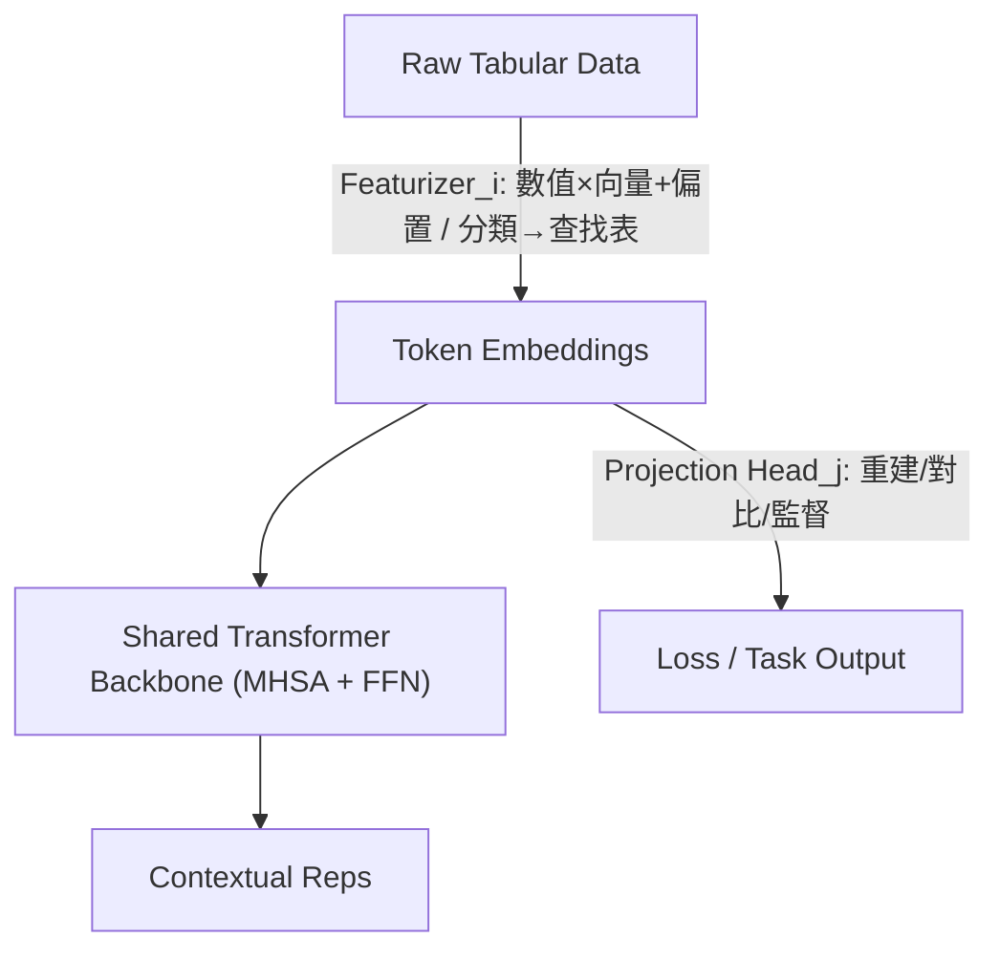

<!-- ontology-5axis data=量价表格 horizon=跨周期 paradigm=监督回归 alpha=端到端表征 autonomy=全自动黑盒 -->

# XTab 解構

> **發布**：2024-06-28 · ICML23
> **QuantML 導讀**：[ICML 23 | XTab：基于联邦学习的表格类预训练模型](https://mp.weixin.qq.com/s?__biz=Mzg2MzAwNzM0NQ==&mid=2247484944&idx=1&sn=3301b97ec2256efc831967f00019cdfd&chksm=ce7e610ef909e818eefd8da5401d05677c089933abbbdf995c2b9a992fe3395e5ad35d79ca24#rd)
> **核心定位**：落點於「跨周期量價表格」與「端到端表征」軸，解決傳統 Tabular Transformer 因列結構異質性導致的跨數據集泛化失效問題，透過 FedAvg 聯邦預訓練實現權重初始化遷移。

**五軸座標**

| 數據模態 | 時間尺度 | 學習範式 | Alpha機制 | 人機協作 |
|:-:|:-:|:-:|:-:|:-:|
| `量价表格` | `跨周期` | `监督回归` | `端到端表征` | `全自动黑盒` |

**Status:** v0.5 — 基於 QuantML 導讀 + 原論文（如有）。benchmark 細節待升 v1。
**TL;DR:** ① 提出跨表格預訓練框架 XTab，解決 Tabular Transformer 難以跨數據集泛化的瓶頸。② 核心 Trick 為「數據特定 Featurizer + 共享 Transformer Backbone + FedAvg 聯邦聚合」，解耦列結構差異。③ 對「端到端表征」軸而言，它首次將 NLP/CV 的預訓練范式成功遷移至異構表格，提供高質量權重初始化。④ 在 OpenML-AutoML Benchmark 的 84 個任務上，預訓練模型在緊縮訓練時間預算下顯著超越隨機初始化與傳統樹模型（具體數值未披露）。

**X-Ray.** 在五軸 Pareto 中，XTab 將「監督回歸」與「端到端表征」的結合點從同構時序推向了異構表格。它解決了量化工程中长期存在的「因子表結構頻繁變更導致模型重訓成本高昂」的舊坑：透過 Featurizer 隔離列維度差異，Backbone 僅學習跨任務的通用特徵交互模式。然而，其預訓練目標（重建/對比/監督混合）依賴於靜態表格分佈，對金融市場高頻變動的 Regime Shift 極度敏感。FedAvg 的梯度聚合假設各客戶端數據分佈相對平穩，這在量價數據中意味著跨市場/跨週期的遷移可能引入隱性前瞻偏差或過擬合於歷史特定波動率區間。對量化讀者而言，XTab 不是直接可用的 Alpha 生成器，而是「因子表征初始化器」；它打不開的 Envelope 是動態訂單簿與非結構化文本的實時融合，但為跨資產、跨頻率的因子庫預訓練提供了可驗證的架構範式。

## §1 · 架構 / Core Mechanism
**1.1 三大改動 vs 前作**
| 維度 | 前作 (FT-Transformer / TabNet 等) | XTab | 工程意義 |
|---|---|---|---|
| 特徵映射 | 統一 Embedding 層，強依賴固定列數 | 數據特定 Featurizer (獨立可訓練向量/查找表) | 解耦列維度異質性，支持動態因子增刪 |
| 訓練範圍 | 單數據集/單領域集中式訓練 | 共享 Transformer Backbone 跨 84 個數據集 | 提取跨任務通用交互模式，非過擬合單一市場 |
| 優化路徑 | 集中式梯度下降 | FedAvg 聯邦聚合 (本地 N 步更新 + 中心平均) | 降低通信開銷，模擬多源數據隔離訓練場景 |

**1.2 ⚡ Eureka**
解耦「列結構映射」與「特徵交互學習」。直覺：讓模型先學「怎麼看不同形狀的表格」，再學「表格裡的規律是什麼」。

**1.3 信息流**

## §2 · 數學層
**📌 Napkin Formula**
$$L_{total} = \sum_{k=1}^{K} \alpha_k L_k\left(\text{Head}_k\left(\text{Backbone}\left(\text{Featurizer}_i(x)\right)\right)\right)$$
**複雜度**：Attention 層 $O(L \cdot d^2)$；Featurizer 為 $O(1)$ 逐列映射；FedAvg 聚合 $\theta_{t+1} = \frac{1}{K}\sum \theta_{t+1}^k$。
**直覺**：損失函數為重建/對比/監督的加權組合，透過 FedAvg 在客戶端本地更新 $N$ 步後聚合。Backbone 僅負責跨任務的序列依賴建模，不承擔列維度對齊的負擔。
**Loss/訓練細節**：預訓練階段混合使用重建損失、對比損失與監督損失；微調分輕量（僅調 Head/Featurizer）與重量（全參數）設置，並引入早停與模型集成。

## §3 · 數據層
- **資料規模/頻率/市場/時段**：OpenML-AutoML Benchmark (AMLB) 84 個表格預測任務。非金融專屬，頻率/市場/時段未披露（屬通用 ML 靜態基準）。
- **怎麼來**：開源 UCI/OpenML 數據集聚合，按領域劃分客戶端。
- **樣本外與容量假設**：假設下游任務與預訓練任務共享潛在特徵交互分佈；採用跨折驗證（52/52 split）模擬 OOS。未驗證金融高頻/低頻容量限制與非平穩時間序列的衰減率。

## §4 · 代碼層
| 項目 | 狀態 |
|---|---|
| Repo | TBD |
| Checkpoint | 論文提及提供預訓練模型（未披露具體路徑/格式） |
| License | TBD |
| 複現難度 | 中（需配置 FedAvg 環境與多數據集管道） |
| 數據可得性 | 高（AMLB 開源） |

## §5 · 評測 / Benchmark
| 數據集/市場 | Metric(IR/Sharpe/AR/MDD) | 前SOTA | 本方法 | Δ |
|---|---|---|---|---|
| OpenML-AutoML Benchmark (84 tasks) | 未披露 | 未披露 | 未披露 | 未披露 |

**解讀**：導讀僅定性描述「在緊縮訓練時間預算下優勢明顯」「XTab-best 排名第二」。Δ 的來源主要歸因於預訓練權重初始化帶來的樣本效率提升，而非架構絕對精度突破。需警惕 AMLB 為靜態跨領域基準，非金融實盤環境，其「泛化」未經 Regime Shift 壓力測試，且未計入聯邦通信與微調算力成本。

## §6 · 失效與隱含假設
**6.1 論文自述 limitations**
未完全閉合與樹模型的性能差距；多模態融合與結構優化為未來方向；預訓練目標對特定任務的適配性仍需實驗驗證。

**6.2 推斷的隱含假設**
- **Regime 依賴**：FedAvg 聚合假設跨數據集梯度方向一致，金融市場結構性斷裂時可能導致負遷移（Negative Transfer）。
- **容量/成本**：共享 Backbone 參數量 TBD，聯邦通信開銷 $N$ 次本地更新 vs 頻繁同步的 trade-off 未量化；實盤延遲無法滿足低頻以上需求。
- **數據泄漏**：預訓練與微調若使用同一來源的衍生特徵或重疊時間窗，可能引入隱性前瞻偏差。
- **Survivorship**：AMLB 為靜態快照，未處理金融數據的退市/停牌/除權除息等生存者偏差。

## §7 · 對比 & 面試 Tip
| 同軸對手 | 關鍵差異軸 | Open? | Status |
|---|---|---|---|
| FT-Transformer | 跨表格預訓練 vs 單數據集訓練 | Open? TBD | 基礎線 |
| TabPFN / TabNet | 零樣本/架構創新 vs 聯邦預訓練 | 部分開源 | 活躍 |
| 傳統樹模型 (XGB/LGBM) | 端到端表征 vs 特徵工程依賴 | 開源 | 工業標準 |

🎤 **Interview Tip**
- **正確答**：XTab 的核心價值在於「權重初始化遷移」而非「架構替換」，它透過 Featurizer 隔離列維度，使 Backbone 能跨任務學習特徵交互；在量化中適合用作多因子庫的冷啟動表征器。
- **錯答**：認為 XTab 直接輸出了可交易的 Alpha 因子，或聲稱其解決了金融時間序列的非平穩性與高頻低延遲問題。

**7.1 可證偽預測**
預測在 `2025-Q4` 前，將有量化團隊將 XTab 的 Featurizer 解耦思想應用於多資產因子庫預訓練，但 Backbone 的 FedAvg 聚合將被替換為動態權重平均（Dynamic Weight Averaging）或 MoE 路由，以適應市場 Regime 切換。

## §8 · For the Reader
- **因子研究員**：將 XTab 視為「跨資產因子表征初始化器」，用其預訓練權重啟動多因子模型，可壓縮特徵交叉的冷啟動時間，但需嚴格隔離預訓練與實盤時間窗。
- **高頻執行 / 組合配置**：不建議直接用於訂單簿或高頻信號生成；其靜態表格假設與 FedAvg 延遲無法滿足低延遲執行需求，僅適合日頻/週頻因子庫的表征預訓練。
- **研究學生 / LLM-Agent**：可將 XTab 的架構抽象為「異構數據適配層 + 共享推理核」，此模式可直接遷移至 LLM 的 Tool-Use 或 Agent 的狀態表征模塊，解決多源 API 返回結構不一致的問題。

## References
- **原論文**：ICML 2023 · XTab: Cross-Table Pretraining for Tabular Transformers
- **Lineage**：FT-Transformer · FedAvg · Tabular Transformers · AutoGluon
- **QuantML 導讀**：[ICML 23 | XTab：基于联邦学习的表格类预训练模型](https://mp.weixin.qq.com/s?__biz=Mzg2MzAwNzM0NQ==&mid=2247484944&idx=1&sn=3301b97ec2256efc831967f00019cdfd&chksm=ce7e610ef909e818eefd8da5401d05677c089933abbbdf995c2b9a992fe3395e5ad35d79ca24#rd)