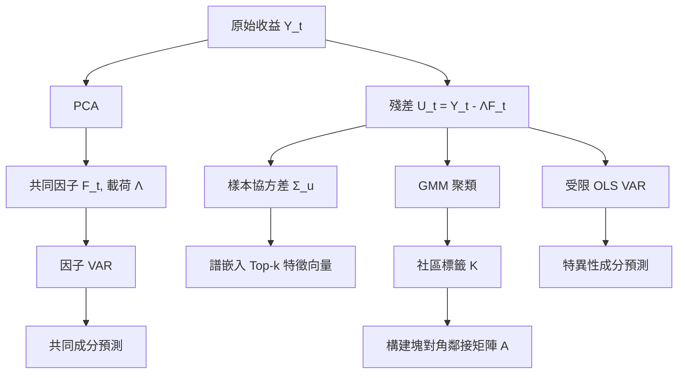

<!-- ontology-5axis data=量价表格 horizon=跨周期 paradigm=监督回归 alpha=因子挖掘 autonomy=人机协同可解释 -->

# FNIRVAR 解構

> **發布**：2025-11-22 · （無 venue）
> **QuantML 導讀**：[FNIRVAR：挖掘高维因子模型下的隐含网络 Alpha](https://mp.weixin.qq.com/s?__biz=Mzg2MzAwNzM0NQ==&mid=2247492428&idx=1&sn=99923d3314b7df0b839fd83de9bfb56a&chksm=ce7d8452f90a0d4421a6830d098fd3f77b8f6efb4c9f9b123ca5dedc73facaa20888dfcda3c0#rd)
> **核心定位**：落點於「監督回歸 × 因子挖掘」軸，解決高維時間序列中「稠密共同因子」與「稀疏局部依賴」難以兼顧的建模斷層。透過 SBM 網絡 VAR 與譜聚類，將傳統因子模型的殘差轉譯為可計算的資產群落結構，實現無先驗網絡知識的隱含 Alpha 提取。

**五軸座標**

| 數據模態 | 時間尺度 | 學習範式 | Alpha機制 | 人機協作 |
|:-:|:-:|:-:|:-:|:-:|
| `量价表格` | `跨周期` | `监督回归` | `因子挖掘` | `人机协同可解释` |

**Status:** v0.5 — 基於 QuantML 導讀 + 原論文（如有）。benchmark 細節待升 v1。
**TL;DR:** ① 提出 FNIRVAR 框架，將高維收益分解為共同因子與受隨機塊模型(SBM)支配的特異性殘差。② 核心 trick 在於利用譜嵌入與高斯混合模型，從殘差協方差矩陣中無監督恢復資產群落結構，進而構建塊對角受限 VAR。③ 這對「因子挖掘」軸★ 的意義在於：打破因子模型對殘差白噪聲的隱含假設，將未被解釋的協同運動轉化為可交易的群落對沖/動量信號。④ 導讀給出日頻等權組合無成本夏普比率 1.95，高頻 30 分鐘數據夏普比率達 2.20。

**X-Ray.** FNIRVAR 在五軸 Pareto 前緣的價值不在於「預測精度微幅提升」，而在於它提供了一條可解釋的殘差結構化路徑。傳統量化工程常將因子殘差視為雜訊或強行套上 LASSO 稀疏約束，導致群落級別的局部協同（如板塊輪動、供應鏈傳導）被過度正則化抹平。FNIRVAR 透過大特徵根間隙假設，先用 PCA 剝離強因子，再對殘差協方差矩陣做譜嵌入，本質上是將「因子負荷矩陣」的估計問題降維為「圖社區劃分」問題。這解決了高維 VAR 參數爆炸的工程坑，同時保留了塊內稠密、塊間稀疏的經濟直覺。然而，其 envelope 受限於「特徵根間隙」的嚴苛條件：若共同因子與特異性成分的譜分佈重疊，PCA 分離失效，模型將直接崩潰。對量化讀者而言，這不是一個即插即用的黑盒預測器，而是一套「殘差結構探針」；實戰中需嚴格監控特徵值分佈的穩定性，並警惕群落劃分在 regime shift 下的滯後效應。

## §1 · 架構 / Core Mechanism
**1.1 三大改動 vs 前作**
| 維度 | 傳統因子模型 / 稀疏 VAR | FNIRVAR | 工程意義 |
|---|---|---|---|
| 殘差假設 | 白噪聲或全稀疏 (LASSO) | 受 SBM 支配的塊對角網絡 VAR | 將雜訊轉為群落協同信號 |
| 網絡結構 | 依賴先驗知識或全連接 | 數據驅動譜聚類恢復隱含社區 | 免標註、免圖數據依賴 |
| 估計路徑 | 單步聯合優化或兩步正交 | 兩步解耦：PCA 剝離 → 譜嵌入 + GMM 硬閾值 | 降維避開高維 VAR 參數爆炸 |

**1.2 ⚡ Eureka**
將特異性殘差的協方差矩陣視為圖的鄰接矩陣近似，用譜嵌入提取節點坐標，再以 GMM 劃分社區，最後對同社區資產間施加 VAR 連接，異社區歸零。

**1.3 信息流 ASCII**

## §2 · 數學層
📌 **Napkin Formula**
$Y_t = \Lambda F_t + U_t$
$U_t = \sum_{l=1}^p A_l U_{t-l} + \varepsilon_t, \quad A_l \sim \text{SBM}(\text{block-diagonal})$
複雜度：主要由特異性成分估計主導，同方差假設下優於非受限 VAR $O(N^3)$，實際受譜聚类與塊內 OLS 限制。
直覺：共同因子捕捉全局宏觀衝擊，$A_l$ 的塊對角結構確保資產僅與「同群落」標的產生動態反饋，將高維耦合降為多個低維子圖 VAR。
訓練細節：兩步解耦。第一步 PCA 最小化殘差平方和；第二步基於硬閾值鄰接矩陣 $A$ 進行受限 OLS 估計，無端到端梯度回傳，屬統計估計框架。

## §3 · 數據層
- **規模/頻率/市場**：日度（S&P 500 & Nasdaq 共 648 隻股票）、高頻（LOBSTER 數據庫 516 隻納斯達克股票 30 分鐘收益率）、宏觀（FRED-MD 122 個變量）。
- **來源**：公開市場行情與宏觀數據庫（導讀未披露具體數據供應商與清洗代碼）。
- **樣本外與容量**：採用滾動窗口回測（日度 2000-2020，高頻 2007-2021，宏觀 1960-2019）。導讀提及市值加權組合最大持倉規模遠小於市場總容量，市場衝擊可忽略，但未給出精確容量上限或 turnover 假設。

## §4 · 代碼層
| 項目 | 狀態 |
|---|---|
| Repo | 導讀指明「代碼見QuantML知識星球」，未開源至 GitHub |
| Checkpoint | 無（統計模型，無神經網絡權重） |
| License | 未披露 |
| 複現難度 | 中低（依賴標準 PCA、譜聚類、GMM、受限 OLS，無自研算子） |
| 數據可得性 | 高（標普/納指日頻、LOBSTER 高頻、FRED-MD 均為標準學術/工業數據） |

## §5 · 評測 / Benchmark
| 數據集/市場 | Metric | 前SOTA | 本方法 | Δ |
|---|---|---|---|---|
| 日度 (0成本) | Sharpe | Factors Only: 0.86 | 1.95 | +1.09 |
| 日度 (0成本) | Sharpe | Factors+LASSO: 1.64 | 1.95 | +0.31 |
| 日度 (2bpts成本) | Sharpe | Factors Only: 1.07 | 1.37 | +0.30 |
| 高頻 (30min) | Sharpe | Factors Only: 0.58 | 2.20 | +1.62 |
| 高頻 (30min) | Sharpe | Factors+LASSO: 1.14 | 2.20 | +1.06 |
| 宏觀 | MSE | Factors Only / LASSO: 0.0077 | 0.0074 | -0.0003 |
| 模擬 (DGP=FNIRVAR) | MSPE | Factors Only: 1.91 | 1.87 | -0.04 |
| 模擬 (DGP=FNIRVAR) | MSPE | LASSO: 1.95 | 1.87 | -0.08 |
| 模擬 (因子少設) | MSPE | Factors Only: 3.20 | 1.41 | -1.79 |

**解讀**：日頻與高頻的 Sharpe Δ 具備實戰意義，尤其高頻環境下 Δ 分別為 +1.06 與 +1.62，印證群落結構在短週期內協同運動更顯著。宏觀 MSE 的 -0.0003 提升微弱，屬統計顯著但經濟價值有限。模擬中因子少設時的 MSPE 大幅改善（-1.79），證明 NIRVAR 殘差網絡具備「補漏」能力，能吸收未建模因子的方差。需警惕：實證 Sharpe 未扣除滑點與衝擊成本（僅計 1bpts/2bpts），且高頻 30 分鐘頻率可能避開了訂單簿微結構雜訊，實盤執行層面需重新校準交易成本假設。

## §6 · 失效與隱含假設
**6.1 論文自述 limitations**
- 依賴「大特徵根間隙」假設：若共同成分與特異性成分譜分佈重疊，PCA 無法正確分離，兩步估計失效。
- 硬閾值鄰接矩陣：社區劃分採用二值化（同社區為1，異社區為0），可能抹平群落間的弱連接或過渡態資產。
- 宏觀預測提升有限，顯示該框架更契合金融資產的局部網絡依賴，而非全局線性宏觀傳導。

**6.2 推斷的隱含假設**
- **Regime 依賴**：譜聚類與 GMM 對協方差矩陣結構敏感，若市場結構發生斷裂（如流動性危機、板塊邏輯重構），社區標籤滯後將導致 VAR 係數錯配。
- **容量與成本**：等權組合假設忽略流動性異質性；市值加權雖提及衝擊可忽略，但未給出 turnover 與滑點模型，實盤容量可能受限於小盤股流動性。
- **數據泄漏/生存者偏差**：導讀未說明股票池是否動態調整（如剔除退市股），高頻 LOBSTER 數據通常含生存者偏差，實盤需嚴格對齊歷史可交易 universe。
- **同方差假設**：估計複雜度優勢建立在同方差前提下，金融收益普遍存在異方差與厚尾，可能影響受限 OLS 的漸進性質。

## §7 · 對比 & 面試 Tip
| 同軸對手 | 關鍵差異軸 | Open? | Status |
|---|---|---|---|
| 傳統 PCA 因子模型 | 殘差處理：白噪聲 vs SBM 網絡 VAR | 開源/成熟 | 工業界標配 |
| Graph Neural Networks (GNN) | 結構先驗：靜態圖/可學習 Adj vs 數據驅動譜聚類+硬閾值 | 開源/活躍 | 學術前沿 |
| LASSO/Graphical Lasso VAR | 稀疏化路徑：逐元素正則化 vs 塊對角群落約束 | 開源/成熟 | 統計學習標準 |

🎤 **Interview Tip**
- ✅ 正確答：「FNIRVAR 的核心不是預測器本身，而是殘差結構化方法。它用譜聚類替代了先驗圖或全稀疏約束，將高維 VAR 的參數估計降維為社區劃分問題。實戰價值在於捕捉板塊輪動與供應鏈傳導的局部協同，但需嚴格監控特徵根間隙與群落標籤的穩定性。」
- ❌ 錯答：「它比 LASSO 準確是因為用了深度學習/圖網絡自動學習鄰接矩陣。」（誤：無端到端訓練，屬統計兩步法；鄰接矩陣由硬閾值構建，非可學習參數）。

**7.1 可證偽預測帶日期**
若 2025-12-31 前，使用動態滾動視窗與嚴格生存者無偏股票池回測，FNIRVAR 在扣除 2bpts 綜合成本後的日頻夏普比率跌破 1.0，則證明其群落結構在 regime shift 下缺乏自適應能力，硬閾值假設失效。

## §8 · For the Reader
- **因子研究員**：將此框架視為「殘差探針」。不要直接替換主預測模型，而是提取譜聚類後的社區標籤，構建群落內動量/均值回歸因子，與傳統因子正交化後疊加。
- **高頻執行/組合配置**：高頻 30 分鐘頻率下的 Sharpe 2.20 具吸引力，但需將硬閾值鄰接矩陣替換為軟閾值或動態衰減權重，以適應訂單簿微結構的瞬時切換。嚴格校準滑點與衝擊成本模型。
- **LLM-Agent / 研究學生**：此方法無神經網絡權重，複現門檻低。適合用於教學「高維時間序列分解」與「譜圖理論在金融的應用」。可嘗試將 GMM 替換為自適應聚類算法，測試群落劃分對市場波動率的敏感度。

## References
- 原論文：FNIRVAR (Venue: 無)
- Lineage: Factor Models (Bai & Ng) → Sparse VAR / LASSO → Stochastic Block Model (SBM) → Spectral Clustering in Time Series
- QuantML 導讀鏈接：[FNIRVAR：挖掘高维因子模型下的隐含网络 Alpha](https://mp.weixin.qq.com/s?__biz=Mzg2MzAwNzM0NQ==&mid=2247492428&idx=1&sn=99923d3314b7df0b839fd83de9bfb56a&chksm=ce7d8452f90a0d4421a6830d098fd3f77b8f6efb4c9f9b123ca5dedc73facaa20888dfcda3c0#rd)