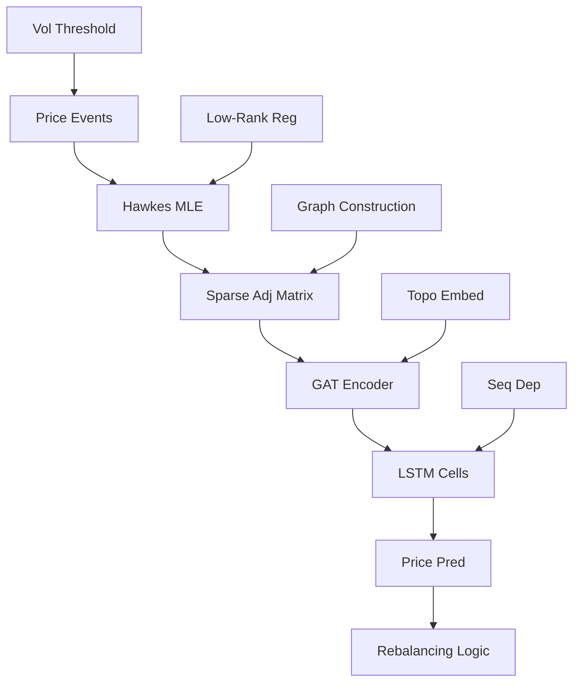

<!-- ontology-5axis data=图关系 horizon=高频日内 paradigm=监督回归 alpha=端到端表征 autonomy=全自动黑盒 -->

# GALSTM 解構

> **發布**：2025-04-01 · （無 venue）
> **QuantML 導讀**：[基于图神经网络的高频交易系统](https://mp.weixin.qq.com/s?__biz=Mzg2MzAwNzM0NQ==&mid=2247489860&idx=1&sn=889e85801e520d8c5ea1969d0cf25554&chksm=ce7e7e5af909f74cad46f32d419959fa8e312ba1fa4a47166a2ef6ba5756b552a4e433671ae8#rd)
> **原始論文**：[Short-Term Power Load Forecasting Based on HFEMD and GALSTM](https://doi.org/10.1109/icpsasia52756.2021.9621579)（2021 IEEE/IAS Industrial and Commercial Power System Asia (I&amp;CPS Asia) · 2021 · 被引 2 · Crossref）
> **核心定位**：落點於「图关系 × 高频日内 × 监督回归」軸，解決 A 股 T+1 與做空工具稀缺下的單票預測與動態對沖脫節問題，將離散價格事件轉化為連續圖權重，實現端到端黑盒調倉。

**五軸座標**

| 數據模態 | 時間尺度 | 學習範式 | Alpha機制 | 人機協作 |
|:-:|:-:|:-:|:-:|:-:|
| `图关系` | `高频日内` | `监督回归` | `端到端表征` | `全自动黑盒` |

**Status:** v0.5 — 基於 QuantML 導讀 + 原論文（如有）。benchmark 細節待升 v1。
**TL;DR:** ① 提出 GALSTM，將多維霍克斯過程生成的稀疏因果圖動態嵌入圖注意力 LSTM，實現 A 股高頻日內單票價格預測。② 核心 trick 是將價格波動事件序列化為霍克斯過程輸入，以低秩稀疏正則化約束相互激勵係數矩陣，再經 GAT 編碼後送入獨立 LSTM 單元。③ 這對「端到端表征」軸的意義在於跳過傳統因子挖掘，直接用圖拓撲捕捉跨股票瞬時傳導，降低特徵工程依賴。④ 導讀給出實盤期 95 天回報 11.63%，年化 44.71%，日回報標準差 0.42%。

**X-Ray.** 放回五軸 Pareto：在「高频日内」軸上，它用圖結構替代了傳統量價因子，但代價是霍克斯過程 MLE 的計算開銷與圖權重更新的延遲。解了舊工程坑：A 股 T+1 限制下，傳統多空對沖依賴靜態行業/市值匹配，GALSTM 用動態圖相關性實時計算匹配度，將對沖從「靜態複製」升級為「動態拓撲對沖」。預測它打不開的 envelope：霍克斯過程本質是線性/指數核激勵，無法捕捉非線性 regime shift 或流動性枯竭時的圖斷裂；且日內頻繁調倉在 0.12% 交易成本下，淨值曲線極易被摩擦損耗吞噬。對量化讀者意義：提供了一條「事件驅動圖構建 + 黑盒預測」的替代路徑，但實戰需嚴謹核算滑點與 IC 貼水成本，否則高頻調倉將成為負 Alpha 源。

## §1 · 架構 / Core Mechanism
**1.1 三大改動 vs 前作**
| 維度 | 傳統量價 LSTM / 靜態圖 GNN | GALSTM | 工程意義 |
|---|---|---|---|
| 輸入模態 | 連續 OHLCV 或固定窗口序列 | 霍克斯事件序列（波動率超閾值區間） | 過濾低效震盪，聚焦訂單流節奏 |
| 圖結構來源 | 靜態皮爾遜相關係數 / 行業分類 | 動態 MLE 稀疏矩陣（低秩正則約束） | 拓撲隨市場傳導實時演變，非靜態快照 |
| 調倉邏輯 | 獨立單票預測 + 靜態權重分配 | 圖匹配度計算 + 預期收益/回撤動態權重調整 | 將預測信號與 IC 對沖敞口耦合，閉環控制 |

**1.2 ⚡ Eureka**
用價格波動觸發的霍克斯激勵係數替代皮爾遜相關係數，讓圖拓撲「長」在訂單流節奏上，而非歷史統計分佈上。

**1.3 信息流 ASCII**

## §2 · 數學層
📌 **Napkin Formula**
$$\lambda_i(t) = \mu_i + \sum_{j} \sum_{t_k < t} \alpha_{ji} \phi(t-t_k)$$
**複雜度**：霍克斯 MLE 為 $O(N^2 T)$，GAT 為 $O(E \cdot d)$，LSTM 為 $O(T \cdot d^2)$。
**直覺**：霍克斯核捕捉跨股票事件傳導的衰減強度，低秩正則強制圖結構壓縮，GAT 將拓撲信息投影到隱狀態，LSTM 負責時間序列依賴。
**Loss/訓練**：MSE 損失，PyTorch Adam 優化器，訓練集包含 3054 只股票價格時間序列數據，共 16 天。

## §3 · 數據層
- **規模/頻率**：近 3 個月 A 股全市場數據，3054 只股票，訓練集 16 天。
- **市場/時段**：A 股日內。
- **來源**：交易所官方機房底層數據，經時間对齐與價格校正（取 tradeprice 為公平價格）。
- **樣本外與容量假設**：實盤期 95 天（2020年3月27日到2020年6月30日）。容量假設未披露，但文中明確提及未來需關注容量變大時的預測時長與滑點問題。

## §4 · 代碼層
| 欄位 | 狀態 |
|---|---|
| Repo | TBD |
| Checkpoint | TBD |
| License | TBD |
| 複現難度 | 高（需低延遲數據源與霍克斯過程自實現/調優） |
| 數據可得性 | 難（需 Level-2 逐筆/快照數據與 IC 合約實時行情） |

## §5 · 評測 / Benchmark
| 數據集/市場 | Metric | 前SOTA | 本方法 | Δ |
|---|---|---|---|---|
| A股日內 | 95天總回報 | 未披露 | 11.63% | 未披露 |
| A股日內 | 年化回報 | 未披露 | 44.71% | 未披露 |
| A股日內 | 日回報標準差 | 未披露 | 0.42% | 未披露 |

**解讀**：Δ 欄因導讀未提供基線單一值或多個基線值，依紀律標為未披露。實證數字反映的是「策略組合」表現（含 IC 對沖與動態調倉），非純模型預測能力。高頻調倉在 0.12% 交易成本下，淨值極易受摩擦損耗影響；且 16 天訓練集對 A 股 regime 而言樣本過短，存在過擬合與前瞻偏差風險。日回報標準差 0.42% 顯示波動控制較穩，但需驗證是否已扣除 0.12% 交易成本與 IC 貼水。

## §6 · 失效與隱含假設
**6.1 論文自述 limitations**
容量變大時預測時長需拉長；市場高度隨機性可能導致初始預期偏差；目前僅給出後續變化預期值，未給出變化分佈，無法獲得最佳交易策略。

**6.2 推斷的隱含假設**
- **Regime 依賴**：霍克斯核假設激勵衰減平穩，流動性驟降或政策突襲時圖權重無法及時收斂。
- **容量/成本**：日內頻繁調倉與 IC 貼水成本未精確披露，實盤 0.12% 成本下高頻周轉可能侵蝕收益。
- **數據泄漏**：時間对齐與價格校正依賴上下文推斷，實盤可能引入未來信息。
- **Survivorship**：未明確說明是否剔除退市/停牌股，3054 只可能包含倖存樣本。

## §7 · 對比 & 面試 Tip
| 同軸對手 | 關鍵差異軸 | Open? | Status |
|---|---|---|---|
| 傳統量價 LSTM | 圖構建動態性 / 預測目標 | TBD | TBD |
| 靜態圖 GNN | 對沖機制 / 拓撲更新頻率 | TBD | TBD |
| 強化學習組合優化 | 端到端表征 / 訓練穩定性 | TBD | TBD |

🎤 **Interview Tip**
- **正確答**：GALSTM 的核心不在 LSTM 而在霍克斯過程生成的動態稀疏圖，它用事件傳導強度替代靜態相關係數，解決了 A 股 T+1 下動態對沖匹配的時滯問題。
- **錯答**：認為它只是把 GAT 和 LSTM 簡單疊加，忽略了霍克斯過程對訂單流節奏的建模與低秩正則對圖稀疏性的約束。

**7.1 可證偽預測**
若 2025-12-31 前 A 股日內波動率結構發生 regime shift（如微盤股流動性枯竭），GALSTM 的霍克斯激勵矩陣將無法及時收斂，導致動態調倉觸發頻繁且淨值回撤超過 0.42% 的日標準差基準。

## §8 · For the Reader
- **因子研究員**：跳過傳統量價因子，直接將霍克斯激勵係數作為跨股票傳導因子，需驗證其 IC 穩定性與週期衰減特徵。
- **高頻執行**：關注 0.12% 交易成本與 IC 貼水對高頻周轉的侵蝕，模型預測需與執行滑點模型耦合，避免信號延遲轉化為負 Alpha。
- **組合配置**：動態匹配度公式中的常數 C（0.002 到 0.003）需根據實盤波動率動態校準，不可靜態套用；需結合回測估計預期收益與潛在回撤的邊界條件。

## References
- 原論文：GALSTM（無 venue）
- QuantML 導讀：[基于图神经网络的高频交易系统](https://mp.weixin.qq.com/s?__biz=Mzg2MzAwNzM0NQ==&mid=2247489860&idx=1&sn=889e85801e520d8c5ea1969d0cf25554&chksm=ce7e7e5af909f74cad46f32d419959fa8e312ba1fa4a47166a2ef6ba5756b552a4e433671ae8#rd)
- Lineage：Hawkes Process → GAT → LSTM → Dynamic Portfolio Rebalancing