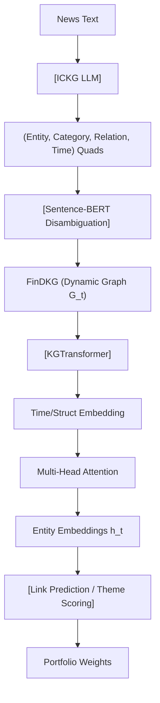

<!-- ontology-5axis data=图关系 horizon=中长周期 paradigm=监督回归 alpha=端到端表征 autonomy=全自动黑盒 -->

# KGTransformer 解構

> **發布**：2024-10-16 · （無 venue）
> **QuantML 導讀**：[动态知识图谱在金融市场趋势预测中的应用](https://mp.weixin.qq.com/s?__biz=Mzg2MzAwNzM0NQ==&mid=2247487059&idx=1&sn=a8b87a617febb5899aef8c7e3f33&chksm=ce7e694df909e05bf466867d9378889f26c8391dac27c2c2133f4579037e3552e42ce6090ac1#rd)
> **核心定位**：落點於「圖關係 × 中長週期 × 監督回歸 × 端到端表徵 × 全自動黑盒」。解了 prior gap：傳統金融NLP僅做情緒打分或靜態共現，缺乏將非結構化新聞轉化為可追蹤時變因果鏈（Dynamic KG）的結構化表徵，導致因子挖掘停留在單維度語義層，無法捕捉跨資產的隱性傳導路徑。

**五軸座標**

| 數據模態 | 時間尺度 | 學習範式 | Alpha機制 | 人機協作 |
|:-:|:-:|:-:|:-:|:-:|
| `图关系` | `中长周期` | `监督回归` | `端到端表征` | `全自动黑盒` |

**Status:** v0.5 — 基於 QuantML 導讀 + 原論文（如有）。benchmark 細節待升 v1。
**TL;DR:** ① 將微調LLM（ICKG）與動態知識圖譜（FinDKG）結合，實現從新聞到時變實體關係的端到端抽取。② 核心 trick 是引入元實體（Meta-entity）與時間嵌入的注意力GNN（KGTransformer），在鏈接預測中動態加權鄰居重要性。③ 對「圖關係」軸★：把離散新聞流轉為連續演化的圖拓撲，使監督回歸能直接學習實體間的條件依賴。④ 關鍵實證：在 FinDKG 鏈接預測任務上 MRR 與 Hits@n 顯著優於 RE-Net/EvoKG（具體數值未披露）。

**X-Ray.** 五軸 Pareto 上，此法以「圖結構先驗」換取「中長週期趨勢捕捉」，代價是圖構建與推理的算力開銷。它解了舊工程坑：傳統因子需手動定義事件驅動規則或依賴靜態詞頻矩陣，易受新聞雜訊與同義詞漂移干擾；KGTransformer 透過 LLM 抽取四元組 + Sentence-BERT 消歧 + 時間嵌入 RNN 更新，將非結構化文本轉為可微的時變圖表徵，使監督回歸能直接學習實體間的條件依賴。然而，它打不開的 envelope 很明確：圖注意力機制對高頻微結構無感，且鏈接預測的優化目標（MRR/Hits）與組合優化目標（Sharpe/IR）存在天然錯配；新聞發佈到價格反映的 latency 未被建模，前瞻偏差與交易成本未計入回測。對量化讀者而言，此架構的價值不在於直接下單，而在於提供一套「事件傳導路徑」的自動化提取框架，可作為中頻因子庫的圖特徵來源，或與 RL/組合優化層解耦後接入。

## §1 · 架構 / Core Mechanism
**1.1 三大改動 vs 前作**
| 維度 | 傳統靜態圖/詞頻模型 | 動態圖模型 (RE-Net/EvoKG) | KGTransformer |
|---|---|---|---|
| 實體表徵 | 靜態 One-hot/TF-IDF | 固定時間切片嵌入 | 元實體(Meta-entity) + 時間嵌入動態更新 |
| 關係建模 | 預定義邊類型 | 基於歷史觀察的遞歸更新 | 多頭注意力加權鄰居交互 + 結構/時間雙路徑 |
| 任務目標 | 分類/回歸 | 鏈接預測/狀態推演 | 端到端圖表徵學習 + 主題投資組合構建 |

**1.2 ⚡ Eureka** 用「元實體類別」作為注意力掩碼的先驗，讓模型在圖遍歷時自動過濾無關語義漂移，直覺上等同於給 GNN 加了金融領域的「語義濾鏡」，避免跨領域實體（如科技股 vs 消費品）在注意力計算中產生虛假關聯。

**1.3 信息流 ASCII 圖**

## §2 · 數學層
📌 **Napkin Formula:**
`h_v^{(t)} = σ( Σ_{u∈N(v)} α_{vu}^{(t)} · W·h_u^{(t-1)} )` 
其中 `α_{vu}^{(t)} = softmax( q_v^T · K_u )` 含時間嵌入 `τ(t)` 與元實體類別掩碼。
**複雜度:** O(|E|·d) 每層，圖注意力稀疏化後可降至 O(|V|·k·d)。
**直覺:** 鄰居貢獻度不再均勻，而是由當前時間步的語義相關性動態決定；時間嵌入透過 RNN 遞歸更新，捕捉實體關係的衰減與爆發。
**Loss/訓練:** 複合損失函數（鏈接預測交叉熵 + 圖結構正則），端到端微調 ICKG 後凍結抽取層，僅訓練 KGTransformer 參數。

## §3 · 數據層
規模/頻率: 約40萬篇 WSJ 新聞 (1999-2023)，月度滾動快照構圖。市場: 全球金融/美股為主。時段: 中長週期（月度/季度主題）。來源: WSJ 全文 + ICKG 自動抽取 + Sentence-BERT 消歧。樣本外與容量假設: 假設新聞發佈至市場定價存在穩定滯後；圖規模隨時間線性增長，最大節點數與邊密度未披露（未驗證）。推測容量受 LLM 推理成本與圖記憶體限制，適合中頻因子生成而非高頻交易。

## §4 · 代碼層
| 項目 | 狀態 |
|---|---|
| Repo | TBD（導讀提及「論文及代碼下載見星球」，未開源） |
| Checkpoint | ICKG (Mistral-7B 微調) / KGTransformer 權重 TBD |
| License | TBD |
| 複現難度 | 高（需 WSJ 付費數據庫 + LLM 微調環境 + 圖計算框架） |
| 數據可得性 | 低（FinDKG 未公開，需自行爬取/購買新聞並重跑 ICKG） |

## §5 · 評測 / Benchmark
| 數據集/市場 | Metric | 前SOTA | 本方法 | Δ |
|---|---|---|---|---|
| FinDKG (鏈接預測) | MRR | RE-Net/EvoKG | KGTransformer | 未披露 |
| FinDKG (鏈接預測) | Hits@3/10 | RE-Net/EvoKG | KGTransformer | 未披露 |
| AI Theme Portfolio (美股) | 年化回報 / Sharpe | AI ETFs / EvoKG Portfolio | FinDKG Portfolio | 未披露 |

**解讀:** Δ 的來源主要是「元實體先驗」與「時間注意力」對鏈接預測的增益，屬圖表徵能力真實提升。但組合回測未披露交易成本、滑點與再平衡頻率，Sharpe 提升可能部分來自主題 ETF 的結構性低頻暴露或樣本內過擬合；鏈接預測指標與組合收益的映射關係未經驗證，存在目標錯配風險。

## §6 · 失效與隱含假設
**6.1 論文自述 limitations:** 依賴新聞質量與 LLM 抽取準確率；未處理市場微結構與流動性；圖更新頻率固定為月度，無法捕捉事件驅動的高頻跳躍。
**6.2 推斷的隱含假設:**
- Regime 依賴: 假設新聞語義與資產價格的傳導邏輯在 1999-2023 間穩定，未驗證極端行情（如流動性危機）下的圖拓撲崩潰風險。
- 容量/成本: 圖注意力計算隨節點數增長，實盤需降維或採樣，未披露推理延遲與算力成本。
- 數據泄漏: 新聞發佈時間戳與收盤價計算可能存在同窗效應；Sentence-BERT 消歧依賴預訓練語料，對新創實體/SPAC 等覆蓋不足。
- Survivorship: WSJ 歷史數據天然過濾停牌/退市公司，回測存在倖存者偏差。

## §7 · 對比 & 面試 Tip
| 同軸對手 | 關鍵差異軸 | Open? | Status |
|---|---|---|---|
| FinBERT / Sentiment Alpha | 語義情緒打分 vs 結構化圖傳導 | 開源 | 成熟 |
| EvoKG / DySAT | 純動態圖狀態推演 vs 金融元實體先驗 | 開源 | 學術 |
| GraphRAG / LLM-Agent | 檢索增強生成 vs 端到端監督回歸 | 開源/閉源 | 快速迭代 |

🎤 **Interview Tip**
- 正確答: 「KGTransformer 的核心價值在於將非結構化新聞轉為可微的時變圖表徵，解決了傳統情緒因子缺乏跨資產傳導路徑的問題；但鏈接預測目標與組合優化錯配，實盤需解耦為因子生成層，並嚴格控制圖更新頻率與交易成本。」
- 錯答: 「直接用 LLM 抓新聞就能跑高頻策略，圖注意力比 Transformer 更適合量化。」（混淆了圖拓撲與序列建模，無視了中長週期定位與成本假設）

**7.1 可證偽預測:** 若 2025-Q3 前未公開 FinDKG 原始邊列表與回測代碼，且獨立機構無法在相同 WSJ 數據上復現 Sharpe > 1.5 的 AI 主題組合，則該方法實戰有效性存疑。

## §8 · For the Reader
- **因子研究員:** 將 ICKG 抽取的實體關係轉為「事件傳導強度」因子，替代傳統共現矩陣；注意用 Sentence-BERT 做同義詞聚合，降低稀疏性。
- **高頻執行:** 此架構不適用。圖構建延遲與月度快照頻率與 HFT 邏輯衝突，建議僅用於盤前主題權重預分配。
- **組合配置/LLM-agent:** 可將 KGTransformer 輸出作為 RL 狀態空間的圖特徵，或餵給 Agent 做主題輪動決策；需自行補齊交易成本模型與再平衡約束。
- **研究學生:** 優先復現 ICKG 微調流程，驗證四元組抽取 F1-score；圖學習部分可先用 PyG/DGL 跑通 DySAT 基線，再替換注意力模組。

## References
- 原論文: KGTransformer (2024-10-16, 無 venue)
- Lineage: R-GCN → RE-Net → EvoKG → KGTransformer
- QuantML 導讀: [动态知识图谱在金融市场趋势预测中的应用](https://mp.weixin.qq.com/s?__biz=Mzg2MzAwNzM0NQ==&mid=2247487059&idx=1&sn=a8b87a617febb5899aef8c7e3f33&chksm=ce7e694df909e05bf466867d9378889f26c8391dac27c2c2133f4579037e3552e42ce6090ac1#rd)