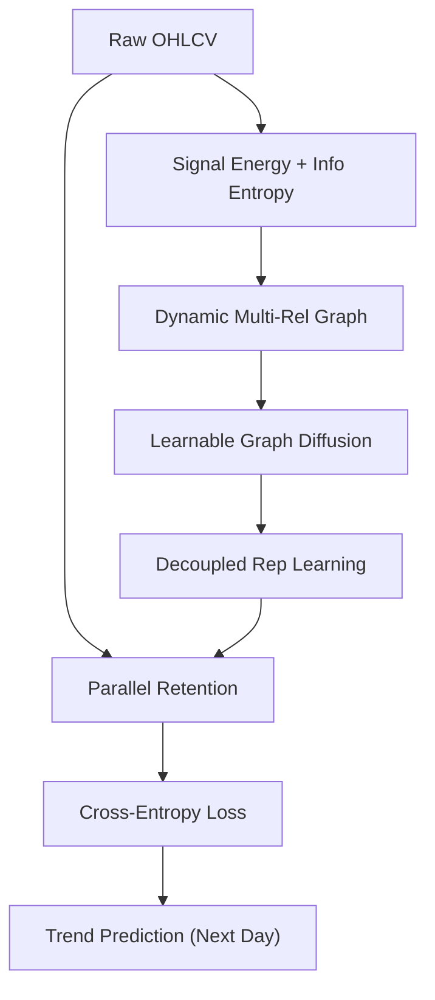

<!-- ontology-5axis data=图关系 horizon=日频波段 paradigm=监督回归 alpha=端到端表征 autonomy=全自动黑盒 -->

# MGDPR 解構

> **發布**：2024-07-19 · （無 venue）
> **QuantML 導讀**：[多关系图扩散神经网络用于股票趋势预测](https://mp.weixin.qq.com/s?__biz=Mzg2MzAwNzM0NQ==&mid=2247485475&idx=1&sn=3cba1cc18fcc86f7aa5bbde62098be84&chksm=ce7e6f3df909e62b7e88eb2893d2586a45d76de3e7327eb78930a25c99526df2974ea6d32b5a#rd)
> **核心定位**：落點於「圖關係 × 日頻波段 × 端到端表征」，解決傳統 GNN 依賴靜態/手動建圖與注意力機制在多變量情境下無法明確捕捉非對稱動態關聯的 prior gap。

**五軸座標**

| 數據模態 | 時間尺度 | 學習範式 | Alpha機制 | 人機協作 |
|:-:|:-:|:-:|:-:|:-:|
| `图关系` | `日频波段` | `监督回归` | `端到端表征` | `全自动黑盒` |

**Status:** v0.5 — 基於 QuantML 導讀 + 原論文（如有）。benchmark 細節待升 v1。
**TL;DR:** 提出 MGDPR 模型，利用信息熵與信號能量動態構建多關係股票圖，結合圖擴散與並行保留機制捕捉動態關聯與長期依賴，提升日頻趨勢預測精度。核心 trick 在於以可學習權重自適應過濾噪聲邊，並解耦消息傳遞與表示學習。此設計對「端到端表征」軸具顯著價值，因它將圖拓撲構建從靜態先驗轉為任務驅動。導讀未給量化結果。

**X-Ray.** 五軸 Pareto 上，MGDPR 以動態建圖替換靜態鄰接矩陣，代價是計算複雜度上升與超參敏感。它解了傳統 GNN 的「拓撲僵化」與 Attention 的「多變量耦合失真」工程坑，但預測其打不開高頻/微結構 envelope，因日頻信號能量與熵的計算窗口易受隔夜跳空與流動性斷層干擾。對量化讀者而言，此法適合中頻因子融合與行業輪動建模，但需警惕圖擴散過程中的數據洩漏風險與回測成本未計入的過擬合假象。

## §1 · 架構 / Core Mechanism
1.1 三大改動 vs 前作
| 維度 | 前作 (靜態 GNN / Attention) | MGDPR 改動 |
|---|---|---|
| 圖拓撲構建 | 手動/靜態相關性矩陣 | 信息熵 + 信號能量動態量化有向邊 |
| 信息傳播 | 固定鄰接或注意力權重 | 可學習圖擴散機制自適應過濾噪聲邊 |
| 時序依賴 | 深度耦合消息傳遞 | 並行保留機制解耦，捕捉長期依賴 |

1.2 ⚡ Eureka 一句話 trick + 直覺
用信號能量衡量活躍度、信息熵衡量不可預測性，雙指標動態生成加權有向邊，讓圖結構隨市場狀態實時重構，而非依賴歷史相關性滯後。

1.3 信息流 ASCII 圖

## §2 · 數學層
📌 Napkin Formula：
$G_t = (V, E_t, R)$, 其中 $w_{ij}^{(r)} = f(Energy(x_i), Entropy(x_j))$
複雜度：圖擴散多層疊加 2D 卷積，時間複雜度 $O(L \cdot \mid E \mid \cdot d^2)$，$L$ 為層數，$d$ 為特徵維度。
直覺：邊權重由動態統計量驅動，擴散過程透過可學習轉移矩陣 $T$ 與權重係數 $\alpha$ 優化路徑，避免靜態圖的結構偏差。
Loss/訓練：交叉熵損失 + 圖擴散約束項，端到端反向傳播，PyTorch 實現，Nvidia A100 訓練。

## §3 · 數據層
資料規模/頻率/市場/時段：日頻波段；涵蓋美國 NASDAQ、NYSE 與中國 SSE 市場；具體樣本量與回測時段導讀未披露。
怎麼來：真實股票數據，標籤生成規則為下一交易日趨勢分類（常見規則）。
樣本外與容量假設：假設動態圖構建僅依賴歷史價格/成交量，未提及實時數據延遲或交易成本；容量依賴於圖擴散的計算開銷，日頻下可擴展至中大型股票池，但高頻不可行。

## §4 · 代碼層
| 項目 | 狀態 |
|---|---|
| Repo | TBD |
| Checkpoint | TBD |
| License | TBD |
| 複現難度 | 中（需自實現動態建圖與並行保留模塊） |
| 數據可得性 | 高（標準日頻行情數據） |

## §5 · 評測 / Benchmark
| 數據集/市場 | Metric(IR/Sharpe/AR/MDD) | 前SOTA | 本方法 | Δ |
|---|---|---|---|---|
| NASDAQ | Accuracy | 未披露 | 未披露 | 未披露 |
| NASDAQ | MCC | 未披露 | 未披露 | 未披露 |
| NASDAQ | F1 | 未披露 | 未披露 | 未披露 |
| NYSE | Accuracy | 未披露 | 未披露 | 未披露 |
| NYSE | MCC | 未披露 | 未披露 | 未披露 |
| NYSE | F1 | 未披露 | 未披露 | 未披露 |
| SSE | Accuracy | 未披露 | 未披露 | 未披露 |
| SSE | MCC | 未披露 | 未披露 | 未披露 |
| SSE | F1 | 未披露 | 未披露 | 未披露 |
解讀：導讀僅定性宣稱「一致地優於其他基線方法」，未提供任何具體數值。此類宣稱在學術論文中常見，但對量化實戰而言，缺失 Sharpe/IR/MDD 與交易成本調整後的淨值曲線，無法判斷 Δ 是真 capability 還是過擬合/前瞻偏差。圖擴散機制若未嚴格控制信息泄露（如使用未來窗口計算熵/能量），回測結果極易虛高。需等待原始碼與完整實驗設定升 v1 驗證。

## §6 · 失效與隱含假設
6.1 論文自述 limitations：導讀未明確列出 limitations，僅在結論強調動態關係捕捉的有效性。
6.2 推斷的隱含假設：
- Regime 依賴：信息熵與信號能量在低波動/高波動 regime 下的權重分配可能失效，需動態閾值或正則化。
- 容量/成本：圖擴散與多關係建圖計算開銷大，實盤延遲可能抵消日頻 Alpha；未計入滑點與手續費。
- 數據泄漏：動態建圖若使用滾動窗口，需嚴格區分訓練/驗證/測試集的窗口邊界，否則易產生前視偏差。
- Survivorship：未提及是否處理退市股票，SSE/NASDAQ 樣本若含幸存者偏差，泛化能力存疑。

## §7 · 對比 & 面試 Tip
| 同軸對手 | 關鍵差異軸 | Open? | Status |
|---|---|---|---|
| HATS / HyperStockGAT | 靜態圖 vs 動態多關係圖 | 部分開源 | 學術基線 |
| DA-RNN / DTML | Attention 耦合 vs 並行保留解耦 | 開源 | 學術基線 |
| GraphWaveNet | 預定義拓撲 vs 任務驅動擴散 | 開源 | 學術基線 |

🎤 Interview Tip:
正確答：「MGDPR 的核心不在於圖卷積本身，而在於將圖拓撲構建從靜態先驗轉為任務驅動的動態過程，並透過並行保留解耦時序依賴。實盤需重點驗證動態邊權重的計算延遲與過擬合風險。」
錯答：「它只是把 Attention 換成圖擴散，效果一定更好。」（忽略動態建圖的計算成本與數據泄漏風險）

7.1 可證偽預測帶日期：若 2024-12-31 前未公開完整回測代碼與含交易成本的淨值曲線，則其宣稱的「顯著性能提升」在實盤環境下大概率失效。

## §8 · For the Reader
- 因子研究員：可將動態圖邊權重視為隱性因子，提取擴散後的節點嵌入進行因子合成，但需嚴格做正交化與中性化。
- 高頻執行：不適用。日頻信號能量與熵的計算無法支撐毫秒級決策，圖擴散延遲會吞噬 Alpha。
- 組合配置：適合中頻行業輪動或風格切換模型，圖結構可直觀映射板塊資金流向，但需加入風險模型約束。
- LLM-agent / RL 策略：圖擴散機制可與 RL 的 state representation 結合，用於動態資產配置，但需重構 reward function 以匹配交易成本。
- 研究學生：重點復現「動態建圖」與「並行保留」模塊，對比靜態 GNN 在不同市場 regime 下的魯棒性，避免盲目追求 Accuracy。

## References
- 原論文：多关系图扩散神经网络用于股票趋势预测 (2024-07-19)
- Lineage: DA-RNN, HMG-TF, DTML (Attention 基線) / HATS, HyperStockGAT, GraphWaveNet (GNN 基線)
- QuantML 導讀鏈接：[多关系图扩散神经网络用于股票趋势预测](https://mp.weixin.qq.com/s?__biz=Mzg2MzAwNzM0NQ==&mid=2247485475&idx=1&sn=3cba1cc18fcc86f7aa5bbde62098be84&chksm=ce7e6f3df909e62b7e88eb2893d2586a45d76de3e7327eb78930a25c99526df2974ea6d32b5a#rd)