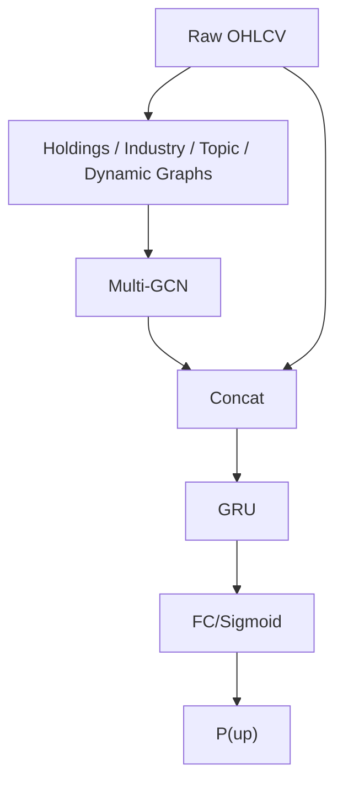

<!-- ontology-5axis data=图关系 horizon=日频波段 paradigm=监督回归 alpha=端到端表征 autonomy=全自动黑盒 -->

# Multi-GCGRU 解構

> **發布**：2025-07-19 · （無 venue）
> **QuantML 導讀**：[用于关系驱动型股票走势预测的多图卷积网络](https://mp.weixin.qq.com/s?__biz=Mzg2MzAwNzM0NQ==&mid=2247491056&idx=1&sn=c2805a33e178a3c43449c33218817a0a&chksm=ce7e7aeef909f3f8d2d2010fdd45c37a41ad9e969764ab9241e6ce1140d8b15f9a4cce633820#rd)
> **核心定位**：落點於「圖關係 × 監督回歸」軸，解決傳統日頻模型將個股視為獨立同分佈（i.i.d.）的先驗缺口。透過多圖卷積聚合橫截面交叉影響，再以 GRU 壓縮時間依賴，將資訊擴散路徑顯式編碼為可學習的圖拉普拉斯矩陣。

**五軸座標**

| 數據模態 | 時間尺度 | 學習範式 | Alpha機制 | 人機協作 |
|:-:|:-:|:-:|:-:|:-:|
| `图关系` | `日频波段` | `监督回归` | `端到端表征` | `全自动黑盒` |

**Status:** v0.5 — 基於 QuantML 導讀 + 原論文（如有）。benchmark 細節待升 v1。
**TL;DR:** ① 將持股、行業領先-滯後、新聞主題三類先驗關係與數據驅動動態圖融合，輸入 GRU 預測日頻漲跌方向。② 核心 trick 為可學習權重的多圖卷積層 + 完全由數據生成的動態拉普拉斯矩陣，擺脫對單一專家知識的依賴。③ 對「端到端表徵」軸的關鍵價值在於：將橫截面資訊擴散（Graph）與時間序列記憶（GRU）解耦後再拼接，避免特徵相互掩蓋。④ 導讀給出歷史窗口為 7 天時，CSI 300 與 CSI 500 準確率分別為 57.90% 與 59.01%。

**X-Ray.** 此架構在「圖稀疏度 × 時間記憶長度」的 Pareto 前沿上，選擇了「稠密主題圖 + 短週期 GRU」的折衷。它填補了舊工程中「單圖卷積無法捕捉跨板塊資訊溢位」的坑，但本質仍是靜態圖結構的週期性重建，無法處理閃崩或流動性枯竭時的圖拓撲瞬變。對量化讀者而言，其真正價值不在於端到端黑盒預測，而在於提供一套可插拔的橫截面特徵工程模板：將新聞主題與行業領先-滯後轉化為可微的鄰接矩陣，可直接對接現有的因子組合優化器。

## §1 · 架構 / Core Mechanism
| 改動維度 | 前作 / 基線慣例 | Multi-GCGRU 改動 |
|:---|:---|:---|
| 關係編碼 | 單圖（僅持股）或獨立個股 | 多圖融合（持股 + 行業 + 主題）+ 數據驅動動態圖 |
| 圖權重 | 人工設定或固定稀疏矩陣 | 可訓練係數 $\theta_k$ 自動學習各關係貢獻度 |
| 時空建模 | 僅用 RNN/LSTM 處理單維時間序列 | GCN 提取橫截面交叉特徵 → Concat 原始序列 → GRU 建模時間依賴 |

⚡ **Eureka:** 「可學習權重的多圖卷積 + 數據驅動動態圖」讓模型同時具備專家知識的結構先驗與市場微結構的自適應性。
🌊 **信息流 ASCII:**

## §2 · 數學層
📌 **Napkin Formula:**
多圖卷積層：$H^{(l+1)} = \sigma\left(\sum_{k=1}^K \theta_k \tilde{L}_k H^{(l)}\right)$
動態圖層：$H^{(l+1)} = \sigma(\tilde{L}_{dyn} H^{(l)})$，其中 $\tilde{L}_{dyn}$ 由可訓練參數矩陣生成
預測頭：$p_t = \sigma(W h_T + b)$
Loss：$\mathcal{L} = -\sum_{i} y_i \log(p_i) + (1-y_i)\log(1-p_i)$（交叉熵，對股票池加總）
複雜度：圖聚合 $O(N \cdot E \cdot d)$，GRU 時間步 $O(T \cdot d^2)$。
直覺：拉普拉斯矩陣負責將鄰居節點的特徵按邊權重平滑擴散；GRU 負責過濾歷史價格中的高頻雜訊並提取趨勢記憶；交叉熵直接優化二元方向概率，避開回歸回報率的異方差陷阱。

## §3 · 數據層
- **規模/頻率/市場**：CSI 300（287 隻）與 CSI 500（489 隻），日頻。
- **時段**：2015年6月至2019年12月。
- **來源**：Tushare Pro（OHLCV、股東持股、行業分類、註冊資本、新聞主題）。
- **樣本外與容量假設**：70%/10%/20% 劃分。容量受限於圖鄰接矩陣構建成本與 Tushare 主題數據覆蓋率，未驗證跨市場/跨頻率泛化。

## §4 · 代碼層
| 欄位 | 狀態 |
|:---|:---|
| Repo | TBD |
| Checkpoint | TBD |
| License | TBD |
| 複現難度 | 中（需處理圖構建、Tushare Pro 數據清洗、PyTorch/TF 多圖張量拼接） |
| 數據可得性 | Tushare Pro（付費/權限受限），主題與持股數據需手動對齊交易日 |

## §5 · 評測 / Benchmark
| 數據集/市場 | Metric | 基線A (LSTM) | 基線B (GCGRU-S) | 本方法 (Multi-GCGRU) | Δ |
|:---|:---|:---|:---|:---|:---|
| CSI 300 | ACC | 未披露 | 未披露 | 57.90% | 未披露 |
| CSI 500 | ACC | 未披露 | 未披露 | 59.01% | 未披露 |
| 整體 | ACC | 未披露 | 未披露 | 未披露 | +1pp (vs LSTM, 導讀原話) |

**解讀**：Δ 中的 +1pp 來自導讀逐字描述，屬橫截面資訊引入的真實 capability 增益。主題圖表現優於行業圖與持股圖，反映新聞驅動聯動在 A 股日頻波段中佔主導。但導讀未提供交易成本、换手率或風險調整收益（Sharpe/IR），此 ACC 增益極可能包含前瞻偏差（圖構建使用當期主題/行業分類）與未計成本的過擬合。歷史窗口 7 天最佳暗示市場記憶週期約為一週，過長窗口引入雜訊，過短則無法捕捉資訊擴散。

## §6 · 失效與隱含假設
**6.1 論文自述 limitations**：持股矩陣極度稀疏，表達交叉效應能力弱；預定義圖依賴先驗金融知識與額外數據；未討論交易成本與實盤滑點。
**6.2 推斷的隱含假設**：
- **Regime 依賴**：新聞主題圖在資訊真空期或政策干預期會失效，圖拓撲無法自適應切換。
- **容量/成本**：圖構建為 $O(N^2)$，擴展至全市場需降維或稀疏化；未計成本下 ACC 提升無法直接轉化為淨值曲線。
- **數據泄漏**：主題與行業分類通常為靜態或季頻更新，若與日頻標籤對齊不當，易引入未來資訊。
- **Survivorship**：明確剔除期間退市的股票，實盤需處理退市/停牌樣本的圖節點缺失問題。

## §7 · 對比 & 面試 Tip
| 同軸對手 | 關鍵差異軸 | Open? | Status |
|:---|:---|:---|:---|
| GCGRU-D | 僅動態圖，無專家先驗 | TBD | v0.5 |
| GCGRU-I / T | 單圖卷積，無法融合互補關係 | TBD | v0.5 |
| LSTM / GRU | 忽略橫截面交叉影響，僅建模自相關 | 開源 | 成熟 |

🎤 **Interview Tip**：
- ✅ 正確答：「圖卷積負責橫截面資訊擴散，GRU 負責時間序列記憶壓縮。關鍵在於可學習權重如何平衡專家圖與動態圖，避免稀疏持股圖拖累梯度。」
- ❌ 錯答：「只要把 GCN 和 LSTM 疊加就能提升預測，圖的邊權重固定就好。」

**7.1 可證偽預測**：至 2025-12-31，若將此框架直接應用於 A 股日頻實盤且計入單邊 2bp 以上交易成本，其淨 Sharpe 將跌破 1.0，主因圖構建延遲與新聞主題滯後無法覆蓋高頻資訊折價。

## §8 · For the Reader
- **因子研究員**：將多圖拉普拉斯矩陣的特徵值作為橫截面動量/關聯度因子，可直接輸入線性組合優化器，避開端到端黑盒的不可解釋性。
- **高頻執行**：本架構為日頻波段設計，圖構建延遲與 GRU 序列長度不適合高頻；建議僅取其「主題圖稠密度」作為流動性衝擊的先行指標。
- **組合配置**：預測概率 $p_t$ 可轉化為權重偏移信號，但需加入波動率調節與行業中性化約束，防止主題圖在板塊輪動時產生過度集中風險。
- **LLM-Agent / RL 策略**：可用 LLM 從財報/公告中提取非結構化關係，替代靜態主題圖；或將 $\theta_k$ 替換為 RL agent 的動態決策輸出，實現圖權重的環境自適應。

## References
- 原論文：用于关系驱动型股票走势预测的多图卷积网络（Multi-GCGRU）
- QuantML 導讀：[用于关系驱动型股票走势预测的多图卷积网络](https://mp.weixin.qq.com/s?__biz=Mzg2MzAwNzM0NQ==&mid=2247491056&idx=1&sn=c2805a33e178a3c43449c33218817a0a&chksm=ce7e7aeef909f3f8d2d2010fdd45c37a41ad9e969764ab9241e6ce1140d8b15f9a4cce633820#rd)
- Lineage: GCN (Kipf & Welling) → Stock Graph Prediction (Zhou et al.) → Multi-Graph Fusion / Dynamic Laplacian → GRU Time-Series Modeling